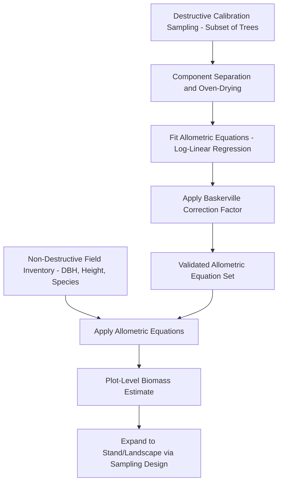
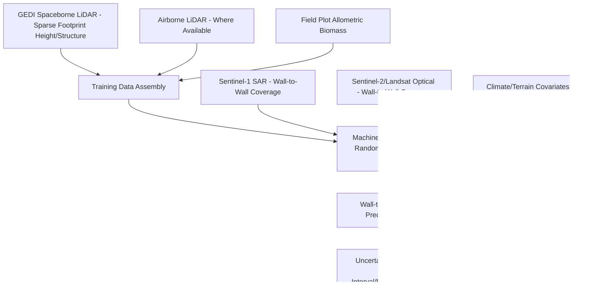

## Biomass and Carbon Stock Estimation


### Overview

Biomass and Carbon Stock Estimation quantifies the mass of organic material (and its carbon content) stored in vegetation and soil, forming the scientific foundation for forest carbon accounting, REDD+ MRV reporting, carbon offset/credit verification, and ecosystem carbon cycle research. Methods range from destructive field sampling and allometric equations through field-plot-calibrated remote sensing models to increasingly sophisticated multi-sensor fusion and machine learning approaches for wall-to-wall mapping.

### Carbon Pool Framework

#### IPCC Carbon Pool Categories

The IPCC framework for greenhouse gas inventories defines five carbon pools in forest/terrestrial ecosystems, each requiring distinct measurement approaches:

1. **Aboveground biomass (AGB)** — living tree/vegetation biomass above the soil surface; the pool most directly estimable from remote sensing due to its correlation with canopy structure
2. **Belowground biomass (BGB)** — root systems; typically estimated indirectly via root-to-shoot ratios applied to AGB rather than direct measurement, since direct root excavation is extremely labor-intensive
3. **Dead wood** — standing dead trees (snags) and downed woody debris; measured via specialized sampling (line-intersect sampling for downed debris, standard tree measurement adapted for snags)
4. **Litter** — surface organic layer above mineral soil, excluding materials large enough to be classified as dead wood; sampled via small-area destructive collection
5. **Soil organic carbon (SOC)** — carbon stored in mineral and organic soil horizons; measured via soil coring, often the largest but most spatially variable and difficult-to-remotely-sense pool

**Key Points**

- Aboveground biomass receives disproportionate research and operational mapping attention because it is the pool most amenable to remote sensing estimation; the other four pools generally rely on field sampling networks, regional default factors, or ratio-based estimation from AGB
- Total ecosystem carbon stock requires summing across all applicable pools; AGB-only estimates (common in remote sensing studies) substantially understate total carbon stock, particularly in ecosystems with large soil carbon pools (peatlands, boreal forests)

### Allometric Biomass Estimation

#### Allometric Equation Framework

Allometric equations relate readily measured tree dimensions (DBH, height) to biomass through species- or genus-group-specific empirical relationships, calibrated from destructive tree harvesting studies:

$$AGB = a \times DBH^b$$

or, incorporating height and/or wood density for improved accuracy:

$$AGB = a \times (DBH^2 \times H \times \rho)^b$$

Where $a$ and $b$ are empirically fitted coefficients, $H$ is tree height, and $\rho$ is species-specific wood density (specific gravity). Log-transformed linear regression is the standard fitting approach, since the power-law relationship becomes linear in log-log space:

$$\ln(AGB) = \ln(a) + b\ln(DBH)$$

**Key Points**

- Allometric equations are strictly valid only within the diameter range and geographic/climatic region of the calibration dataset; extrapolation beyond calibration range (particularly to very large trees) introduces substantial and difficult-to-quantify uncertainty
- **Pantropical allometric equations** (e.g., Chave et al. equations widely used in tropical forest carbon studies) incorporate climate variables alongside DBH, height, and wood density to improve cross-regional applicability compared to purely local single-species equations, though species-specific local equations remain preferable when available
- A systematic correction factor (Baskerville correction) is typically applied when back-transforming log-space regression predictions to arithmetic scale, since naive back-transformation of a log-linear model introduces a statistical bias (the retransformation bias) that underestimates mean biomass

#### Root-to-Shoot Ratio for Belowground Biomass

$$BGB = AGB \times R_{ratio}$$

Where $R_{ratio}$ is an empirically-derived root-to-shoot ratio, commonly falling in the range of 0.2–0.3 for many forest types though varying substantially by forest type, biomass density, and climate (generally higher root-to-shoot ratios in drier/lower-biomass ecosystems reflecting proportionally greater belowground carbon allocation).

### Field Sampling for Biomass Calibration

#### Destructive Sampling

Direct biomass measurement via tree felling, component separation (stem, branches, foliage), oven-drying to constant mass, and weighing — the ground-truth reference method underlying all allometric equation development, but destructive, costly, and impractical for large-scale or repeated sampling.

#### Non-Destructive Field Plot Approaches

Standard operational biomass estimation combines non-destructive forest inventory measurements (per Forest Inventory and Mensuration methods: DBH, height, species) with pre-existing allometric equations, avoiding the need for destructive sampling at every inventory location while still requiring periodic destructive calibration studies to develop/validate the allometric equations themselves.



### Remote Sensing-Based Biomass Mapping

#### LiDAR-Based Approaches

Airborne LiDAR-derived canopy height and structure metrics (following the Area-Based Approach methodology from Forest Inventory and Mensuration) are regressed against field-plot allometrically-derived biomass to produce wall-to-wall biomass prediction surfaces — currently the most accurate operational remote sensing approach for AGB mapping where airborne LiDAR coverage is available, though coverage remains limited by acquisition cost relative to satellite alternatives.

#### Spaceborne LiDAR

- **GEDI (Global Ecosystem Dynamics Investigation)** — ISS-based spaceborne LiDAR providing sparse-footprint (not wall-to-wall) canopy height and structure measurements across the near-global forested land area within its orbital coverage, used both directly for biomass estimation at footprint locations and as training/calibration data for wall-to-wall optical/SAR-based biomass models
- **ICESat-2** — primarily an ice/elevation-focused mission but its photon-counting LiDAR also provides usable vegetation canopy height information, supplementing GEDI's coverage

#### SAR-Based Biomass Estimation

SAR backscatter exhibits a characteristic **saturation** relationship with biomass — backscatter increases with biomass at low-to-moderate biomass levels but saturates (loses sensitivity) at higher biomass density, with the saturation point varying by radar wavelength:

| SAR Band | Wavelength | Approximate Biomass Saturation Point |
| --- | --- | --- |
| X-band | ~3cm | Low (~20-50 t/ha) |
| C-band | ~5.6cm | Low-moderate (~40-100 t/ha) |
| L-band | ~23cm | Moderate-high (~100-150 t/ha) |
| P-band | ~68cm | Highest among common bands (~150-200+ t/ha) |

**Key Points**

- Longer-wavelength SAR (L-band, P-band) penetrates deeper into canopy structure and interacts more with larger woody biomass components (branches, trunks), extending the biomass range before backscatter saturation occurs compared to shorter wavelengths that primarily interact with upper canopy leaves/twigs
- The upcoming/recent dedicated biomass-focused satellite missions (e.g., ESA's BIOMASS mission using P-band SAR) are specifically designed to address the saturation limitation of existing shorter-wavelength operational SAR sensors for high-biomass tropical/temperate forest carbon mapping [Unverified — mission operational status and data availability should be verified against current ESA mission status, as this may have progressed since general knowledge references]

#### Optical-Based Biomass Estimation

Optical vegetation indices (NDVI and similar) generally saturate at relatively low biomass/LAI levels (as discussed under Vegetation Indices and Canopy Analysis), making optical-only approaches poorly suited for high-biomass forest carbon mapping in isolation; optical data is more commonly used in multi-sensor fusion approaches (combined with LiDAR/SAR structural information) or in low-biomass ecosystems (grassland, shrubland, young forest) where saturation is less limiting.

### Multi-Sensor Fusion and Machine Learning Biomass Mapping



**Key Points**

- Global and national biomass mapping products increasingly follow this pattern: sparse spaceborne LiDAR (GEDI) provides height/structure training data across broad geographic extent, machine learning models relate this training data to wall-to-wall optical/SAR covariates, producing continuous biomass surfaces extending beyond direct LiDAR footprint coverage
- Model uncertainty in these fusion products is spatially heterogeneous — generally lowest near dense GEDI footprint coverage and field validation plots, and highest in undersampled regions or biomass ranges poorly represented in training data

### Implementation Examples

#### Python — Allometric Biomass Calculation with Baskerville Correction

```python
import numpy as np

def allometric_biomass(dbh_cm, allometric_a, allometric_b, 
                          regression_residual_variance=None):
    """
    Calculate individual tree aboveground biomass using log-linear
    allometric equation, with optional Baskerville correction for
    retransformation bias.
    ln(AGB) = ln(a) + b*ln(DBH)  ->  AGB = a * DBH^b
    """
    agb = allometric_a * (dbh_cm ** allometric_b)

    if regression_residual_variance is not None:
        # Baskerville correction factor: exp(MSE/2)
        correction_factor = np.exp(regression_residual_variance / 2)
        agb_corrected = agb * correction_factor
        return agb_corrected

    return agb

def chave_pantropical_agb(dbh_cm, wood_density_g_cm3, height_m=None, 
                             climate_stress_e=None):
    """
    Simplified representation of Chave et al. pantropical AGB allometry
    structure (exact published coefficients should be sourced from the
    current peer-reviewed reference for operational use).
    """
    if height_m is not None:
        # Height-inclusive form
        agb_kg = 0.0673 * ((wood_density_g_cm3 * (dbh_cm ** 2) * height_m) ** 0.976)
    else:
        # Diameter-only form using climate/environmental stress variable E
        # (E represents a climate-related environmental stress index)
        if climate_stress_e is None:
            climate_stress_e = 0  # placeholder; should be derived from climate data
        ln_agb = (-1.803 - 0.976 * climate_stress_e + 0.976 * np.log(wood_density_g_cm3)
                  + 2.673 * np.log(dbh_cm) - 0.0299 * (np.log(dbh_cm) ** 2))
        agb_kg = np.exp(ln_agb)

    return agb_kg  # kg per tree

def stand_carbon_stock(agb_trees_kg_list, root_shoot_ratio=0.25, 
                          carbon_fraction=0.47):
    """
    Estimate total (AGB + BGB) carbon stock from individual tree AGB values.
    carbon_fraction: IPCC default biomass-to-carbon conversion (~0.47 for most forests)
    """
    total_agb_kg = sum(agb_trees_kg_list)
    total_bgb_kg = total_agb_kg * root_shoot_ratio
    total_biomass_kg = total_agb_kg + total_bgb_kg

    carbon_stock_kg = total_biomass_kg * carbon_fraction
    co2_equivalent_kg = carbon_stock_kg * (44/12)  # C to CO2 molecular weight ratio

    return {
        'total_agb_kg': total_agb_kg,
        'total_bgb_kg': total_bgb_kg,
        'total_biomass_kg': total_biomass_kg,
        'carbon_stock_kg': carbon_stock_kg,
        'co2_equivalent_kg': co2_equivalent_kg
    }
```

#### Python — LiDAR-Biomass Regression Model (Area-Based Approach)

```python
import numpy as np
from sklearn.ensemble import RandomForestRegressor
from sklearn.model_selection import cross_val_score, KFold

def fit_lidar_biomass_model(lidar_metrics_df, field_biomass_col='agb_mg_ha'):
    """
    Fit LiDAR-to-biomass regression model using area-based approach metrics
    (extending the height-metric extraction from Forest Inventory methods).
    """
    feature_cols = ['h_mean', 'h_max', 'h_p95', 'h_stddev', 'canopy_density']

    X = lidar_metrics_df[feature_cols]
    y = lidar_metrics_df[field_biomass_col]

    model = RandomForestRegressor(n_estimators=500, max_depth=12, 
                                     min_samples_leaf=3, random_state=42)

    kf = KFold(n_splits=10, shuffle=True, random_state=42)
    cv_r2 = cross_val_score(model, X, y, cv=kf, scoring='r2')
    cv_rmse = -cross_val_score(model, X, y, cv=kf, scoring='neg_root_mean_squared_error')

    model.fit(X, y)

    print(f"Cross-validated R²: {cv_r2.mean():.3f} ± {cv_r2.std():.3f}")
    print(f"Cross-validated RMSE: {cv_rmse.mean():.2f} ± {cv_rmse.std():.2f} Mg/ha")

    return model
```

#### SAR Backscatter-Biomass Saturation Modeling

```python
import numpy as np
from scipy.optimize import curve_fit

def sar_biomass_saturation_model(biomass, k, biomass_sat):
    """
    Semi-empirical water-cloud-type saturation model relating
    SAR backscatter to biomass, capturing the characteristic
    saturation behavior at high biomass levels.
    """
    return k * (1 - np.exp(-biomass / biomass_sat))

def fit_sar_biomass_relationship(field_biomass, sar_backscatter_linear):
    """
    Fit saturation model to field-calibration data.
    sar_backscatter_linear: backscatter in linear (not dB) power units
    """
    popt, pcov = curve_fit(
        sar_biomass_saturation_model, field_biomass, sar_backscatter_linear,
        p0=[np.max(sar_backscatter_linear), np.median(field_biomass)],
        maxfev=5000
    )
    k_fitted, biomass_sat_fitted = popt

    print(f"Estimated saturation biomass point: {biomass_sat_fitted:.1f} Mg/ha")
    print("[Note: Above this range, backscatter provides limited additional "
          "biomass discrimination with this sensor configuration]")

    return popt, pcov
```

### Carbon Accounting Frameworks and Standards

- **IPCC Good Practice Guidance / 2006 IPCC Guidelines for National GHG Inventories** — the foundational methodological framework defining carbon pools, Tier 1/2/3 estimation approaches (increasing data intensity and accuracy from default global factors to country-specific to plot-based/model-based estimation)
- **REDD+ (Reducing Emissions from Deforestation and Forest Degradation)** — UNFCCC framework requiring robust MRV (Measurement, Reporting, Verification) of forest carbon stock changes, a major driver of biomass mapping methodology development in tropical forest nations
- **Verified Carbon Standard (VCS) / Gold Standard** — voluntary carbon market certification standards with specific methodological requirements for biomass/carbon quantification underlying carbon credit issuance
- **Allometric equation databases** (e.g., GlobAllomeTree) — curated repositories of published allometric equations by species/region, supporting appropriate equation selection for a given project area

### Uncertainty Sources in Biomass/Carbon Estimation

- **Allometric equation uncertainty** — the largest single uncertainty source in most field-plot-based biomass estimates, stemming from natural tree-to-tree variation around the fitted allometric relationship plus extrapolation error when applied outside calibration range
- **Wood density uncertainty** — species-specific wood density values, when unavailable at the individual species level, are often substituted with genus or family-average values, introducing additional uncertainty particularly in high-diversity tropical forests with many rarely-sampled species
- **Sampling design uncertainty** — standard survey sampling error from extrapolating plot-level measurements to stand/landscape totals (per Forest Inventory sampling theory)
- **Remote sensing model uncertainty** — regression/ML model prediction error when extending field-calibrated relationships to the full remote sensing coverage extent, compounding with the underlying allometric and sampling uncertainty already present in the training data itself

[Inference] Total uncertainty in wall-to-wall, remote-sensing-based biomass maps compounds across multiple sequential uncertainty sources (allometric, sampling, remote sensing model), meaning published pixel-level uncertainty figures should generally be interpreted as lower bounds unless the specific study has performed full uncertainty propagation across all these stages.

### Common Implementation Pitfalls

- Applying allometric equations far outside their calibration DBH range, particularly underestimating biomass of very large trees which disproportionately contribute to total stand carbon stock
- Omitting the Baskerville (or equivalent) back-transformation correction when using log-linear allometric equations, systematically underestimating mean biomass
- Treating AGB estimates as equivalent to total ecosystem carbon stock without accounting for belowground biomass, dead wood, litter, and soil organic carbon pools
- Using shorter-wavelength SAR (C-band, X-band) for high-biomass forest carbon mapping without accounting for saturation, leading to systematic underestimation in dense/mature forest stands
- Applying generic root-to-shoot ratios without considering their substantial variation by forest type, climate, and biomass density

### Conclusion

Biomass and carbon stock estimation progresses from destructive calibration sampling and allometric equation development, through non-destructive field inventory application, to increasingly sophisticated remote sensing approaches spanning airborne/spaceborne LiDAR, SAR, and multi-sensor machine learning fusion for wall-to-wall mapping. Rigorous carbon accounting requires attention to the full IPCC carbon pool framework beyond aboveground biomass alone, explicit uncertainty quantification across the compounding sources from allometric equations through remote sensing model error, and sensor selection matched to the biomass density range of the target ecosystem given the saturation limitations inherent in both optical and SAR approaches.

**Related Topics**

- Allometric Equation Development and Validation
- GEDI and Spaceborne LiDAR for Forest Structure
- SAR Backscatter-Biomass Saturation Modeling
- REDD+ MRV Methodology and Carbon Markets
- IPCC Carbon Pool Framework and Tier-Based Reporting
- Forest Inventory and Mensuration
- Soil Organic Carbon Mapping
- Machine Learning for Wall-to-Wall Biomass Mapping
- Uncertainty Propagation in Carbon Stock Estimation
- ESA BIOMASS Mission and P-band SAR