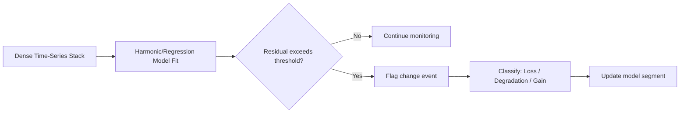
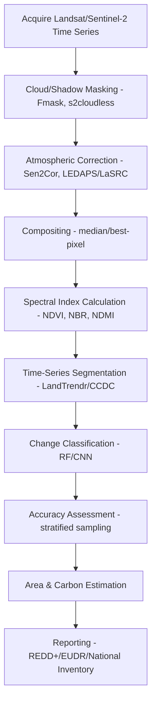

## Deforestation and Forest Change Detection


### Overview

Deforestation and forest change detection is the application of remote sensing, GIS, and statistical analysis to identify, quantify, and monitor the loss, degradation, and regrowth of forest cover over time. It underpins global climate policy (REDD+, Paris Agreement Article 5), biodiversity conservation, supply chain due diligence (EUDR), and national forest inventories. The discipline sits at the intersection of satellite remote sensing, time-series analysis, machine learning, and forest ecology.

**Key Points**

- Deforestation is a permanent, human-induced conversion of forest to non-forest land use (e.g., agriculture, mining, urbanization), distinct from **forest degradation** (reduction in canopy density/quality without land-use change) and natural disturbance (fire, windthrow, disease).
- Forest change detection relies on comparing multi-temporal satellite imagery using spectral, structural, or statistical differencing techniques.
- FAO defines forest as land with tree canopy cover >10%, area >0.5 ha, trees able to reach 5 m height in situ — though national definitions vary substantially, complicating global comparisons. [Unverified: exact thresholds vary by country reporting standards]

---

### Core Concepts and Definitions

#### Forest Change Categories

- **Deforestation**: Stand-replacing, permanent conversion to non-forest use.
- **Forest degradation**: Reduction in biomass/canopy without full conversion (selective logging, understory fire).
- **Forest gain/regrowth**: Reforestation, afforestation, or natural succession.
- **Disturbance vs. loss**: Fire and pest damage may be temporary (canopy recovers) or permanent, requiring temporal follow-up to classify correctly.

#### Drivers of Deforestation

- Agricultural expansion (commodity-driven: soy, palm oil, cattle ranching, cocoa)
- Shifting cultivation
- Logging (legal and illegal)
- Infrastructure development (roads, dams, mining, urban expansion)
- Wildfire (natural and anthropogenic)

---

### Remote Sensing Data Sources

| Sensor/Platform | Resolution | Revisit | Typical Use |
| --- | --- | --- | --- |
| Landsat 5/7/8/9 (TM/ETM+/OLI) | 30 m | 16 days | Long-term historical change (1984–present) |
| Sentinel-2 (MSI) | 10–20 m | 5 days | High-frequency monitoring, near-real-time alerts |
| MODIS | 250–500 m | Daily | Continental-scale, fire/burned-area products |
| PlanetScope | 3–5 m | Daily | Fine-scale validation, illegal logging detection |
| SAR (Sentinel-1, PALSAR-2) | 10–25 m | 6–12 days | Cloud-penetrating monitoring (critical in tropics) |
| LiDAR (GEDI, airborne) | Point cloud | Variable | Canopy height, biomass structure |
| Hyperspectral (EnMAP, PRISMA) | 20–30 m | Variable | Species-level degradation, stress detection |

**Key Points**

- Optical sensors are limited by persistent cloud cover in tropical regions; SAR is essential for continuous monitoring in the Amazon, Congo Basin, and Southeast Asia.
- Sentinel-2's 5-day revisit combined with Landsat's continuity (via Harmonized Landsat Sentinel-2, HLS) enables near-real-time alert systems.

---

### Change Detection Methodologies

#### 1. Spectral Index Differencing

Common vegetation indices computed at two or more time points, then differenced.

**Normalized Difference Vegetation Index (NDVI)**:

$$NDVI = \frac{NIR - Red}{NIR + Red}$$

**Normalized Burn Ratio (NBR)** — for fire/disturbance:

$$NBR = \frac{NIR - SWIR}{NIR + SWIR}$$

**Delta Normalized Burn Ratio (dNBR)**:

$$dNBR = NBR_{prefire} - NBR_{postfire}$$

- Simple, interpretable, computationally cheap.
- Sensitive to phenological noise (seasonal leaf-off, drought) producing false positives; requires cloud/shadow masking and seasonal compositing to mitigate.

#### 2. Image Classification and Post-Classification Comparison

1. Classify each date independently (supervised: Random Forest, SVM; or unsupervised: k-means, ISODATA).
2. Compare classified maps pixel-by-pixel to produce a change matrix.
3. Error accumulates from both classification dates — a key limitation.

#### 3. Time-Series Trajectory Analysis

Uses dense stacks (weekly/monthly composites) rather than bi-temporal pairs.

- **LandTrendr** (Landsat-based Detection of Trends in Disturbance and Recovery): fits temporal segmentation to spectral trajectories, distinguishing abrupt loss from gradual recovery.
- **BFAST** (Breaks For Additive Season and Trend): decomposes time series into trend, seasonal, and remainder components, detecting structural breaks.
- **CCDC** (Continuous Change Detection and Classification): fits harmonic regression models per pixel continuously, flagging change when new observations deviate from the model.

**Example**



#### 4. Machine Learning and Deep Learning Approaches

- **Random Forest / Gradient Boosting**: pixel or object-based classification using spectral + textural + topographic features.
- **Convolutional Neural Networks (CNNs)**: spatial pattern recognition (e.g., U-Net for semantic segmentation of forest loss).
- **LSTM/Transformer models**: sequence modeling of dense time series for change point detection.
- **Object-Based Image Analysis (OBIA)**: segments imagery into homogeneous objects before classification, reducing salt-and-pepper noise common in pixel-based methods.

---

### Operational Global Monitoring Systems

#### Global Forest Watch (GFW) / Hansen Global Forest Change

- Produced by University of Maryland (Hansen et al.), hosted via Global Forest Watch.
- Annual tree cover loss layer at 30 m resolution derived from Landsat time-series analysis.
- Distinguishes **tree cover loss** (any canopy removal, including from harvest cycles) from **deforestation** — an important semantic distinction users often conflate.

#### GLAD (Global Land Analysis and Discovery) Alerts

- Near-real-time Landsat-based alerts (weekly).
- **GLAD-S2**: Sentinel-2 based, higher spatial resolution.

#### RADD (Radar for Detecting Deforestation)

- Sentinel-1 SAR-based alerts, enabling cloud-independent detection critical for wet tropics.

#### JRC Tropical Moist Forest (TMF) Dataset

- European Commission Joint Research Centre product tracking forest cover, degradation, and recovery since 1990 across the tropics.

#### PRODES and DETER (Brazil/INPE)

- **PRODES**: annual, high-accuracy deforestation mapping for the Legal Amazon (official reporting).
- **DETER**: near-daily alert system for rapid response/enforcement, lower positional accuracy, designed for early warning rather than official accounting.

**Key Points**

- Alert systems (GLAD, RADD, DETER) prioritize timeliness for enforcement; annual products (Hansen, PRODES) prioritize accuracy for official statistics and carbon accounting.
- Combining alert and annual products is standard practice for balancing responsiveness and rigor.

---

### Accuracy Assessment

Change detection maps require rigorous validation against reference data (high-resolution imagery interpretation, field plots).

**Confusion Matrix Components**:

- Overall accuracy: $OA = \frac{\sum_{i} n_{ii}}{N}$
- Producer's accuracy (omission error complement): correctly classified reference pixels / total reference pixels in that class
- User's accuracy (commission error complement): correctly classified pixels / total pixels mapped as that class

**Area estimation** should use stratified random sampling with the Olofsson et al. (2014) design-based estimator, which adjusts area estimates using accuracy statistics rather than relying on raw pixel counts — since raw map-based area estimates are biased by classification error.

---

### Biomass and Carbon Estimation

Forest change detection connects directly to carbon accounting via:

$$Emissions = \Delta Forest\ Area \times Carbon\ Density \times \frac{44}{12}$$

- Carbon density derived from allometric equations, LiDAR-derived canopy height (GEDI), or national forest inventory plots.
- The factor 44/12 converts carbon mass to CO₂ mass (molecular weight ratio).
- Above-ground biomass (AGB) models often combine optical/SAR backscatter with LiDAR training data via machine learning regression (Random Forest, XGBoost).

---

### Workflow Example (Practical Pipeline)

**Example**



**Sample Google Earth Engine (GEE) code snippet** for NDVI-based bi-temporal change:

```javascript
// Load Sentinel-2 surface reflectance collections
var before = ee.ImageCollection('COPERNICUS/S2_SR_HARMONIZED')
  .filterDate('2023-01-01', '2023-03-01')
  .filterBounds(roi)
  .median();

var after = ee.ImageCollection('COPERNICUS/S2_SR_HARMONIZED')
  .filterDate('2024-01-01', '2024-03-01')
  .filterBounds(roi)
  .median();

var ndviBefore = before.normalizedDifference(['B8', 'B4']);
var ndviAfter = after.normalizedDifference(['B8', 'B4']);
var ndviChange = ndviAfter.subtract(ndviBefore).rename('NDVI_change');

var lossMask = ndviChange.lt(-0.2); // threshold-based loss flag
Map.addLayer(lossMask.selfMask(), {palette: ['red']}, 'Potential Forest Loss');
```

---

### Policy and Regulatory Frameworks

- **REDD+** (Reducing Emissions from Deforestation and Forest Degradation): UNFCCC mechanism requiring MRV (Measurement, Reporting, Verification) systems built on forest change detection.
- **EU Deforestation Regulation (EUDR)**: requires supply chain traceability for commodities (cattle, cocoa, coffee, palm oil, rubber, soy, wood) linked to deforestation-free land after a cutoff date, relying heavily on satellite monitoring for compliance verification.
- **FAO Forest Resources Assessment (FRA)**: periodic global forest reporting.
- **National Forest Monitoring Systems (NFMS)**: country-level MRV infrastructure combining remote sensing with ground-based inventories.

---

### Common Challenges and Limitations

- **Cloud contamination** in tropical regions reduces usable optical observations; SAR fusion mitigates this.
- **Forest definition ambiguity** across jurisdictions creates comparability issues between datasets.
- **Degradation detection** is inherently harder than deforestation detection because spectral signals are subtler and more easily confused with phenology or sensor noise.
- **Shifting cultivation vs. permanent conversion**: distinguishing rotational agriculture (temporary clearing) from true deforestation requires multi-year trajectory analysis, not single bi-temporal comparisons.
- **Spatial resolution trade-offs**: coarse resolution (MODIS) misses small-scale/selective logging; fine resolution (PlanetScope) increases cost and processing burden at scale.
- Model performance and thresholds are typically tuned per biome/region; a threshold calibrated for boreal forest will likely not transfer directly to tropical moist forest. [Inference: based on general remote sensing domain-transfer behavior; exact transferability depends on specific sensor/region combination]

---

### Emerging Directions

- **Foundation models** for Earth observation (e.g., Clay, Prithvi/IBM-NASA geospatial foundation model, Google's AlphaEarth) applied to forest monitoring via fine-tuning rather than training from scratch.
- **Multi-sensor fusion** (optical + SAR + LiDAR) becoming standard for robust, cloud-independent, structurally-informed monitoring.
- **Near-real-time alert integration** with enforcement workflows (e.g., mobile apps for ranger/community verification).
- **GEDI-Landsat/Sentinel fusion** for wall-to-wall canopy height and biomass mapping beyond GEDI's sparse footprint sampling.

---

### Related Topics

- Forest inventory and biomass estimation (allometric equations, LiDAR-based AGB modeling)
- SAR remote sensing fundamentals and interferometry
- Google Earth Engine and cloud-based geospatial analysis platforms
- Land use/land cover (LULC) classification methods
- Fire and burned area mapping (dNBR, MODIS MCD64A1)
- Carbon accounting and MRV systems for climate policy
- Biodiversity and habitat fragmentation analysis
- Time-series analysis techniques (BFAST, CCDC, LandTrendr in depth)
- Supply chain traceability and geolocation compliance (EUDR implementation)
- Accuracy assessment and sampling design for land cover mapping