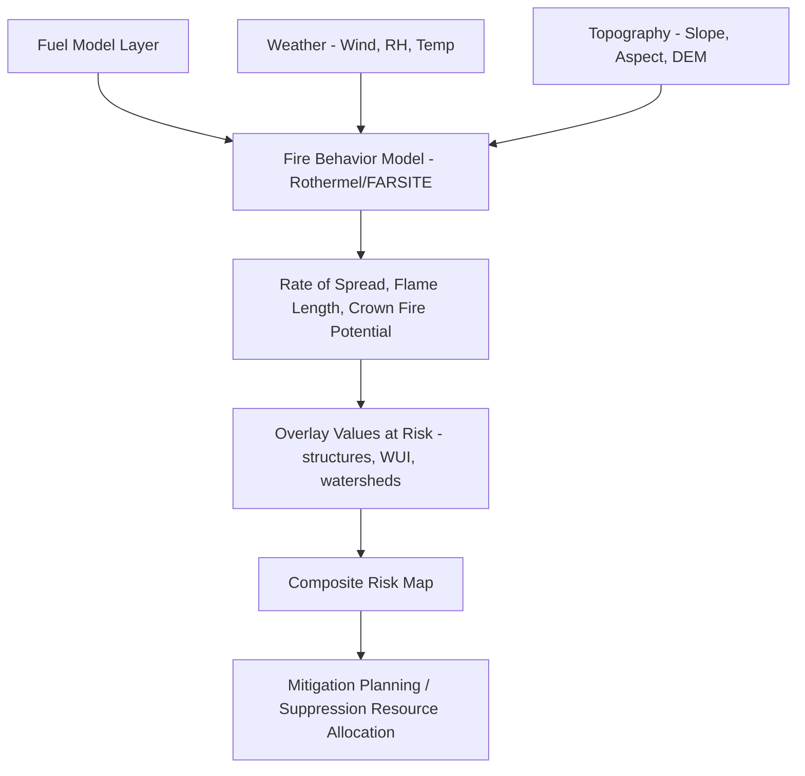
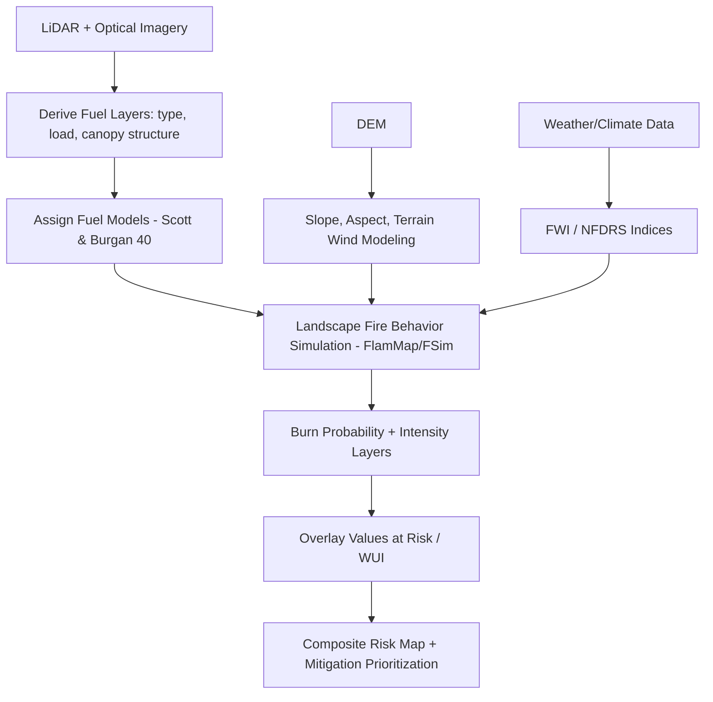

## Wildfire Fuel and Risk Mapping


### Overview

Wildfire fuel and risk mapping is the geospatial characterization of vegetation fuel loads, fuel types, moisture content, terrain, and weather to model fire ignition probability, spread behavior, and potential impact. It integrates remote sensing, fire behavior physics, GIS-based terrain analysis, and machine learning to support pre-fire mitigation planning, real-time suppression decision-making, and post-fire risk assessment.

**Key Points**

- Fuel mapping characterizes *what can burn*; fire behavior modeling predicts *how it will burn*; risk mapping combines likelihood and consequence to prioritize management action.
- Outputs feed prescribed burn planning, defensible space regulation, insurance underwriting, evacuation planning, and suppression resource allocation.

---

### Core Concepts

#### Fuel vs. Hazard vs. Risk

- **Fuel**: combustible biomass (live and dead vegetation) available to burn — quantity, type, arrangement, moisture.
- **Fire hazard**: physical potential for fire behavior (intensity, spread rate) given fuel, weather, and topography — independent of what's at stake.
- **Fire risk**: probability of an event combined with consequences to values at risk (structures, lives, watersheds, habitat, carbon stocks).

$$Risk = Likelihood \times Consequence$$

#### The Fire Behavior Triangle

Fire spread is governed by three interacting factors:

1. **Fuel** — type, load, moisture, continuity (horizontal and vertical)
2. **Weather** — wind speed/direction, temperature, relative humidity
3. **Topography** — slope, aspect, elevation

---

### Fuel Classification Systems

#### Fuel Models

- **Anderson's 13 Fire Behavior Fuel Models (1982)**: classic US system grouping fuels into grass, shrub, timber, and slash categories based on load and depth.
- **Scott and Burgan's 40 Fuel Models (2005)**: expanded system adding dynamic fuel moisture response and better discrimination of fuel bed characteristics; widely used in current US operational modeling.
- **Fuel Characteristic Classification System (FCCS)**: developed by USFS, characterizes fuelbeds across strata (canopy, shrub, herb, woody, litter-lichen-moss, ground) for both fire behavior and smoke/emissions modeling.

#### Fuel Strata

- **Ground fuels**: duff, roots, buried organic matter (smoldering combustion).
- **Surface fuels**: litter, grass, shrubs, downed woody debris (primary driver of surface fire spread rate).
- **Ladder fuels**: shrubs and small trees bridging surface and canopy fuels, enabling vertical fire transition.
- **Canopy/crown fuels**: tree crowns; crown fire potential depends on canopy bulk density and canopy base height.

**Key Points**

- Fuel continuity — both horizontal (surface fuel patchiness) and vertical (ladder fuel presence) — is often more predictive of fire spread than raw fuel load alone.
- Fuel moisture content (live and dead) is the single most dynamic variable, changing on hourly-to-seasonal timescales and requiring near-real-time monitoring.

---

### Remote Sensing Inputs for Fuel Mapping

| Data Source | Application |
| --- | --- |
| LiDAR (airborne/GEDI) | Canopy height, canopy base height, canopy bulk density, vertical fuel structure |
| Landsat/Sentinel-2 | Fuel type classification, vegetation indices, burn severity |
| Hyperspectral (AVIRIS, PRISMA) | Live fuel moisture content, species discrimination |
| SAR (Sentinel-1) | Biomass structure, moisture proxy under cloud cover |
| MODIS/VIIRS | Active fire detection, land surface temperature, daily fuel moisture proxies |
| Digital Elevation Models (DEM) | Slope, aspect, terrain-driven wind and fire spread modeling |
| Weather station networks / RAWS | Real-time temperature, RH, wind for Fire Weather Index inputs |

**Live Fuel Moisture (LFM)** is commonly estimated using spectral indices such as:

**Normalized Difference Water Index (NDWI)**:

$$NDWI = \frac{NIR - SWIR}{NIR + SWIR}$$

**Normalized Difference Infrared Index (NDII)** — similar formulation used for canopy water content proxying.

---

### Fire Danger and Weather Indices

#### US National Fire Danger Rating System (NFDRS)

Integrates fuel moisture, weather, and fuel model into indices such as **Energy Release Component (ERC)** and **Burning Index (BI)**.

#### Canadian Forest Fire Weather Index (FWI) System

Widely adopted internationally; composed of six components:

- **FFMC** (Fine Fuel Moisture Code) — moisture of fine surface litter
- **DMC** (Duff Moisture Code) — moisture of loosely compacted organic layers
- **DC** (Drought Code) — moisture of deep, compact organic layers
- **ISI** (Initial Spread Index) — combines FFMC and wind
- **BUI** (Buildup Index) — combines DMC and DC
- **FWI** (Fire Weather Index) — overall intensity potential, combining ISI and BUI

#### Keetch-Byram Drought Index (KBDI)

Soil moisture deficit proxy on a 0–800 scale, commonly used in the southeastern and southern US.

---

### Fire Behavior Modeling

#### Rothermel Surface Fire Spread Model (1972)

The foundational physical model underlying most operational US fire spread tools (BEHAVE, FARSITE, FlamMap, FSPro):

$$R = \frac{I_R \xi (1 + \phi_w + \phi_s)}{\rho_b \epsilon Q_{ig}}$$

Where $R$ is rate of spread, $I_R$ is reaction intensity, $\xi$ is propagating flux ratio, $\phi_w$ and $\phi_s$ are wind and slope coefficients, $\rho_b$ is bulk density, $\epsilon$ is effective heating number, and $Q_{ig}$ is heat of preignition.

#### Operational Fire Behavior Software

- **FARSITE**: deterministic fire growth simulation using Rothermel spread model + terrain + weather, producing perimeter growth over time.
- **FlamMap**: landscape-scale fire behavior mapping (spread rate, flame length, crown fire potential) for a fixed snapshot in time — used heavily for fuel treatment planning.
- **FSPro (Fire Spread Probability)**: probabilistic fire spread modeling using Monte Carlo simulation across weather scenarios, used operationally during active incidents.
- **FCA (Fire Consequence Analysis)** and **Risk Management Assistance (RMA)** tools: combine spread probability with values-at-risk for large-fire decision support.
- **Cell-automata and semi-empirical models** (e.g., Prometheus in Canada, based on FWI system) used internationally.

**Example**



---

### Landscape Fuel Data Products

#### LANDFIRE (US)

- National program (USGS/USFS) producing 30 m raster layers: existing vegetation type, canopy cover/height/base height/bulk density, surface and canopy fuel models, fire regime condition class.
- Updated periodically via disturbance tracking and remote sensing fusion; the primary data backbone for US operational fire behavior modeling.

#### Wildland-Urban Interface (WUI) Mapping

- Identifies zones where structures intermingle with or are adjacent to wildland vegetation.
- Classified typically as **interface** (structures directly adjacent to contiguous wildland vegetation) vs. **intermix** (structures interspersed within wildland vegetation) based on housing density and vegetation cover thresholds.
- Critical layer for consequence modeling since WUI zones concentrate life-safety and structure-loss risk.

---

### Risk Mapping and Consequence Modeling

A composite wildfire risk map typically overlays:

1. **Burn probability** (from simulation, e.g., FSim/FCon Monte Carlo modeling across thousands of stochastic weather/ignition scenarios)
2. **Fire intensity metrics** (flame length, fireline intensity)
3. **Values at risk** (structures, infrastructure, watersheds supplying drinking water, critical habitat, carbon stocks)
4. **Vulnerability/susceptibility** of those values (e.g., structure ignitability, defensible space compliance)

$$Expected\ Net\ Value\ Change = \sum (Burn\ Probability \times Fire\ Intensity\ Effect \times Response\ Function)$$

This "expected net value change" (ENVC) framework is standard in US federal risk assessment (e.g., USFS Wildfire Risk to Communities).

---

### Machine Learning Applications

- **Ignition probability modeling**: Random Forest, logistic regression, or gradient boosting using historical ignition points, human activity proxies (road density, powerline proximity), lightning climatology, and fuel/weather covariates.
- **Burned area prediction**: CNNs and gradient-boosted models trained on historical fire perimeters plus antecedent fuel/weather conditions.
- **Fuel moisture estimation**: regression models (Random Forest, neural networks) trained on field-sampled LFM against satellite spectral indices, increasingly using data fusion across optical/SAR/thermal.
- **Post-fire burn severity**: differenced Normalized Burn Ratio (dNBR) classified against the **Composite Burn Index (CBI)** field-validated severity scale.

$$dNBR = NBR_{prefire} - NBR_{postfire}$$


---

### Workflow Example: Composite Wildfire Risk Pipeline



**Sample Python snippet** — NDWI-based live fuel moisture proxy using rasterio:

```python
import rasterio
import numpy as np

with rasterio.open('sentinel2_nir.tif') as nir_src, \
     rasterio.open('sentinel2_swir.tif') as swir_src:
    nir = nir_src.read(1).astype('float32')
    swir = swir_src.read(1).astype('float32')

ndwi = (nir - swir) / (nir + swir + 1e-6)

# Flag critically dry vegetation (low moisture proxy)
critical_dryness_mask = ndwi < 0.1
```

---

### Common Challenges and Limitations

- **Fuel model generalization**: standardized fuel models (e.g., the 40 Scott-Burgan models) are approximations; local calibration against field plots improves accuracy but is resource-intensive.
- **Fuel moisture temporal resolution**: satellite-derived LFM estimates typically lag real conditions by days depending on sensor revisit and cloud cover, while fine fuel moisture can change within hours.
- **Wind modeling at fine scale**: terrain-driven wind effects (channeling, downslope events like Santa Ana or Diablo winds) require high-resolution atmospheric modeling (e.g., WindNinja) rather than coarse weather station interpolation alone.
- **Crown fire transition thresholds**: canopy bulk density and base height estimates from LiDAR carry uncertainty that propagates into crown fire potential predictions. [Inference: general uncertainty propagation behavior in physically-based fire models; exact error magnitude is model- and region-specific]
- **Climate change non-stationarity**: historical fire regime data used to calibrate risk models may not represent future fire behavior under shifting climate baselines, requiring scenario-based rather than purely historical-frequency approaches.

---

### Related Topics

- Burn severity mapping and post-fire recovery monitoring (dNBR, CBI)
- LiDAR-derived forest structure metrics
- Fire regime condition class and historical fire ecology
- WindNinja and terrain-driven microscale wind modeling
- Prescribed fire and fuel treatment planning
- Smoke emissions and air quality modeling (BlueSky framework)
- Climate change impacts on fire regimes
- Wildland-Urban Interface policy and defensible space regulation
- Remote sensing time-series for vegetation stress detection
- Insurance and catastrophe risk modeling for wildfire