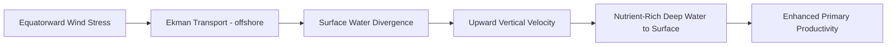

## Oceanographic Fundamentals

### Overview

Oceanographic fundamentals encompass the physical, chemical, biological, and geological processes governing the world's oceans, and the geospatial and remote sensing methods used to observe and model them. This foundation underpins marine spatial planning, coastal hazard assessment, fisheries management, climate modeling, and ocean-atmosphere interaction studies.

**Key Points**

- Oceanography is traditionally divided into four subdisciplines: physical, chemical, biological, and geological oceanography — each contributing distinct but interconnected data layers to marine geospatial analysis.
- Satellite altimetry, scatterometry, and ocean color remote sensing provide the primary synoptic (large-area, repeat-coverage) observational backbone for global ocean monitoring, complementing sparse in-situ measurements.

---

### Physical Oceanography

#### Ocean Structure and Stratification

- **Mixed layer**: near-surface, wind-mixed, relatively uniform temperature/salinity zone.
- **Thermocline**: layer of rapid temperature decrease with depth, separating warm surface water from cold deep water.
- **Halocline**: layer of rapid salinity change with depth.
- **Pycnocline**: layer of rapid density change, typically the combined effect of thermocline and halocline, controlling vertical stratification and mixing.

#### Seawater Density and the Equation of State

Density is a function of temperature, salinity, and pressure:

$$\rho = \rho(T, S, P)$$

Governed by the **TEOS-10** (Thermodynamic Equation of Seawater 2010) standard, which replaced the older EOS-80 formulation as the international reference for computing seawater properties (density, potential temperature, specific volume) from Conservative Temperature and Absolute Salinity.

#### Ocean Circulation

- **Wind-driven (surface) circulation**: Ekman transport, Ekman spiral — net water transport occurs at approximately 90° to wind direction due to Coriolis deflection.
- **Thermohaline circulation**: density-driven deep circulation, often visualized as the "global conveyor belt," driven by temperature and salinity differences (e.g., North Atlantic Deep Water formation).
- **Geostrophic currents**: balance between pressure gradient force and Coriolis force, the dominant balance for large-scale ocean currents away from boundaries.

$$f v = \frac{1}{\rho}\frac{\partial P}{\partial x}$$

Where $f$ is the Coriolis parameter, $v$ is geostrophic velocity, $\rho$ is density, and $\partial P/\partial x$ is the horizontal pressure gradient.

- **Major current systems**: Gulf Stream, Kuroshio, Antarctic Circumpolar Current (ACC), California Current, Humboldt Current — western boundary currents are narrow and fast; eastern boundary currents are broad and slow, with implications for upwelling patterns.

#### Tides

- Driven by gravitational interaction between Earth, Moon, and Sun, modulated by Earth's rotation and coastal geometry.
- **Semidiurnal**, **diurnal**, and **mixed** tidal regimes depending on the relative amplitude of tidal constituents.
- **Harmonic analysis** decomposes tidal signals into constituent frequencies (M2, S2, K1, O1 being dominant), used operationally for tide prediction.

#### Waves

- **Wind waves**: generated by local wind stress; described by significant wave height ($H_s$), period, and direction.
- **Swell**: wave energy propagated away from its generating storm, more regular and longer-period.
- **Wave energy** is proportional to the square of wave height:

$$E \propto H^2$$

- **Internal waves**: waves propagating along density interfaces (e.g., the pycnocline) rather than the sea surface, important for mixing and nutrient transport.

#### Upwelling and Downwelling

- **Coastal upwelling**: wind-driven Ekman transport moves surface water offshore, drawing cold, nutrient-rich deep water to the surface — drives major fisheries productivity zones (e.g., Peru-Humboldt, California, Benguela systems).
- **Downwelling**: convergent transport pushes surface water downward, typically associated with lower biological productivity at the surface.

**Example**

---

### Chemical Oceanography

#### Salinity

- Measured via the **Practical Salinity Scale (PSS-78)**, derived from conductivity, temperature, and pressure measurements; expressed in Practical Salinity Units (PSU), now increasingly reported as Absolute Salinity (g/kg) under TEOS-10.

#### Dissolved Gases and Carbonate Chemistry

- **Ocean carbonate system**: CO₂ dissolves into seawater, forming carbonic acid, bicarbonate, and carbonate ions in equilibrium:

$$CO_2 + H_2O \rightleftharpoons H_2CO_3 \rightleftharpoons H^+ + HCO_3^- \rightleftharpoons 2H^+ + CO_3^{2-}$$

- **Ocean acidification**: increasing atmospheric CO₂ absorption lowers seawater pH and reduces carbonate ion availability, impacting calcifying organisms (corals, shellfish, some plankton).
- **Dissolved oxygen**: varies with temperature (inversely), biological productivity, and circulation; **oxygen minimum zones (OMZs)** form where consumption exceeds resupply, typically at mid-depths in productive upwelling regions.

#### Nutrients

- Key macronutrients: nitrate, phosphate, silicate — limiting factors for phytoplankton growth, with regional variation in which nutrient is limiting (Liebig's Law of the Minimum).

---

### Biological Oceanography

- **Primary production**: photosynthetic carbon fixation by phytoplankton, forming the base of marine food webs; estimated via chlorophyll-a concentration as a proxy, commonly derived from ocean color remote sensing.
- **Trophic structure**: phytoplankton → zooplankton → higher trophic levels, with productivity strongly tied to nutrient availability, light, and mixing regime.
- **Biological pump**: process by which organic carbon produced at the surface sinks to depth, sequestering carbon away from the atmosphere on timescales from years to millennia.

---

### Geological Oceanography

- **Bathymetry**: seafloor topography, mapped via multibeam sonar, satellite altimetry-derived gravity models, or LiDAR in shallow coastal zones.
- **Plate tectonics and seafloor spreading**: mid-ocean ridges, subduction zones, and transform faults shape ocean basin morphology and are linked to seismic/tsunami hazard.
- **Sediment transport**: coastal and shelf sediment dynamics driven by wave, current, and tidal energy, critical for coastal erosion and habitat mapping.

---

### Remote Sensing and Observational Systems

| Data/Platform | Measures | Application |
| --- | --- | --- |
| Satellite altimetry (Jason series, Sentinel-6) | Sea surface height | Geostrophic currents, sea level rise, eddies |
| Ocean color (MODIS-Aqua, VIIRS, Sentinel-3 OLCI) | Chlorophyll-a, turbidity | Primary productivity, water quality |
| SST (AVHRR, MODIS, VIIRS) | Sea surface temperature | Current mapping, upwelling detection, marine heatwaves |
| Scatterometry (ASCAT, QuikSCAT heritage) | Ocean surface wind | Wind stress, Ekman transport estimation |
| Argo floats | Temperature/salinity profiles | Subsurface ocean structure, global heat content |
| Multibeam sonar | Bathymetry | Seafloor mapping, habitat classification |
| Drifting/moored buoys | In-situ T/S/currents/waves | Ground-truthing, model validation |
| Gliders and AUVs | Subsurface profiles | High-resolution process studies |

**Key Points**

- The **Argo float network** (~4,000 autonomous profiling floats globally) is the backbone of subsurface global ocean monitoring, providing near-real-time temperature and salinity profiles to ~2,000 m depth.
- Satellite altimetry-derived sea surface height anomalies are used to compute geostrophic current velocity anomalies via the geostrophic balance equation, enabling global surface current mapping.

---

### Ocean-Atmosphere Coupling

- **ENSO (El Niño-Southern Oscillation)**: coupled ocean-atmosphere phenomenon involving periodic warming (El Niño) and cooling (La Niña) of central/eastern equatorial Pacific SST, with global climate teleconnections.
- **Air-sea heat flux**: exchange of sensible heat, latent heat (evaporation), and radiative energy at the ocean surface, a primary driver of atmospheric circulation and storm intensification.
- **Marine heatwaves**: discrete, prolonged periods of anomalously warm SST, increasingly monitored via satellite SST time series and linked to coral bleaching and ecosystem disruption.

---

### Common Geospatial Applications

- Marine spatial planning and habitat suitability modeling using layered bathymetry, SST, salinity, and current data.
- Coastal vulnerability and sea level rise projection combining altimetry trends with digital elevation models.
- Fisheries management using upwelling and chlorophyll-a proxies for productivity hotspots.
- Oil spill and marine debris trajectory modeling using surface current and wind field data (Lagrangian particle tracking).
- Harmful algal bloom (HAB) detection via ocean color anomaly detection.

---

### Common Challenges and Limitations

- **Subsurface data sparsity**: despite Argo, deep ocean (>2,000 m) and polar regions remain undersampled relative to surface satellite coverage.
- **Cloud cover** limits optical ocean color and SST retrieval frequency, similar to terrestrial remote sensing constraints.
- **Altimetry resolution near coasts**: traditional nadir altimetry has degraded accuracy in shallow coastal waters due to land contamination in the radar footprint; wide-swath missions (e.g., SWOT) aim to address this. [Unverified: SWOT coastal accuracy improvements are an active area of ongoing validation as of the most recent literature]
- **Model-observation integration**: data assimilation into ocean circulation models (e.g., HYCOM, ROMS) carries uncertainty that varies by region and variable, particularly in eddy-resolving simulations. [Inference: general data assimilation uncertainty behavior; magnitude depends on specific model configuration and region]

---

### Related Topics

- Sea level rise monitoring and coastal vulnerability assessment
- Ocean color remote sensing and chlorophyll-a algorithms
- Bathymetric LiDAR and multibeam sonar mapping
- Coral reef and marine habitat mapping
- Marine heatwave detection and coral bleaching monitoring
- Coastal erosion and shoreline change analysis
- Harmful algal bloom detection via remote sensing
- Ocean circulation modeling (HYCOM, ROMS, data assimilation)
- ENSO and climate teleconnection analysis
- Marine spatial planning and GIS-based habitat suitability modeling