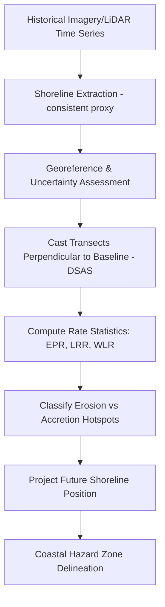

## Coastal Processes and Shoreline Change

### Overview

Coastal processes and shoreline change encompass the physical mechanisms that shape coastlines — wave action, tides, sediment transport, and sea level dynamics — and the geospatial methods used to detect, quantify, and forecast shoreline position change over time. This domain is central to coastal hazard assessment, erosion management, infrastructure planning, and climate adaptation.

**Key Points**

- Shoreline change results from the interaction of forcing processes (waves, tides, currents, sea level rise) with sediment supply, coastal geomorphology, and human modification (armoring, dredging, damming).
- Geospatial shoreline analysis relies on time-series aerial/satellite imagery, LiDAR-derived elevation, and statistical trend analysis to quantify historical rates and project future positions.

---

### Core Coastal Processes

#### Wave-Driven Processes

- **Wave shoaling**: as waves move into shallower water, wavelength decreases and wave height increases due to conservation of energy flux.
- **Wave refraction**: waves bend as they approach shore at an angle, due to differential speed change with depth, tending to focus energy on headlands and disperse it in bays.
- **Wave breaking and surf zone dynamics**: energy dissipation in the nearshore zone drives sediment suspension and transport.

#### Longshore and Cross-Shore Sediment Transport

- **Longshore drift**: net sediment transport parallel to shore, driven by oblique wave approach generating a longshore current within the surf zone.

$$Q_l \propto H_b^{2.5} \sin(2\alpha_b)$$

Where $Q_l$ is longshore sediment transport rate, $H_b$ is breaking wave height, and $\alpha_b$ is the breaking wave angle relative to shore — the general form underlying the widely used **CERC formula**.

- **Cross-shore transport**: seasonal and storm-driven exchange of sediment between beach and nearshore bar systems (e.g., summer accretion vs. winter erosion profiles in mid-latitude beaches).

#### Tidal and Estuarine Processes

- **Tidal prism**: volume of water exchanged through a tidal inlet between high and low tide, controlling inlet stability and ebb/flood delta morphology.
- **Tidal flats and marshes**: sediment accretion balances relative sea level rise in stable systems; imbalance leads to marsh drowning or progradation.

#### Sea Level and Vertical Land Motion

- **Relative sea level rise (RSLR)** = eustatic (global) sea level rise + local vertical land motion (subsidence or uplift from tectonics, groundwater/hydrocarbon extraction, glacial isostatic adjustment, sediment compaction).

$$RSLR = SLR_{eustatic} + VLM$$

- Subsidence-driven RSLR can substantially exceed the global eustatic rate in specific settings (e.g., Mississippi Delta, parts of Southeast Asia), making local VLM measurement (via GNSS, InSAR) essential for accurate local projections. [Unverified: exact regional subsidence rates vary significantly by location and are best sourced from current local monitoring networks rather than generalized]

---

### Coastal Landform Types and Response

| Landform | Typical Process Signature |
| --- | --- |
| Sandy beaches | High-frequency, wave-dominated cycling (accretion/erosion) |
| Barrier islands | Overwash, inlet migration, landward rollover under RSLR |
| Rocky/cliffed coasts | Slow erosion punctuated by episodic mass wasting events |
| Deltas | Sediment supply vs. compaction/subsidence balance |
| Salt marshes/mangroves | Vertical accretion vs. RSLR; sediment trapping by vegetation |
| Coral reef coasts | Wave attenuation by reef structure; sensitive to reef degradation |

---

### Shoreline Change Detection Methodology

#### Shoreline Proxy Indicators

Since "the shoreline" is not a single fixed physical feature, mapping requires selecting a consistent proxy:

- **High Water Line (HWL)**: visually identifiable wet/dry sand boundary on imagery — historically common but subjective and tide/wave-state dependent.
- **Mean High Water (MHW)** or **Mean Sea Level (MSL)** datum-based shoreline: derived from LiDAR elevation intersected with a tidal datum — more objective and repeatable.
- **Vegetation line**: used in some marsh/dune contexts as a longer-term stability proxy.

**Key Points**

- Mixing shoreline proxies across time periods (e.g., HWL from historical aerial photos vs. LiDAR-derived MHW from modern surveys) introduces systematic bias into change rate calculations and must be corrected or explicitly acknowledged.

#### Data Sources for Time-Series Analysis

- Historical aerial photography (often digitized/georeferenced back to early-to-mid 20th century in well-studied regions)
- T-sheets (NOAA historical topographic survey sheets, 19th–20th century)
- Satellite imagery (Landsat, Sentinel-2) for multi-decadal, moderate-resolution trend analysis
- Airborne and satellite-derived LiDAR/bathymetric LiDAR for high-resolution elevation-based shoreline extraction
- Structure-from-Motion (SfM) photogrammetry from UAV surveys for fine-scale, repeat local monitoring

#### Statistical Trend Analysis — DSAS (Digital Shoreline Analysis System)

USGS-developed ArcGIS extension, the standard tool for computing shoreline change statistics along transects cast perpendicular to a baseline.

Common statistics computed per transect:

- **End Point Rate (EPR)**: distance between oldest and newest shoreline divided by time elapsed — simple but sensitive to endpoint noise.
- **Linear Regression Rate (LRR)**: least-squares regression slope of shoreline position vs. time across all available dates — more robust to individual outlier shorelines.
- **Weighted Linear Regression (WLR)**: regression weighted by positional uncertainty of each shoreline date.
- **Net Shoreline Movement (NSM)**: total distance between earliest and most recent shoreline.

$$LRR = \frac{\sum (t_i - \bar{t})(y_i - \bar{y})}{\sum (t_i - \bar{t})^2}$$

Where $t_i$ is date and $y_i$ is shoreline position along the transect.

**Example**

---

### Remote Sensing and Geospatial Tools

| Tool/Data | Purpose |
| --- | --- |
| USGS DSAS | Transect-based shoreline change rate statistics |
| CoastSat (open-source, Python) | Automated satellite-derived shoreline extraction from Landsat/Sentinel-2 |
| NOAA Digital Coast | Repository of coastal LiDAR, imagery, and analysis tools |
| Structure-from-Motion (SfM) | UAV-based high-resolution topographic/beach profile monitoring |
| InSAR | Vertical land motion detection for subsidence-adjusted RSLR |
| GNSS/RTK survey | Ground-truth elevation and shoreline position validation |

**CoastSat** is a widely used open-source Python toolkit that automates sub-pixel shoreline position extraction from publicly available satellite imagery using a machine-learning-based water/land classifier, enabling shoreline time-series generation without manual digitization at global scale.

---

### Coastal Hazard and Vulnerability Modeling

- **Storm surge modeling**: combines wind stress, atmospheric pressure gradient, and bathymetry to predict water level rise during storms (e.g., SLOSH, ADCIRC models).
- **Coastal flood exposure mapping**: intersects projected water levels (surge + tide + wave runup + sea level rise) with digital elevation models to delineate inundation extent.
- **Coastal Vulnerability Index (CVI)**: composite index combining geomorphology, shoreline change rate, coastal slope, relative sea level rise, mean wave height, and mean tidal range into a relative vulnerability ranking.
- **Bruun Rule**: simplified equilibrium profile model relating shoreline retreat to sea level rise:

$$R = \frac{L}{h+B} \times S$$

Where $R$ is shoreline retreat, $L$ is the active profile length, $h$ is closure depth, $B$ is berm height, and $S$ is sea level rise — widely used for first-order estimates but with recognized limitations regarding sediment budget assumptions and applicability to non-equilibrium or sediment-starved coasts. [Inference: Bruun Rule limitations are well-documented in the coastal geomorphology literature; specific applicability depends on local sediment supply conditions]

---

### Human Modification and Management Responses

- **Hard stabilization**: seawalls, revetments, groins, jetties — protect fixed infrastructure but often cause downdrift erosion and eventual beach narrowing/loss in front of the structure ("coastal squeeze").
- **Soft stabilization**: beach nourishment, dune restoration — adds sediment volume, generally considered more sustainable but requires periodic renourishment.
- **Managed retreat**: planned relocation of infrastructure/development away from eroding or high-risk zones.
- **Living shorelines**: nature-based approaches using marsh vegetation, oyster reefs, or other biogenic structures to stabilize shorelines while maintaining ecological function.

---

### Common Challenges and Limitations

- **Proxy inconsistency**: as noted, blending different shoreline indicators across a time series introduces uncertainty that must be quantified (typically reported as a positional uncertainty band per shoreline date, e.g., ±X m).
- **Seasonal and storm-event noise**: single-date shoreline snapshots can misrepresent long-term trends if captured immediately after a storm or during anomalous seasonal beach state; multi-date averaging or seasonal normalization is recommended.
- **Sediment budget data gaps**: accurate shoreline change projection requires understanding sediment sources/sinks (littoral cells, dredging, damming of sediment-supplying rivers), which are often poorly quantified.
- **Nonlinear and threshold responses**: barrier island and marsh systems can exhibit threshold behavior (e.g., marsh drowning, inlet breaching) that linear regression-based trend extrapolation does not capture well.
- **Vertical datum complexity**: converting between tidal datums (MHW, MSL, NAVD88) and ensuring elevation data consistency across sources is a frequent source of error in coastal elevation-based analyses.

---

### Related Topics

- Storm surge and coastal flood modeling (SLOSH, ADCIRC)
- Sea level rise projections and vertical land motion (InSAR, GNSS)
- Beach nourishment and living shoreline design
- Barrier island and inlet dynamics
- Salt marsh and mangrove accretion dynamics
- UAV-based Structure-from-Motion coastal monitoring
- Coastal Vulnerability Index (CVI) methodology
- Tidal datum conversion and geodesy for coastal applications
- Digital Shoreline Analysis System (DSAS) workflow in depth
- Climate adaptation and managed retreat planning