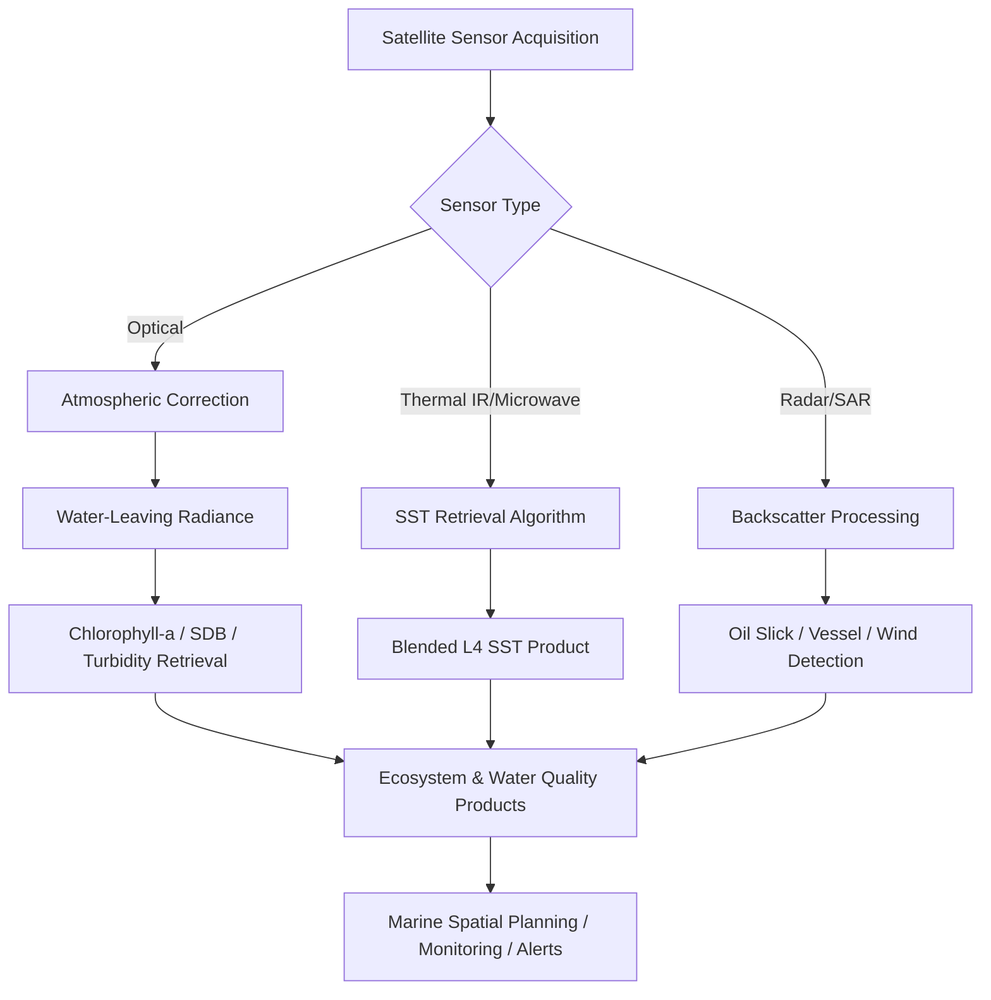

## Marine Remote Sensing Applications

### Overview

Marine remote sensing applications encompass the use of satellite, airborne, and in-situ sensor platforms to observe, quantify, and monitor ocean and coastal properties — including sea surface temperature, ocean color, bathymetry, sea state, and marine ecosystem health. These applications provide the synoptic, repeat-coverage data essential for operational oceanography, fisheries management, marine conservation, and climate monitoring at scales unattainable through ship-based sampling alone.

**Key Points**

- Marine remote sensing spans the electromagnetic spectrum from visible/NIR (ocean color, bathymetry) through thermal infrared (SST) to microwave (altimetry, scatterometry, SAR), each suited to different ocean properties.
- Unlike terrestrial remote sensing, most ocean color and thermal signals originate from only the top few meters to tens of meters of the water column, requiring careful atmospheric and water-column correction.

---

### Sensor Categories and Core Applications

#### Ocean Color Remote Sensing

- Measures water-leaving radiance in visible wavelengths to derive chlorophyll-a concentration, colored dissolved organic matter (CDOM), total suspended sediment, and water clarity.
- **Key sensors**: MODIS-Aqua/Terra, VIIRS (Suomi-NPP, NOAA-20/21), Sentinel-3 OLCI, PACE (NASA's hyperspectral ocean color mission).
- **Chlorophyll-a retrieval** commonly uses band-ratio algorithms (e.g., OC3/OC4 algorithms) relating blue-to-green reflectance ratios to pigment concentration:

$$Chl\text{-}a = 10^{(a_0 + a_1 R + a_2 R^2 + a_3 R^3 + a_4 R^4)}$$

Where $R = \log_{10}(R_{rs,blue}/R_{rs,green})$ and coefficients $a_0$–$a_4$ are empirically derived.

- Requires **atmospheric correction** to remove the dominant atmospheric contribution (often >90% of top-of-atmosphere signal) before water-leaving radiance can be isolated — a critical and error-prone processing step.

#### Sea Surface Temperature (SST)

- Derived from thermal infrared (AVHRR, MODIS, VIIRS) or passive microwave (AMSR2) sensors.
- **Infrared SST**: higher spatial resolution (~1 km) but blocked by cloud cover.
- **Microwave SST**: coarser resolution (~25 km) but penetrates non-precipitating clouds, providing more complete daily coverage.
- Blended, gap-filled SST products (e.g., NOAA OISST, GHRSST-derived L4 products) combine multiple sensors for continuous daily global coverage.
- Applications: current mapping, upwelling detection, marine heatwave monitoring, El Niño/La Niña tracking, fisheries habitat modeling.

#### Satellite Altimetry

- Radar altimeters (Jason series, Sentinel-6 Michael Freilich, SWOT) measure sea surface height with centimeter-level precision.
- Derives **geostrophic current velocities** via the geostrophic balance relationship between sea surface height gradients and Coriolis force, enabling global mapping of ocean currents and mesoscale eddies.
- Core dataset for **global mean sea level rise monitoring** — the multi-decadal Jason/TOPEX altimetry record is a foundational climate data record.
- **SWOT (Surface Water and Ocean Topography)**: wide-swath interferometric altimetry mission providing 2D sea surface height at ~1 km resolution (vs. narrow nadir tracks of traditional altimeters), extending coverage into coastal zones and enabling finer-scale eddy and current detection.

#### Synthetic Aperture Radar (SAR)

- Active microwave imaging, cloud- and daylight-independent.
- **Applications**:
  - Oil spill detection (spills dampen surface capillary waves, appearing as dark patches with distinct texture from natural slicks)
  - Ship detection and maritime domain awareness (vessel monitoring, illegal fishing detection)
  - Sea ice mapping and classification
  - Internal wave and surface current front detection via surface roughness signatures
  - Wind speed retrieval via backscatter-wind relationships (e.g., CMOD geophysical model functions)

#### Scatterometry

- Active microwave sensors (ASCAT, and historically QuikSCAT) measuring backscatter to derive near-surface ocean wind speed and direction.
- Key input for computing wind stress and Ekman transport, and for validating/initializing numerical weather and wave models.

#### Bathymetric and Coastal Mapping

- **Satellite-Derived Bathymetry (SDB)**: uses the differential attenuation of visible light wavelengths with water depth in clear, shallow water (typically <20–30 m) to estimate depth from multispectral imagery (Sentinel-2, PlanetScope, WorldView).
- **Airborne bathymetric LiDAR**: uses a green laser (532 nm) that penetrates the water column, paired with a near-infrared laser for the water surface return, to directly measure depth via time-of-flight in clear shallow water.
- **Multibeam sonar**: primary method for deep and turbid-water bathymetric mapping, providing high-resolution swath coverage from vessel-mounted transducers.

$$Depth \approx \frac{\ln(R_{blue}) - \ln(R_{green})}{k}$$

A simplified form of the log-ratio SDB approach, where $k$ is an empirically calibrated attenuation coefficient ratio. [Inference: general form of published log-ratio SDB algorithms such as Stumpf et al. 2003; exact coefficients require local field calibration]

---

### Marine Ecosystem and Habitat Applications

- **Coral reef mapping**: multispectral/hyperspectral imagery combined with bathymetry to classify benthic habitat types (coral, seagrass, sand, rubble) and detect bleaching via anomalous reflectance and thermal stress indices (e.g., NOAA Coral Reef Watch's Degree Heating Weeks product).
- **Seagrass and kelp mapping**: canopy extent and density mapped via high-resolution multispectral imagery, important for blue carbon accounting and fisheries habitat assessment.
- **Harmful algal bloom (HAB) detection**: anomalous chlorophyll-a or specific pigment signatures (e.g., phycocyanin for cyanobacteria) detected via ocean color time-series anomaly analysis.
- **Marine mammal and megafauna habitat modeling**: integrates SST, chlorophyll-a, and bathymetry as environmental covariates in species distribution models.

**Example**

---

### Data Processing Considerations

#### Atmospheric Correction (Ocean Color)

- Removes Rayleigh scattering, aerosol scattering, and sun glint contamination to isolate true water-leaving radiance.
- Standard algorithms: NASA's `l2gen` processing chain (SeaDAS), POLYMER, ACOLITE (widely used for coastal/inland waters with Sentinel-2/Landsat).

#### Cloud Masking and Compositing

- Similar challenges to terrestrial remote sensing; ocean color and SST products commonly use multi-day composites (e.g., 8-day, monthly) to improve spatial coverage at the cost of temporal resolution.

#### Calibration and Validation (Cal/Val)

- In-situ validation networks (e.g., AERONET-OC for ocean color, moored buoys for SST) are essential for algorithm calibration and product accuracy assessment, since satellite retrievals require empirical tuning against field measurements.

---

### Operational and Application Platforms

| Platform/Product | Provider | Function |
| --- | --- | --- |
| NASA Ocean Color Web / OB.DAAC | NASA | Global ocean color data distribution and processing |
| Copernicus Marine Service (CMEMS) | EU/ESA | Integrated ocean analysis/forecast products (physical, biogeochemical) |
| NOAA Coral Reef Watch | NOAA | Thermal stress monitoring for coral bleaching |
| Global Fishing Watch | NGO/partnership | AIS + SAR-based vessel tracking for fisheries monitoring |
| ACOLITE | RBINS | Open-source atmospheric correction for coastal/inland water |
| SeaDAS | NASA | Ocean color processing and analysis software |

---

### Common Challenges and Limitations

- **Case 1 vs. Case 2 waters**: standard ocean color algorithms are calibrated primarily for open-ocean "Case 1" waters (optical properties dominated by phytoplankton); coastal "Case 2" waters with high sediment/CDOM loading require specialized algorithms (e.g., ACOLITE) and show higher retrieval uncertainty.
- **Sun glint and cloud shadow contamination**: can corrupt optical retrievals and require specific masking; glint is a particular challenge for both ocean color and SDB in certain sun-sensor geometries.
- **Bathymetric depth limits**: SDB accuracy degrades rapidly with depth and turbidity, generally limited to depths where sufficient light penetration and return signal exist — often no more than a few tens of meters in clear water and considerably less in turbid coastal zones.
- **Temporal mismatch**: polar-orbiting satellite revisit (often 1–3 days for a given sensor) may miss short-duration events (e.g., localized HAB blooms, transient current features), partially mitigated by multi-sensor constellations.
- **Validation sparsity in remote regions**: Cal/Val infrastructure is concentrated in well-studied coastal regions, leaving open-ocean and polar product accuracy less constrained. [Unverified: regional validation density varies and is best confirmed against current mission-specific validation reports]

---

### Related Topics

- Oceanographic fundamentals (circulation, stratification, tides)
- Satellite-derived bathymetry algorithm development and calibration
- Coral reef and benthic habitat classification
- Sea surface temperature and marine heatwave detection
- SAR-based vessel detection and illegal fishing monitoring
- Ocean color atmospheric correction algorithms (ACOLITE, l2gen, POLYMER)
- Coastal water quality and turbidity monitoring
- Blue carbon ecosystem mapping (seagrass, mangroves, salt marsh)
- Numerical ocean circulation and forecasting models (HYCOM, CMEMS)
- Global Fishing Watch and maritime domain awareness systems