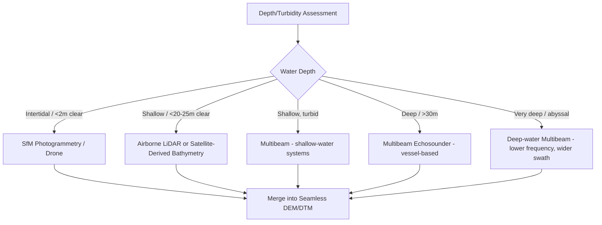

## Bathymetric Mapping Techniques

### Overview

Bathymetric mapping techniques are the methods used to measure and represent underwater topography — the depth and shape of ocean, sea, lake, and river floors. These techniques range from acoustic sonar systems for deep and turbid water to optical and LiDAR-based methods for clear shallow water, forming the geospatial foundation for navigation safety, coastal engineering, habitat mapping, hazard assessment, and marine spatial planning.

**Key Points**

- No single bathymetric method covers the full depth range and water clarity spectrum efficiently; operational bathymetric mapping programs typically combine multiple techniques (multibeam, LiDAR, satellite-derived) matched to depth zone and water conditions.
- Modern seafloor mapping increasingly emphasizes not just depth but also seafloor backscatter (for substrate classification) and full 3D point cloud data for habitat and geomorphological analysis.

---

### Acoustic Methods

#### Single-Beam Echosounder (SBES)

- Transmits a single narrow acoustic pulse downward and measures two-way travel time to compute depth:

$$Depth = \frac{c \times t}{2}$$

Where $c$ is the speed of sound in water (~1,500 m/s, varying with temperature, salinity, and pressure) and $t$ is two-way travel time.

- Produces a single depth measurement per ping along the vessel track (a line of soundings), historically the standard for hydrographic surveying, now largely superseded by multibeam for high-resolution mapping but still used for simple transects and shallow small-craft surveys.

#### Multibeam Echosounder (MBES)

- Transmits a fan of acoustic beams perpendicular to the vessel track, simultaneously measuring depth across a swath (typically 4–7× water depth in swath width), enabling full-coverage seafloor mapping rather than sparse trackline soundings.
- Produces both **bathymetry** (depth grid) and **backscatter intensity** (proxy for seafloor hardness/roughness, useful for substrate/habitat classification).
- Requires precise vessel positioning (GNSS), attitude correction (motion sensor/IMU for pitch, roll, heave), and sound velocity profiling (to correct for refraction of the beam fan through the water column).

$$SVC: \theta_2 = \sin^{-1}\left(\frac{c_2}{c_1}\sin\theta_1\right)$$

Snell's law-based ray-bending correction applied using measured sound velocity profiles, essential because sound speed varies with depth due to temperature/salinity/pressure gradients, causing beam refraction that must be corrected for accurate positioning of soundings.

- **Key processing steps**: raw beam data → motion/attitude correction → sound velocity correction → tide correction → outlier/noise filtering (e.g., CUBE algorithm — Combined Uncertainty and Bathymetry Estimator) → gridded bathymetric surface.

#### Sidescan Sonar

- Produces high-resolution seafloor imagery based on backscatter intensity from an angled acoustic beam, excellent for identifying seafloor features, debris, shipwrecks, and habitat texture, but does not directly produce quantitative bathymetry (depth) without interferometric processing.
- **Interferometric (phase-differencing) sidescan/swath systems**: combine sidescan imagery with phase-based depth derivation, offering wide swath coverage as an alternative to multibeam, particularly cost-effective in shallow water.

#### Single-Beam vs. Multibeam Comparison

| Characteristic | Single-Beam | Multibeam |
| --- | --- | --- |
| Coverage | Trackline only (sparse) | Full swath (complete coverage) |
| Resolution | Coarse between lines | High, continuous |
| Cost/complexity | Lower | Higher (more sensors, processing) |
| Typical use | Reconnaissance, small craft, shallow rivers | Hydrographic charting, habitat mapping, engineering surveys |
| Backscatter data | Limited/none | Yes, co-registered with bathymetry |

---

### Optical and Laser Methods

#### Airborne Bathymetric LiDAR (ALB)

- Uses a dual-laser system: a **green laser (532 nm)** that penetrates the water column and reflects off the seafloor, paired with a **near-infrared laser (1064 nm)** that reflects off the water surface, enabling depth computation via the time difference between returns.

$$Depth = \frac{c_{water} \times \Delta t}{2}$$

Where $c_{water}$ is the speed of light in water (refractive index-adjusted) and $\Delta t$ is the time difference between surface and bottom returns.

- Effective typically in clear water to depths of a few tens of meters, with maximum penetration strongly dependent on water clarity (turbidity, chlorophyll content) — turbid coastal water can reduce effective depth substantially compared to clear oceanic water.
- Efficient for large-area, shallow, clear-water coastal surveys (e.g., reef systems, sandy shelf environments) where vessel-based multibeam would be slow or logistically difficult (shallow draft hazards).

#### Satellite-Derived Bathymetry (SDB)

- Estimates depth from multispectral satellite imagery (Sentinel-2, PlanetScope, WorldView) by exploiting the differential attenuation of different wavelengths with depth in clear water — blue light penetrates deepest, red/NIR is absorbed quickly.
- **Log-ratio (Stumpf) method**, a widely used empirical approach:

$$Depth = m_1 \frac{\ln(n \times R_{blue})}{\ln(n \times R_{green})} - m_0$$

Where $m_1$, $m_0$ are empirically derived coefficients (calibrated against known-depth reference points, e.g., LiDAR or sonar survey data) and $n$ is a scaling constant to ensure positive log arguments.

- Physics-based (radiative transfer) approaches offer an alternative that can require less site-specific empirical calibration but demand more detailed knowledge of water optical properties. [Inference: general trade-off documented in SDB literature; exact performance depends on implementation and validation data]
- Effective range typically extends to depths of roughly 15–25 m in clear water, degrading significantly in turbid or optically complex coastal zones.

#### Structure-from-Motion (SfM) Photogrammetry

- Used for very shallow (sub-meter to few-meter) clear-water bathymetry from drone or aircraft imagery, applying refraction correction to account for the bending of light at the air-water interface.
- Common in intertidal zone, reef flat, and shallow stream/river bathymetric mapping at high spatial resolution.

---

### Method Selection by Depth Zone

**Example**

---

### Data Processing and Product Generation

#### Vertical Referencing

- Bathymetric data must be referenced to a defined **vertical datum** — commonly a tidal datum such as **Mean Lower Low Water (MLLW)** for nautical charting (ensuring conservative, safe-for-navigation depths) or an ellipsoidal/geoid-based datum for integration with terrestrial elevation data.
- **Vertical datum transformation** between tidal and geodetic references is a frequent and consequential source of error when merging bathymetric and topographic datasets into a seamless "topobathymetric" DEM.

#### Uncertainty and Quality Standards

- **IHO (International Hydrographic Organization) S-44 standard**: defines survey order categories (Special, 1a, 1b, 2) specifying total vertical and horizontal uncertainty limits based on the survey's intended use (e.g., critical navigation areas require the tightest uncertainty tolerances).
- **CUBE (Combined Uncertainty and Bathymetry Estimator)**: statistical algorithm widely used in multibeam processing software to generate a bathymetric surface with associated uncertainty estimates from dense, overlapping soundings, while flagging statistical outliers.

#### Topobathymetric DEM Integration

- Seamless elevation models spanning land and sea require merging LiDAR/photogrammetric topography with bathymetric data (multibeam, SDB, or bathymetric LiDAR), harmonized to a common vertical datum — essential for coastal flood modeling, tsunami inundation modeling, and sediment transport studies that must represent the land-sea continuum without an artificial discontinuity at the shoreline.

---

### Applications

- Nautical charting and navigation safety (IHO/national hydrographic offices)
- Coastal engineering and dredging volume calculations
- Benthic habitat mapping (coral, seagrass, hardbottom classification using bathymetry + backscatter)
- Tsunami and storm surge inundation modeling (requires accurate nearshore/offshore bathymetry as a boundary condition)
- Submarine cable and pipeline route planning
- Geohazard assessment (submarine landslides, fault mapping)
- Fisheries habitat and essential fish habitat delineation

---

### Common Challenges and Limitations

- **Turbidity constraints**: optical methods (LiDAR, SDB, SfM) are fundamentally limited by water clarity; none can reliably map depth in highly turbid estuarine or sediment-laden coastal waters, where acoustic methods remain necessary despite higher cost.
- **Shallow-water vessel access**: multibeam surveys in very shallow water (<2–3 m) face vessel draft and safety constraints, creating a coverage gap often termed the "white ribbon" between vessel-surveyable depths and land-based topographic survey limits — a gap increasingly filled by drone-based SfM and bathymetric LiDAR.
- **Temporal dynamics**: sandy and estuarine seafloors can change significantly between survey epochs (storm events, sediment transport), meaning bathymetric data has a practical "shelf life" that varies by environment — highly dynamic inlet and nearshore zones require more frequent resurvey than stable deep offshore areas.
- **Calibration data dependency for SDB**: empirical SDB algorithms require reliable reference depth data (from LiDAR or sonar) for calibration in each new area, limiting fully independent deployment in unsurveyed regions.
- **Data volume and processing complexity**: dense multibeam point clouds and LiDAR data require substantial processing pipelines (motion correction, sound velocity correction, artifact removal) and computing/storage resources at survey scale.

---

### Related Topics

- Multibeam sonar processing workflows and CUBE algorithm
- Satellite-derived bathymetry algorithm calibration
- Topobathymetric DEM creation for coastal flood modeling
- Benthic habitat classification using bathymetry and backscatter
- Tidal datum transformation and vertical referencing
- IHO S-44 hydrographic survey standards
- Drone/UAV Structure-from-Motion shallow-water mapping
- Submarine geohazard mapping
- Coastal and marine spatial planning data integration
- Tsunami and storm surge inundation modeling inputs