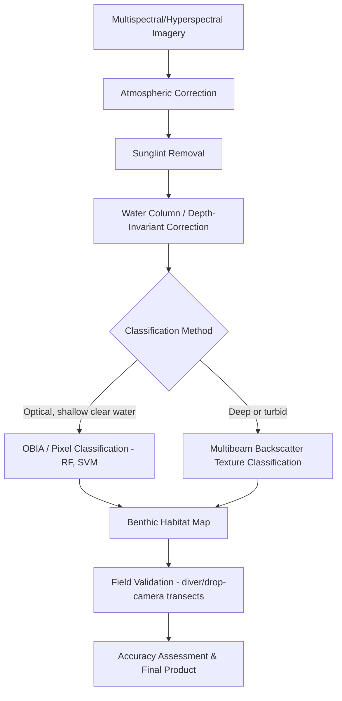

## Coral Reef and Marine Habitat Mapping

### Overview

Coral reef and marine habitat mapping is the geospatial identification, classification, and monitoring of benthic (seafloor) marine ecosystems — coral reefs, seagrass meadows, mangroves, kelp forests, and other substrate types — using remote sensing, in-situ survey, and GIS methods. These maps underpin marine protected area (MPA) design, fisheries habitat management, reef resilience monitoring, and blue carbon accounting.

**Key Points**

- Habitat mapping requires resolving both **depth** (bathymetry) and **substrate/cover type** (benthic classification), typically from the same or complementary optical/acoustic datasets.
- Because benthic habitats occur in shallow, often clear water, optical remote sensing (satellite, airborne, drone) plays a larger relative role here than in most other marine remote sensing applications, alongside acoustic methods for deeper or turbid reef environments.

---

### Habitat Types and Ecological Context

#### Coral Reefs

- Structurally complex, calcium carbonate-based ecosystems built by scleractinian (hard) corals in symbiosis with photosynthetic zooxanthellae algae.
- Habitat zones typically mapped: reef crest, fore reef/reef slope, back reef, reef flat, patch reef, lagoon.
- **Coral bleaching**: loss of zooxanthellae (and associated pigmentation) under thermal stress, detectable via anomalous spectral reflectance and monitored operationally via sea surface temperature-based stress indices.

#### Seagrass Meadows

- Submerged flowering plants forming dense meadows in soft-sediment shallow coastal zones; critical nursery habitat and significant blue carbon sink due to high organic carbon burial rates in sediment.

#### Mangroves

- Intertidal woody vegetation forming the interface between terrestrial and marine systems; mapped using a blend of terrestrial (optical, LiDAR, SAR) and coastal remote sensing methods given their position at the land-sea boundary.

#### Kelp Forests and Macroalgae

- Canopy-forming brown algae in temperate/cold shallow waters, mapped via surface canopy detection (optical imagery capturing the floating/near-surface canopy) rather than deep benthic classification.

#### Hardbottom, Rubble, and Sand

- Non-living or non-vegetated substrate classes that remain essential mapping categories for complete habitat characterization and for distinguishing live coral/seagrass extent from surrounding substrate.

---

### Remote Sensing Data Sources

| Sensor/Platform | Resolution | Application |
| --- | --- | --- |
| Sentinel-2 / Landsat | 10–30 m | Regional-scale reef/seagrass extent mapping |
| PlanetScope / WorldView / Pléiades | 0.3–3 m | Fine-scale benthic classification |
| Hyperspectral (AVIRIS, PRISMA, PACE) | 5–30 m | Species/community-level discrimination |
| Airborne bathymetric LiDAR | Sub-meter to few meters | Reef structural complexity, rugosity, depth |
| Multibeam sonar | Variable, sub-meter to meters | Deep/turbid reef and hardbottom mapping, backscatter-based substrate classification |
| Drone/UAV imagery (RGB, multispectral) | Centimeter-scale | Fine-scale monitoring, photogrammetric 3D reconstruction |
| Diver/AUV photo transects | Centimeter-scale | Ground-truth validation, species-level identification |

---

### Benthic Habitat Classification Workflow

#### Water Column Correction

Because optical signals must pass through the water column twice (down and back up), depth-dependent light attenuation distorts benthic reflectance signatures. Standard approaches include:

- **Lyzenga depth-invariant index**: mathematically removes the depth-dependent component of reflectance to isolate the substrate signal, using paired band logarithms:

$$Index_{ij} = \ln(R_i) - \frac{k_i}{k_j}\ln(R_j)$$

Where $R_i$, $R_j$ are reflectance in two bands and $k_i/k_j$ is the ratio of their attenuation coefficients, empirically derived from sand-only pixels across a depth gradient — this produces a depth-invariant bottom index usable for classification independent of water depth.

- Alternative: explicit **radiative transfer inversion** (e.g., using a bathymetry layer to directly correct each pixel for depth-specific attenuation).

#### Classification Approaches

- **Pixel-based supervised classification**: Random Forest, Support Vector Machine (SVM), Maximum Likelihood, trained on field-validated habitat classes.
- **Object-Based Image Analysis (OBIA)**: segments imagery into spatially coherent objects before classification, generally preferred for reef habitat mapping because it better captures patchy, heterogeneous reef structure than pixel-based methods and reduces salt-and-pepper misclassification.
- **Deep learning (CNN-based semantic segmentation)**: increasingly applied to high-resolution drone and satellite imagery for fine-scale coral cover and community classification, particularly effective when trained on large annotated photo-transect datasets.
- **Acoustic backscatter classification**: multibeam backscatter intensity texture analysis (e.g., using tools like QTC or BSTC) for substrate hardness/roughness-based habitat discrimination in deeper or turbid areas beyond optical range.

**Example**

---

### Reef Structural Complexity Metrics

- **Rugosity**: ratio of contoured (actual) surface distance to linear (straight-line) distance along a transect, a classic in-situ metric of structural complexity linked to fish biodiversity and habitat availability.
- **3D photogrammetric reconstruction (Structure-from-Motion)**: increasingly used to derive rugosity, rugosity variants, and fine-scale structural complexity metrics remotely from overlapping diver or drone photo surveys, without direct physical transect measurement.
- **LiDAR-derived surface roughness**: analogous structural complexity metrics derived from high-resolution bathymetric LiDAR point clouds.

---

### Coral Bleaching and Thermal Stress Monitoring

- **NOAA Coral Reef Watch**: operational satellite SST-based program producing **Degree Heating Weeks (DHW)**, a cumulative thermal stress metric:

$$DHW = \sum_{t=1}^{12\ weeks} \max(0, SST_t - MMM - 1°C)$$

Where $MMM$ is the Maximum Monthly Mean climatological SST for that reef location, and stress accumulates when SST exceeds MMM by at least 1°C, summed in degree-weeks over a trailing 12-week window.

- DHW thresholds (e.g., 4 and 8 °C-weeks) are used operationally to issue bleaching alert levels, informing management response and monitoring prioritization.

---

### Blue Carbon and Ecosystem Service Mapping

- Seagrass and mangrove extent maps feed directly into **blue carbon stock estimation**, combining mapped area with field-measured or literature-derived carbon density values (soil organic carbon, biomass) to estimate sequestration potential for climate mitigation accounting (e.g., under Verified Carbon Standard blue carbon methodologies).
- Habitat maps also support ecosystem service valuation (coastal protection from wave attenuation, fisheries nursery value) used in marine spatial planning and MPA prioritization.

---

### Marine Protected Area (MPA) and Management Applications

- Habitat maps form the baseline for **MPA zoning and design**, identifying representative and critical habitat for protection network placement.
- **Change detection over time** (repeat mapping) tracks reef degradation, seagrass loss, or recovery following disturbance events (bleaching, cyclones, disease outbreaks).
- Habitat connectivity analysis (e.g., linking mangrove nursery habitat to adjacent reef and seagrass systems) informs ridge-to-reef and ecosystem-based management approaches.

---

### Common Challenges and Limitations

- **Depth penetration limits**: optical benthic mapping is constrained to relatively shallow, clear water (commonly effective to depths of roughly 15–20 m depending on turbidity), leaving deeper reef slopes and mesophotic reef zones reliant on acoustic or in-situ methods.
- **Spectral similarity between classes**: some benthic classes (e.g., certain coral morphotypes vs. algae-covered rock) have overlapping spectral signatures at coarser sensor resolutions, requiring higher spatial/spectral resolution or texture-based features to discriminate reliably.
- **Sunglint and surface wave distortion**: sea surface roughness introduces glint and refraction artifacts in optical imagery, requiring correction algorithms (e.g., Hedley glint correction) prior to classification.
- **Ground-truth data cost and logistics**: field validation (diver transects, drop cameras) is labor- and time-intensive, often creating a bottleneck that limits classification accuracy assessment, particularly in remote reef systems.
- **Taxonomic resolution trade-off**: remote sensing-based classification typically resolves broad functional or morphological categories (e.g., branching vs. massive coral) rather than species-level identification, which generally still requires in-situ survey. [Inference: general remote sensing resolution constraint; achievable taxonomic resolution depends on sensor and site-specific factors]

---

### Related Topics

- Satellite-derived bathymetry and water column correction methods
- NOAA Coral Reef Watch and thermal stress monitoring products
- Blue carbon accounting for seagrass and mangrove ecosystems
- Structure-from-Motion photogrammetry for 3D reef reconstruction
- Multibeam backscatter classification for substrate mapping
- Marine protected area design and spatial prioritization
- Object-Based Image Analysis (OBIA) methodology
- Mangrove remote sensing and land-sea interface mapping
- Ocean color remote sensing fundamentals
- Deep learning for benthic habitat classification