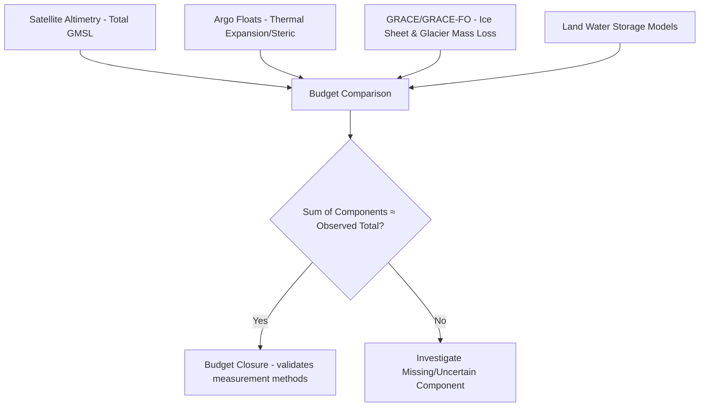

## Sea Level Rise Analysis

### Overview

Sea level rise analysis is the measurement, attribution, and projection of changes in ocean water surface elevation over time, combining satellite altimetry, tide gauge records, vertical land motion data, and climate modeling. It is foundational to coastal hazard planning, infrastructure design, flood risk mapping, and climate adaptation policy.

**Key Points**

- Global mean sea level rise (eustatic) results primarily from **thermal expansion** of warming ocean water and **mass addition** from melting land ice (glaciers, ice sheets); local relative sea level change additionally depends on vertical land motion and regional ocean dynamics.
- Sea level rise is not spatially uniform — regional variation from ocean circulation, gravitational/rotational effects of ice mass redistribution, and local land motion can cause local rates to differ substantially from the global mean.

---

### Core Concepts

#### Eustatic vs. Relative Sea Level

- **Eustatic (global mean) sea level**: the globally averaged change in ocean volume, driven by thermal expansion and ice mass changes.
- **Relative sea level (RSL)**: the sea level change experienced at a specific location relative to the local land surface, combining eustatic change with local vertical land motion (VLM):

$$RSL = SLR_{eustatic} + VLM$$

- VLM includes subsidence (from groundwater/hydrocarbon extraction, sediment compaction, tectonic settling) or uplift (glacial isostatic adjustment, tectonic uplift), and can dominate the local sea level signal in certain settings, sometimes exceeding the eustatic rate by several-fold in subsidence-prone deltas and coastal cities. [Unverified: exact local subsidence-to-eustatic ratios vary widely by location and should be confirmed against current site-specific monitoring]

#### Components of Global Mean Sea Level Rise

1. **Thermal expansion (steric)**: seawater expands as it warms, a direct thermodynamic response to ocean heat uptake.
2. **Glacier mass loss**: melt contribution from mountain glaciers worldwide.
3. **Ice sheet mass loss**: contributions from the Greenland and Antarctic ice sheets via surface melt and ice discharge (calving, ice stream acceleration).
4. **Land water storage changes**: groundwater extraction and reservoir impoundment have historically offsetting but generally net-positive contributions to sea level.

#### Gravitational Fingerprint Effect

- Melting ice sheets reduce local gravitational pull on nearby ocean water, causing sea level to *fall* near the melting ice source and rise more than the global average in far-field regions — meaning the source of ice loss (Greenland vs. Antarctica) shapes distinct regional sea level rise "fingerprints" rather than uniform redistribution.

---

### Measurement Methods

#### Tide Gauges

- Long-term, fixed-point instruments measuring sea level relative to a local benchmark, providing the longest observational records (some exceeding a century) but limited in spatial coverage and confounded by local VLM unless corrected with independent geodetic measurement.
- Networks: **PSMSL (Permanent Service for Mean Sea Level)** maintains the primary global historical tide gauge archive.

#### Satellite Altimetry

- Radar altimeters (TOPEX/Poseidon, Jason-1/2/3, Sentinel-6 Michael Freilich) measure sea surface height globally via two-way radar pulse travel time from satellite to sea surface.
- Provides the continuous global mean sea level record since 1993, cross-calibrated across the satellite series to maintain a consistent long-term climate data record.
- **SWOT (Surface Water and Ocean Topography)**: wide-swath interferometric altimetry extending measurement into coastal zones and smaller-scale features beyond traditional nadir-track altimetry's coverage gaps.

#### GNSS and Vertical Land Motion Measurement

- Continuous GNSS (Global Navigation Satellite System) stations co-located with tide gauges directly measure vertical land motion, enabling separation of the VLM component from the oceanographic sea level signal at that location.
- **InSAR (Interferometric SAR)**: measures spatially distributed vertical land motion (subsidence/uplift) over broader areas than point-based GNSS, valuable for characterizing subsidence patterns across coastal cities and deltas.

#### Gravimetric Measurement (GRACE/GRACE-FO)

- Satellite gravimetry missions measure changes in Earth's gravity field to directly quantify ice sheet and glacier mass loss and terrestrial water storage change — providing the mass-budget component that, combined with steric (thermal expansion) estimates, closes the sea level budget.

---

### Sea Level Budget Closure

The sea level budget approach cross-validates the sum of individual contributing processes against the total observed sea level rise from altimetry:

$$SLR_{total} = SLR_{thermal\ expansion} + SLR_{glaciers} + SLR_{ice\ sheets} + SLR_{land\ water}$$

Reasonable closure between the summed contributions and the independently observed altimetric total is used by the scientific community as a check on the completeness and accuracy of individual measurement methods.

**Example**

---

### Projections and Scenario Modeling

- **IPCC Assessment Reports** provide sea level rise projections under multiple emissions scenarios (Shared Socioeconomic Pathways, SSPs), typically presented as likely ranges by 2100 and beyond, with separate consideration of low-confidence, high-impact ice sheet instability processes (e.g., marine ice sheet instability, ice cliff collapse) that could drive higher-end outcomes. [Unverified: specific numeric projection ranges change between IPCC report cycles and should be sourced from the current assessment report rather than assumed static]
- **Probabilistic and scenario-based local projections** (e.g., NOAA's regional sea level rise scenarios in the US) downscale global projections using local VLM and ocean dynamic sea level patterns to produce actionable local planning curves.
- **Semi-empirical models**: statistical relationships between historical global temperature and sea level rise rates, used as an alternative or complement to process-based ice sheet/ocean models for projection.

---

### Geospatial Analysis Applications

#### Coastal Inundation Mapping

- Combines projected sea level (plus tidal datum, storm surge, and wave runup where relevant) with high-resolution digital elevation models (DEMs) to delineate future flood extent.
- **Bathtub model**: simplest approach, applying a uniform water level threshold to a DEM without accounting for hydrological connectivity — tends to overestimate inundation extent in areas not hydraulically connected to the sea.
- **Hydrodynamically connected models**: more sophisticated approaches that trace flow connectivity, providing more realistic inundation extent than simple bathtub thresholding.

#### Vertical Datum Considerations

- Sea level rise analysis requires careful reconciliation between the tidal datum used for local water level reference (e.g., Mean Higher High Water) and the vertical datum of the elevation model (e.g., NAVD88, ellipsoidal heights) — a frequent and consequential source of systematic error if mismatched.

#### Coastal Vulnerability and Exposure Mapping

- Overlaying projected inundation extent with population, infrastructure, and ecosystem layers to assess exposure and prioritize adaptation investment.
- **Digital Coast (NOAA)** and similar national/regional platforms provide standardized sea level rise viewer tools combining projections with local elevation data for planning-level assessment.

---

### Ecosystem and Infrastructure Impacts

- **Coastal wetland/marsh drowning**: occurs when the rate of sea level rise exceeds the rate of vertical sediment accretion a marsh system can sustain, a key threshold-based ecosystem response rather than a linear one.
- **Saltwater intrusion**: rising sea level drives saline water further into coastal aquifers and river systems, threatening freshwater supply and agricultural land.
- **Compound flooding**: sea level rise raises the baseline water level upon which storm surge, high tides, and heavy rainfall-driven river discharge are superimposed, amplifying flood frequency and severity even without any change in storm characteristics.
- **Nuisance/high-tide flooding**: increasing frequency of minor flooding during ordinary high tides as the baseline sea level rises closer to infrastructure elevation thresholds, tracked as an early, tangible indicator of sea level rise impact in coastal communities.

---

### Common Challenges and Limitations

- **Ice sheet dynamic uncertainty**: processes like ice cliff instability and rapid ice stream dynamics in Antarctica represent the largest source of uncertainty in high-end sea level rise projections, given limited historical analogs for calibrating these processes. [Inference: broadly reflects the scientific consensus on projection uncertainty sources; specific uncertainty magnitudes are actively evolving in the literature]
- **Local VLM data gaps**: many coastal regions, particularly in the Global South, lack dense GNSS or InSAR-derived VLM coverage, limiting the accuracy of local relative sea level projections compared to well-instrumented regions.
- **Short vs. long altimetry record**: the satellite altimetry record (since 1993) is short relative to multi-decadal ocean and climate variability, requiring careful statistical treatment to separate long-term trend from natural variability (e.g., ENSO-driven interannual fluctuations).
- **DEM vertical accuracy**: inundation mapping accuracy is fundamentally constrained by the vertical accuracy of the underlying DEM, particularly in low-relief coastal areas where small elevation errors translate to large horizontal inundation extent errors.
- **Nonlinear ecosystem thresholds**: marsh and wetland response to sea level rise is not well captured by simple linear projection methods, given accretion-drowning threshold dynamics.

---

### Related Topics

- Vertical land motion measurement (InSAR, GNSS) and subsidence mapping
- Coastal processes and shoreline change analysis
- Storm surge and compound flood modeling
- Digital elevation model accuracy assessment for coastal applications
- Tidal datum transformation and geodesy
- Salt marsh accretion dynamics and blue carbon
- Glacial isostatic adjustment and ice sheet mass balance (GRACE/GRACE-FO)
- Climate change scenario modeling (IPCC SSPs)
- Saltwater intrusion and coastal aquifer management
- Coastal vulnerability index methodology