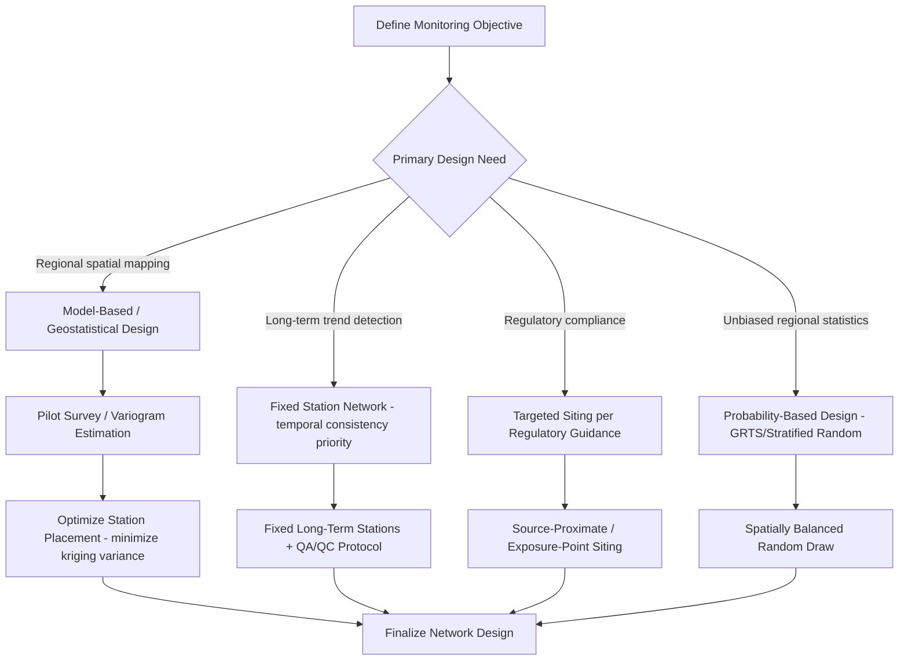

## Environmental Monitoring Network Design

### Overview

Environmental monitoring network design is the systematic planning of sensor/station locations, sampling frequency, and data collection protocols to detect, quantify, and track environmental conditions (air quality, water quality, soil, biodiversity, climate variables) over space and time. Effective network design balances statistical rigor, spatial representativeness, cost constraints, and the specific management or regulatory question the network is meant to answer.

**Key Points**

- Network design is fundamentally a statistical sampling design problem overlaid on geographic space — the objective (trend detection, compliance monitoring, spatial mapping, early warning) determines the optimal spatial and temporal sampling strategy, and no single design serves all objectives equally well.
- Poorly designed networks are a common source of downstream analytical failure: even sophisticated modeling cannot fully compensate for systematically biased or under-representative sampling locations.

---

### Defining Monitoring Objectives

Before any spatial design work, the network's primary purpose must be clearly specified, since it drives every subsequent design decision:

- **Trend detection**: tracking long-term change at fixed locations (requires temporal consistency, minimal station relocation).
- **Compliance/regulatory monitoring**: verifying conditions meet legal thresholds (often requires siting near specific sources or exposure points per regulatory guidance).
- **Spatial mapping/interpolation**: characterizing spatial patterns across a region (requires spatially representative coverage, informed by geostatistical design).
- **Early warning/event detection**: rapid identification of anomalies or incidents (requires strategic placement near vulnerable receptors or known risk sources, often with higher temporal resolution).
- **Background/reference condition characterization**: establishing baseline conditions in relatively undisturbed areas for comparison purposes.

---

### Spatial Sampling Design Approaches

#### Design-Based (Probability) Sampling

- **Simple random sampling**: locations selected with equal probability across the study area; statistically unbiased but can leave spatial gaps or clusters by chance.
- **Stratified random sampling**: study area divided into strata (e.g., land use classes, watersheds, elevation bands) with random sampling within each, ensuring representation across known sources of variability.
- **Systematic (grid-based) sampling**: regularly spaced sampling locations (e.g., a fixed grid), providing even spatial coverage and often more efficient than random sampling for detecting spatial trends, though vulnerable to aliasing if the sampling interval coincides with periodic spatial patterns in the underlying variable.
- **Generalized Random Tessellation Stratified (GRTS) design**: a spatially balanced probabilistic sampling approach widely used in large-scale environmental monitoring (e.g., US EPA's National Aquatic Resource Surveys), which ensures spatial balance while retaining valid probability-based statistical inference and allowing flexible addition/removal of sites without compromising design integrity.

#### Model-Based (Geostatistical) Design

- Uses knowledge of the spatial autocorrelation structure (variogram) of the target variable to optimize station placement for minimizing prediction (kriging) variance across the domain.
- **Space-filling designs**: maximize spatial coverage/spread of points, useful when the spatial correlation structure is unknown a priori.
- **Variance-minimizing designs**: iteratively place or reposition stations to minimize the average or maximum kriging prediction variance, typically implemented via simulated annealing or exchange algorithms once an initial variogram model is available (often from a pilot survey or historical data).

#### Targeted/Judgmental Siting

- Expert- or regulation-driven placement (e.g., downwind of a known emission source, downstream of a discharge point, at a water intake) — appropriate for compliance and source-attribution objectives but not statistically representative of the broader region and should not be used alone for regional spatial inference.

**Example**

---

### Temporal Sampling Design

#### Sampling Frequency Determination

- Driven by the temporal autocorrelation and variability of the target variable: rapidly fluctuating parameters (e.g., stream turbidity during storm events, air quality during pollution episodes) require higher-frequency or continuous monitoring; slowly changing parameters (e.g., groundwater levels in stable aquifers) may be adequately characterized with less frequent sampling.
- **Nyquist-type consideration**: sampling frequency must be at least twice the frequency of the shortest meaningful temporal cycle to be characterized, to avoid aliasing (e.g., missing diurnal cycles with infrequent daytime-only sampling).

#### Continuous vs. Discrete (Grab) Sampling

- **Continuous/automated sensors** (e.g., in-situ water quality sondes, air quality monitors): capture high-frequency variability and short-duration events but require greater capital investment, power/data infrastructure, and calibration maintenance.
- **Discrete/grab sampling**: lower cost per sample, enables laboratory analysis of parameters not measurable in-situ, but risks missing short-duration events (e.g., episodic pollution spikes) between sampling visits.

#### Rotating Panel Designs

- Used when it is impractical to monitor all sites continuously: a subset of "core" sites are monitored every period while other sites rotate in/out on a schedule, balancing spatial coverage against resource constraints while still supporting trend detection at core sites (a design used in several US EPA national survey programs).

---

### Statistical Power and Network Adequacy

#### Power Analysis for Trend Detection

Determines the minimum number of stations, sampling frequency, and monitoring duration needed to detect a trend of a specified magnitude with acceptable statistical confidence:

$$n \approx \left(\frac{(z_{\alpha/2} + z_{\beta})\sigma}{\delta}\right)^2$$

Where $n$ is required sample size, $z_{\alpha/2}$ and $z_{\beta}$ are critical values corresponding to desired significance level and statistical power, $\sigma$ is the variability of the measured parameter, and $\delta$ is the minimum detectable effect size — illustrating the general trade-off that greater underlying variability or a smaller effect size to be detected both increase the required sampling effort.

#### Redundancy and Network Optimization

- **Spatial redundancy assessment**: identifies stations providing highly correlated (statistically redundant) information, candidates for potential removal/relocation to improve overall network efficiency without materially degrading information content.
- **Entropy-based design metrics** (e.g., using information theory measures such as joint entropy and transinformation): used in some network optimization frameworks to balance maximizing information gain against minimizing redundancy between stations.

---

### Sensor and Station Siting Considerations

- **Representativeness**: station placement must avoid highly localized artifacts unless that localized signal is specifically the monitoring target (e.g., avoiding placing an "ambient" air quality station directly adjacent to a single dominant local source, unless source-specific monitoring is the intent).
- **Accessibility and maintenance**: practical considerations (power availability, physical access for maintenance/calibration, security from vandalism/theft) materially affect long-term data quality and network sustainability, and are frequently underweighted in purely statistical siting optimization.
- **Co-location with existing infrastructure**: leveraging existing infrastructure (cell towers, gauging stations, buildings) can reduce cost and simplify permitting/access compared to greenfield siting.
- **Metadata and site characterization documentation**: recording siting rationale, surrounding land use/land cover, instrument specifications, and any site changes over time is essential for correctly interpreting long-term records and detecting artifacts from station relocation or instrument changes (a phenomenon known broadly as inhomogeneity in long climate/environmental time series).

---

### Integration with Remote Sensing and Modeling

- **In-situ networks are frequently combined with remote sensing and models** rather than used as the sole data source — ground stations provide the accurate, high-temporal-resolution "truth" needed to calibrate and validate spatially continuous but lower-accuracy or indirect satellite/model products.
- **Data assimilation frameworks**: combine sparse in-situ observations with model output (weather/climate/hydrologic models) to produce spatially continuous, dynamically consistent estimates, effectively extending the value of a limited physical network.
- **Network design increasingly considers "complementarity" with existing remote sensing coverage** — prioritizing in-situ station placement where remote sensing products have known weaknesses (e.g., under dense canopy, in complex terrain, or in persistently cloud-covered regions) rather than duplicating well-characterized areas.

---

### Quality Assurance and Data Management

- **Standard Operating Procedures (SOPs)**: documented protocols for instrument calibration, sample collection/handling, and data QA/QC, essential for ensuring comparability across stations and over time within a network.
- **QA/QC flagging systems**: automated and manual data flagging (e.g., for sensor drift, biofouling, calibration failure, extreme outliers) to maintain dataset integrity before public release or use in analysis.
- **Data management plans**: define data formats, metadata standards, storage/archival, and public accessibility protocols — increasingly aligned with FAIR (Findable, Accessible, Interoperable, Reusable) data principles for environmental monitoring programs.

---

### Common Challenges and Limitations

- **Funding-driven network gaps**: monitoring networks frequently expand and contract with funding cycles rather than purely statistical optimization, leading to historically inconsistent spatial/temporal coverage that complicates long-term trend analysis.
- **Legacy site inertia**: long-running stations are often retained for temporal continuity even when a purely statistical re-optimization would suggest relocation, creating tension between historical comparability and current spatial representativeness.
- **Equity and environmental justice considerations**: historical monitoring network siting has, in some jurisdictions, under-represented environmental justice communities, an increasingly prominent consideration in contemporary network redesign and expansion efforts. [Unverified: specific equity gaps and remediation approaches vary substantially by jurisdiction and program]
- **Climate/land-use non-stationarity**: a network optimized for historical spatial variability patterns may become suboptimal as land use or climate patterns shift, requiring periodic re-evaluation rather than a one-time static design.
- **Sensor technology evolution**: rapid advancement in low-cost sensor technology creates a growing but complex opportunity to densify networks, requiring careful evaluation of lower-cost sensor accuracy/calibration relative to reference-grade instruments before integration into formal monitoring programs.

---

### Related Topics

- Geostatistics and kriging interpolation methods
- Variogram modeling and spatial autocorrelation analysis
- Water quality monitoring program design
- Air quality monitoring network design and regulatory siting criteria
- Data assimilation techniques for environmental modeling
- Low-cost sensor networks and calibration methods
- Long-term ecological monitoring (LTER) program design
- Environmental justice and equitable monitoring network placement
- FAIR data principles for environmental data management
- Remote sensing and in-situ data fusion techniques