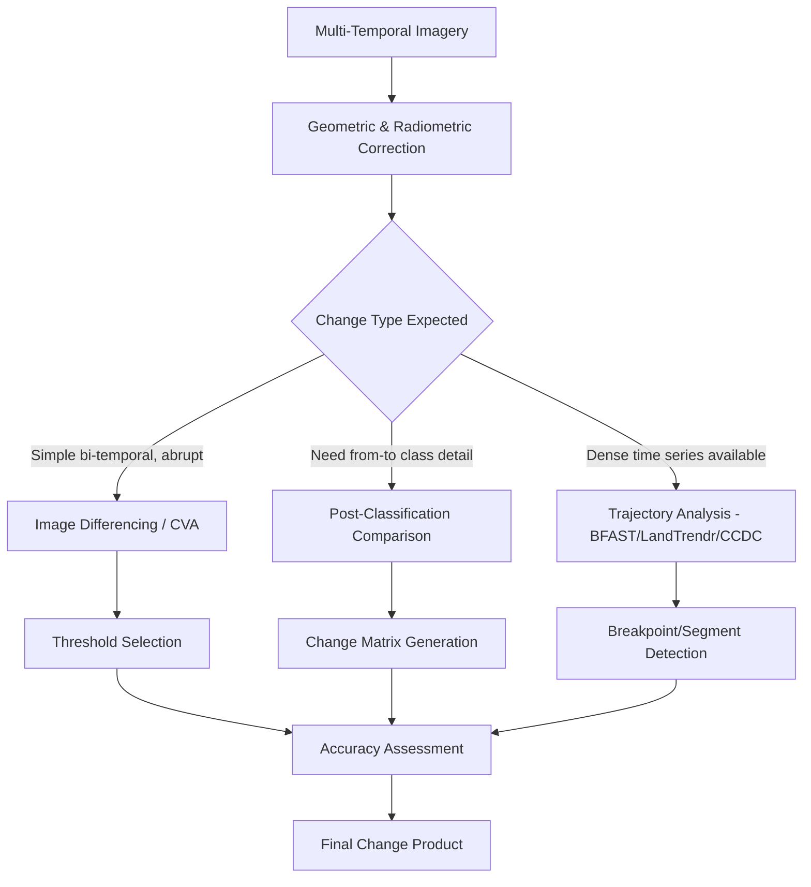

## Remote Sensing for Environmental Change Detection

### Overview

Remote sensing for environmental change detection is the application of multi-temporal satellite and airborne imagery to identify, quantify, and characterize changes in land cover, land use, ecosystem condition, and environmental quality over time. It provides a spatially continuous, historically consistent, and cost-effective alternative to exhaustive field-based monitoring, forming a core analytical method across forestry, water resources, urban planning, disaster response, and environmental impact assessment.

**Key Points**

- Change detection is fundamentally a comparison problem: it requires radiometrically and geometrically consistent imagery across time, since apparent "change" can result from real land-surface change or from sensor/atmospheric/illumination artifacts if preprocessing is inadequate.
- The appropriate change detection method depends on the nature of the expected change (abrupt vs. gradual), the required thematic detail (binary change/no-change vs. from-to class transitions), and the available image time-series density.

---

### Preprocessing Requirements

#### Geometric Correction

- **Co-registration**: precise spatial alignment between image dates is essential; even sub-pixel misregistration produces false change signals along edges and boundaries, particularly problematic in heterogeneous landscapes.
- **Orthorectification**: removes terrain-induced and sensor-geometry distortion, especially critical in areas of significant topographic relief.

#### Radiometric Correction

- **Atmospheric correction**: converts raw digital numbers to surface reflectance, removing variable atmospheric effects (aerosol loading, water vapor) that differ between acquisition dates and would otherwise be misinterpreted as land-surface change.
- **Relative radiometric normalization**: an alternative or complementary approach that adjusts one image's radiometry to match a reference image using statistical relationships between invariant "pseudo-invariant features" (e.g., roads, bare rock) present in both dates.
- **BRDF (Bidirectional Reflectance Distribution Function) correction**: accounts for view-angle and illumination-angle dependent reflectance variation, relevant for wide-swath sensors (e.g., MODIS) where off-nadir observations can otherwise introduce artifacts.

#### Phenological and Illumination Consistency

- Selecting anniversary dates (same time of year) or applying phenological normalization minimizes false change from seasonal vegetation state differences rather than true land-cover change.
- Cloud/shadow masking and gap-filling (via compositing across a date window) are standard steps, particularly in persistently cloudy regions.

---

### Change Detection Method Categories

#### 1. Algebraic/Image Differencing Methods

- **Band or index differencing**: subtracting corresponding bands or spectral indices (e.g., NDVI) between two dates; simple and interpretable, but requires careful threshold selection to separate real change from noise.

$$\Delta NDVI = NDVI_{t2} - NDVI_{t1}$$

- **Image ratioing**: dividing rather than subtracting corresponding bands; can reduce certain multiplicative noise sources (e.g., some illumination effects) compared to simple differencing.
- **Change Vector Analysis (CVA)**: treats each pixel's multi-band reflectance as a vector in spectral space; computes both the **magnitude** (Euclidean distance between the two dates' vectors, indicating amount of change) and **direction** (angle, indicating type/nature of change) of the change vector.

$$Magnitude = \sqrt{\sum_{b=1}^{n}(R_{b,t2} - R_{b,t1})^2}$$

#### 2. Transformation-Based Methods

- **Principal Component Analysis (PCA) of stacked multi-date imagery**: change information tends to concentrate in minor (lower-variance) components while stable, unchanged land cover dominates the major components; requires visual/statistical interpretation of which components represent genuine change.
- **Tasseled Cap Transformation**: derives brightness, greenness, and wetness indices with clear physical vegetation/soil interpretation; differencing these components across dates (particularly the "Disturbance Index," combining brightness, greenness, and wetness) is widely used for forest disturbance detection.
- **Multivariate Alteration Detection (MAD)**: a canonical correlation-based transformation designed specifically to maximize the separation between changed and unchanged pixels, statistically more robust to radiometric inconsistency between dates than simple differencing.

#### 3. Classification-Based Methods

- **Post-classification comparison**: independently classify each date, then compare classified maps to generate a from-to change matrix; provides full thematic detail (what changed to what) but error propagates from both individual classification accuracies (combined classification error can exceed either individual date's error).
- **Direct multi-date classification**: classifies a stacked, multi-date image directly into change/no-change or specific change-type classes in a single classification step, avoiding compounding of two separate classification errors but requiring more complex, well-labeled training data covering actual change trajectories.

#### 4. Time-Series/Trajectory-Based Methods

For dense time-series stacks (weekly to monthly observations) rather than sparse bi-temporal pairs:

- **BFAST (Breaks For Additive Season and Trend)**: decomposes a time series into trend, seasonal, and remainder components, statistically detecting structural breakpoints indicating abrupt change.
- **LandTrendr**: fits temporal segmentation algorithms to per-pixel spectral trajectories, distinguishing abrupt disturbance from gradual trends (recovery, growth, decline).
- **CCDC (Continuous Change Detection and Classification)**: fits continuously updated harmonic regression models per pixel, flagging change when new observations significantly deviate from the established model, well-suited to near-real-time monitoring applications.

**Example**

---

### Threshold Determination

Selecting the boundary between "change" and "no-change" in continuous difference/magnitude images is a critical and often subjective step:

- **Statistical threshold**: commonly set at a fixed number of standard deviations from the mean of the difference distribution (assuming most pixels represent no-change background noise).
- **Otsu's method**: automatic threshold selection that minimizes intra-class variance between the two resulting classes (change/no-change), a widely used unsupervised approach.
- **Iterative/empirical calibration**: threshold adjusted against a reference/validation dataset to optimize accuracy metrics, generally preferred when reliable reference data exists since it directly ties the threshold to actual detection performance rather than a purely statistical assumption.

---

### Machine Learning and Deep Learning Approaches

- **Random Forest / Gradient Boosting classifiers**: widely used for both post-classification and direct change classification, leveraging spectral, textural, and topographic features.
- **Convolutional Neural Networks (CNNs)**: particularly Siamese network architectures that process paired before/after image patches to directly learn change representations, increasingly used for high-resolution change mapping (e.g., building damage assessment, deforestation detection).
- **U-Net and encoder-decoder architectures**: for pixel-wise semantic change segmentation, producing detailed change masks rather than simple binary or coarse classification.
- **Transformer-based and foundation models**: emerging application of pretrained Earth observation foundation models (e.g., Prithvi, Clay) fine-tuned for change detection tasks, reducing the labeled training data burden compared to training from scratch. [Unverified: specific comparative performance claims for foundation models on change detection tasks are an active area of ongoing research and benchmarking]

---

### Accuracy Assessment

- **Confusion matrix-based validation**: comparing mapped change/no-change (or from-to classes) against independent reference data (higher-resolution imagery interpretation, field visits), computing overall accuracy, producer's accuracy, and user's accuracy per class.
- **Area-adjusted estimation (Olofsson et al. approach)**: uses stratified random sampling and accuracy statistics to produce unbiased area estimates of change, correcting for the systematic bias in raw pixel-counting approaches caused by classification error.
- **Reference data considerations**: reference data must itself be independent of and more reliable than the change detection method being validated — commonly higher spatial resolution imagery or field survey, ideally from a source not used in the change detection process itself.

---

### Application Domains

- **Deforestation and forest disturbance monitoring** (see dedicated forestry change detection methods)
- **Urban expansion and impervious surface growth tracking**
- **Water body and wetland extent change** (drought, flooding, reservoir/lake dynamics)
- **Glacier and snow cover change**
- **Post-disaster damage assessment** (earthquake, flood, wildfire — often requiring rapid-turnaround change detection using whatever imagery is available immediately following an event)
- **Agricultural land conversion and cropping pattern change**
- **Coastal and shoreline change** (see dedicated coastal geomorphology methods)

---

### Common Challenges and Limitations

- **False change from registration/radiometric error**: as emphasized above, inadequate preprocessing is a leading cause of spurious change signals, particularly along linear features (roads, field boundaries) and in areas of steep terrain.
- **Seasonal/phenological confounding**: differences in vegetation state due to season, drought, or interannual variability can be misclassified as land-cover change if not adequately controlled for via anniversary-date selection or phenological normalization.
- **Sensor/platform transitions**: long-term time series often span multiple sensor generations (e.g., Landsat 5 to 7 to 8/9) with differing spectral response characteristics, requiring cross-sensor harmonization (e.g., via the Harmonized Landsat Sentinel-2, HLS, product) to maintain a consistent time series.
- **Gradual vs. abrupt change discrimination**: methods tuned for abrupt disturbance detection (e.g., simple bi-temporal differencing) can under-detect slow, gradual degradation processes, which trajectory-based methods are better suited to capture.
- **Minimum mapping unit and spatial resolution constraints**: change smaller than the sensor's effective resolution or the analysis's minimum mapping unit will be systematically missed, a fundamental detection limit rather than a correctable processing error.
- **Class imbalance in training data**: change events are typically rare relative to stable/no-change area, creating class imbalance challenges for supervised classification and machine learning approaches that require careful sampling design or loss-function weighting to address.

---

### Related Topics

- Deforestation and forest change detection methods (LandTrendr, CCDC, GLAD/RADD alerts)
- Land use/land cover classification techniques
- Coastal shoreline change detection and DSAS methodology
- Post-disaster rapid damage assessment using remote sensing
- Harmonized Landsat Sentinel-2 (HLS) data fusion
- Accuracy assessment and area estimation (Olofsson method)
- Deep learning architectures for Earth observation (Siamese networks, U-Net)
- Atmospheric correction algorithms for optical imagery
- Time-series analysis methods (BFAST, CCDC, LandTrendr in depth)
- Environmental Impact Assessment (EIA) integration with remote sensing monitoring