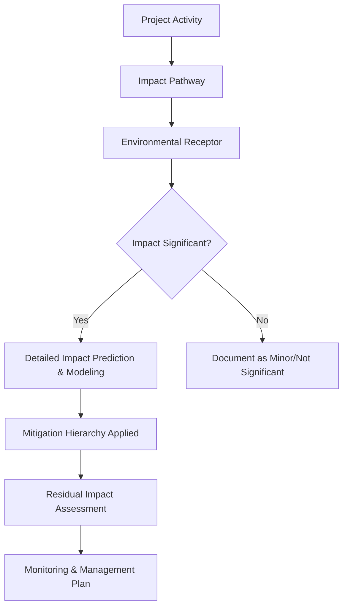

## Environmental Impact Assessment Process

### Overview

The Environmental Impact Assessment (EIA) process is a structured, legally-grounded procedure for identifying, predicting, evaluating, and mitigating the environmental consequences of proposed development projects before they proceed. It integrates scientific analysis, geospatial methods, stakeholder engagement, and regulatory decision-making to inform whether and how a project moves forward.

**Key Points**

- EIA is fundamentally a *predictive and decision-support* process — it evaluates likely future impacts of a not-yet-built project, distinguishing it from environmental monitoring, which measures actual conditions of an existing or completed activity.
- While specific procedural requirements vary substantially by jurisdiction (e.g., US National Environmental Policy Act/NEPA, EU EIA Directive, World Bank Environmental and Social Framework), the underlying analytical structure is broadly consistent across systems.

---

### Core Stages of the EIA Process

#### 1. Screening

- Determines whether a proposed project requires a full EIA, based on project type, scale, location sensitivity, and applicable regulatory thresholds.
- Typically results in a categorical outcome: full EIA required, a reduced-scope assessment sufficient, or exemption (though specific category names and thresholds vary by jurisdiction).

#### 2. Scoping

- Defines the boundaries of the assessment: which environmental, social, and economic impacts will be evaluated, the geographic and temporal extent of analysis, and the level of detail required.
- Involves early stakeholder and regulatory agency consultation to identify key issues of concern and avoid later rework from omitted impact categories.
- Produces a **Scoping Report** or Terms of Reference document guiding subsequent baseline studies and impact analysis.

#### 3. Baseline Data Collection

- Characterizes existing environmental, social, and economic conditions in the project area and its zone of influence prior to project implementation, providing the reference condition against which predicted impacts are measured.
- Typically spans multiple domains: air quality, water resources (surface and groundwater), soil, biodiversity/ecology, noise, cultural/archaeological resources, socioeconomic conditions, and land use.
- Geospatial methods (remote sensing land cover mapping, field survey, GIS-based spatial analysis) are central to establishing spatially explicit baseline conditions, particularly for large linear or area-based projects (pipelines, roads, mining concessions).

#### 4. Impact Identification and Prediction

- Identifies which project activities (construction, operation, decommissioning phases) will interact with which environmental receptors, and predicts the nature, magnitude, duration, and geographic extent of resulting impacts.
- **Common impact identification tools**:
  - **Checklists**: standardized lists of potential impact categories, useful for ensuring comprehensive coverage but limited in capturing impact interactions.
  - **Matrices (e.g., Leopold Matrix)**: cross-tabulate project activities against environmental factors, with cell values indicating impact magnitude and significance — useful for visualizing the breadth of activity-impact interactions.
  - **Network/impact pathway diagrams**: trace cause-effect chains, capturing indirect and cascading impacts that simple matrices can miss.
  - **Predictive modeling**: quantitative models for specific impact types (air dispersion modeling, hydrological/hydraulic modeling, noise propagation modeling, habitat suitability modeling).

**Example**

#### 5. Impact Significance Evaluation

- Assesses whether predicted impacts are significant enough to warrant mitigation or influence project approval, typically considering factors such as: magnitude, geographic extent, duration/reversibility, frequency, likelihood, and sensitivity/vulnerability of the affected receptor.
- Significance criteria are often defined during scoping and applied consistently across impact categories to support transparent, defensible determinations.

#### 6. Mitigation Hierarchy

A structured sequence of preference for addressing identified impacts, applied in order:

1. **Avoidance**: eliminating the impact entirely through project design or siting changes (the most preferred approach).
2. **Minimization**: reducing the magnitude, extent, or duration of unavoidable impacts.
3. **Rehabilitation/Restoration**: repairing impacted areas during or after project activities.
4. **Offsetting/Compensation**: compensating for residual impacts that cannot be avoided, minimized, or restored (e.g., habitat banking, biodiversity offsets), used only as a last resort after the preceding steps have been genuinely pursued.

#### 7. Environmental Management and Monitoring Plan (EMP/EMMP)

- Translates identified mitigation measures into actionable, assigned, and scheduled commitments for the construction and operational phases.
- Establishes monitoring protocols to verify predicted impacts against actual outcomes and to confirm mitigation effectiveness, closing the loop between prediction (EIA) and actual environmental performance.

#### 8. Review and Decision-Making

- Regulatory agency (and often public) review of the EIA report/Environmental Impact Statement (EIS), assessing adequacy and completeness against regulatory requirements.
- Results in a decision: approval (potentially with conditions), request for additional information/revision, or rejection.

#### 9. Post-Approval Monitoring and Auditing

- Ongoing compliance monitoring against EMP commitments during construction and operation.
- **Environmental auditing**: periodic, sometimes independent, review of actual environmental performance against EIA predictions and approved conditions, feeding lessons learned back into future EIA practice.

---

### Public Participation and Stakeholder Engagement

- Most EIA frameworks mandate stakeholder consultation at defined stages (commonly during scoping and following draft report publication), though the specific mechanisms (public hearings, written comment periods, community meetings) vary by jurisdiction.
- **Indigenous and traditional community engagement**: increasingly formalized requirements (e.g., Free, Prior, and Informed Consent principles in various international frameworks) for projects affecting indigenous lands or traditional resource use.
- Grievance/complaint mechanisms are commonly required components of the EMP to provide an ongoing channel for affected community concerns during project implementation.

---

### Geospatial and Technical Methods in EIA

| Method | Application in EIA |
| --- | --- |
| Remote sensing land cover classification | Baseline vegetation/habitat mapping, change detection over project timeline |
| GIS overlay/suitability analysis | Siting alternatives analysis, constraint mapping |
| Air dispersion modeling (e.g., AERMOD) | Predicting downwind air quality impacts |
| Hydrological/hydraulic modeling | Predicting surface water flow, flood, and water quality impacts |
| Noise propagation modeling | Predicting construction/operational noise impact zones |
| Species distribution/habitat suitability modeling | Predicting biodiversity impact and identifying critical habitat |
| Viewshed analysis | Visual impact assessment for infrastructure projects |
| Cumulative effects GIS analysis | Aggregating impacts from the proposed project with other existing/planned developments in the region |

---

### Cumulative Impact Assessment

- Evaluates the combined effect of the proposed project's impacts together with other past, present, and reasonably foreseeable future actions in the region — a frequently under-addressed but increasingly emphasized component of rigorous EIA practice, since individually insignificant project impacts can combine to produce significant regional-scale effects.
- Requires broader spatial and temporal scope than single-project impact analysis, often necessitating regional baseline data and coordination across multiple project proponents or regulatory review processes.

---

### Comparison of Major Frameworks (Illustrative)

| Framework | Jurisdiction/Scope | Key Feature |
| --- | --- | --- |
| NEPA (National Environmental Policy Act) | United States (federal actions) | Requires Environmental Assessment (EA) or full Environmental Impact Statement (EIS) depending on significance screening |
| EIA Directive | European Union | Harmonized minimum EIA requirements across member states, with national implementation variation |
| Environmental and Social Framework (ESF) | World Bank-financed projects | Ten Environmental and Social Standards (ESS) covering a broad range of impact categories |
| IFC Performance Standards | International Finance Corporation-financed private sector projects | Eight performance standards, widely adopted as an international private-sector benchmark ("Equator Principles" banks) |

[Unverified: specific procedural details, thresholds, and current requirements for any given framework should be confirmed against the current official regulatory text, as EIA regulations are periodically revised]

---

### Common Challenges and Limitations

- **Baseline data adequacy**: insufficient baseline survey duration (e.g., single-season ecological surveys missing seasonal species presence) can undermine the accuracy of impact predictions built upon that baseline.
- **Cumulative impact data gaps**: robust cumulative impact assessment requires data on other regional projects that may be incomplete, confidential, or simply unavailable at the time of assessment.
- **Prediction uncertainty**: impact predictions rely on models and professional judgment applied to a not-yet-built project, carrying inherent uncertainty that is not always transparently communicated or subsequently verified through post-approval monitoring. [Inference: general critique documented in EIA effectiveness literature; specific prediction accuracy varies by impact type and project]
- **Mitigation hierarchy erosion**: in practice, offsetting/compensation is sometimes applied prematurely rather than as a genuine last resort after avoidance and minimization have been fully pursued, undermining the intended hierarchy.
- **Consultation quality vs. compliance**: public participation processes can satisfy minimum procedural requirements without achieving genuinely meaningful stakeholder influence on project design, a recognized critique in EIA effectiveness research.
- **Follow-up and auditing gaps**: post-approval monitoring and auditing are often less rigorously resourced than the pre-approval assessment phase, weakening the feedback loop needed to verify prediction accuracy and mitigation effectiveness over time.

---

### Related Topics

- Cumulative effects assessment methodology
- Biodiversity offset design and habitat banking
- Air dispersion modeling (AERMOD, CALPUFF)
- Species distribution and habitat suitability modeling
- Strategic Environmental Assessment (SEA) — policy/program-level assessment
- Environmental Management Plan (EMP) development and compliance monitoring
- GIS-based siting and constraint mapping
- Social Impact Assessment (SIA) integration
- Free, Prior, and Informed Consent (FPIC) frameworks
- Environmental auditing and post-approval compliance monitoring