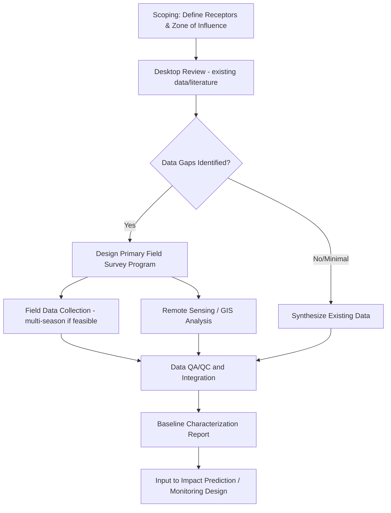

## Baseline Data Collection and Analysis

### Overview

Baseline data collection and analysis establishes the pre-project or reference condition of environmental, social, and physical systems against which future change or project impacts are measured. It is the empirical foundation for Environmental Impact Assessment, environmental monitoring programs, restoration success evaluation, and regulatory compliance determination — the quality of the baseline directly constrains the validity of any subsequent impact or trend conclusion.

**Key Points**

- A baseline is not a single snapshot but ideally a characterization of natural variability (seasonal, interannual, spatial) sufficient to distinguish genuine future change from normal background fluctuation.
- Baseline adequacy is judged relative to its intended use: the spatial extent, temporal duration, and parameter selection required for a small local project differ substantially from those needed for a regional cumulative assessment or long-term trend detection program.

---

### Planning the Baseline Study

#### Defining Spatial and Temporal Scope

- **Zone of influence**: the geographic area within which project or study activities could plausibly produce detectable effects, which may extend well beyond the immediate project footprint (e.g., downstream water quality effects, downwind air quality effects, wide-ranging wildlife populations).
- **Temporal duration**: baseline studies ideally span sufficient time to characterize seasonal cycles (a full annual cycle at minimum for most ecological and hydrological parameters) and, where feasible, capture interannual variability (e.g., wet vs. dry year conditions) rather than relying on a single, potentially unrepresentative sampling period.
- **Reference/control sites**: in comparative designs (e.g., Before-After-Control-Impact, BACI), baseline data collection extends to appropriately matched reference sites unaffected by the project, enabling separation of project-driven change from broader regional trends unrelated to the project.

#### Parameter Selection

- Driven directly by the scoping stage of the associated assessment or monitoring program: parameters should correspond to receptors plausibly affected by anticipated activities, rather than defaulting to an exhaustive, undifferentiated list.
- Common baseline domains: physical (topography, soils, geology), hydrological (surface water quantity/quality, groundwater), atmospheric (air quality, noise, climate), biological (vegetation/habitat, wildlife, aquatic ecology), and socioeconomic (land use, demographics, cultural/archaeological resources).

---

### Data Collection Methods

#### Field-Based Survey Methods

- **Transect and quadrat sampling**: standard ecological survey methods for vegetation composition, cover, and structure, using systematic or randomized transect/plot placement.
- **Point-count and distance sampling**: wildlife survey methods (particularly birds) estimating abundance/density while accounting for imperfect detection probability.
- **Camera trap and acoustic monitoring**: passive, continuous wildlife detection methods increasingly used to supplement or replace labor-intensive direct observation, particularly valuable for cryptic or nocturnal species.
- **Water quality grab sampling and continuous sonde deployment**: for surface/groundwater baseline characterization, combining discrete laboratory-analyzed samples (broader parameter suite) with continuous in-situ sensors (higher temporal resolution for key parameters like temperature, dissolved oxygen, turbidity, conductivity).
- **Soil sampling and geotechnical investigation**: characterizing soil chemistry, contamination status, and geotechnical properties relevant to construction impact prediction.

#### Remote Sensing and GIS-Based Methods

- **Land cover/land use classification**: establishing the spatial baseline extent of habitat types, agricultural land, water bodies, and built environment using satellite or airborne imagery classification.
- **Historical imagery analysis**: reconstructing land cover trajectories and historical disturbance/land-use change patterns preceding the baseline study period, providing important context for interpreting current conditions.
- **LiDAR-derived terrain and vegetation structure data**: canopy height, biomass proxies, and detailed topographic characterization supporting both ecological baseline and engineering/hydrological baseline needs.
- **Desktop/secondary data review**: compiling existing datasets (government monitoring records, prior studies, published literature) to supplement and contextualize new primary data collection, often the most cost-effective first step in baseline characterization.

**Example**

---

### Statistical Characterization of Baseline Conditions

#### Descriptive and Variability Analysis

- Baseline reporting typically includes central tendency (mean, median), variability (standard deviation, range, percentiles), and, where sufficient temporal data exists, seasonal or interannual pattern characterization rather than single summary values alone.
- **Natural variability envelope**: establishing the expected range of natural fluctuation is essential for later distinguishing genuine project-induced change from normal background variation — a baseline reported as a single number without variability context has limited analytical value for impact detection.

#### Spatial Interpolation and Mapping

- **Geostatistical interpolation (kriging)**: where point-based field samples must be extended to continuous spatial coverage (e.g., groundwater contamination extent, soil parameter mapping), kriging provides both an interpolated surface and an associated prediction uncertainty/variance surface.
- **Inverse Distance Weighting (IDW)** and other deterministic interpolators: simpler alternatives to kriging, appropriate when the spatial autocorrelation structure needed for geostatistical modeling is not well characterized or a pilot dataset is too sparse for reliable variogram estimation.

#### Trend and Baseline Stability Assessment

- Where historical data exists, statistical trend tests (e.g., Mann-Kendall test for monotonic trend, Seasonal Kendall for data with seasonal cycles) can establish whether the "baseline" itself is stable or already undergoing directional change independent of the proposed project — an important distinction for correctly attributing any future observed change.

$$S = \sum_{i<j} sgn(x_j - x_i)$$

The Mann-Kendall test statistic $S$ is based on the sign of all pairwise differences in a time series; a non-parametric approach that does not require the data to follow a normal distribution, making it well-suited to typically skewed environmental datasets.

---

### Data Quality Assurance

#### Standard Operating Procedures (SOPs)

- Documented, consistent protocols for sample collection, handling, chain-of-custody, and laboratory analysis are essential for baseline data defensibility, particularly given that baseline data may later be scrutinized in regulatory review or legal proceedings.

#### QA/QC Sampling

- **Field duplicates, blanks, and spikes**: standard quality control samples interspersed with primary samples to quantify sampling and analytical precision/accuracy and detect contamination.
- **Laboratory accreditation**: use of accredited laboratories (following recognized quality standards) for analytical work supporting baseline characterization, ensuring results meet defensible methodological standards.

#### Metadata Documentation

- Comprehensive metadata (survey methodology, equipment specifications, personnel, weather/field conditions, coordinate reference system, timestamps) is essential both for immediate QA/QC purposes and for enabling valid comparison against future monitoring data collected potentially by different personnel or methods.

---

### Integration into Impact Assessment and Monitoring

- Baseline data directly parameterizes impact prediction models (e.g., providing background concentrations for air/water quality dispersion modeling, providing pre-project habitat extent for cumulative impact calculations).
- **Before-After-Control-Impact (BACI) design**: the baseline dataset serves as the "before" component in a design that also requires matched "control" (unaffected reference) site data, enabling statistically robust impact attribution once post-project monitoring data becomes available.
- Baseline reports typically explicitly flag data gaps and limitations (e.g., single-season sampling, access constraints, rare species detection limits), which subsequent impact assessment and monitoring plan design should account for rather than treating the baseline as complete and uncertainty-free.

---

### Common Challenges and Limitations

- **Single-season/snapshot bias**: project timelines frequently compress baseline studies into a single field season, risking mischaracterization of conditions if that season was atypical (e.g., drought year) or if the surveyed parameters have strong seasonal dependence not captured by a single visit.
- **Access and permitting constraints**: baseline surveys, particularly on private land or in remote/sensitive areas, can be constrained by access limitations that create spatial gaps in an otherwise well-designed sampling program.
- **Rare and cryptic species detection limits**: absence of detection during baseline surveys does not necessarily confirm absence of a species, particularly for rare, cryptic, or highly mobile species — a limitation that should be explicitly acknowledged rather than treated as definitive absence data.
- **Shifting baseline problem**: in systems already experiencing long-term degradation or change (e.g., historically overfished marine systems, historically altered watersheds), a "current condition" baseline may not represent a genuinely natural or historically undisturbed reference state, complicating restoration target-setting and impact significance interpretation.
- **Data comparability over time**: changes in survey methodology, equipment, or personnel between baseline and later monitoring phases can introduce artificial discontinuities that are difficult to distinguish from genuine environmental change unless carefully documented and, where possible, cross-calibrated.

---

### Related Topics

- Environmental Impact Assessment process (baseline as a core EIA stage)
- Environmental monitoring network design
- BACI (Before-After-Control-Impact) experimental design
- Geostatistics and kriging interpolation methods
- Mann-Kendall trend testing for environmental time series
- Land cover/land use classification from remote sensing
- Water quality monitoring protocols and QA/QC
- Ecological survey methods (transect, distance sampling, camera trapping)
- Shifting baseline syndrome in ecological restoration
- Chain-of-custody and laboratory data quality standards