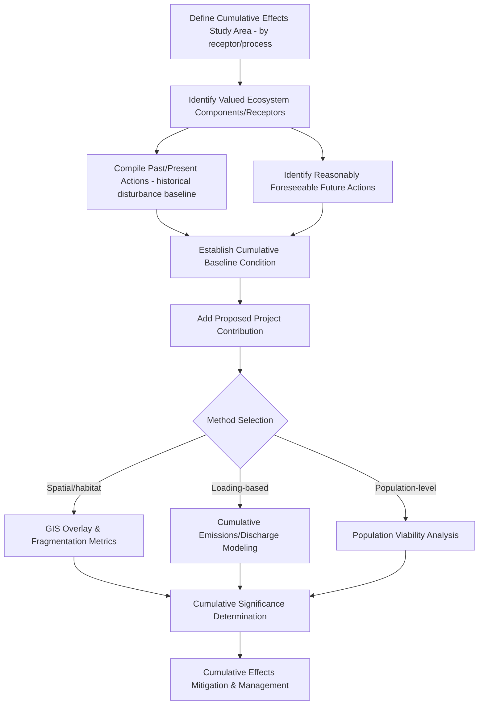

## Cumulative Impact Assessment

### Overview

Cumulative Impact Assessment (CIA) evaluates the combined environmental, social, and ecological effects of a proposed project together with other past, present, and reasonably foreseeable future actions within a defined region — recognizing that individually insignificant impacts can aggregate into significant regional-scale degradation. It extends the analytical scope of standard project-level Environmental Impact Assessment beyond a single project's direct footprint to the broader landscape or system in which that project sits.

**Key Points**

- Cumulative impacts arise through three basic mechanisms: **additive** effects (simple summation of similar impacts from multiple sources), **synergistic/interactive** effects (combined impact exceeding the simple sum of individual contributions), and **time-crowded or space-crowded** effects (impacts that individually would dissipate but overlap in time or space before recovery/dilution occurs).
- CIA is widely recognized in the environmental assessment literature as one of the most procedurally and technically challenging components of impact assessment, given its dependence on data about other actions frequently outside the assessing party's control or knowledge. [Inference: reflects a broadly documented critique in EIA/CIA effectiveness literature]

---

### Core Concepts

#### Defining the Cumulative Effects Study Area

- The geographic boundary for cumulative assessment is typically defined by the spatial extent of the relevant environmental process or receptor (e.g., an entire watershed for water quality/quantity effects, an airshed for air quality, a wildlife population's full range for habitat/connectivity effects) rather than an arbitrary administrative or project-based boundary.
- Different receptors within the same assessment may require different cumulative study area boundaries — a single fixed study area boundary applied uniformly across all impact categories risks either under- or over-scoping specific receptors.

#### Temporal Scope

- Extends both backward (historical degradation/disturbance context establishing current baseline condition) and forward (reasonably foreseeable future actions within a defined planning horizon) from the present assessment.
- **Reasonably foreseeable future actions (RFFAs)**: identifying which future projects/activities should be included is inherently judgment-based — overly narrow inclusion criteria understate cumulative effects, while overly broad/speculative inclusion can dilute analytical rigor with highly uncertain future scenarios.

---

### Methodological Approaches

#### Checklist and Matrix-Based Approaches

- Extension of standard EIA matrix methods (e.g., Leopold-style matrices) to explicitly include contributions from other identified actions alongside the proposed project, cross-tabulated against affected receptors.
- Useful for ensuring systematic coverage of impact-receptor combinations but limited in capturing genuinely synergistic or nonlinear cumulative interactions.

#### Overlay and GIS-Based Spatial Analysis

- **Spatial overlay of disturbance footprints**: mapping the cumulative spatial extent of habitat loss, fragmentation, or land conversion from multiple projects within the study area, often the most straightforward and defensible cumulative effects method for spatially explicit impacts like habitat loss.
- **Landscape fragmentation metrics**: quantitative indices (e.g., patch size distribution, edge density, connectivity indices) applied to cumulative disturbance footprints to characterize habitat fragmentation trends attributable to the combined set of actions.
- **Cumulative disturbance density mapping**: e.g., road density, well pad density, or other infrastructure density metrics per unit area, commonly used as a cumulative effects indicator in resource extraction and energy development contexts.

#### Carrying Capacity and Threshold-Based Approaches

- Evaluates whether cumulative effects approach or exceed an identified ecological or system threshold (e.g., a watershed's assimilative capacity for a pollutant, a population's minimum viable habitat threshold), providing a more ecologically grounded significance determination than additive impact summation alone.
- Requires robust understanding of the relevant threshold, which is often poorly characterized for many ecological systems, introducing substantial uncertainty into threshold-based cumulative significance conclusions.

#### Quantitative and Modeling-Based Approaches

- **Environmental modeling with cumulative loading**: e.g., air dispersion or water quality models parameterized to include emissions/discharges from all identified sources within the study area, not just the proposed project, directly simulating cumulative concentration or loading outcomes.
- **Population viability analysis (PVA)**: for wildlife cumulative effects, modeling how cumulative habitat loss/fragmentation across multiple projects affects long-term population persistence probability.
- **System dynamics and network models**: representing interactions and feedback loops between multiple stressors and receptors, appropriate where synergistic or nonlinear cumulative interactions are a primary concern rather than simple additive loading.

**Example**

---

### Data Requirements and Sources

| Data Type | Typical Source |
| --- | --- |
| Historical disturbance/land use trajectory | Remote sensing time-series (Landsat archive, historical aerial photography) |
| Other project locations/status | Regulatory agency project registries, environmental permit databases |
| Regional baseline environmental conditions | Government monitoring networks, prior regional studies |
| Population/species range and status | Species distribution databases, prior survey data, expert consultation |
| Future development projections | Land use plans, zoning designations, infrastructure master plans |

**Key Points**

- Remote sensing time-series analysis is particularly valuable for cumulative impact assessment because it provides an objective, spatially explicit historical disturbance record independent of potentially incomplete regulatory project databases — directly supporting establishment of the cumulative baseline condition.
- Coordination across multiple project proponents and regulatory agencies is often necessary to compile a complete picture of other actions within the study area, since no single proponent typically has full visibility into all other relevant activities.

---

### Significance Determination

- Cumulative significance evaluation typically considers: whether the combined effect approaches or exceeds a defined ecological/regulatory threshold, whether the affected receptor's resilience/recovery capacity is exceeded by the frequency/magnitude of cumulative effects, and the reversibility of cumulative degradation relative to the assessment's planning horizon.
- **Proportional contribution analysis**: quantifying the proposed project's incremental contribution relative to the total cumulative effect, providing context for whether the marginal project-specific contribution is itself a meaningful driver of cumulative significance or a comparatively minor addition to an already substantially altered baseline.

---

### Mitigation and Management for Cumulative Effects

- **Regional/landscape-level planning**: cumulative effects are generally better addressed through coordinated regional land-use or strategic planning (see Strategic Environmental Assessment) than through project-by-project mitigation alone, since individual project mitigation cannot fully address effects driven by the combined regional development pattern.
- **Cumulative effects management frameworks**: some jurisdictions establish regional cumulative effects thresholds or caps (e.g., maximum disturbance density within a defined planning area) that individual project approvals must collectively respect, shifting some cumulative management burden from individual EIA processes to upstream regional planning.
- **Adaptive management**: given the inherent uncertainty in cumulative effects prediction, monitoring-based adaptive management approaches — adjusting management responses as actual cumulative conditions become better characterized over time — are increasingly emphasized as a practical complement to purely predictive cumulative assessment.

---

### Common Challenges and Limitations

- **Data availability and proponent knowledge gaps**: individual project proponents frequently lack complete information about other past, present, and especially future actions in the region, a foundational and difficult-to-fully-resolve constraint on CIA rigor.
- **Baseline shifting/moving target problem**: because cumulative baselines themselves continue to change as new projects are approved, cumulative assessments conducted at different times for different projects in the same region can be based on inconsistent baseline conditions, complicating regional-scale coherence.
- **Threshold uncertainty**: many ecological and environmental systems lack well-established, quantitatively defined thresholds for cumulative effects significance, forcing reliance on professional judgment or precautionary assumptions in threshold-based approaches.
- **Institutional/jurisdictional fragmentation**: cumulative effects frequently cross administrative and regulatory boundaries (multiple permitting authorities, multiple jurisdictions), while individual EIA processes are typically organized around single-project, single-authority review, creating a structural mismatch between the scale of the problem and the scale of the typical assessment process.
- **Synergistic effect quantification difficulty**: while additive cumulative effects are relatively tractable to model, genuinely synergistic or nonlinear interactions between multiple stressors are much harder to quantify with confidence and are often qualitatively acknowledged rather than rigorously modeled in practice. [Inference: reflects a widely noted methodological gap in CIA practice literature]

---

### Related Topics

- Environmental Impact Assessment process (CIA as an extension of project-level EIA)
- Strategic Environmental Assessment (SEA) for regional/policy-level planning
- Landscape fragmentation metrics and connectivity analysis
- Population viability analysis (PVA)
- Baseline data collection and historical disturbance characterization
- Remote sensing time-series analysis for regional land-use change
- Biodiversity offset design and regional mitigation banking
- Adaptive management frameworks
- Watershed-scale and airshed-scale environmental modeling
- Regional land-use and infrastructure planning coordination