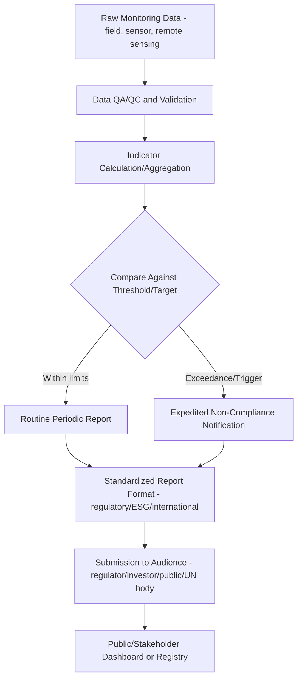

## Monitoring and Reporting Frameworks

### Overview

Monitoring and reporting frameworks are the structured systems that translate ongoing environmental data collection into standardized indicators, compliance verification, and stakeholder-accessible reporting. They provide the operational bridge between raw environmental monitoring data (from networks, remote sensing, and field programs) and the regulatory, corporate, and public accountability structures that rely on that data to verify commitments and track progress toward defined objectives.

**Key Points**

- Monitoring generates data; a reporting framework defines how that data is aggregated into indicators, compared against benchmarks or targets, and communicated to specific audiences (regulators, investors, the public, international bodies) — the framework, not the raw data, is what makes monitoring information decision-useful.
- Framework selection and design are driven by the specific accountability relationship involved: regulatory compliance frameworks, corporate sustainability disclosure frameworks, and international/multilateral reporting frameworks each have distinct structures, indicator sets, and audiences.

---

### Core Components of a Monitoring and Reporting Framework

#### Indicator Selection and Design

- **Indicators** are measurable proxies for broader environmental conditions or management objectives (e.g., dissolved oxygen as a proxy for aquatic ecosystem health, forest cover change as a proxy for biodiversity/carbon impact).
- Effective indicators are commonly evaluated against criteria such as: scientific validity, sensitivity to actual change, cost-effectiveness of measurement, interpretability by non-specialist audiences, and comparability across sites/time.
- **Indicator hierarchies**: frameworks often organize indicators from broad, aggregated headline indicators (for high-level reporting/public communication) down to detailed underlying metrics (for technical/regulatory analysis), preserving traceability between the two levels.

#### Targets, Thresholds, and Benchmarks

- Indicators are typically evaluated against defined reference points: regulatory compliance thresholds (legally binding limits), management targets (organizationally set goals), or scientific reference conditions (e.g., historical baseline or minimally disturbed reference sites).
- **Trigger/action levels**: some frameworks define intermediate thresholds below the ultimate compliance limit that trigger investigation or corrective action before an actual exceedance occurs, functioning as an early-warning mechanism within the reporting structure.

#### Reporting Frequency and Format

- Reporting cadence (continuous/real-time, monthly, annual) is driven by the framework's purpose: regulatory compliance reporting often follows fixed statutory schedules, while corporate sustainability reporting is frequently annual, and public-facing dashboards increasingly aim for near-real-time or continuously updated presentation.
- **Standardized reporting templates**: many frameworks specify structured formats (fixed indicator sets, defined units, required metadata) to ensure comparability across reporting entities and over time.

---

### Regulatory Compliance Monitoring Frameworks

- Structured around specific legal/permit requirements, typically specifying required parameters, monitoring locations, frequency, analytical methods, and reporting deadlines tied to a specific regulatory instrument (discharge permit, air quality permit, mining license conditions).
- **Self-monitoring and reporting**: many regulatory frameworks require the regulated entity to conduct its own monitoring and submit reports (e.g., Discharge Monitoring Reports under water discharge permitting systems), with regulatory agency audit/verification as a secondary check rather than the primary data source.
- **Non-compliance/exceedance reporting**: typically requires immediate or expedited notification distinct from routine periodic reporting, given the different urgency and potential enforcement implications.

---

### Corporate Sustainability and ESG Reporting Frameworks

| Framework | Focus | Structure |
| --- | --- | --- |
| GRI (Global Reporting Initiative) Standards | Broad sustainability impact reporting | Modular standards covering economic, environmental, and social topics |
| TCFD (Task Force on Climate-related Financial Disclosures) | Climate-related financial risk | Governance, strategy, risk management, metrics/targets structure |
| TNFD (Taskforce on Nature-related Financial Disclosures) | Nature/biodiversity-related financial risk | Parallel structure to TCFD, extended to nature-related dependencies and impacts |
| CDP (formerly Carbon Disclosure Project) | Climate, water, forests disclosure | Standardized questionnaire-based disclosure, scored/benchmarked |
| SASB (Sustainability Accounting Standards Board) Standards | Industry-specific financially material sustainability metrics | Now consolidated under the IFRS Sustainability Disclosure Standards (ISSB) |

**Key Points**

- Corporate ESG reporting frameworks have undergone significant consolidation in recent years (e.g., SASB's integration into ISSB standards), and current requirements should be verified against each framework's current official documentation given the pace of change. [Unverified: specific current framework status and requirements should be confirmed via up-to-date sources given ongoing standard consolidation]
- Many corporate frameworks increasingly require geospatially-referenced data (e.g., facility-level emissions, deforestation-linked supply chain sourcing locations) reflecting growing regulatory and investor demand for spatially verifiable disclosure rather than aggregated corporate-level totals alone.

---

### International and Multilateral Reporting Frameworks

- **UNFCCC National Communications and Biennial Transparency Reports**: countries report greenhouse gas inventories and climate action progress under the Paris Agreement's enhanced transparency framework.
- **REDD+ MRV (Measurement, Reporting, Verification)**: forest-sector specific framework requiring countries to report deforestation/degradation-related emissions and removals against an established forest reference level, heavily reliant on remote sensing-based forest monitoring systems.
- **SDG (Sustainable Development Goals) Indicator Framework**: UN-coordinated global indicator set (231 unique indicators across 17 goals as originally adopted, with periodic refinement) tracked by national statistical offices and reported to international bodies, several of which rely directly on geospatial/Earth observation data (e.g., SDG 15.1.1 forest area as a proportion of total land area).
- **Ramsar Convention reporting**: wetland-specific international reporting obligations for designated Wetlands of International Importance.

---

### Environmental Management System (EMS) Frameworks

- **ISO 14001**: internationally recognized standard for environmental management systems, establishing a structured plan-do-check-act cycle including defined monitoring, measurement, and internal reporting requirements as part of certification.
- EMS-embedded monitoring frameworks are typically organizationally internal (supporting continuous improvement and certification maintenance) but often feed into external regulatory or voluntary disclosure reporting as a data source.

**Example**

---

### Geospatial Integration in Monitoring and Reporting

- **Spatial dashboards and web GIS platforms**: increasingly standard for presenting monitoring data to regulators and the public (e.g., interactive maps showing station locations, current status, and historical trends), improving accessibility over traditional tabular reports.
- **Remote sensing-based reporting for spatial commitments**: frameworks addressing deforestation-free supply chains (e.g., EU Deforestation Regulation compliance reporting), protected area management effectiveness, or land degradation neutrality increasingly require or accept satellite-derived evidence as primary or supporting reporting data.
- **Open data and interoperability standards**: growing emphasis on machine-readable, standardized geospatial data formats (e.g., following FAIR data principles, OGC standards) to enable data aggregation across reporting entities and integration into national/international monitoring systems rather than siloed, format-inconsistent submissions.

---

### Data Verification and Assurance

- **Third-party verification/assurance**: many frameworks (particularly corporate ESG and international climate reporting) increasingly require or encourage independent third-party verification of reported data, addressing credibility concerns associated with self-reported information.
- **Chain of custody and audit trails**: maintaining documented traceability from raw monitoring data through to final reported figures, essential for surviving verification review and maintaining reporting defensibility.
- **Remote sensing as independent verification**: satellite-based monitoring increasingly serves as an independent cross-check against self-reported data (e.g., satellite-detected deforestation compared against a company's self-reported deforestation-free sourcing claims), a trend expected to continue given the falling cost and improving frequency of relevant Earth observation data.

---

### Common Challenges and Limitations

- **Framework proliferation and fragmentation**: organizations subject to multiple overlapping reporting obligations (regulatory, corporate ESG, international) often face substantial duplicative effort due to inconsistent indicator definitions, units, and reporting periods across frameworks, despite efforts toward harmonization (e.g., ISSB consolidation).
- **Indicator-reality gap**: poorly chosen or overly aggregated indicators can obscure rather than reveal genuine environmental performance, particularly when an organization has latitude in indicator selection or reporting boundary definition (e.g., scope/boundary choices in emissions reporting).
- **Verification resource constraints**: robust independent verification is resource-intensive, meaning many reporting frameworks in practice rely substantially on self-reported, unverified, or only partially verified data, particularly in lower-resource regulatory or organizational contexts.
- **Temporal lag between monitoring and reporting**: annual or periodic reporting cycles can create significant lag between an actual environmental event/exceedance and its public disclosure, a limitation increasingly addressed by near-real-time dashboard and alert-based reporting mechanisms but not yet universal across frameworks.
- **Comparability challenges across evolving standards**: as frameworks are periodically revised (methodology updates, consolidation, new indicator requirements), maintaining a consistent historical reporting time series for trend analysis becomes progressively more complex.

---

### Related Topics

- Environmental monitoring network design
- REDD+ MRV systems and forest reference levels
- Corporate ESG disclosure and TCFD/TNFD/ISSB standards
- SDG indicator framework and Earth observation data integration
- ISO 14001 environmental management systems
- Third-party verification and environmental data assurance
- Web GIS dashboards for public environmental reporting
- FAIR data principles and open geospatial data standards
- EU Deforestation Regulation (EUDR) compliance reporting
- Chain of custody and data quality assurance protocols