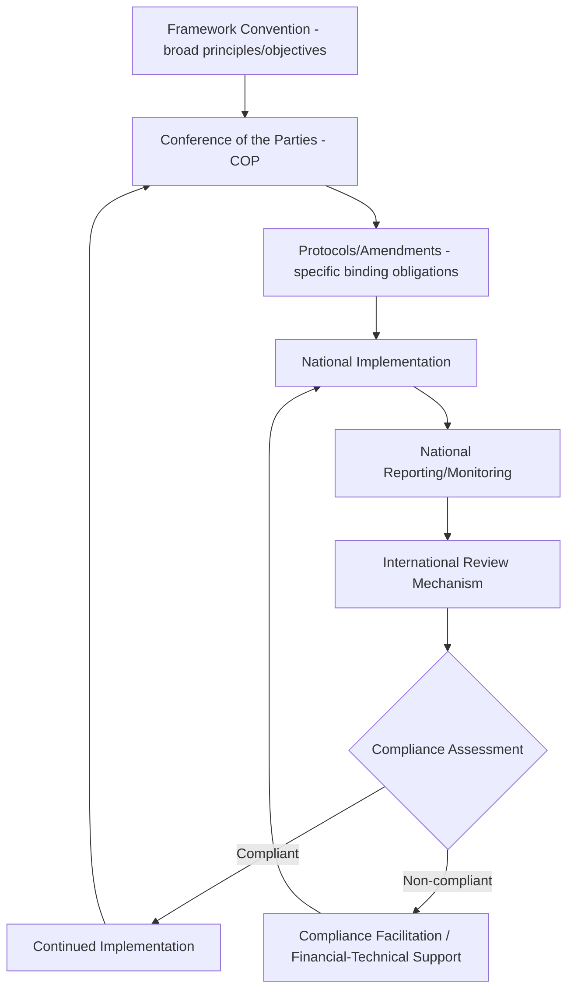

## International Environmental Agreements

### Overview

International Environmental Agreements (IEAs) are treaties, conventions, protocols, and related legal instruments negotiated between states (and sometimes other actors) to address environmental problems that cross national borders or require coordinated global action. They form the legal and institutional architecture underpinning global environmental governance, spanning climate change, biodiversity, chemical/waste management, ozone protection, and shared natural resources.

**Key Points**

- IEAs vary substantially in legal bindingness — ranging from legally binding treaties with enforcement mechanisms to non-binding declarations and voluntary frameworks — and this distinction fundamentally shapes their practical effect and compliance dynamics.
- Most major IEAs rely on national implementation and self-reporting rather than direct international enforcement, making national governance capacity and monitoring/reporting systems (including geospatial monitoring) central to their real-world effectiveness.

---

### Types of International Environmental Instruments

- **Treaties/Conventions**: formal, legally binding agreements between states, typically establishing overarching principles and institutional structures (e.g., a Conference of the Parties, COP) rather than detailed obligations.
- **Protocols**: legally binding instruments attached to a parent convention, adding specific, often more stringent obligations (e.g., the Kyoto Protocol under the UNFCCC, the Montreal Protocol implementing the Vienna Convention).
- **Amendments**: formal modifications to an existing treaty or protocol, requiring ratification by parties similar to the original instrument.
- **Declarations and non-binding frameworks**: politically significant but not legally binding statements of principle or intent (e.g., the Rio Declaration), often shaping the normative direction of subsequent binding instruments without imposing direct legal obligations themselves.

---

### Major Global Environmental Agreements by Domain

#### Climate Change

- **UNFCCC (United Nations Framework Convention on Climate Change, 1992)**: the foundational treaty establishing the objective of stabilizing greenhouse gas concentrations and the principle of "common but differentiated responsibilities."
- **Kyoto Protocol (1997)**: established binding emissions reduction targets for developed countries via a top-down, differentiated obligation structure.
- **Paris Agreement (2015)**: shifted to a bottom-up structure based on Nationally Determined Contributions (NDCs) — country-set, progressively ambitious climate commitments — combined with an enhanced transparency framework for tracking progress, rather than centrally negotiated binding targets.

#### Biodiversity

- **Convention on Biological Diversity (CBD, 1992)**: overarching framework for biodiversity conservation, sustainable use, and equitable benefit-sharing from genetic resources.
- **Kunming-Montreal Global Biodiversity Framework (2022)**: the CBD's current strategic framework, including targets such as the widely referenced "30x30" goal of conserving 30% of land and sea by 2030. [Unverified: specific target wording and current implementation status should be confirmed against current CBD documentation given the framework's ongoing implementation phase]
- **CITES (Convention on International Trade in Endangered Species, 1973)**: regulates international trade in specimens of endangered species through a permit-based system organized around species-specific appendices reflecting differing levels of trade restriction.
- **Ramsar Convention (1971)**: focused specifically on wetland conservation, establishing a List of Wetlands of International Importance.

#### Ozone Layer Protection

- **Vienna Convention (1985)** and **Montreal Protocol (1987)**: widely cited as one of the most successful international environmental agreements, having achieved near-universal ratification and substantial phase-out of ozone-depleting substances, with the **Kigali Amendment (2016)** extending its scope to phase down hydrofluorocarbons (HFCs) given their significant climate forcing potential despite not being ozone-depleting themselves.

#### Chemicals and Waste

- **Basel Convention (1989)**: regulates transboundary movement of hazardous waste, aiming to prevent waste transfer from wealthier to less-resourced countries without adequate management capacity.
- **Stockholm Convention (2001)**: addresses persistent organic pollutants (POPs), chemicals that resist degradation and bioaccumulate.
- **Rotterdam Convention (1998)**: establishes a prior informed consent procedure for international trade in certain hazardous chemicals and pesticides.
- **Minamata Convention (2013)**: addresses mercury pollution across its lifecycle, from mining through use and disposal.

#### Desertification and Land

- **UNCCD (United Nations Convention to Combat Desertification, 1994)**: the third of the three "Rio Conventions" (alongside UNFCCC and CBD), focused on combating land degradation, particularly in drylands, and establishing the Land Degradation Neutrality target framework.

#### Marine and Ocean Governance

- **UNCLOS (United Nations Convention on the Law of the Sea, 1982)**: the overarching legal framework for ocean governance, establishing maritime zones (territorial waters, Exclusive Economic Zones, continental shelf) and rights/obligations regarding marine resource use.
- **BBNJ Agreement (Biodiversity Beyond National Jurisdiction, adopted 2023)**: addresses conservation and sustainable use of marine biodiversity in areas beyond national jurisdiction (the high seas), a notable recent addition to the ocean governance architecture. [Unverified: ratification and entry-into-force status should be confirmed against current sources given this is a comparatively recent agreement]

---

### Institutional and Compliance Architecture

#### Conference of the Parties (COP) Structure

- Most major conventions operate through a periodic COP — the treaty's governing body composed of all ratifying states — which negotiates implementation decisions, adopts amendments/protocols, and reviews collective progress.
- Subsidiary bodies (scientific/technical advisory bodies, implementation review bodies) typically support the COP with technical assessment and compliance review functions between plenary sessions.

#### Common but Differentiated Responsibilities (CBDR)

- A foundational principle across several major environmental agreements (most explicitly articulated in UNFCCC) recognizing that developed and developing countries have differing historical contributions to environmental problems and differing capacities to respond, translating into differentiated obligations, timelines, or financial/technical support mechanisms.

#### Financial and Technical Support Mechanisms

- **Global Environment Facility (GEF)** and dedicated funds (e.g., the **Green Climate Fund** under UNFCCC) provide financing mechanisms supporting developing country implementation of treaty obligations, reflecting the CBDR principle in practical funding architecture.

**Example**

---

### Role of Monitoring, Reporting, and Geospatial Data

- **National reporting obligations**: most major IEAs require periodic national reports (e.g., National Communications under UNFCCC, National Biodiversity Strategy and Action Plan reporting under CBD) as the primary compliance monitoring mechanism, given the general absence of direct international enforcement authority.
- **MRV (Measurement, Reporting, Verification) systems**: increasingly formalized within climate agreements specifically, requiring standardized greenhouse gas inventory methodologies and, for forest-related commitments (REDD+), remote sensing-based forest monitoring as a core evidentiary basis.
- **Satellite-based independent verification**: growing use of Earth observation data by international bodies, NGOs, and researchers to independently verify national self-reported data (e.g., satellite-derived deforestation estimates compared against national forest reporting), adding a layer of external accountability beyond purely self-reported national statistics.
- **Global environmental indicator tracking**: several IEA-related commitments are tracked via globally standardized indicators (e.g., SDG indicators, several of which directly derive from Earth observation data) enabling comparative progress assessment across countries using consistent methodology.

---

### Compliance and Enforcement Challenges

- **Limited direct enforcement authority**: most IEAs lack binding international enforcement mechanisms comparable to domestic law; compliance relies substantially on reputational pressure, peer review, transparency mechanisms, and, in some cases, trade-related measures (e.g., CITES permit systems, Montreal Protocol trade restrictions on ozone-depleting substances with non-parties).
- **Nationally Determined Contribution (NDC) ambition gap**: under the Paris Agreement's bottom-up structure, aggregate NDC ambition has been widely assessed by international bodies as insufficient relative to stated temperature goals, an ongoing and actively monitored gap tracked through periodic global stocktake processes. [Unverified: specific current ambition gap figures change with each assessment cycle and should be sourced from the most recent official assessment]
- **Ratification and entry-into-force delays**: some agreements require a threshold number of ratifications before entering into force, and even after entry into force, individual country ratification/implementation timelines vary substantially.

---

### Common Challenges and Limitations

- **Fragmentation across multiple conventions**: the proliferation of separate, domain-specific IEAs (climate, biodiversity, chemicals, land) creates coordination challenges at the national implementation level, where a single government agency or ministry may face overlapping and sometimes inconsistently sequenced reporting obligations across conventions.
- **Data and capacity gaps in developing countries**: robust national reporting, particularly MRV systems requiring remote sensing and technical monitoring capacity, remains unevenly developed globally, with capacity-building support (partially addressed through GEF and similar mechanisms) an ongoing rather than fully resolved need.
- **Geopolitical and participation volatility**: major agreements have experienced significant shifts in participation over time (withdrawal and re-entry by major parties in some cases), introducing uncertainty into long-term treaty stability and collective ambition. [Unverified: current participation status of major agreements changes over time and should be verified against current sources]
- **Verification vs. sovereignty tension**: independent satellite-based verification of national commitments, while valuable for accountability, can create diplomatic tension where it appears to challenge a state's sovereign right to self-report, an evolving dynamic in international environmental governance.

---

### Related Topics

- REDD+ MRV systems and forest reference levels
- Paris Agreement Nationally Determined Contributions and global stocktake
- SDG indicator framework and Earth observation integration
- CITES trade permit systems and wildlife trafficking monitoring
- Land Degradation Neutrality (UNCCD framework)
- Global Environment Facility and Green Climate Fund financing mechanisms
- National environmental law and domestic implementation frameworks
- Transboundary environmental governance (shared watersheds, migratory species)
- Satellite-based independent verification of international commitments
- Marine spatial planning and UNCLOS maritime zone geospatial delineation