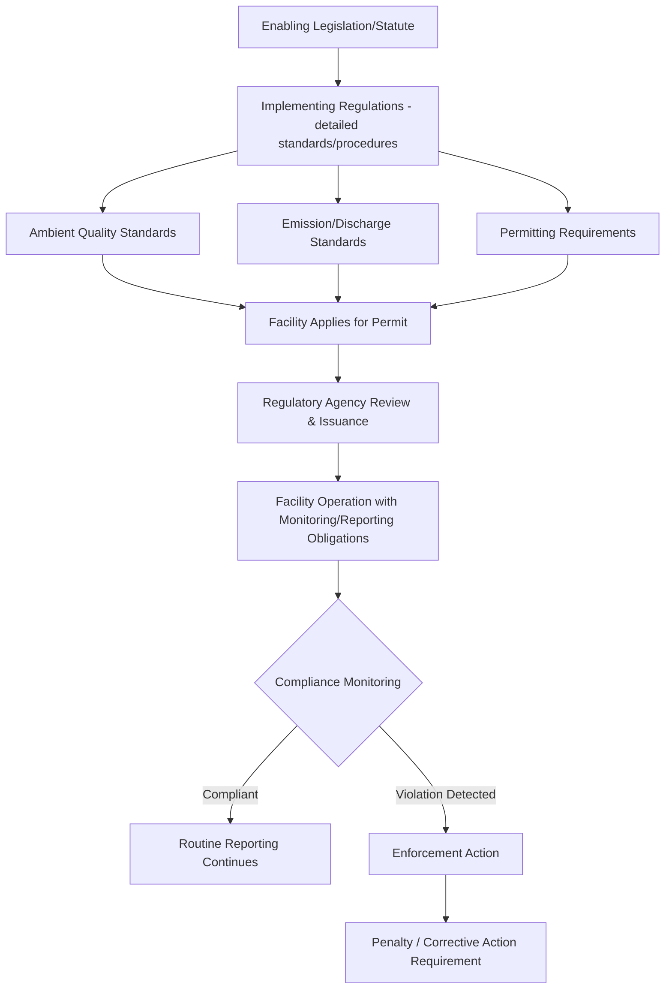

## National Environmental Regulations

### Overview

National environmental regulations are the domestic legal instruments — statutes, implementing rules, permits, and standards — through which individual countries translate environmental policy goals and international treaty commitments into binding, enforceable requirements within their jurisdiction. They form the operational layer of environmental governance, directly shaping permitting processes, compliance monitoring, and the geospatial data/reporting systems used to verify adherence.

**Key Points**

- National regulatory frameworks vary substantially in structure and stringency, but most share common regulatory instruments: ambient quality standards, emission/discharge limits, permitting systems, and enforcement/penalty mechanisms.
- Because national regulations are the primary mechanism through which international environmental agreements and domestic environmental policy actually take legal effect on the ground, they are the level at which most environmental monitoring, EIA, and geospatial compliance work is directly applied.

---

### Core Regulatory Instruments

#### Ambient Quality Standards

- Establish maximum allowable concentrations of pollutants in environmental media (air, water, soil) at a receptor or ambient location, representing the regulatory target for overall environmental quality rather than a specific source's emissions.
- Typically differentiated by designated use category (e.g., drinking water source vs. industrial water body; residential vs. industrial air quality zone), reflecting that acceptable pollutant levels depend on the sensitivity of the intended use.

#### Emission and Discharge Standards

- Set maximum allowable pollutant release rates or concentrations at the point of emission/discharge (smokestack, effluent pipe), distinct from and generally more directly enforceable than ambient standards since they apply at an identifiable, attributable source.
- Often differentiated by industry sector and, in some frameworks, by facility age/technology (e.g., new source performance standards imposing stricter requirements on newly constructed facilities than existing ones).

#### Permitting and Licensing Systems

- **Environmental permits**: required authorizations for activities with potential environmental impact (industrial operations, waste discharge, resource extraction, land development), typically specifying facility-specific conditions, monitoring requirements, and reporting obligations.
- **Permit renewal and review cycles**: most systems require periodic permit renewal, providing a regular opportunity to update conditions based on updated science, technology, or changed environmental circumstances rather than a one-time, permanent authorization.

#### Land Use and Zoning Regulation

- Governs permissible land uses and development density within designated zones, frequently incorporating environmental protection objectives (buffer zones around sensitive habitats, floodplain development restrictions, protected area designations) directly into the land-use planning and approval process.

---

### Regulatory Approach Typologies

#### Command-and-Control Regulation

- Traditional approach specifying required technologies, practices, or fixed numerical limits that regulated entities must meet, with penalties for non-compliance — the dominant approach in most national frameworks, valued for regulatory certainty and straightforward enforceability.

#### Market-Based Instruments

- **Cap-and-trade/emissions trading systems**: establish an overall emissions cap with tradable allowances, allowing market mechanisms to achieve reductions at lower aggregate cost than uniform command-and-control limits, used for greenhouse gases and certain conventional pollutants in various national and subnational systems.
- **Environmental taxes/levies**: pricing mechanisms (carbon taxes, pollution charges) that incorporate environmental costs into economic decision-making without prescribing specific compliance methods.
- **Payment for ecosystem services (PES)**: incentive-based mechanisms compensating landowners/resource managers for maintaining or enhancing ecosystem services (watershed protection, carbon sequestration, biodiversity conservation).

#### Performance-Based and Outcome-Focused Regulation

- Specifies required environmental outcomes while allowing regulated entities flexibility in the specific methods used to achieve them, contrasted with prescriptive command-and-control approaches that mandate specific technologies or practices.

---

### Institutional Structure

#### Regulatory Agencies

- Most national systems designate a primary environmental regulatory authority (e.g., environmental protection agency/ministry), though implementation authority is frequently distributed across multiple levels of government (national, regional/state, local) and sometimes across multiple sector-specific agencies (water, forestry, mining, agriculture) with overlapping or coordinated jurisdiction.

#### Federal/Subnational Division of Authority

- In federal systems, environmental regulatory authority is often shared or divided between national and subnational (state/provincial) governments, with the national level frequently setting minimum standards that subnational jurisdictions may meet or exceed but generally not fall below — creating potential for significant subnational variation in actual stringency within a single country.

#### Judicial and Administrative Review

- Most systems provide mechanisms for regulated entities and affected parties to challenge regulatory decisions (permit denials, enforcement actions, standard-setting) through administrative appeal processes and/or judicial review, providing a check on regulatory agency decision-making.

**Example**

---

### Compliance Monitoring and Enforcement

#### Self-Monitoring and Reporting

- Many systems require regulated entities to conduct and report their own compliance monitoring (e.g., discharge monitoring reports), with regulatory agency inspection and audit serving as a verification/deterrence function rather than the primary ongoing data source.

#### Inspection and Audit

- Scheduled and unannounced facility inspections verify actual compliance conditions and can identify violations not apparent from self-reported data alone, particularly important given inherent incentive concerns with purely self-reported compliance data.

#### Remote Sensing and Geospatial Compliance Monitoring

- Increasingly used to supplement traditional inspection-based compliance monitoring, particularly for spatially extensive or hard-to-access violations: illegal deforestation/land clearing, unpermitted construction in protected zones, illegal mining, and unauthorized discharge plumes detectable via satellite imagery.
- Provides regulatory agencies with a scalable, relatively low-cost method for prioritizing limited field inspection resources toward locations flagged by remote monitoring as most likely non-compliant.

#### Enforcement Mechanisms

- **Administrative penalties**: fines, permit suspension/revocation, corrective action orders — typically the most common and rapidly deployable enforcement tool.
- **Civil enforcement**: court-imposed remedies, including injunctive relief and civil penalties, often available for more serious or continued violations.
- **Criminal enforcement**: reserved for the most serious violations (e.g., knowing/willful violations causing significant harm), involving criminal prosecution and potential imprisonment in addition to financial penalties.

---

### Environmental Impact Assessment Integration

- National EIA requirements (screening thresholds, procedural steps, review authority) are themselves established through national environmental regulation, meaning EIA process design varies across countries even where the underlying analytical structure (screening, scoping, baseline, impact prediction, mitigation, monitoring) is broadly similar.
- National regulations typically specify which project types/scales trigger EIA requirements and which regulatory body has review/approval authority, directly shaping the practical scope of project-level environmental review within that jurisdiction.

---

### Cross-Cutting Regulatory Areas

- **Protected area law**: legal designation and management framework for national parks, reserves, and other protected areas, including permitted/prohibited activities within designated boundaries.
- **Endangered species protection**: legal mechanisms for listing threatened/endangered species and regulating activities (habitat modification, take/harm) affecting them.
- **Water rights and allocation law**: governs the legal framework for water withdrawal rights, often historically separate from water quality regulation but increasingly integrated in contemporary water governance frameworks.
- **Waste and hazardous materials management**: regulates generation, transport, treatment, and disposal of solid and hazardous waste, frequently implementing obligations under international agreements (e.g., Basel Convention) at the national level.

---

### Common Challenges and Limitations

- **Regulatory capacity gaps**: effective implementation and enforcement require sustained institutional capacity (technical staff, monitoring infrastructure, laboratory capability) that varies substantially across countries and can lag behind the formal stringency of written regulations. [Inference: broadly documented gap between regulatory design and implementation capacity in environmental governance literature]
- **Fragmented multi-agency jurisdiction**: overlapping authority across multiple agencies/levels of government can create coordination challenges, regulatory gaps, or duplicative requirements for regulated entities operating across jurisdictional boundaries.
- **Self-reporting reliability concerns**: reliance on regulated entity self-monitoring creates inherent incentive tensions, partially but not fully addressed by independent inspection, audit, and increasingly remote sensing-based verification.
- **Standard-setting lag relative to emerging contaminants/technologies**: regulatory standards for newly identified environmental concerns (emerging contaminants, new industrial processes) often lag scientific understanding, given the typically lengthy formal rulemaking process required to establish or revise binding standards.
- **Subnational variation within federal systems**: in federal systems, significant differences in subnational implementation stringency can create regulatory arbitrage incentives and complicate national-level environmental outcome consistency.

---

### Related Topics

- Environmental Impact Assessment process (national regulatory implementation)
- International Environmental Agreements and domestic implementation
- Remote sensing for regulatory compliance monitoring
- Protected area law and management frameworks
- Cap-and-trade and emissions trading system design
- Water rights and water quality regulatory integration
- Environmental enforcement and penalty structures
- Endangered species legal protection frameworks
- Payment for Ecosystem Services (PES) program design
- Environmental permitting and licensing procedures