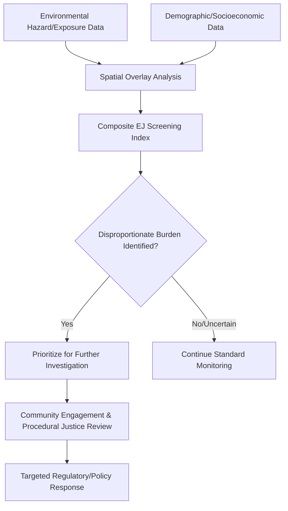

## Environmental Justice and Equity

### Overview

Environmental justice and equity concerns the fair distribution of environmental benefits and burdens across populations, and the meaningful inclusion of all communities — particularly those historically marginalized by race, income, or indigenous status — in environmental decision-making. It combines social science, epidemiology, law, and increasingly geospatial analysis to identify, quantify, and address disproportionate environmental harm.

**Key Points**

- Environmental justice is commonly analyzed along three interconnected dimensions: **distributive justice** (fair distribution of environmental risks and benefits), **procedural justice** (fair and meaningful participation in decision-making processes), and **recognitional justice** (acknowledgment of the distinct rights, knowledge systems, and historical context of affected communities).
- Geospatial analysis — particularly GIS-based overlay of environmental hazard data with demographic data — has become a core methodological tool for identifying and documenting environmental justice concerns at scale.

---

### Core Concepts

#### Distributive Justice

- Examines whether environmental hazards (pollution sources, contaminated sites, industrial facilities) and environmental benefits (green space, clean water access, disaster protection infrastructure) are distributed disproportionately across different demographic groups.
- Empirically studied through spatial correlation between hazard/benefit location and demographic characteristics (race, income, age, language proficiency) at fine geographic resolution.

#### Procedural Justice

- Concerns whether affected communities have meaningful, timely, and accessible opportunities to participate in decisions affecting their environment — public comment periods, hearings, and consultation processes that are substantively (not merely formally) accessible given language, literacy, scheduling, and resource constraints communities may face.
- Meaningful procedural justice generally requires more than minimum legal compliance with notice-and-comment requirements; it requires genuine capacity for affected communities to understand technical information and influence outcomes.

#### Recognitional Justice

- Acknowledges the distinct historical relationships, traditional knowledge systems, and legal/political status of specific communities — particularly indigenous peoples — in environmental decision-making, going beyond simple demographic inclusion to recognize differentiated rights and ways of knowing.

---

### Historical and Conceptual Origins

- The environmental justice movement is widely traced to community organizing in response to documented instances of hazardous facility siting disproportionately affecting minority and low-income communities, with the term and formal framework gaining significant traction in environmental policy discourse from the late 20th century onward.
- Early foundational studies established statistical associations between race/income and proximity to hazardous waste facilities and other environmental burdens, providing empirical grounding for what had previously been primarily a community-based observation.

---

### Geospatial Methods in Environmental Justice Analysis

#### Environmental Justice Screening Tools

- Combine spatially-referenced environmental hazard/exposure data (air quality, proximity to hazardous facilities, water quality, flood risk) with demographic data (race/ethnicity, income, age, linguistic isolation) at fine geographic resolution (e.g., census tract or block group level) to produce composite screening indices identifying areas of potential disproportionate burden.
- Widely used examples include government-developed screening platforms (e.g., US EPA's EJScreen, California's CalEnviroScreen) that combine multiple environmental and demographic indicators into composite percentile rankings for prioritization purposes.
- **Key methodological consideration**: screening tools are designed to identify areas warranting further investigation, not to definitively establish causation or individual-level exposure/health outcomes — a distinction the tools themselves typically emphasize but that can be lost in downstream application.

#### Spatial Overlay and Proximity Analysis

- **Buffer analysis**: identifying populations within a defined distance of a hazard source (e.g., population within 1 km of a hazardous facility), a common but methodologically simple approach that does not account for actual dispersion patterns, wind direction, or exposure pathway specifics.
- **Exposure modeling integration**: more sophisticated approaches combine demographic overlay with actual pollutant dispersion or concentration modeling (e.g., air dispersion model output) rather than simple proximity, providing a more accurate exposure-based rather than purely distance-based assessment.

#### Cumulative Burden Assessment

- Recognizes that environmental justice communities frequently face multiple, simultaneous environmental stressors (several nearby facilities, multiple pollutant types, combined with socioeconomic vulnerability factors like limited healthcare access) whose combined effect may exceed what single-source, single-pollutant regulatory review captures.
- Connects methodologically to cumulative impact assessment approaches, but with an explicit demographic equity lens rather than purely ecological/environmental focus.

**Example**

---

### Application in Regulatory and Planning Processes

#### Environmental Impact Assessment Integration

- Environmental justice analysis is increasingly integrated as an explicit component of EIA processes in various jurisdictions, requiring assessment of whether a proposed project's impacts would disproportionately affect environmental justice communities, alongside standard impact categories.
- Cumulative impact assessment methodology is particularly relevant here, given that environmental justice communities often already bear disproportionate baseline environmental burden before a new project's incremental contribution is even considered.

#### Facility Siting and Permitting

- Some jurisdictions have incorporated environmental justice considerations directly into permitting decision criteria, requiring enhanced review, additional mitigation, or in some cases denial of permits for facilities proposed in areas already identified as bearing disproportionate cumulative burden.

#### Green Infrastructure and Benefit Distribution

- Equity analysis extends beyond hazard avoidance to positive environmental benefit distribution — urban tree canopy, park access, flood protection infrastructure — recognizing that unequal distribution of environmental benefits is itself an environmental justice concern, not only unequal distribution of harms.
- **Urban heat island and tree canopy equity analysis**: a widely studied application combining land surface temperature remote sensing with demographic data, frequently finding lower tree canopy coverage and higher heat exposure correlated with historically under-resourced neighborhoods in many studied cities.

---

### Indigenous Environmental Justice and Rights

- Indigenous communities face environmental justice considerations distinct from general demographic equity analysis, rooted in treaty rights, traditional territorial relationships, and sovereignty considerations that general screening tools based on standard demographic categories may not adequately capture.
- **Free, Prior, and Informed Consent (FPIC)**: an increasingly recognized principle (particularly in international frameworks and some national legal systems) requiring genuine indigenous community consent, obtained without coercion and with adequate information and time, for projects affecting indigenous lands or resources — a higher procedural standard than general public consultation requirements.
- **Traditional Ecological Knowledge (TEK) integration**: growing recognition of the value of incorporating indigenous traditional knowledge alongside conventional scientific data in environmental assessment and monitoring, though methodological and institutional integration remains an active area of development. [Inference: reflects an actively developing area of practice; specific integration approaches vary substantially by jurisdiction and program]

---

### Data and Methodological Considerations

#### Modifiable Areal Unit Problem (MAUP)

- Environmental justice screening results can be sensitive to the choice of geographic aggregation unit (census tract vs. block group vs. custom buffer), a well-documented spatial analysis phenomenon where different unit choices can produce different apparent patterns from the same underlying data — an important methodological caution when interpreting or comparing screening tool outputs.

#### Data Gaps and Representation

- Fine-resolution demographic and environmental data availability varies globally and even within well-resourced countries, with some populations (undocumented residents, highly mobile populations, some rural and tribal communities) potentially undercounted or underrepresented in the standard data sources (e.g., census data) underlying screening tools.

#### Correlation vs. Causation

- Spatial correlation between demographic characteristics and environmental hazard proximity documented through screening tools identifies pattern, not mechanism — establishing why such patterns exist (historical zoning/redlining practices, land value dynamics, political power differentials in facility siting decisions) requires additional historical and social science analysis beyond the geospatial pattern itself.

---

### Common Challenges and Limitations

- **Screening tool misuse**: composite screening indices, designed for prioritization and further investigation, are sometimes applied as if they provide definitive causal or individual-level exposure conclusions, a documented methodological caution that screening tool developers themselves typically emphasize.
- **Data resolution and recency**: environmental justice analysis is constrained by the spatial and temporal resolution of underlying demographic (often census-based, updated infrequently) and environmental hazard data, potentially missing rapidly changing neighborhood composition or newly emerging hazard sources.
- **Procedural justice measurement difficulty**: while distributive justice is relatively tractable to quantify geospatially, procedural and recognitional justice dimensions are inherently harder to measure quantitatively, often relying on qualitative assessment, community feedback, and process documentation rather than standardized spatial indicators.
- **Balancing standardization and local context**: nationally standardized screening tools enable consistent, comparable prioritization across large areas but can miss locally specific concerns or community-identified priorities that a standardized indicator set does not capture, creating tension between scalability and local relevance.
- **Political and legal contestation**: environmental justice as a regulatory consideration remains subject to ongoing legal and political debate in various jurisdictions regarding its appropriate role, weight, and enforceability in formal decision-making, an evolving area rather than a settled matter. [Unverified: current legal and regulatory status of environmental justice requirements varies by jurisdiction and is subject to ongoing change]

---

### Related Topics

- Cumulative Impact Assessment methodology
- Environmental Impact Assessment process and EJ integration
- Urban heat island mapping and land surface temperature remote sensing
- Free, Prior, and Informed Consent (FPIC) frameworks
- Environmental monitoring network design and equity considerations
- Modifiable Areal Unit Problem (MAUP) in spatial analysis
- GIS-based demographic and hazard overlay analysis
- Traditional Ecological Knowledge integration in environmental science
- Green infrastructure and urban tree canopy equity
- National environmental regulation and permitting integration