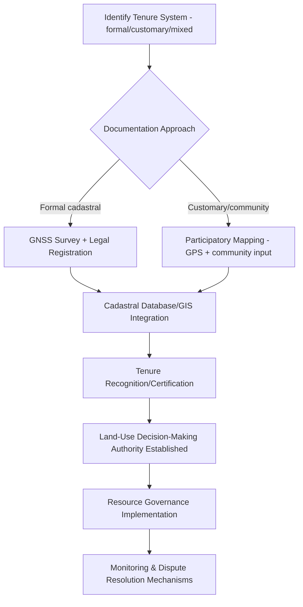

## Land Tenure and Resource Governance

### Overview

Land tenure and resource governance encompasses the legal, institutional, and customary systems that define rights to hold, use, transfer, and manage land and natural resources. It shapes who has authority to make land-use decisions, who bears responsibility for resource stewardship, and how conflicts over land and resource access are resolved — forming a foundational layer beneath environmental regulation, conservation planning, and development. Geospatial tools increasingly play a central role in documenting, formalizing, and disputing tenure claims.

**Key Points**

- Land tenure systems exist on a spectrum from formal, state-registered individual freehold ownership to customary/communal tenure systems, with substantial global variation and frequent overlap or conflict between formal and customary systems within the same territory.
- Secure tenure — whether formal or customary — is widely recognized in the development and conservation literature as a precondition for sustainable resource management, since resource users with insecure or contested rights have weaker incentives for long-term stewardship investment.

---

### Core Concepts

#### Tenure Bundle of Rights

- Land/resource tenure is commonly conceptualized not as a single binary "ownership" status but as a **bundle of rights** that can be held separately or in combination: right of access, right of withdrawal/use (e.g., harvesting timber or water), right of management (deciding how the resource is used), right of exclusion (determining who else may access), and right of alienation (transferring or selling the right itself).
- Different tenure arrangements distribute this bundle differently — for example, a grazing lease may confer withdrawal rights without alienation rights, while freehold ownership typically confers the full bundle.

#### Tenure Typologies

- **Private/individual tenure**: rights held by an individual or corporate entity, typically formally registered and legally enforceable, with strong alienation rights.
- **State/public tenure**: land and resources held and managed by government entities, ranging from strictly protected areas to multiple-use public lands with permitted private extraction/use rights.
- **Communal/customary tenure**: rights held collectively by a community or group according to traditional or locally-recognized rules, often lacking formal state registration but functioning as a legitimate and enforceable system within the community and, increasingly, recognized to varying degrees in national law.
- **Open access**: absence of defined exclusion rights, where no party can effectively prevent others from resource use — frequently (though not universally, per critiques of the classic "tragedy of the commons" framing) associated with resource overexploitation risk in the absence of alternative governance arrangements.

#### Formal vs. Customary Tenure Interaction

- In many regions, especially across parts of Africa, Asia, and Latin America, customary tenure systems govern the majority of land area in practice even where formal state land law nominally applies, creating a frequent gap between de jure (legally recognized) and de facto (practically operating) tenure systems.
- **Legal pluralism**: the coexistence of multiple, sometimes conflicting tenure systems (statutory, customary, religious) within the same jurisdiction, requiring careful navigation in land governance and dispute resolution processes.

---

### Resource Governance Frameworks

#### Common-Pool Resource Governance

- Natural resources such as fisheries, grazing lands, forests, and groundwater aquifers frequently exhibit common-pool characteristics (difficult to exclude users, but use by one party reduces availability for others), requiring governance arrangements distinct from either pure private property or pure state control.
- **Elinor Ostrom's design principles for common-pool resource management**: widely referenced institutional design principles associated with successful community-based common-pool resource governance, including clearly defined boundaries, rules matched to local conditions, participatory decision-making, monitoring, graduated sanctions, and conflict-resolution mechanisms — an influential framework in resource governance scholarship.

#### Co-management and Community-Based Natural Resource Management (CBNRM)

- Governance arrangements sharing management authority and responsibility between government agencies and local resource-user communities, positioned as an alternative to both purely top-down state management and purely open-access or informal community management.
- Widely applied in forestry (community forestry programs), fisheries (co-managed fishing zones), and wildlife management (community conservancies), with outcomes varying substantially based on the genuine distribution of decision-making authority and benefit-sharing arrangements established.

#### Indigenous and Traditional Land Rights

- Growing formal recognition in international frameworks and increasingly in national law of indigenous peoples' rights to their traditional lands and resources, though the extent and enforceability of this recognition varies substantially by country.
- **Indigenous and Community Conserved Areas (ICCAs)**: territories governed and managed by indigenous peoples or local communities, increasingly recognized as an important conservation governance category alongside formally designated state protected areas.

---

### Geospatial Tools in Land Tenure Documentation

#### Cadastral Mapping and Land Registration

- **Cadastre**: a systematic, geospatially referenced record of land parcels, ownership/rights holders, and associated attributes, forming the technical backbone of formal land registration systems.
- Modern cadastral systems increasingly integrate GNSS/GPS survey, satellite/aerial imagery, and GIS database management, replacing older paper-based and less precise boundary documentation methods.
- **Fit-for-purpose land administration**: an approach, particularly relevant in developing-country and customary tenure contexts, that prioritizes efficient, cost-effective, and locally appropriate boundary documentation (potentially using lower-precision but rapidly deployable methods like participatory community mapping with GPS/satellite imagery) over the high-precision, high-cost survey standards typical of formal cadastral systems in well-resourced settings — enabling more rapid tenure formalization at scale.

#### Participatory and Community Mapping

- Community-based mapping methods, often combining local knowledge with GPS data collection and satellite/aerial imagery interpretation, used to document customary boundaries, resource use areas, and traditional territorial claims that may lack any formal documentation.
- Increasingly digitized through mobile data collection tools and open-source GIS platforms, lowering the technical and cost barriers to community-led mapping compared to earlier paper-map-based participatory approaches.

**Example**

#### Remote Sensing for Tenure and Boundary Monitoring

- Satellite imagery increasingly used to monitor encroachment on documented tenure boundaries (e.g., illegal logging within community forest concessions, agricultural encroachment into protected indigenous territories), supporting enforcement of already-documented rights.
- Historical imagery analysis can also support tenure claim documentation by demonstrating long-term land use patterns consistent with claimed customary rights, in contexts where formal historical records are absent or incomplete.

---

### Land Governance and Environmental Outcomes

- Empirical research has documented associations between secure indigenous/community tenure and forest conservation outcomes in various regions, though the strength and consistency of this relationship varies by study and context, and mechanisms (enforcement capacity, economic incentive alignment, cultural stewardship practices) are actively studied rather than fully settled. [Inference: reflects a body of empirical literature on tenure security and conservation outcomes; specific effect sizes and causal mechanisms vary by study and region]
- Insecure or contested tenure is frequently identified as a driver of unsustainable resource extraction, since actors without confidence in long-term rights retention have reduced incentive to forgo short-term extraction for long-term resource sustainability — a dynamic relevant to deforestation, overfishing, and land degradation analysis.

---

### Land Tenure Reform and Formalization Programs

- **Land titling and formalization initiatives**: government or donor-supported programs to extend formal legal recognition to previously undocumented (often customary) land rights, intended to improve tenure security, access to credit (using land as collateral), and investment incentives.
- **Critiques and risks of formalization**: formalization processes carry documented risks including elite capture (formal titling disproportionately benefiting better-connected or more resourced community members), loss of flexibility inherent in customary systems, and potential erosion of communal management arrangements when individual titling is imposed on previously collectively-managed resources. [Inference: reflects documented critiques in land governance and development literature; specific outcomes vary substantially by program design and context]
- **Land consolidation and redistribution programs**: distinct policy tools addressing fragmented landholding patterns or historical inequitable land distribution, carrying their own distinct implementation and equity considerations separate from formalization/titling programs.

---

### Common Challenges and Limitations

- **Overlapping and conflicting claims**: formal and customary systems, or multiple customary systems, frequently produce overlapping claims to the same land/resources, requiring dispute resolution mechanisms that are not always well-developed or accessible, particularly for marginalized claimants.
- **Gender and tenure security**: women's land and resource rights are frequently less secure than men's within both formal and customary systems in many contexts, an actively studied equity dimension of land tenure reform and formalization program design. [Unverified: specific current gender tenure gap statistics vary by region and should be sourced from current data]
- **Elite capture risk in formalization and co-management**: as noted, both formal titling programs and community-based/co-management arrangements carry documented risk that better-resourced or better-connected actors disproportionately capture the benefits of tenure reform or governance authority, undermining intended equity outcomes.
- **Data and mapping resource constraints**: comprehensive cadastral coverage and up-to-date tenure documentation remain incomplete in many regions, particularly for customary and informal tenure systems, creating persistent gaps between actual land governance practice and the documented/mapped record.
- **Dynamic and negotiated nature of customary tenure**: customary tenure systems are often flexible and context-dependent (e.g., use rights shifting seasonally or with community negotiation) in ways that can be poorly captured by static, fixed-boundary formal mapping approaches, creating a methodological tension between documentation precision and customary system fidelity.

---

### Related Topics

- Cadastral mapping and land registration systems
- Community-Based Natural Resource Management (CBNRM)
- Indigenous and Community Conserved Areas (ICCAs)
- Common-pool resource governance (Ostrom design principles)
- Free, Prior, and Informed Consent (FPIC) frameworks
- Participatory GIS and community mapping methods
- Deforestation drivers and land-use change analysis
- Protected area governance and management effectiveness
- Land degradation neutrality and sustainable land management
- Gender and land rights in resource governance