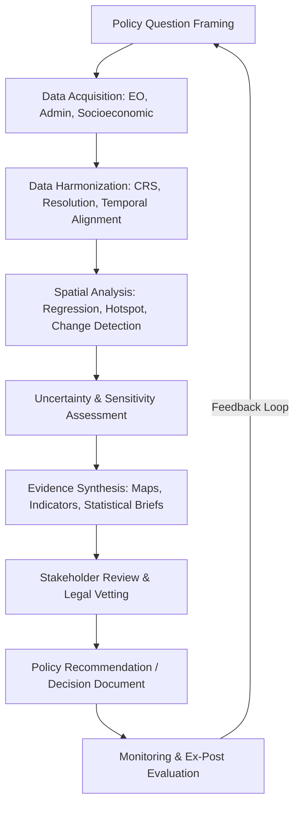

## Policy Analysis Using Geospatial Evidence

### Definition and Scope

Policy analysis using geospatial evidence is the systematic application of spatial data, remote sensing products, and geographic information system (GIS) methods to inform, evaluate, and defend environmental policy decisions. It bridges quantitative spatial science and public administration by translating raster/vector datasets, spatial statistics, and modeled outputs into decision-relevant indicators that withstand legal, regulatory, and political scrutiny.

This discipline spans the full policy cycle: problem identification, options analysis, impact assessment, implementation monitoring, and ex-post evaluation, with geospatial evidence serving as an empirical backbone at each stage.

### Role in the Policy Cycle

**Key Points**

- **Agenda-setting**: Satellite-derived indicators (e.g., deforestation alerts, air quality anomalies) surface issues requiring policy attention.
- **Formulation**: Spatial scenario modeling compares policy alternatives (e.g., zoning options, protected area boundaries).
- **Adoption**: Maps and spatial statistics support cost-benefit and equity arguments presented to legislators or agencies.
- **Implementation**: GIS-based monitoring tracks compliance (e.g., permitted land use vs. actual land cover).
- **Evaluation**: Before/after spatial comparisons quantify policy effectiveness (e.g., protected area deforestation avoided).

### Core Data Sources

| Category | Examples | Typical Use |
| --- | --- | --- |
| Earth observation | Landsat, Sentinel-1/2, MODIS, VIIRS | Land cover change, vegetation health, thermal anomalies |
| Administrative/cadastral | Parcel boundaries, zoning maps, protected area registries | Legal compliance, land tenure disputes |
| Socioeconomic | Census, household surveys geocoded to enumeration areas | Environmental justice, exposure analysis |
| Environmental monitoring | Air quality sensor networks, water gauges, soil sampling | Regulatory threshold compliance |
| Climate/hazard models | CMIP6 downscaled projections, flood inundation models | Adaptation policy, risk zoning |
| Citizen science/crowdsourced | iNaturalist, OpenStreetMap, community mapping | Ground-truthing, participatory GIS |

### Analytical Methods

**Key Points**

- **Spatial regression**: Addresses spatial autocorrelation that ordinary least squares (OLS) ignores, using models such as spatial lag ($y = \rho W y + X\beta + \epsilon$) or spatial error specifications.
- **Difference-in-differences with spatial matching**: Compares treated areas (e.g., inside a protected area boundary) against synthetic or geographically matched controls to estimate causal policy impact.
- **Hotspot analysis**: Getis-Ord $Gi^*$ statistic identifies statistically significant spatial clusters of an indicator (e.g., illegal logging events) for enforcement prioritization.
- **Exposure and buffer analysis**: Overlaying pollution sources with population layers within defined radii to assess exposure inequities.
- **Land use/land cover (LULC) change detection**: Post-classification comparison or continuous change detection (e.g., LandTrendr, CCDC) to quantify policy-relevant transitions (forest loss, urban sprawl).
- **Scenario and suitability modeling**: Multi-criteria decision analysis (MCDA) with weighted overlay to evaluate siting policies (e.g., renewable energy zoning).

The Getis-Ord statistic is formally:

$$G_i^* = \frac{\sum_{j=1}^{n} w_{ij}x_j - \bar{X}\sum_{j=1}^{n} w_{ij}}{S\sqrt{\frac{n\sum_{j=1}^{n}w_{ij}^2 - (\sum_{j=1}^{n}w_{ij})^2}{n-1}}}$$

### Standard Workflow

### Worked Example: Deforestation Policy Evaluation

**Example**

A ministry wants to evaluate whether a 2020 logging moratorium reduced deforestation in a target province.

1. Acquire annual forest cover loss rasters (e.g., Hansen Global Forest Change) for 2015–2025.
2. Define treatment area (province under moratorium) and control areas (similar provinces without the policy, matched on baseline forest cover, elevation, and road density).
3. Compute annual deforestation rate per unit area:

   $$D_t = \frac{\text{Forest loss area}_t}{\text{Total forest area}_{t-1}} \times 100$$
4. Apply a spatial difference-in-differences model:

   $$D_{it} = \beta_0 + \beta_1 \text{Treat}_i + \beta_2 \text{Post}_t + \beta_3(\text{Treat}_i \times \text{Post}_t) + \gamma X_{it} + \epsilon_{it}$$

   where $\beta_3$ estimates the policy's causal effect.
5. Map residual deforestation "leakage" to adjacent non-treated areas to check for displacement effects.
6. Report findings with confidence intervals and a sensitivity check against alternative control specifications.

[Inference] The magnitude of any estimated moratorium effect is highly sensitive to control-group selection and to whether enforcement capacity was uniform across the treated province; results should be interpreted alongside qualitative enforcement records.

### Environmental Justice and Equity Analysis

**Key Points**

- Overlay pollutant concentration surfaces (e.g., interpolated PM2.5) with demographic layers to compute disparate exposure metrics.
- Common indicator: population-weighted exposure disparity ratio between a demographic subgroup and the reference population.
- Tools: EPA EJScreen (US), CEJST (US), EU-wide equivalents integrating Copernicus and Eurostat data.
- Requires careful handling of the modifiable areal unit problem (MAUP), since results can shift depending on the aggregation unit chosen (block group vs. census tract vs. custom buffer).

### Legal and Regulatory Considerations

**Key Points**

- Geospatial evidence used in litigation or regulatory rulemaking must meet evidentiary standards for data provenance, reproducibility, and chain of custody (e.g., documented processing lineage, versioned datasets).
- Metadata standards (ISO 19115, FGDC) support defensibility of spatial evidence in administrative and judicial review.
- Positional and thematic accuracy must be disclosed; many jurisdictions require stated confidence levels or error matrices for classified land cover products submitted as evidence.
- [Unverified] Specific admissibility thresholds for satellite-derived evidence vary substantially by jurisdiction and are not standardized internationally; consult domain legal counsel for a specific case.

### Communicating Findings to Policymakers

**Key Points**

- Prioritize concise, decision-ready visual products: choropleth maps with clear legends, dashboards with drill-down capability, and one-page policy briefs pairing a map with 2–3 headline statistics.
- Avoid overly technical cartographic complexity; policymakers generally respond better to simplified, high-contrast thematic maps than to multi-layer technical outputs.
- Uncertainty should be visually communicated (e.g., hatching for low-confidence zones) rather than omitted, to maintain scientific credibility.

### Illustrative Diagram: Evidence-to-Decision Pipeline

<svg viewBox="0 0 760 260" xmlns="http://www.w3.org/2000/svg" font-family="sans-serif">
<text x="380" y="20" text-anchor="middle" font-size="14" font-weight="bold">Geospatial Evidence to Policy Decision Pipeline (svg_diagram)</text>
<rect x="20" y="60" width="140" height="60" rx="6" fill="#dbeafe" stroke="#1d4ed8"/>
<text x="90" y="85" text-anchor="middle" font-size="11">Raw EO / GIS Data</text>
<text x="90" y="100" text-anchor="middle" font-size="10">(satellite, sensors)</text>
<rect x="200" y="60" width="140" height="60" rx="6" fill="#dcfce7" stroke="#15803d"/>
<text x="270" y="85" text-anchor="middle" font-size="11">Spatial Analysis</text>
<text x="270" y="100" text-anchor="middle" font-size="10">(regression, hotspots)</text>
<rect x="380" y="60" width="140" height="60" rx="6" fill="#fef9c3" stroke="#a16207"/>
<text x="450" y="85" text-anchor="middle" font-size="11">Indicator Synthesis</text>
<text x="450" y="100" text-anchor="middle" font-size="10">(maps, statistics)</text>
<rect x="560" y="60" width="160" height="60" rx="6" fill="#fee2e2" stroke="#b91c1c"/>
<text x="640" y="85" text-anchor="middle" font-size="11">Policy Decision</text>
<text x="640" y="100" text-anchor="middle" font-size="10">(regulation, funding)</text>
<line x1="160" y1="90" x2="200" y2="90" stroke="black" marker-end="url(#arrow)"/>
<line x1="340" y1="90" x2="380" y2="90" stroke="black" marker-end="url(#arrow)"/>
<line x1="520" y1="90" x2="560" y2="90" stroke="black" marker-end="url(#arrow)"/>
<rect x="200" y="170" width="320" height="50" rx="6" fill="#f3e8ff" stroke="#7e22ce"/>
<text x="360" y="200" text-anchor="middle" font-size="11">Stakeholder & Legal Review Loop</text>
<line x1="450" y1="120" x2="360" y2="170" stroke="black" stroke-dasharray="4,2" marker-end="url(#arrow)"/>
<line x1="360" y1="170" x2="450" y2="120" stroke="black" stroke-dasharray="4,2"/>
<defs>
<marker id="arrow" markerWidth="8" markerHeight="8" refX="6" refY="3" orient="auto">
<path d="M0,0 L6,3 L0,6 Z" fill="black"/>
</marker>
</defs>
</svg>

### Common Pitfalls

**Key Points**

- Conflating correlation from overlay analysis with causal policy effect without a valid counterfactual design.
- Ignoring the modifiable areal unit problem (MAUP) and edge effects when aggregating to administrative boundaries.
- Using mismatched temporal resolution between policy implementation date and satellite revisit/compositing periods, biasing before/after comparisons.
- Failing to propagate classification or interpolation uncertainty into final policy indicators.
- Omitting documentation of coordinate reference system (CRS) transformations, which can silently introduce positional errors in cross-boundary comparisons.

### Software and Tooling

**Key Points**

- **Open source**: QGIS, GeoPandas, PySAL (spatial econometrics), GDAL, R (`sf`, `spdep`, `spatialreg`), Google Earth Engine for large-scale EO processing.
- **Proprietary**: ArcGIS Pro, ArcGIS Online dashboards, ENVI for advanced remote sensing classification.
- **Policy-specific platforms**: Global Forest Watch, Climate Watch, World Resources Institute Aqueduct (water risk), EPA EJScreen.

### Related Topics

- Environmental Impact Assessment (EIA) spatial methods
- Remote sensing for regulatory compliance monitoring
- Spatial econometrics and causal inference
- Environmental justice mapping and exposure modeling
- Protected area effectiveness evaluation
- Land tenure and cadastral mapping for governance
- Climate risk zoning and adaptation policy
- Open geospatial data standards (OGC, FGDC, ISO 19115)