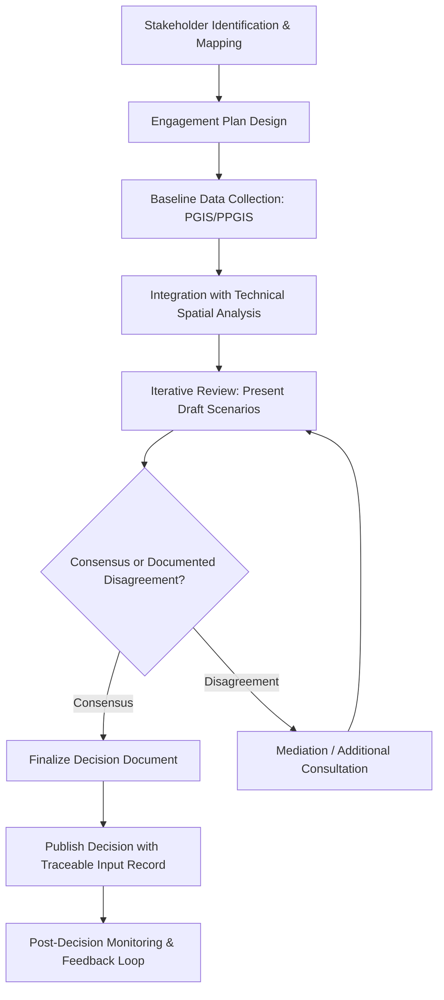

## Stakeholder Engagement in Environmental Decisions

### Definition and Scope

Stakeholder engagement in environmental decisions is the structured process of identifying, consulting, and incorporating input from individuals, communities, organizations, and institutions affected by or interested in an environmental policy, project, or resource management decision. Within geospatial and environmental science, this process increasingly relies on spatial tools — participatory GIS (PGIS), public participation GIS (PPGIS), and geoweb platforms — to collect, visualize, and integrate stakeholder knowledge into technical analysis and formal decision-making.

### Rationale and Legal Basis

**Key Points**

- Improves decision legitimacy and reduces implementation conflict by surfacing local knowledge not captured in remote sensing or administrative datasets.
- Required under many statutory frameworks: NEPA (US) public comment periods, EU Aarhus Convention (access to information, participation, and justice in environmental matters), and Free, Prior, and Informed Consent (FPIC) provisions for Indigenous communities under ILO Convention 169 and UNDRIP.
- Reduces environmental justice risk by ensuring marginalized or historically excluded groups have documented input, which strengthens legal defensibility of the final decision.
- [Unverified] The specific procedural requirements (comment period length, notification radius, translation obligations) vary significantly by jurisdiction and must be verified against local statute.

### Spectrum of Engagement

A widely used framework is the International Association for Public Participation (IAP2) spectrum, which frames engagement not as binary but as a graduated scale:

| Level | Goal | Example Geospatial Tool |
| --- | --- | --- |
| Inform | One-way communication of decision | Static web maps, public notice dashboards |
| Consult | Gather feedback on a proposed option | Online comment-enabled map portals |
| Involve | Work directly with stakeholders throughout | Participatory mapping workshops |
| Collaborate | Partner in developing solutions | Co-design of zoning scenarios using shared GIS |
| Empower | Final decision-making placed with stakeholders | Community-led land use planning with GIS support |

### Participatory GIS (PGIS) and PPGIS Methods

**Key Points**

- **Sketch mapping**: Stakeholders draw features (sacred sites, hazard zones, resource areas) on printed base maps, later digitized into vector layers.
- **PPGIS web platforms**: Interactive online maps (e.g., Maptionnaire, GeoForm, ArcGIS Survey123) allow geolocated public comments tied to specific coordinates or parcels.
- **Mental mapping**: Captures perceived rather than measured spatial relationships (e.g., perceived flood risk vs. modeled flood extent), useful for identifying risk communication gaps.
- **Mobile data collection**: Field apps (KoBoToolbox, Open Data Kit, ArcGIS Field Maps) enable community members to geotag observations (illegal dumping, erosion, wildlife sightings) as structured point data.
- **3D and immersive visualization**: Community forums increasingly use 3D terrain visualization or simple AR overlays to help non-technical stakeholders interpret proposed infrastructure impacts.

### Standard Engagement Workflow

### Stakeholder Identification and Mapping

**Key Points**

- Use a stakeholder matrix categorizing groups by **influence** and **interest** (power-interest grid) to prioritize engagement intensity.
- Cross-reference stakeholder locations spatially: overlay stakeholder addresses, land parcels, or community boundaries with the project's spatial footprint plus a relevant buffer distance.
- Include both direct stakeholders (adjacent landowners, permit holders) and indirect stakeholders (downstream water users, regional NGOs, future generations represented by advocacy groups).
- Document underrepresented groups explicitly (e.g., non-English speakers, populations without reliable internet access) to design targeted, non-digital engagement channels alongside geoweb tools.

### Worked Example: Coastal Zoning Consultation

**Example**

A coastal municipality is revising setback regulations after erosion modeling shows increased risk.

1. Identify stakeholders using parcel data: property owners within a 500 m buffer of the current and projected shoreline, local fishing cooperatives, tourism operators, and an Indigenous community with treaty fishing rights in the area.
2. Publish an interactive PPGIS map showing modeled erosion scenarios (current, +1m sea level rise, +2m) with a public comment layer.
3. Hold in-person workshops using printed sketch maps for stakeholders with limited internet access; digitize workshop input into point/polygon layers tagged with participant-identified concerns.
4. Integrate qualitative input (e.g., "this cove is used for traditional harvesting") as an attribute layer alongside quantitative erosion projections.
5. Present three zoning scenarios, each with a map comparing stakeholder-identified priority areas against the technical hazard zones.
6. Document consensus areas and unresolved conflicts (e.g., a proposed setback line that overlaps a traditional harvesting site) in a formal decision record for legal traceability.

[Inference] The credibility of the final zoning decision is likely to depend as much on the transparency of how conflicting input was resolved as on the technical accuracy of the erosion model itself.

### Data Integration Challenges

**Key Points**

- **Scale mismatch**: Stakeholder-contributed points/polygons often have coarser or inconsistent spatial precision than remote sensing or survey-grade data; requires documented confidence/precision metadata per contribution.
- **Attribute harmonization**: Free-text stakeholder comments must be coded into structured categories (e.g., using a controlled vocabulary) before they can be jointly analyzed with quantitative layers.
- **Bias in digital participation**: PPGIS platforms systematically under-represent populations with lower digital access ("digital divide"), requiring blended digital/analog collection strategies to avoid skewed spatial input.
- **Data sovereignty**: Indigenous-contributed spatial data may be subject to Indigenous Data Sovereignty principles (e.g., CARE Principles: Collective Benefit, Authority to Control, Responsibility, Ethics), which can restrict how that data is stored, shared, or published outside community consent.

### Communicating Trade-offs to Stakeholders

**Key Points**

- Use side-by-side scenario maps rather than single "preferred alternative" maps early in the process, to avoid appearing to predetermine the outcome.
- Pair maps with plain-language summary statistics (e.g., "Option A protects 40% more wetland but displaces 12 households") rather than raw technical output.
- Maintain a public, versioned record of how input changed the analysis or decision, supporting both trust-building and legal defensibility.

### Illustrative Diagram: Stakeholder Influence-Interest Grid

<svg xmlns="http://www.w3.org/2000/svg" viewBox="0 0 620 460" font-family="sans-serif">
<text x="310" y="20" text-anchor="middle" font-size="14" font-weight="bold">Stakeholder Power-Interest Grid (svg_diagram)</text>
<line x1="80" y1="400" x2="80" y2="60" stroke="black" />
<line x1="80" y1="400" x2="560" y2="400" stroke="black" />
<text x="30" y="230" font-size="11" transform="rotate(-90 30 230)">Influence / Power</text>
<text x="320" y="425" font-size="11" text-anchor="middle">Interest in Decision</text>
<line x1="320" y1="60" x2="320" y2="400" stroke="#ccc" stroke-dasharray="3,3" />
<line x1="80" y1="230" x2="560" y2="230" stroke="#ccc" stroke-dasharray="3,3" />

<text x="140" y="120" font-size="10" font-style="italic">Keep Satisfied</text>

<text x="420" y="120" font-size="10" font-style="italic">Manage Closely</text>

<text x="140" y="340" font-size="10" font-style="italic">Monitor (Minimal)</text>

<text x="420" y="340" font-size="10" font-style="italic">Keep Informed</text>

<circle cx="440" cy="100" r="6" fill="#b91c1c" />
<text x="450" y="104" font-size="10">Regulatory Agency</text>
<circle cx="460" cy="150" r="6" fill="#1d4ed8" />
<text x="470" y="154" font-size="10">Indigenous Community</text>
<circle cx="400" cy="320" r="6" fill="#15803d" />
<text x="410" y="324" font-size="10">Adjacent Landowners</text>
<circle cx="150" cy="360" r="6" fill="#a16207" />
<text x="160" y="364" font-size="10">General Public</text>
<circle cx="180" cy="90" r="6" fill="#7e22ce" />
<text x="190" y="94" font-size="10">Funding Institution</text>
</svg>

### Common Pitfalls

**Key Points**

- Treating engagement as a single terminal event (one public meeting) rather than an iterative process spanning the decision lifecycle.
- Presenting technical spatial outputs without accessible interpretation aids, effectively excluding non-specialist stakeholders from meaningful participation.
- Failing to close the feedback loop — not documenting or communicating how stakeholder input was or was not incorporated into the final decision.
- Collecting PGIS data without a clear data governance agreement, leading to later disputes over data ownership, especially with Indigenous or traditional knowledge contributions.
- Over-relying on digital-only engagement tools, systematically excluding stakeholders without reliable internet access or digital literacy.

### Software and Tooling

**Key Points**

- **PPGIS/web platforms**: Maptionnaire, GeoForm, ArcGIS Survey123, Social Pinpoint, Konveio.
- **Mobile field data collection**: KoBoToolbox, Open Data Kit (ODK), ArcGIS Field Maps.
- **Open source mapping/visualization**: QGIS with QField for offline field mapping, Leaflet-based custom comment maps, Mapbox GL JS for interactive scenario dashboards.
- **Data governance frameworks**: CARE Principles for Indigenous Data Governance, FAIR data principles for broader stakeholder data interoperability.

### Related Topics

- Participatory GIS (PGIS) and PPGIS methodologies
- Free, Prior, and Informed Consent (FPIC) in resource governance
- Environmental Impact Assessment (EIA) public comment integration
- Indigenous Data Sovereignty and the CARE Principles
- Environmental justice and equity mapping
- Conflict resolution and mediation in land use planning
- Citizen science and crowdsourced environmental monitoring
- Risk communication and public perception of hazard maps