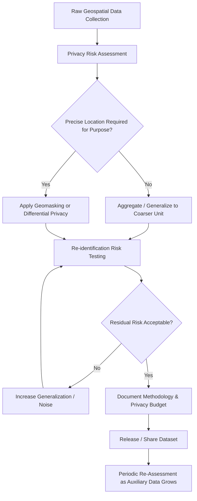

## Privacy Considerations in Geospatial Data

### Definition and Scope

Privacy considerations in geospatial data address the risks that arise when location information — collected via GPS devices, mobile applications, remote sensing, IoT sensors, or administrative records — can identify, track, profile, or expose individuals or communities. Because location is a quasi-identifier that correlates strongly with home address, workplace, religious practice, health status, and social relationships, geospatial datasets carry re-identification and surveillance risks that generic tabular data does not.

### Why Location Data Is High-Risk

**Key Points**

- **Uniqueness of mobility patterns**: Studies on mobile phone trajectory data have shown that a small number of spatiotemporal points (as few as 4 in some published studies) can uniquely identify the majority of individuals in a large dataset, even without names attached.
- **Sensitive inference**: Location traces can reveal protected attributes indirectly — visits to medical facilities (health status), places of worship (religion), or specific neighborhoods (ethnicity, socioeconomic status).
- **Persistence and linkability**: Home/work location pairs act as stable identifiers that can be linked across otherwise anonymized datasets (e.g., matching a "anonymous" trajectory dataset to a voter registration file via inferred home address).
- **Aggregation does not guarantee anonymity**: Coarse spatial binning or k-anonymity at low k can still leak information in sparsely populated areas.

[Unverified] Specific re-identification rates cited in mobility-privacy literature vary by dataset density, time resolution, and population size; exact figures should be verified against the specific study being referenced rather than generalized.

### Regulatory Frameworks

| Framework | Jurisdiction | Relevance to Geospatial Data |
| --- | --- | --- |
| GDPR | EU/EEA | Treats precise location data as personal data; requires lawful basis, purpose limitation, data minimization |
| CCPA/CPRA | California, US | "Precise geolocation" is an enumerated sensitive category with opt-out rights |
| HIPAA | US (health data) | Geocoded health records require de-identification of geographic subdivisions smaller than state, with additional restrictions on ZIP codes |
| PIPEDA | Canada | Location data treated as personal information under consent-based principles |
| Sector-specific | Varies | Telecom location data often has separate statutory protection (e.g., US CPNI rules) |

[Unverified] Regulatory thresholds (e.g., exact HIPAA geographic unit restrictions, GDPR's precise definition boundaries for "location data") should be confirmed against current statutory text, as these frameworks are periodically amended.

### Core Privacy Risks in Geospatial Workflows

**Key Points**

- **Re-identification from "anonymized" data**: Removing names/IDs from a spatial dataset while retaining precise coordinates and timestamps is insufficient; home/work inference attacks can re-identify individuals.
- **Function creep**: Data collected for one purpose (e.g., traffic flow analysis) repurposed for another (e.g., law enforcement surveillance) without renewed consent.
- **Mosaic effect**: Combining multiple low-risk public datasets (parcel records, utility data, satellite imagery) can jointly reveal sensitive information not apparent in any single dataset.
- **High-resolution imagery risks**: Very high-resolution satellite or aerial imagery can resolve individual vehicles, informal settlements, or personal property, raising surveillance concerns distinct from traditional survey-based privacy risks.
- **Third-party data broker exposure**: Mobile app SDKs frequently harvest and resell granular location data with limited user awareness, a well-documented practice in investigative and regulatory reporting.

### Privacy-Preserving Techniques

**Key Points**

- **Spatial k-anonymity**: Generalizing point locations so each released location is indistinguishable from at least $k-1$ others (e.g., cloaking to a region containing $k$ individuals).
- **Differential privacy**: Adding calibrated statistical noise to query outputs (e.g., counts per grid cell) such that the presence or absence of any single individual changes the output distribution negligibly, governed by a privacy budget $\epsilon$.
- **Geomasking**: Randomly perturbing point coordinates within a defined radius, often with adaptive radius to account for population density (e.g., donut masking to avoid the mean displacement artifact of simple random perturbation).
- **Spatial aggregation/binning**: Reporting data at coarser administrative or grid units (e.g., census tract instead of address) rather than point-level data.
- **Temporal generalization**: Reducing timestamp precision (e.g., date instead of minute) to limit trajectory reconstruction.
- **Synthetic data generation**: Generating statistically representative but non-real trajectories/locations for research or software testing use.

The differential privacy guarantee is formally expressed as:

$$\Pr[\mathcal{M}(D) \in S] \leq e^{\epsilon} \cdot \Pr[\mathcal{M}(D') \in S]$$

where $D$ and $D'$ are neighboring datasets differing by one individual's record, and $\mathcal{M}$ is the randomized mechanism.

### Standard De-Identification Workflow

### Worked Example: Publishing a Public Health Dashboard

**Example**

A health department wants to publish a dashboard showing disease case density by neighborhood.

1. Raw data: geocoded patient addresses linked to diagnosis dates — highly sensitive, must never be published at point resolution.
2. Aggregate cases to census block groups; suppress any block group with fewer than a minimum threshold count (a common convention is suppressing cells with counts below 5, consistent with common small-cell disclosure practices in public health reporting) to prevent inference in sparsely populated areas.
3. Apply temporal aggregation (weekly rather than daily counts) to reduce the risk of linking a case to a specific known event or clinic visit day.
4. Consider adding calibrated noise (differential privacy) to counts before publication if the dashboard will be interactively queryable, since interactive query interfaces are more vulnerable to differencing attacks than static published tables.
5. Document the suppression threshold, aggregation unit, and noise parameters in a public methodology note to support both transparency and legal defensibility.
6. Re-evaluate suppression thresholds periodically, since a static aggregation scheme can become newly susceptible to re-identification as external auxiliary datasets grow richer over time.

[Inference] A given suppression threshold considered adequate at time of publication may need periodic re-evaluation, since re-identification risk depends partly on external datasets that can change independently of the published dataset itself.

### Illustrative Diagram: Privacy Risk vs. Data Utility Trade-off

<svg xmlns="http://www.w3.org/2000/svg" viewBox="0 0 600 340" font-family="sans-serif">
<text x="300" y="20" text-anchor="middle" font-size="14" font-weight="bold">Privacy-Utility Trade-off Curve (svg_diagram)</text>
<line x1="70" y1="290" x2="70" y2="50" stroke="black" />
<line x1="70" y1="290" x2="550" y2="290" stroke="black" />
<text x="300" y="315" text-anchor="middle" font-size="11">Data Utility (spatial precision)</text>
<text x="30" y="170" font-size="11" transform="rotate(-90 30 170)">Privacy Protection</text>
<path d="M 90 270 Q 250 260 350 150 Q 430 70 530 60" fill="none" stroke="#1d4ed8" stroke-width="2" />
<circle cx="120" cy="265" r="5" fill="#b91c1c" />
<text x="130" y="268" font-size="10">Raw point coordinates</text>
<circle cx="300" cy="190" r="5" fill="#a16207" />
<text x="310" y="193" font-size="10">Geomasked / k-anonymized</text>
<circle cx="470" cy="90" r="5" fill="#15803d" />
<text x="330" y="90" font-size="10">Census-tract aggregation + DP noise</text>
</svg>

### Ethical and Governance Best Practices

**Key Points**

- Apply **privacy by design**: build de-identification and access controls into the data pipeline from collection, not as a post-hoc release step.
- Conduct a **Data Protection Impact Assessment (DPIA)** (or jurisdiction-equivalent) before deploying any system that collects fine-grained location data.
- Implement **tiered access**: precise data available only to authorized analysts under data use agreements, aggregated/masked data for public release.
- Maintain **data minimization**: collect only the spatial and temporal resolution genuinely required for the stated analytical purpose.
- Recognize **collective/community privacy**: some geospatial harms (e.g., revealing informal settlement patterns, or the location of endangered species poaching-sensitive habitats) affect groups or ecosystems rather than named individuals, requiring governance frameworks (e.g., data embargoes, coordinate obfuscation for sensitive species) beyond individual consent models.

### Common Pitfalls

**Key Points**

- Assuming removal of direct identifiers (name, ID number) is sufficient anonymization for location data, ignoring quasi-identifier re-identification risk.
- Applying static geomasking without accounting for population density, causing over-masking in dense areas and under-protection in sparse ones.
- Publishing high-resolution interactive maps/APIs that allow unlimited querying, enabling differencing attacks even on nominally aggregated data.
- Neglecting to re-assess previously published "safe" datasets as new auxiliary data sources (e.g., newly public property records) increase re-identification risk over time.
- Treating privacy and open data mandates as mutually exclusive rather than designing tiered-access models that satisfy both.

### Software and Tooling

**Key Points**

- **Differential privacy libraries**: Google's differential privacy library, OpenDP, IBM Diffprivlib.
- **Geomasking/spatial anonymization**: R packages such as `SpatialEpi`, custom donut-masking implementations, ArcGIS geoprocessing tools for spatial aggregation.
- **De-identification frameworks**: HIPAA Safe Harbor geographic rules (US health data), UK Anonymisation Decision-Making Framework (ADF).
- **Risk assessment**: k-anonymity/l-diversity auditing tools, ARX Data Anonymization Tool.

### Related Topics

- Differential privacy fundamentals and privacy budgets
- Data Protection Impact Assessments (DPIA) for spatial systems
- Environmental justice mapping and community-level privacy
- Indigenous Data Sovereignty and the CARE Principles
- Remote sensing ethics and high-resolution imagery governance
- Open data policy vs. privacy-preserving release strategies
- Mobile location data and third-party SDK data brokers
- Mosaic effect and cross-dataset re-identification risk