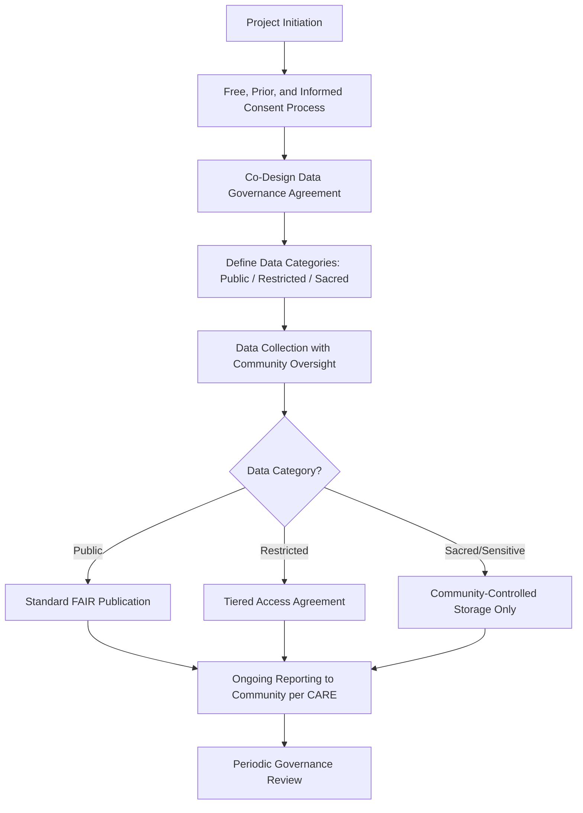

## Data Sovereignty and Indigenous Data Rights

### Definition and Scope

Data sovereignty and Indigenous data rights concern the principle that Indigenous peoples and nations retain authority over the collection, ownership, interpretation, storage, and use of data pertaining to their lands, resources, cultural knowledge, and communities. In geospatial science, this applies directly to spatial datasets — traditional territory boundaries, sacred site locations, traditional ecological knowledge (TEK), resource use patterns, and biodiversity data — collected through remote sensing, GIS surveys, or participatory mapping conducted on or about Indigenous lands.

Data sovereignty is distinct from, but related to, national data sovereignty (the principle that data is subject to the laws of the country in which it is collected); Indigenous data sovereignty asserts a further, nested layer of self-determined authority specific to Indigenous nations and communities, independent of state boundaries.

### Foundational Principles: CARE and FAIR

**Key Points**

- **FAIR principles** (Findable, Accessible, Interoperable, Reusable) were developed primarily for scientific data management and emphasize open, machine-readable data sharing.
- **CARE Principles** (Collective Benefit, Authority to Control, Responsibility, Ethics) were developed by the Global Indigenous Data Alliance specifically to address the gap left by FAIR, which does not address power asymmetries or community consent.
- The two frameworks are complementary, not competing: FAIR governs technical data quality and openness; CARE governs the ethical and political dimensions of who controls and benefits from the data.

| Principle Set | Focus | Key Question |
| --- | --- | --- |
| FAIR | Technical/scientific reusability | Can the data be found and used efficiently? |
| CARE | Ethical/community governance | Who has authority over this data, and who benefits? |

The CARE Principles break down as:

- **Collective Benefit**: Data ecosystems should be designed to enable Indigenous peoples to derive benefit from the data.
- **Authority to Control**: Indigenous peoples' rights to govern the collection, ownership, and application of data about their communities, lands, and resources must be recognized.
- **Responsibility**: Those working with Indigenous data have a responsibility to share how data is used to support Indigenous self-determination.
- **Ethics**: Indigenous peoples' rights and wellbeing should be the primary concern in data governance, throughout the data lifecycle.

### Legal and Policy Instruments

**Key Points**

- **UNDRIP** (UN Declaration on the Rights of Indigenous Peoples, 2007): Establishes rights to self-determination, land, and free, prior and informed consent (FPIC), forming the normative backbone for Indigenous data rights internationally, though it is a declaration rather than a binding treaty.
- **ILO Convention 169**: Binding for ratifying states, establishes consultation obligations for decisions affecting Indigenous lands and resources.
- **National frameworks**: Vary widely — examples include Canada's engagement with First Nations data governance principles (e.g., OCAP: Ownership, Control, Access, Possession, developed by the First Nations Information Governance Centre), Aotearoa/New Zealand's Māori data sovereignty (Te Mana Raraunga network), and Australia's Indigenous Data Sovereignty frameworks led by the Maiam nayri Wingara collective.
- [Unverified] The specific legal enforceability of these frameworks (declaration vs. binding statute vs. institutional policy) varies substantially by country and should be confirmed against current national law for any applied project.

### OCAP Principles (Canada-Specific Example)

**Key Points**

- **Ownership**: The community or group owns information collectively, in the same way an individual owns their personal information.
- **Control**: Indigenous peoples, communities, and their representative bodies have the right to control the research and information management processes that pertain to them.
- **Access**: Indigenous peoples must have access to information and data about themselves, regardless of where it is held.
- **Possession**: Physical control of data as a mechanism to protect Ownership — data should be stored/held in a way that enables the community to enforce its rights.

### Geospatial-Specific Applications

**Key Points**

- **Traditional territory mapping**: Boundaries of traditional or ancestral lands often do not align with colonial administrative or cadastral boundaries; GIS projects must avoid imposing external classification schemes onto Indigenous spatial concepts.
- **Sacred and sensitive site protection**: Precise coordinates of sacred sites, burial grounds, or culturally sensitive resource locations are frequently withheld, generalized, or encrypted in public-facing datasets, even when collected as part of a broader project (e.g., biodiversity survey).
- **Traditional Ecological Knowledge (TEK) integration**: Spatial representation of TEK (seasonal resource cycles, species behavior knowledge) requires governance agreements distinct from standard scientific metadata licensing, since TEK is often held collectively and may include restricted or ceremonial knowledge not intended for general publication.
- **Biodiversity and conservation data**: International frameworks like the Convention on Biological Diversity (CBD) and Nagoya Protocol on Access and Benefit-Sharing intersect with Indigenous data rights when genetic/biodiversity data is geographically linked to Indigenous-held lands.

### Standard Data Governance Workflow

### Worked Example: Community-Led Biodiversity Mapping Project

**Example**

A research institution partners with an Indigenous nation to map culturally significant plant species distribution using drone-based remote sensing and community field surveys.

1. Initiate FPIC process before any data collection begins, including a formal agreement on data ownership, storage location, and publication rights — not merely a one-time consent form.
2. Co-develop a data classification scheme with community representatives: (a) general vegetation health indices — publishable openly; (b) specific plant population locations — restricted to co-management agencies; (c) locations tied to ceremonial or medicinal use — held exclusively under community control, never entered into the shared GIS database at full precision.
3. Apply spatial generalization for restricted-category data before any external reporting (e.g., presence within a 5 km grid cell rather than exact coordinates), analogous to geomasking techniques used for privacy protection.
4. Store sacred-category data on infrastructure under direct community control (community-owned server or offline archive), separate from the research institution's standard data repository.
5. Establish a data-sharing agreement specifying that any secondary use or publication requires renewed community authorization, consistent with OCAP's ownership and control principles.
6. Provide the community with the full, unrestricted dataset and analysis outputs, fulfilling the Responsibility and Collective Benefit elements of CARE, independent of what subset becomes public.

[Inference] Long-term success of such agreements likely depends more on sustained institutional relationship management than on the initial legal agreement alone, since governance needs (e.g., new use cases, staff turnover) tend to evolve over a multi-year project.

### Illustrative Diagram: CARE vs. FAIR Relationship

<svg xmlns="http://www.w3.org/2000/svg" viewBox="0 0 640 320" font-family="sans-serif">
<text x="320" y="20" text-anchor="middle" font-size="14" font-weight="bold">CARE and FAIR as Complementary Frameworks (svg_diagram)</text>
<circle cx="240" cy="180" r="110" fill="#dbeafe" fill-opacity="0.6" stroke="#1d4ed8" />
<circle cx="400" cy="180" r="110" fill="#fee2e2" fill-opacity="0.6" stroke="#b91c1c" />

<text x="170" y="140" font-size="12" font-weight="bold">FAIR</text>

<text x="150" y="160" font-size="10">Findable</text>

<text x="150" y="175" font-size="10">Accessible</text>

<text x="150" y="190" font-size="10">Interoperable</text>

<text x="150" y="205" font-size="10">Reusable</text>

<text x="440" y="140" font-size="12" font-weight="bold">CARE</text>

<text x="430" y="160" font-size="10">Collective Benefit</text>

<text x="430" y="175" font-size="10">Authority to Control</text>

<text x="430" y="190" font-size="10">Responsibility</text>

<text x="430" y="205" font-size="10">Ethics</text>

<text x="320" y="185" font-size="9" text-anchor="middle" width="80">Governed,</text>

<text x="320" y="198" font-size="9" text-anchor="middle">Ethical,</text>

<text x="320" y="211" font-size="9" text-anchor="middle">Reusable Data</text>

</svg>

### Common Pitfalls

**Key Points**

- Treating a single upfront consent form as equivalent to an ongoing FPIC relationship, rather than establishing renewable, revisitable governance agreements.
- Publishing precise coordinates for sacred or sensitive sites under a general "open science" or "open data" mandate without a separate sensitivity review.
- Applying standard academic data-sharing licenses (e.g., CC-BY) to Indigenous-held spatial knowledge without community authorization, effectively removing community control once published.
- Assuming CARE and FAIR are in conflict rather than designing systems that satisfy both simultaneously (e.g., publishing generalized/aggregated data openly while restricting granular data).
- Failing to distinguish between national data sovereignty requirements (e.g., data residency laws) and the distinct, additional layer of Indigenous data sovereignty, treating compliance with one as sufficient for the other.

### Software and Tooling

**Key Points**

- **Access-controlled GIS platforms**: ArcGIS Enterprise with role-based access control, community-hosted QGIS Server instances, or offline-first tools (QField, Mergin Maps) for community-controlled field data collection.
- **Data governance documentation**: Local Contexts' TK (Traditional Knowledge) and BC (Biocultural) Labels, which are metadata tags that can be attached to digital spatial/cultural datasets to signal usage restrictions and provenance.
- **Spatial generalization tools**: Standard GIS buffering/aggregation functions (QGIS, ArcGIS) adapted for sensitive-site coordinate generalization, following the same techniques used in privacy geomasking.
- **Governance frameworks for reference**: Global Indigenous Data Alliance (GIDA) CARE Principles documentation, First Nations Information Governance Centre (FNIGC) OCAP resources.

### Related Topics

- CARE and FAIR data principles in scientific data management
- Free, Prior, and Informed Consent (FPIC) in resource governance
- Privacy considerations and geomasking techniques in geospatial data
- Traditional Ecological Knowledge (TEK) integration in environmental science
- Stakeholder engagement in environmental decisions
- Nagoya Protocol and access/benefit-sharing for biodiversity data
- Local Contexts TK/BC Labels for cultural data metadata
- Participatory GIS (PGIS) and community-led mapping methodologies