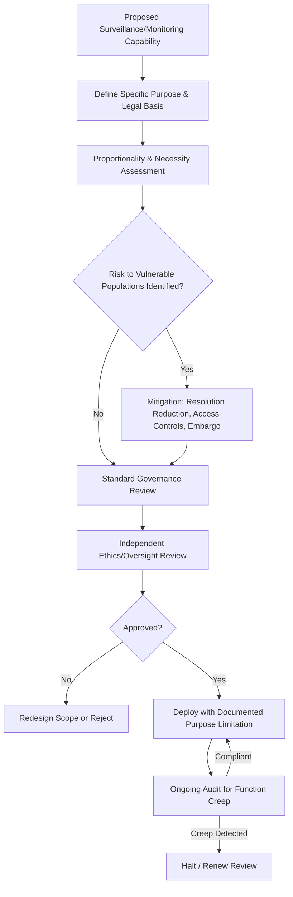

## Ethical Use of Location and Surveillance Data

### Definition and Scope

Ethical use of location and surveillance data concerns the normative principles and governance practices guiding how spatially and temporally resolved data about individuals, groups, or activities is collected, analyzed, shared, and acted upon — particularly when derived from satellite imagery, aerial/drone surveillance, mobile device tracking, CCTV, automated license plate readers (ALPR), or IoT sensor networks. This extends beyond legal compliance (addressed under privacy law) into questions of proportionality, power asymmetry, dual-use risk, and downstream harm, especially where geospatial technology is applied to law enforcement, border control, environmental compliance monitoring, or conflict-affected areas.

### Core Ethical Frameworks

**Key Points**

- **Proportionality**: Surveillance intensity and spatial/temporal resolution should be proportionate to the specific, documented purpose — not maximized by default because the technical capability exists.
- **Necessity**: Data collection should be limited to what is strictly necessary to achieve a legitimate, clearly articulated objective, avoiding speculative or open-ended data hoarding.
- **Purpose limitation and function creep resistance**: Data collected for one stated purpose (e.g., agricultural monitoring) should not be silently repurposed for another (e.g., immigration enforcement) without renewed ethical and legal review.
- **Transparency and accountability**: Affected populations and oversight bodies should have visibility into what surveillance capabilities exist, who operates them, and under what authority.
- **Dual-use awareness**: Geospatial tools developed for benign purposes (disaster response, conservation) can be repurposed for surveillance or targeting; ethical review should anticipate foreseeable misuse.

### Domains of Application and Risk

| Domain | Example Use | Key Ethical Tension |
| --- | --- | --- |
| Environmental compliance | Satellite detection of illegal logging/fishing | Legitimate enforcement vs. surveillance of subsistence users |
| Humanitarian response | Refugee camp mapping via satellite/drone | Aid coordination vs. exposing vulnerable populations to hostile actors |
| Law enforcement | ALPR networks, predictive policing hotspot maps | Public safety vs. disproportionate surveillance of specific communities |
| Conservation | Anti-poaching drone/camera-trap networks | Wildlife protection vs. surveillance of Indigenous/local land users |
| Border security | Satellite and drone monitoring of border regions | State security vs. human rights of migrants |
| Urban planning | Mobile mobility data for transit planning | Service optimization vs. individual movement profiling |

### The Humanitarian Case: Refugee and Conflict-Zone Mapping

**Key Points**

- High-resolution satellite imagery and mapping of refugee camps or conflict-affected populations can support aid delivery but simultaneously creates a targetable dataset if it falls into the hands of hostile state or non-state actors.
- The "Do No Harm" principle, established in humanitarian ethics, requires assessing whether the existence of a detailed spatial dataset could increase risk to the mapped population, independent of the mapper's own intent.
- Precision reduction (deliberately generalizing camp boundaries or population density figures in public releases) is a common mitigation, paralleling geomasking techniques used in privacy protection.
- [Inference] The risk calculus for publishing precise humanitarian location data likely differs substantially by conflict context and the specific threat actors present, meaning a policy appropriate in one crisis may not transfer safely to another.

### Standard Ethical Review Workflow

### Worked Example: Satellite-Based Illegal Fishing Detection

**Example**

An NGO develops a satellite-and-AIS (Automatic Identification System) data pipeline to detect illegal, unreported, and unregulated (IUU) fishing vessels for referral to enforcement agencies.

1. Define purpose narrowly: detection of vessels operating in protected marine areas without valid permits, not general maritime activity profiling.
2. Assess proportionality: cross-reference detected vessel positions only against known protected area boundaries and permit registries, rather than logging comprehensive movement histories of all vessels in the region.
3. Identify vulnerable-user risk: small-scale subsistence fishers using AIS-equivalent tracking may be swept into the same detection pipeline as industrial IUU operators; design classification rules (vessel size, gear type inference from SAR imagery) to reduce false positives against subsistence fishers.
4. Establish data-sharing tiers: full-resolution vessel tracks shared only with mandated enforcement agencies under a data use agreement; aggregated/statistical summaries (e.g., "estimated IUU activity increased 12% in Zone 3") published publicly.
5. Build an audit log documenting each referral decision and its outcome, enabling later review of whether enforcement actions were proportionate to detected violations.
6. Periodically review whether the tool's scope has expanded beyond its original purpose (e.g., requests to use the same pipeline for unrelated maritime security tasks), applying a formal function-creep check.

[Inference] The long-term legitimacy of such a system likely depends heavily on whether affected fishing communities perceive the enforcement process as fair, which is not fully determined by the technical accuracy of the detection algorithm alone.

### Illustrative Diagram: Ethical Risk Escalation by Resolution and Population Vulnerability

<svg xmlns="http://www.w3.org/2000/svg" viewBox="0 0 620 340" font-family="sans-serif">
<text x="310" y="20" text-anchor="middle" font-size="14" font-weight="bold">Surveillance Risk by Resolution and Population Vulnerability (svg_diagram)</text>
<line x1="80" y1="290" x2="80" y2="50" stroke="black" />
<line x1="80" y1="290" x2="560" y2="290" stroke="black" />
<text x="320" y="315" text-anchor="middle" font-size="11">Spatial/Temporal Resolution</text>
<text x="30" y="170" font-size="11" transform="rotate(-90 30 170)">Population Vulnerability</text>
<rect x="80" y="50" width="240" height="120" fill="#dcfce7" fill-opacity="0.5" />
<rect x="320" y="50" width="240" height="120" fill="#fef9c3" fill-opacity="0.5" />
<rect x="80" y="170" width="240" height="120" fill="#fef9c3" fill-opacity="0.5" />
<rect x="320" y="170" width="240" height="120" fill="#fee2e2" fill-opacity="0.5" />

<text x="140" y="110" font-size="10">Low risk</text>

<text x="380" y="110" font-size="10">Moderate risk</text>

<text x="140" y="230" font-size="10">Moderate risk</text>

<text x="380" y="230" font-size="10">High risk</text>

<text x="400" y="250" font-size="9" font-style="italic">(e.g., refugee camp</text>

<text x="400" y="262" font-size="9" font-style="italic">high-res imagery)</text>

</svg>

### Governance and Oversight Mechanisms

**Key Points**

- **Institutional review**: Ethics review boards (analogous to human-subjects IRBs) adapted for geospatial/surveillance projects, assessing proportionality and vulnerable-population risk before deployment.
- **Algorithmic and data audits**: Periodic independent review of who is accessing surveillance datasets and for what stated purpose, to detect unauthorized function creep.
- **Sunset clauses and data retention limits**: Time-bound authorization for surveillance data collection and mandatory deletion schedules, rather than indefinite retention.
- **Impact assessments**: Human Rights Impact Assessments (HRIA) or equivalent, applied specifically to geospatial surveillance deployments, distinct from but complementary to Data Protection Impact Assessments.
- **Community and stakeholder input**: Where feasible, engaging affected populations in defining acceptable use boundaries, consistent with participatory governance principles used in stakeholder engagement processes generally.

### Common Pitfalls

**Key Points**

- Justifying surveillance data collection by technical feasibility ("we can capture this resolution") rather than a documented, proportionate need.
- Publishing high-resolution spatial data about vulnerable populations (refugees, subsistence resource users, protected witnesses) without a "Do No Harm" risk assessment specific to the local threat context.
- Allowing silent function creep, where a system's actual use diverges from its originally approved purpose without renewed ethical review.
- Conflating legal compliance with ethical adequacy — a surveillance practice can be lawful in a given jurisdiction while still raising proportionality or fairness concerns.
- Failing to disaggregate risk by population vulnerability, applying a single governance standard regardless of whether the monitored population is, for example, a well-resourced industrial actor or a subsistence community.

### Software and Tooling

**Key Points**

- **Access control and audit logging**: Role-based access control (RBAC) systems integrated into GIS platforms (ArcGIS Enterprise, PostGIS with row-level security) to enforce tiered data access and maintain audit trails.
- **Resolution/precision reduction**: Standard GIS generalization and buffering tools (QGIS, GDAL) applied deliberately to reduce identifiability in public releases, following the same technical approach as privacy geomasking.
- **Ethics/impact assessment frameworks**: Human Rights Impact Assessment (HRIA) methodologies, humanitarian sector "Do No Harm" guidance (e.g., from ICRC and OCHA-affiliated bodies), for structuring formal review.
- **Governance reference standards**: Responsible Data principles from the humanitarian and development data community, addressing similar proportionality and harm-avoidance questions specific to crisis and conflict settings.

### Related Topics

- Privacy considerations and geomasking techniques in geospatial data
- Data sovereignty and Indigenous data rights
- Stakeholder engagement in environmental decisions
- Remote sensing for regulatory compliance monitoring
- Humanitarian "Do No Harm" principles in crisis mapping
- Algorithmic bias and fairness in predictive spatial models
- Dual-use technology risk assessment in geospatial systems
- Human Rights Impact Assessment (HRIA) methodology