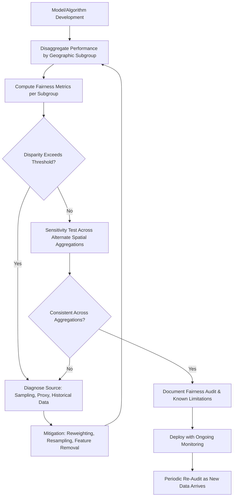

## Bias and Equity in Spatial Algorithms

### Definition and Scope

Bias and equity in spatial algorithms addresses how geospatial models, classifiers, and predictive systems can systematically produce inaccurate, unfair, or disproportionately harmful outcomes for specific geographic areas or demographic groups. Unlike generic algorithmic bias, spatial bias is compounded by the inherent structure of geographic data — spatial autocorrelation, uneven sampling density, historical redlining and segregation embedded in administrative boundaries, and the modifiable areal unit problem (MAUP) — all of which can encode and amplify existing socioeconomic and racial disparities into ostensibly "neutral" spatial models.

### Sources of Spatial Bias

**Key Points**

- **Training data sampling bias**: Remote sensing ground-truth points and validation datasets are often collected disproportionately in accessible, wealthier, or already well-studied areas, producing lower model accuracy in underrepresented regions (e.g., informal settlements, rural low-income areas).
- **Historical data embedding**: Administrative boundaries (redlining maps, zoning districts) used as model inputs or training labels can encode historically discriminatory policy directly into model outputs, even without any explicit demographic variable in the model.
- **Sensor and infrastructure bias**: Air quality, traffic, or environmental sensor networks are frequently sparser in low-income or historically marginalized neighborhoods, causing models trained on that data to underestimate exposure or risk in exactly the areas most affected.
- **Spatial resolution mismatch**: Satellite imagery resolution and revisit frequency can differ systematically by region (due to commercial tasking priorities or cloud cover patterns), producing uneven data quality that correlates with regional wealth or geopolitical priority.
- **Proxy variables**: Even when protected attributes (race, income) are excluded from a model, spatial location itself often functions as a strong proxy for those attributes due to historical residential segregation.

### The Modifiable Areal Unit Problem (MAUP) as an Equity Issue

**Key Points**

- MAUP describes how statistical results change depending on the scale (zoning problem) or configuration (aggregation problem) of the spatial units used, even when the underlying data is identical.
- In equity analysis, this means a disparity index computed at the census tract level can show a different (sometimes opposite) conclusion than the same analysis computed at the block group or ZIP code level.
- Administrative boundary choices are not neutral: they can be gerrymandered, historically drawn along discriminatory lines, or simply too coarse to detect intra-district disparities affecting a minority population clustered within a larger, more affluent unit.
- [Inference] Because MAUP effects can shift a disparity finding either toward or away from statistical significance, equity analyses relying on a single aggregation scale without sensitivity testing across multiple unit definitions may understate or overstate a genuine disparity.

### Domains Where Spatial Algorithmic Bias Is Well-Documented

| Domain | Mechanism of Bias | Consequence |
| --- | --- | --- |
| Predictive policing | Historical arrest data (reflecting biased enforcement patterns) used to predict future "hotspots" | Feedback loop reinforcing over-policing of the same neighborhoods |
| Flood/disaster risk models | Elevation and infrastructure data denser in wealthier areas | Underestimated risk scoring in underserved, poorly mapped areas |
| Credit/insurance geographic scoring | Historical redlining boundaries correlated with modern risk models | Perpetuation of discriminatory lending/insurance patterns |
| Environmental exposure modeling | Sparse monitoring station placement in low-income areas | Undercounted pollution exposure in the most affected communities |
| Land value/property assessment models | Historical sale price data reflecting past discriminatory appraisal practices | Systematic under- or over-valuation along historical redlining lines |

[Unverified] The magnitude of bias documented in any specific deployed system (e.g., a named predictive policing product) varies by implementation and dataset, and should be evaluated against the specific published audit or study rather than generalized across all systems in a category.

### Standard Bias Auditing Workflow

### Fairness Metrics Adapted for Spatial Context

**Key Points**

- **Spatial disparity ratio**: Ratio of model error rate (or predicted outcome) between a target subgroup's geographic areas and the overall population's areas.
- **Geographically weighted accuracy assessment**: Extending standard classification accuracy metrics (e.g., producer's/user's accuracy in remote sensing) with a geographically weighted regression (GWR) framework to detect where accuracy degrades spatially rather than reporting a single global accuracy figure.
- **Demographic parity across aggregation units**: Testing whether a binary outcome (e.g., "high risk" classification) is distributed proportionately across demographic groups at multiple spatial aggregation scales, directly addressing MAUP sensitivity.

A basic spatial disparity ratio can be expressed as:

$$SDR = \frac{\text{Error rate in subgroup areas}}{\text{Error rate in reference population areas}}$$

Values substantially different from 1 indicate potential differential performance requiring investigation.

### Worked Example: Auditing a Flood Risk Model

**Example**

A municipal flood risk model, built using LiDAR elevation data and historical claims data, is suspected of underestimating risk in a lower-income district with sparser data coverage.

1. Disaggregate model validation accuracy by neighborhood, comparing predicted vs. observed flood extent for both a well-mapped affluent district and the lower-income district in question.
2. Confirm whether LiDAR point density and historical insurance claims records (a proxy for reported/documented flooding) are systematically sparser in the lower-income district — a common pattern where underinsured populations underreport claims, biasing the training label itself.
3. Compute the spatial disparity ratio between the two districts' false-negative rates (actual floods the model failed to predict).
4. If disparity exceeds an agreed threshold, apply mitigation: supplement sparse LiDAR coverage with satellite-derived elevation proxies, or reweight training data to counteract underreporting bias rather than simply dropping the district's earthbound claims data as "unreliable."
5. Re-test the disparity ratio after mitigation, and additionally test whether the finding holds when aggregated at both census tract and block group levels to rule out a MAUP artifact.
6. Publish an audit report disclosing the residual disparity, the mitigation applied, and known remaining limitations, rather than presenting a single global accuracy statistic.

[Inference] Underreporting of historical flood claims in underinsured areas is a plausible and commonly cited mechanism for this kind of bias, but confirming it as the actual cause in a specific dataset requires direct investigation of that dataset's claims reporting patterns rather than assuming the general pattern applies.

### Illustrative Diagram: Bias Amplification Feedback Loop

<svg xmlns="http://www.w3.org/2000/svg" viewBox="0 0 640 360" font-family="sans-serif">
<text x="320" y="20" text-anchor="middle" font-size="14" font-weight="bold">Spatial Bias Feedback Loop (svg_diagram)</text>
<rect x="40" y="60" width="160" height="55" rx="6" fill="#fee2e2" stroke="#b91c1c" />
<text x="120" y="90" text-anchor="middle" font-size="10">Historical Disparity</text>
<text x="120" y="103" text-anchor="middle" font-size="10">(e.g., redlining, under-sensing)</text>
<rect x="240" y="60" width="160" height="55" rx="6" fill="#fef9c3" stroke="#a16207" />
<text x="320" y="90" text-anchor="middle" font-size="10">Biased Training Data</text>
<text x="320" y="103" text-anchor="middle" font-size="10">/ Sparse Ground Truth</text>
<rect x="440" y="60" width="160" height="55" rx="6" fill="#dbeafe" stroke="#1d4ed8" />
<text x="520" y="90" text-anchor="middle" font-size="10">Model Trained</text>
<text x="520" y="103" text-anchor="middle" font-size="10">on Skewed Data</text>
<rect x="240" y="220" width="160" height="55" rx="6" fill="#dcfce7" stroke="#15803d" />
<text x="320" y="250" text-anchor="middle" font-size="10">Disparate Outcome</text>
<text x="320" y="263" text-anchor="middle" font-size="10">(e.g., under-predicted risk)</text>
<line x1="200" y1="87" x2="240" y2="87" stroke="black" marker-end="url(#a2)" />
<line x1="400" y1="87" x2="440" y2="87" stroke="black" marker-end="url(#a2)" />
<line x1="520" y1="115" x2="320" y2="220" stroke="black" marker-end="url(#a2)" />
<line x1="240" y1="247" x2="150" y2="115" stroke="black" stroke-dasharray="4,2" marker-end="url(#a2)" />
<text x="60" y="180" font-size="9" font-style="italic">Reinforces</text>
</svg>

### Mitigation Strategies

**Key Points**

- **Stratified/geographically balanced sampling**: Deliberately oversampling underrepresented areas during data collection or validation to correct for infrastructure-driven sampling gaps.
- **Reweighting and resampling**: Adjusting training loss functions or resampling underrepresented spatial strata to reduce differential performance, analogous to class-imbalance correction techniques in general machine learning.
- **Removing or auditing proxy variables**: Testing whether spatial location variables are functioning as unacknowledged proxies for protected attributes, and applying fairness constraints accordingly.
- **Multi-scale sensitivity testing**: Routinely re-running equity analyses at multiple spatial aggregation levels to detect MAUP-driven artifacts before publishing a disparity finding.
- **Participatory validation**: Involving affected communities in reviewing model outputs and flagging implausible or harmful predictions, complementing purely statistical fairness audits.

### Common Pitfalls

**Key Points**

- Reporting a single global accuracy or error metric without disaggregating by geography, masking substantial subgroup disparities.
- Treating "we removed race/income as a variable" as sufficient fairness mitigation, while ignoring that location itself often encodes the same information via historical segregation patterns.
- Using historical enforcement, claims, or sale-price data as ground truth without accounting for known biases in how that historical data was generated (e.g., biased policing, underreporting, discriminatory appraisal).
- Testing equity findings at only one spatial aggregation scale, risking a MAUP-driven false negative or false positive on a genuine disparity.
- Deploying a spatial model without an ongoing monitoring plan, allowing a bias identified at launch to silently re-emerge as new, similarly skewed data accumulates.

### Software and Tooling

**Key Points**

- **Fairness auditing libraries**: Fairlearn, AIF360 (AI Fairness 360), adaptable to spatial subgroup analysis by treating geographic units as the protected-group variable.
- **Spatial statistics for bias diagnosis**: PySAL, R's `spdep` and `GWmodel` packages for geographically weighted regression and local disparity diagnostics.
- **Multi-scale sensitivity testing**: Custom aggregation scripts in GeoPandas/R `sf` to re-run analyses across census block group, tract, and county levels.
- **Documentation standards**: Model cards and datasheets for datasets, extended with a geographic disaggregation section, to standardize disclosure of known spatial performance gaps.

### Related Topics

- Environmental justice mapping and exposure modeling
- Modifiable Areal Unit Problem (MAUP) in spatial statistics
- Policy analysis using geospatial evidence
- Privacy considerations in geospatial data
- Ethical use of location and surveillance data
- Geographically weighted regression (GWR) methodology
- Historical redlining and its persistence in modern spatial datasets
- Algorithmic fairness metrics adapted from non-spatial machine learning