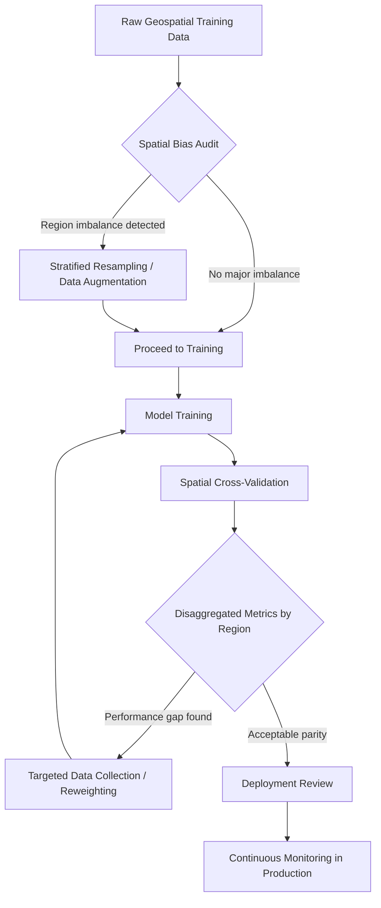
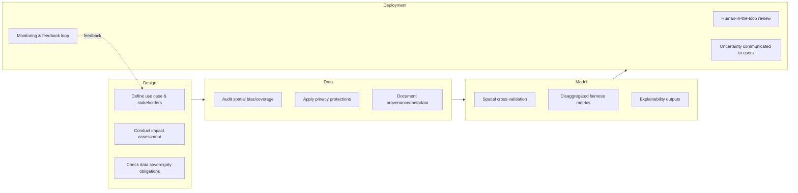

## Responsible AI Use in Geospatial Applications

### Overview

Responsible AI (RAI) in geospatial applications refers to the frameworks, technical practices, and governance structures that ensure machine learning and AI systems operating on location data are fair, transparent, accountable, privacy-preserving, and environmentally sound. Geospatial data introduces unique risks not present in generic AI/ML contexts: location is inherently identifying, spatial data encodes historical and systemic inequities (e.g., redlining patterns embedded in land-use datasets), and geospatial AI outputs (flood maps, crop yield predictions, surveillance analytics) often drive high-stakes decisions affecting entire populations or ecosystems.

### Why Geospatial AI Requires Distinct Ethical Treatment

**Key Points**

- **Re-identification risk**: Even "anonymized" location traces can re-identify individuals with high accuracy using as few as 4 spatiotemporal points [Inference — based on widely cited mobility-privacy literature such as de Montjoye et al., though exact re-identification rates are dataset- and model-dependent].
- **Spatial autocorrelation and bias propagation**: Nearby locations tend to share similar attribute values (Tobler's First Law of Geography), which means biased training data doesn't just affect a point—it propagates through spatially correlated neighborhoods, amplifying disparities across entire regions.
- **Dual-use concerns**: Object detection models trained for disaster response (e.g., identifying damaged buildings) can be repurposed for military targeting or mass surveillance with minimal modification.
- **Ecological stakes**: Errors in AI-driven land-cover classification or species-distribution models can misdirect conservation funding or mask illegal deforestation.
- **Data sovereignty**: Indigenous and local communities often have ancestral or customary claims to land data that conventional data-governance frameworks do not recognize.

### Core Pillars of Responsible Geospatial AI

#### 1. Fairness and Bias Mitigation

Geospatial ML models frequently inherit bias from historically skewed data collection (e.g., satellite imagery training sets overrepresenting wealthy, well-mapped regions of the Global North).

**Example**

A building-footprint detection model trained primarily on North American and European high-resolution imagery underperforms in informal settlements in sub-Saharan Africa or South Asia, where building materials, density, and shapes differ substantially—leading to systematic undercounting of population and infrastructure in those regions.

Mitigation strategies:

- **Stratified spatial sampling**: Ensure training data proportionally represents diverse biomes, urban morphologies, and socioeconomic contexts rather than being convenience-sampled from data-rich regions.
- **Spatial cross-validation**: Standard random k-fold cross-validation leaks information due to spatial autocorrelation, producing overly optimistic accuracy metrics. Spatial blocking (holding out entire geographic blocks) gives a more honest generalization estimate.
- **Fairness metrics adapted for space**: Disaggregate performance metrics (precision, recall, IoU) by administrative region, land-cover type, or demographic strata rather than reporting a single global accuracy figure.

#### 2. Privacy and Location Data Protection

Location data is classified as sensitive personal data under regulations such as the EU General Data Protection Regulation (GDPR) and the California Consumer Privacy Act (CCPA), because it can reveal home addresses, religious affiliations (via places of worship visited), health status (via clinic visits), and more.

**Key Points**

- **k-anonymity for trajectories**: Ensuring each released trajectory is indistinguishable from at least $k-1$ others within a spatial-temporal grid.
- **Differential privacy (DP)**: Adding calibrated statistical noise so that the presence or absence of any single individual's data does not significantly change aggregate query results. Formally, a mechanism $M$ satisfies $\epsilon$-differential privacy if for neighboring datasets $D_1$ and $D_2$:

$$P[M(D_1) \in S] \leq e^{\epsilon} \cdot P[M(D_2) \in S]$$

- **Geomasking**: Techniques such as random perturbation, aggregation to coarser administrative units, or donut geomasking (displacing points within an annulus to avoid revealing exact residence) are used before public release of sensitive point data (e.g., disease case locations).
- **Federated learning for geospatial AI**: Training models across distributed data silos (e.g., multiple national mapping agencies) without centralizing raw imagery or location logs, transmitting only model gradients.

#### 3. Transparency and Explainability

**Example**

A wildfire risk model that outputs a binary "high risk" flag for a property without explanation prevents homeowners, insurers, and regulators from understanding—or contesting—the basis of the classification. Techniques such as SHAP (SHapley Additive exPlanations) or spatially-aware saliency maps can attribute the prediction to contributing factors (vegetation density, slope, historical fire frequency, proximity to power lines), improving accountability.

Transparency practices specific to geospatial AI:

- **Model cards and datasheets for spatial datasets**: Documenting spatial resolution, coordinate reference system (CRS), temporal coverage, sensor provenance, and known coverage gaps.
- **Uncertainty visualization**: Presenting confidence intervals or probability surfaces (not just point predictions) is especially critical in geospatial contexts, since a single misclassified pixel can represent a real building, farm plot, or habitat patch.

#### 4. Accountability and Governance Structures

- **Human-in-the-loop (HITL) review**: For high-stakes applications (disaster response resource allocation, land-tenure disputes, predictive policing hotspot maps), automated outputs should be reviewed by domain experts before action is taken.
- **Impact assessments**: Algorithmic Impact Assessments (AIAs) or Data Protection Impact Assessments (DPIAs), adapted for spatial context, should evaluate downstream effects on specific communities before deployment.
- **Auditable provenance chains**: Maintaining lineage metadata (STAC-compliant catalogs, checksums, processing logs) so any AI-derived map layer can be traced back to its source imagery and processing steps.

#### 5. Environmental and Resource Considerations

Training large geospatial foundation models (e.g., satellite imagery transformers) on petabyte-scale Earth observation archives carries a nontrivial computational carbon footprint [Inference — exact figures depend heavily on hardware, energy grid mix, and training duration, and are typically self-reported by model developers with variable rigor].

Responsible practices:

- Favor fine-tuning pretrained geospatial foundation models (e.g., Prithvi, SatMAE, Clay) over training from scratch.
- Report estimated energy use and carbon emissions alongside model performance benchmarks, following frameworks like the ML CO2 Impact calculator.
- Right-size model architecture to task complexity rather than defaulting to the largest available model.

### Data Sovereignty and Indigenous Data Governance

Frameworks such as the **CARE Principles for Indigenous Data Governance** (Collective Benefit, Authority to Control, Responsibility, Ethics) complement the more data-centric **FAIR Principles** (Findable, Accessible, Interoperable, Reusable) commonly applied to open geospatial data.

| Principle Set | Focus | Example Application |
| --- | --- | --- |
| FAIR | Data usability and interoperability | Publishing a land-cover raster with standardized STAC metadata |
| CARE | Community rights and self-determination | Requiring Indigenous nation consent before releasing traditional territory boundary data |

**Example**

A conservation NGO building a species-distribution model using camera-trap and GPS-collar data from land co-managed by an Indigenous community should establish data-sharing agreements specifying who retains ownership, whether raw coordinates are shared externally, and how model outputs (e.g., poaching-risk hotspots) are communicated back to the community—since publicly releasing precise animal or ranger-patrol locations can itself enable poaching.

### Regulatory and Standards Landscape

- **EU AI Act**: Classifies certain geospatial AI uses (e.g., biometric surveillance via aerial imagery, critical infrastructure risk assessment) as "high-risk," triggering conformity assessment, documentation, and human oversight requirements.
- **OGC (Open Geospatial Consortium) initiatives**: Working groups on AI/ML interoperability standards (e.g., a formal specification for machine-learning-ready STAC extensions) aim to standardize how training data and model outputs are described. [Unverified — specific OGC standard version numbers and finalization status should be checked against current OGC documentation, as these evolve]
- **UN-GGIM (Global Geospatial Information Management)**: Has issued guidance on the ethical and responsible use of geospatial data for sustainable development, emphasizing equitable access and capacity building.

### A Practical Responsible-AI Checklist for Geospatial Projects

### Illustrative Diagram: Responsible AI Risk Surface in Geospatial Pipelines

<svg xmlns="http://www.w3.org/2000/svg" viewBox="0 0 760 420" font-family="Arial, sans-serif">
<text x="380" y="24" text-anchor="middle" font-size="16" font-weight="bold" fill="#1a1a1a">Responsible AI Risk Surface — Geospatial Pipeline (svg_diagram)</text>
<rect x="20" y="60" width="150" height="60" rx="8" fill="#dbeafe" stroke="#1e40af" stroke-width="1.5" />
<text x="95" y="85" text-anchor="middle" font-size="12" fill="#1e3a8a">Data</text>
<text x="95" y="102" text-anchor="middle" font-size="10" fill="#1e3a8a">Acquisition</text>
<rect x="220" y="60" width="150" height="60" rx="8" fill="#dcfce7" stroke="#15803d" stroke-width="1.5" />
<text x="295" y="85" text-anchor="middle" font-size="12" fill="#14532d">Preprocessing</text>
<text x="295" y="102" text-anchor="middle" font-size="10" fill="#14532d">&amp; Labeling</text>
<rect x="420" y="60" width="150" height="60" rx="8" fill="#fef3c7" stroke="#b45309" stroke-width="1.5" />
<text x="495" y="85" text-anchor="middle" font-size="12" fill="#78350f">Model</text>
<text x="495" y="102" text-anchor="middle" font-size="10" fill="#78350f">Training</text>
<rect x="600" y="60" width="140" height="60" rx="8" fill="#fee2e2" stroke="#b91c1c" stroke-width="1.5" />
<text x="670" y="85" text-anchor="middle" font-size="12" fill="#7f1d1d">Deployment</text>
<text x="670" y="102" text-anchor="middle" font-size="10" fill="#7f1d1d">&amp; Decisions</text>
<line x1="170" y1="90" x2="220" y2="90" stroke="#555" stroke-width="1.5" marker-end="url(#arrow)" />
<line x1="370" y1="90" x2="420" y2="90" stroke="#555" stroke-width="1.5" marker-end="url(#arrow)" />
<line x1="570" y1="90" x2="600" y2="90" stroke="#555" stroke-width="1.5" marker-end="url(#arrow)" />
<text x="95" y="160" text-anchor="middle" font-size="10" fill="`#1e3a8a`" font-weight="bold">Risks:</text>

<text x="95" y="176" text-anchor="middle" font-size="9" fill="`#1e3a8a`">Coverage gaps</text>

<text x="95" y="190" text-anchor="middle" font-size="9" fill="`#1e3a8a`">Sensor bias</text>

<text x="295" y="160" text-anchor="middle" font-size="10" fill="`#14532d`" font-weight="bold">Risks:</text>

<text x="295" y="176" text-anchor="middle" font-size="9" fill="`#14532d`">Label noise</text>

<text x="295" y="190" text-anchor="middle" font-size="9" fill="`#14532d`">PII exposure</text>

<text x="495" y="160" text-anchor="middle" font-size="10" fill="`#78350f`" font-weight="bold">Risks:</text>

<text x="495" y="176" text-anchor="middle" font-size="9" fill="`#78350f`">Spatial leakage</text>

<text x="495" y="190" text-anchor="middle" font-size="9" fill="`#78350f`">Overfitting to region</text>

<text x="670" y="160" text-anchor="middle" font-size="10" fill="`#7f1d1d`" font-weight="bold">Risks:</text>

<text x="670" y="176" text-anchor="middle" font-size="9" fill="`#7f1d1d`">Dual-use misuse</text>

<text x="670" y="190" text-anchor="middle" font-size="9" fill="`#7f1d1d`">Automation bias</text>

<rect x="60" y="240" width="640" height="150" rx="10" fill="#f8fafc" stroke="#94a3b8" stroke-width="1.5" stroke-dasharray="4,3" />
<text x="380" y="265" text-anchor="middle" font-size="13" font-weight="bold" fill="#334155">Cross-Cutting Governance Layer</text>
<text x="130" y="295" text-anchor="middle" font-size="10" fill="#334155">Privacy</text>
<text x="130" y="310" text-anchor="middle" font-size="10" fill="#334155">(DP, geomasking)</text>

<text x="280" y="295" text-anchor="middle" font-size="10" fill="`#334155`">Fairness</text>

<text x="280" y="310" text-anchor="middle" font-size="10" fill="`#334155`">(spatial CV, parity)</text>

<text x="430" y="295" text-anchor="middle" font-size="10" fill="`#334155`">Transparency</text>

<text x="430" y="310" text-anchor="middle" font-size="10" fill="`#334155`">(model cards, XAI)</text>

<text x="580" y="295" text-anchor="middle" font-size="10" fill="`#334155`">Sovereignty</text>

<text x="580" y="310" text-anchor="middle" font-size="10" fill="`#334155`">(CARE principles)</text>

<text x="380" y="345" text-anchor="middle" font-size="10" fill="`#334155`">Continuous monitoring · Human-in-the-loop review · Impact assessment · Auditable provenance</text>

<text x="380" y="370" text-anchor="middle" font-size="9" fill="`#64748b`">Applies across every pipeline stage, not as a single checkpoint</text>

</svg>

### Common Pitfalls

- **Treating coarse aggregation as sufficient anonymization**: Aggregating to census-block level can still be reversed with auxiliary datasets in sparsely populated areas.
- **Ignoring temporal bias**: A land-cover classifier trained only on cloud-free, dry-season imagery will systematically misrepresent regions with persistent cloud cover or strong seasonality.
- **Conflating high accuracy with fairness**: A globally high $F_1$ score can mask severe underperformance in specific subregions if metrics aren't spatially disaggregated.
- **Deploying without a feedback/appeal mechanism**: Especially critical for AI used in land-tenure, insurance underwriting, or disaster-aid eligibility determinations, where erroneous classifications have direct material consequences.

### Conclusion

Responsible AI in geospatial applications extends conventional AI ethics (fairness, transparency, accountability, privacy) with domain-specific technical practices—spatial cross-validation, geomasking, spatially disaggregated fairness metrics, and CARE-aligned data sovereignty protocols—because location data is uniquely identifying, spatially correlated, and tied to real-world power structures over land and resources. Effective governance requires embedding these considerations throughout the entire pipeline, from data acquisition through deployment monitoring, rather than treating ethics as a final compliance checkbox.

**Related Topics**

- Differential Privacy Techniques for Location Data
- Spatial Bias Detection and Fairness Metrics in Remote Sensing
- CARE Principles vs. FAIR Principles in Geospatial Data Sharing
- Explainable AI (XAI) for Earth Observation Models
- Geospatial Foundation Models and Their Environmental Footprint
- Algorithmic Impact Assessments for Spatial Decision-Support Systems
- Dual-Use Risk Management in Satellite Imagery Analytics
- Federated Learning Architectures for Cross-Border Earth Observation Data