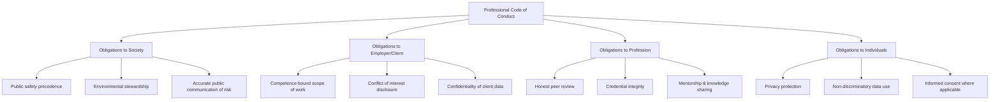

## Professional Codes of Conduct

### Overview

Professional codes of conduct in geospatial science are formalized ethical and technical standards published by professional bodies, certification organizations, and standards institutions to guide the behavior of practitioners—surveyors, GIS analysts, remote sensing scientists, cartographers, and geospatial software engineers. These codes establish obligations around competence, data integrity, client/public welfare, conflicts of interest, and professional accountability, distinguishing licensed/certified professional practice from informal or hobbyist use of geospatial tools.

### Purpose and Function of Codes of Conduct

**Key Points**

- **Public trust**: Geospatial outputs (property boundaries, flood zones, environmental impact assessments) carry legal and safety consequences; codes of conduct exist to protect the public from negligent or fraudulent practice.
- **Self-regulation**: Many geospatial professions are self-regulating, meaning the professional body (not government alone) defines and enforces standards, subject to potential license revocation.
- **Baseline for licensure**: In fields like land surveying, adherence to a code of conduct is often a legal prerequisite for maintaining a professional license, distinct from purely voluntary codes in adjacent fields like GIS analysis.
- **Interoperation with law**: Codes of conduct typically complement (not replace) statutory law, contract law, and data protection regulation—violating a code may trigger professional sanctions even where no law was broken.

### Major Geospatial Professional Bodies and Their Codes

| Organization | Scope | Code/Standard | Enforcement Mechanism |
| --- | --- | --- | --- |
| American Society for Photogrammetry and Remote Sensing (ASPRS) | Photogrammetry, remote sensing, GIS | Code of Ethics | Membership review; reputational |
| Urban and Regional Information Systems Association (URISA) | GIS professionals (GISP certification) | GISCI Code of Ethics | GISP certification revocation |
| International Federation of Surveyors (FIG) | Licensed surveying (global) | FIG Statement of Ethical Principles | Member association enforcement (varies by country) |
| Royal Institution of Chartered Surveyors (RICS) | Land/property surveying (UK/global) | RICS Rules of Conduct | Chartered status revocation, disciplinary panels |
| National Society of Professional Surveyors (NSPS) | Licensed surveying (US) | Code of Ethics | State board coordination |
| GIS Certification Institute (GISCI) | GISP (GIS Professional) certification | Code of Ethics (adapted from URISA) | Certification suspension/revocation |
| International Cartographic Association (ICA) | Cartography | Ethical guidelines on map design/accuracy | Reputational; advisory |
| American Congress on Surveying and Mapping (ACSM, historical/merged) | Surveying/mapping | Predecessor codes now under NSPS/ASPRS | Historical |

[Unverified — organizational names, mergers, and current certification bodies should be cross-checked against each organization's official website, as professional associations periodically restructure or rebrand]

### Core Ethical Principles Common Across Geospatial Codes

Most geospatial professional codes converge on a similar set of principles, structurally comparable to codes in engineering and medicine:

**Example**

The GISCI Code of Ethics (used for GISP certification) organizes obligations into four relationship categories: obligations to *society*, to *employers/clients*, to *colleagues/the profession*, and to *individuals in society*. This structure is a common pattern across geospatial and adjacent engineering codes.

1. **Competence**: Practitioners must only perform work within their demonstrated area of expertise and must maintain current knowledge of methods, software, and legal requirements (continuing education requirements are common for certifications like GISP).
2. **Integrity and honesty in data reporting**: Prohibits falsifying survey measurements, fabricating accuracy statements, or misrepresenting the provenance or currency of geospatial data.
3. **Objectivity and avoiding conflicts of interest**: A surveyor certifying a property boundary must disclose any personal or financial stake in the outcome (e.g., a family relationship with the landowner).
4. **Confidentiality**: Client and public data (especially sensitive location data such as protected species habitats or Indigenous sacred sites) must not be disclosed without authorization.
5. **Public welfare precedence**: Codes typically state that public safety and welfare take precedence over client or employer interests—for example, a surveyor should not certify a flood-zone determination they know to be inaccurate merely because a client requests a favorable result.
6. **Professional accountability**: Practitioners should take responsibility for errors, correct them promptly, and not misrepresent their credentials or the credentials of their work product.

### Codes of Conduct vs. Adjacent Governance Instruments

It is important to distinguish professional codes of conduct from related but distinct instruments:

| Instrument | Nature | Example |
| --- | --- | --- |
| **Professional Code of Conduct** | Behavioral/ethical obligations of the practitioner | GISCI Code of Ethics |
| **Technical Standard** | Prescribes data format, accuracy, or interoperability specification | OGC GeoPackage Encoding Standard |
| **Data Governance Policy** | Organizational rules for data lifecycle management | An agency's open-data publication policy |
| **Law/Regulation** | Statutory requirement with legal force | State licensure statutes for professional land surveyors |
| **Institutional Review Board (IRB) Protocol** | Research ethics oversight, typically for human-subjects data | University IRB approval for a mobility-tracking study |

**Example**

A GIS analyst using drone imagery to map informal settlements might simultaneously need to: (1) follow their employer's data governance policy for storage/retention, (2) comply with national aviation law for drone operation, (3) obtain IRB approval if the work constitutes human-subjects research, and (4) uphold the GISCI Code of Ethics obligation to protect the privacy of settlement residents—these are four distinct, overlapping obligations, not a single unified requirement.

### Case-Based Illustration: Applying Codes in Practice

**Example**

A licensed surveyor is asked by a developer client to adjust a boundary survey slightly in the client's favor to avoid a costly redesign, with the client implying future contracts depend on cooperation. Under codes such as the NSPS Code of Ethics or FIG Statement of Ethical Principles, the surveyor is obligated to:

- Decline the request, since public welfare and factual accuracy take precedence over client relationships.
- Document the original findings and communicate professionally why the adjustment cannot be made.
- Report the incident through appropriate professional or regulatory channels if pressure escalates to coercion.

This scenario illustrates the "public welfare precedence" and "integrity" principles operating together, and reflects the general structure of such codes; specific disciplinary procedures vary by jurisdiction and licensing board. [Inference]

### Enforcement Mechanisms

- **Certification-linked enforcement**: For voluntary certifications (e.g., GISP), violations can result in certification suspension or revocation, but do not necessarily prevent someone from working in GIS without the certification—the leverage is reputational and employer-driven.
- **License-linked enforcement**: For legally licensed professions (e.g., Professional Land Surveyor, PLS), state or national licensing boards can suspend or revoke the legal right to practice, carrying direct legal and financial consequences.
- **Peer complaint processes**: Most bodies provide a formal ethics complaint mechanism, typically involving a review committee, evidence submission, and a right of response before sanctions are applied.
- **Continuing Education (CE) requirements**: Many codes are paired with mandatory CE credits, partly to keep practitioners current on evolving ethical issues (e.g., AI-driven analysis, data privacy law).

### Emerging Additions to Geospatial Codes of Conduct

As geospatial practice increasingly incorporates AI/ML, drone data collection, and large-scale personal mobility datasets, professional bodies have been expanding or reinterpreting codes to address:

- **AI-assisted analysis disclosure**: Emerging expectations that practitioners disclose when a deliverable (e.g., a classified land-cover map) was substantially produced or assisted by machine learning models, rather than presenting it as purely manual expert analysis. [Speculation — while data integrity and honest representation are long-standing code principles, an explicit AI-disclosure clause is not yet universally codified across all major bodies as of this writing and should be checked against current organizational codes]
- **Sensor and drone ethics**: Emerging guidance on proportionality and minimization when using high-resolution drone or satellite sensors near private property or vulnerable populations.
- **Open data stewardship**: Growing expectation that practitioners consider downstream reuse risk before publishing high-resolution geospatial datasets openly, balancing FAIR data principles against privacy and security.

### Illustrative Diagram: Code of Conduct Enforcement Pathway

<svg xmlns="http://www.w3.org/2000/svg" viewBox="0 0 760 340" font-family="Arial, sans-serif">
<text x="380" y="24" text-anchor="middle" font-size="16" font-weight="bold" fill="#1a1a1a">Professional Code of Conduct — Enforcement Pathway (svg_diagram)</text>
<rect x="20" y="60" width="160" height="55" rx="8" fill="#e0e7ff" stroke="#3730a3" stroke-width="1.5" />
<text x="100" y="92" text-anchor="middle" font-size="11" fill="#312e81">Alleged Violation Reported</text>
<rect x="230" y="60" width="160" height="55" rx="8" fill="#fef9c3" stroke="#a16207" stroke-width="1.5" />
<text x="310" y="92" text-anchor="middle" font-size="11" fill="#713f12">Ethics/Review Committee Investigation</text>
<rect x="440" y="60" width="160" height="55" rx="8" fill="#fee2e2" stroke="#b91c1c" stroke-width="1.5" />
<text x="520" y="85" text-anchor="middle" font-size="11" fill="#7f1d1d">Finding &amp; Due</text>
<text x="520" y="100" text-anchor="middle" font-size="11" fill="#7f1d1d">Process Hearing</text>
<rect x="650" y="60" width="90" height="55" rx="8" fill="#dcfce7" stroke="#15803d" stroke-width="1.5" />
<text x="695" y="92" text-anchor="middle" font-size="10" fill="#14532d">Outcome</text>
<line x1="180" y1="87" x2="230" y2="87" stroke="#555" stroke-width="1.5" marker-end="url(#arrow2)" />
<line x1="390" y1="87" x2="440" y2="87" stroke="#555" stroke-width="1.5" marker-end="url(#arrow2)" />
<line x1="600" y1="87" x2="650" y2="87" stroke="#555" stroke-width="1.5" marker-end="url(#arrow2)" />
<rect x="600" y="150" width="140" height="40" rx="6" fill="#f0fdf4" stroke="#15803d" />
<text x="670" y="174" text-anchor="middle" font-size="10" fill="#14532d">No Action / Dismissed</text>
<rect x="600" y="200" width="140" height="40" rx="6" fill="#fffbeb" stroke="#b45309" />
<text x="670" y="224" text-anchor="middle" font-size="10" fill="#78350f">Reprimand / CE Requirement</text>
<rect x="600" y="250" width="140" height="40" rx="6" fill="#fef2f2" stroke="#b91c1c" />
<text x="670" y="274" text-anchor="middle" font-size="10" fill="#7f1d1d">Suspension / Revocation</text>
<line x1="695" y1="115" x2="670" y2="150" stroke="#888" stroke-width="1" stroke-dasharray="3,2" />
<line x1="695" y1="115" x2="670" y2="200" stroke="#888" stroke-width="1" stroke-dasharray="3,2" />
<line x1="695" y1="115" x2="670" y2="250" stroke="#888" stroke-width="1" stroke-dasharray="3,2" />

<text x="380" y="300" text-anchor="middle" font-size="10" fill="`#475569`">Note: Exact stages, terminology, and appeal rights vary by organization and jurisdiction.</text>

</svg>

### Common Pitfalls

- **Assuming certification is legally binding when it is voluntary**: GISP or similar credentials carry professional weight but generally do not confer the same legal authority as a licensed surveying credential (e.g., PLS/PE)—conflating the two can misrepresent a practitioner's legal standing.
- **Treating codes as static**: Codes of ethics are periodically revised; practitioners relying on outdated versions may miss newly codified obligations (e.g., around geospatial AI or drone data).
- **Assuming codes override contractual or legal obligations**: A code of conduct sets a professional floor but does not exempt practitioners from contract law, intellectual property law, or data protection statutes—these operate concurrently.
- **Ignoring jurisdictional variation**: International bodies like FIG provide harmonizing principles, but enforcement and specific rules are typically implemented at the national or state/provincial member-association level, producing meaningful cross-border differences.

### Conclusion

Professional codes of conduct provide the ethical infrastructure underpinning trust in geospatial practice, translating abstract principles—competence, integrity, confidentiality, public welfare—into enforceable professional obligations backed by certification or licensure bodies. While codes share a common structural DNA across organizations (obligations to society, employer, profession, and individuals), practitioners must recognize that codes operate alongside, not instead of, technical standards, organizational data governance policies, and statutory law, and that codes are increasingly being extended to address AI-assisted analysis, drone sensing, and large-scale location data stewardship.

**Related Topics**

- GISP Certification Process and Continuing Education Requirements
- Licensure Requirements for Professional Land Surveyors (PLS)
- OGC Standards vs. Professional Ethical Codes
- Conflict of Interest Management in Geospatial Consulting
- Informed Consent and IRB Protocols for Location-Based Research
- Whistleblower Protections in Professional Engineering and Surveying
- Comparative Analysis: FIG vs. RICS vs. ASPRS Codes of Ethics
- Emerging AI-Disclosure Clauses in Geospatial Professional Standards