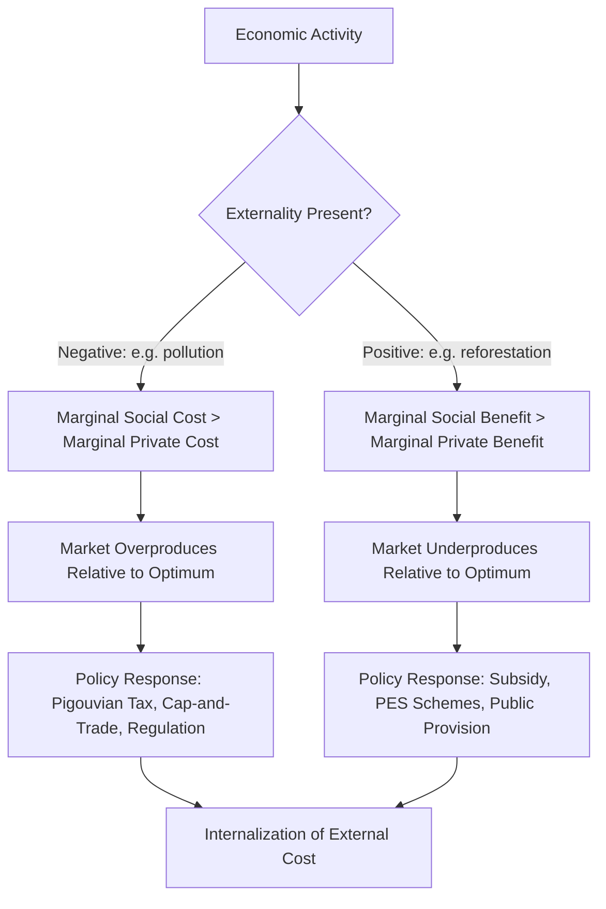
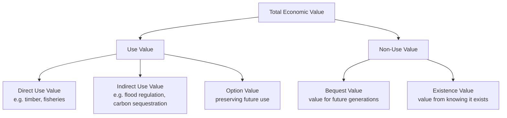

## Principles of Environmental Economics

### Overview

Environmental economics is the branch of economics concerned with the relationship between economic activity and the natural environment—how markets allocate (or fail to allocate) environmental resources, how environmental costs and benefits are valued, and how policy instruments can correct market failures to achieve efficient and sustainable outcomes. It provides the analytical foundation for geospatial applications such as ecosystem service valuation, land-use policy modeling, carbon market mapping, and natural resource management.

### Foundational Concept: Market Failure in Environmental Contexts

**Key Points**

- **Externalities**: Costs or benefits of an economic activity that fall on third parties not involved in the transaction. Pollution is the canonical negative externality; pollinator habitat conservation is a canonical positive externality.
- **Public goods**: Environmental resources (clean air, biodiversity, climate stability) are often *non-excludable* (you cannot prevent someone from benefiting) and *non-rival* (one person's enjoyment doesn't diminish another's), leading markets to systematically undersupply them.
- **Common-pool resources**: Resources that are rival but non-excludable (fisheries, groundwater aquifers, grazing land), which are prone to overexploitation—the "Tragedy of the Commons" problem formalized by Garrett Hardin (1968) and later refined by Elinor Ostrom's work on collective governance institutions.
- **Information asymmetry**: Environmental harms are frequently diffuse, delayed, or scientifically uncertain, making it difficult for market participants to price risk accurately (e.g., groundwater contamination effects that manifest decades later).

### The Externality Problem, Formally

A firm's private cost of production $MPC$ (marginal private cost) excludes the cost imposed on society through pollution, $MEC$ (marginal external cost). The socially optimal output level accounts for the full marginal social cost:

$$MSC = MPC + MEC$$

At the free-market equilibrium, firms produce where $MPC$ equals marginal benefit/price, producing more than the socially efficient quantity $Q^*$—because the external cost is not internalized. The welfare loss from this overproduction is represented graphically as the deadweight loss triangle between the private and social marginal cost curves, bounded by market quantity $Q_m$ and optimal quantity $Q^*$.

### Core Theoretical Frameworks

#### 1. Pigouvian Taxation

Proposed by Arthur Pigou, this approach corrects negative externalities by taxing the activity at a rate equal to the marginal external cost, aligning private incentives with social costs.

**Example**

A carbon tax set at $50 per ton of $CO_2$ emitted forces firms to internalize the social cost of carbon (SCC) directly into production decisions, incentivizing a shift toward lower-emission processes without mandating a specific technology.

#### 2. Coase Theorem

Ronald Coase argued that if property rights are well-defined and transaction costs are negligible, private parties can bargain to an efficient outcome regardless of the initial allocation of rights—internalizing the externality without government intervention.

**Example**

If a downstream fishing community holds a clearly defined right to clean water, an upstream factory polluting the river must either pay the community for the right to pollute or install treatment technology, with the outcome depending on whichever option is cheaper (i.e., the efficient allocation is reached through negotiation, not the initial rights assignment itself). [Inference — this is a stylized illustration of the theorem; the theorem's real-world applicability is limited by transaction costs, incomplete information, and enforcement difficulty, which the theory itself acknowledges as key limiting conditions]

#### 3. Cap-and-Trade (Tradable Permits)

Combines a regulatory cap on total emissions with a market mechanism allowing firms to trade permits, so abatement occurs where it is cheapest (lowest marginal abatement cost), achieving the emissions target at minimum aggregate cost.

| Feature | Pigouvian Tax | Cap-and-Trade |
| --- | --- | --- |
| Price certainty | High (tax rate fixed) | Low (permit price fluctuates with market) |
| Quantity certainty | Low (emissions depend on response to tax) | High (total emissions capped) |
| Administrative complexity | Lower | Higher (requires monitoring, registry, trading infrastructure) |
| Revenue use | Tax revenue to government | Auction revenue (if permits auctioned) or free allocation |
| Geospatial relevance | Emissions inventories by facility/region | Spatial distribution of permit trading, "hotspot" risk of localized pollution concentration |

#### 4. Tragedy of the Commons and Institutional Solutions

**Example**

Overfishing in unregulated open-access fisheries illustrates the tragedy of the commons: each fisher has an individual incentive to maximize catch, but the aggregate effect depletes the stock below sustainable yield. Elinor Ostrom's empirical research (for which she received the 2009 Nobel Memorial Prize in Economic Sciences) identified design principles for successful community-based common-pool resource management, including clearly defined boundaries, monitoring by resource users themselves, and graduated sanctions for rule violations, as alternatives to both pure privatization and top-down state regulation.

### Valuation of Environmental Goods

Because environmental goods often lack market prices, environmental economics has developed specialized valuation methodologies—critical for geospatial cost-benefit analysis and ecosystem service mapping.

**Key Points**

- **Revealed preference methods**: Infer value from observed market behavior.
  - *Hedonic pricing*: Decomposes property values to isolate the implicit price of environmental attributes (e.g., proximity to a park, distance from a landfill), often implemented using spatial hedonic regression models.
  - *Travel cost method*: Estimates recreational site value from the cost (time + money) visitors incur to reach it, commonly paired with GIS-based catchment/distance analysis.
- **Stated preference methods**: Elicit value through surveys.
  - *Contingent valuation*: Directly asks respondents their willingness to pay (WTP) for a hypothetical environmental change.
  - *Choice experiments*: Asks respondents to choose among bundles of environmental attributes at different price points, allowing estimation of marginal values for specific attributes.
- **Benefit transfer**: Applies valuation estimates from existing studies to a new but similar context/site, common in large-scale spatial ecosystem service modeling (e.g., InVEST software) due to the cost of conducting primary valuation studies everywhere.

$$TEV = UV + NUV = (DUV + IUV + OV) + (BV + EV)$$

Where **Total Economic Value (TEV)** decomposes into **Use Value (UV)**—comprising Direct Use Value (DUV, e.g., timber harvesting), Indirect Use Value (IUV, e.g., flood regulation by wetlands), and Option Value (OV, preserving future use options)—and **Non-Use Value (NUV)**, comprising Bequest Value (BV, value of preserving for future generations) and Existence Value (EV, value from simply knowing a resource exists).

### Discounting and Intergenerational Equity

Environmental economics grapples with how to compare present costs against future benefits (or vice versa) using the discount rate $r$:

$$PV = \frac{FV}{(1+r)^t}$$

**Key Points**

- A higher discount rate diminishes the present value of long-term environmental damages (e.g., climate change impacts decades out), which has significant policy implications—the choice of discount rate was a central point of contention in the Stern Review (2006, which used a low discount rate, emphasizing strong near-term climate action) versus critiques by economists such as William Nordhaus (who favored higher, market-based discount rates).
- This tension underlies debates over the **Social Cost of Carbon (SCC)**, a monetized estimate of the marginal damage from one additional ton of $CO_2$ emissions, which varies substantially depending on the discount rate and damage function assumptions used. [Inference — SCC estimates are model-dependent and have varied substantially across different administrations, agencies, and academic studies; specific dollar figures should be verified against current authoritative sources]

### Weak vs. Strong Sustainability

| Concept | Core Premise | Implication |
| --- | --- | --- |
| **Weak sustainability** | Natural capital and manufactured/human capital are substitutable; what matters is maintaining total capital stock | Depleting a forest is acceptable if the proceeds are reinvested in other productive capital |
| **Strong sustainability** | Certain forms of natural capital (critical natural capital) are non-substitutable and must be preserved in physical terms | Wetland loss cannot be fully compensated by financial capital due to unique, non-replicable ecosystem functions |

### Policy Instruments Summary

**Example**

A national government aiming to reduce deforestation might deploy several environmental-economics-informed instruments simultaneously: a **Payment for Ecosystem Services (PES)** program compensating landowners for forest retention (correcting the positive externality of carbon sequestration and biodiversity), a **cap-and-trade** system for large industrial emitters, and **command-and-control regulation** (e.g., protected area designation) for critical habitat where market mechanisms are judged insufficiently reliable.

- **Command-and-control regulation**: Direct legal limits or technology mandates (e.g., emissions standards); administratively simple but often not cost-minimizing across heterogeneous firms.
- **Market-based instruments**: Taxes, cap-and-trade, tradable water rights; generally more cost-effective but require robust monitoring and enforcement infrastructure.
- **Payments for Ecosystem Services (PES)**: Direct payments to resource stewards (e.g., Costa Rica's PES program) to incentivize conservation as an economically competitive land use.
- **Information-based instruments**: Eco-labeling, mandatory disclosure (e.g., environmental impact statements), correcting information asymmetry without direct price intervention.

### Relevance to Geospatial Practice

- **Spatial hedonic pricing models** rely on GIS-derived proximity, viewshed, and land-cover variables as regressors.
- **Ecosystem service mapping tools** (e.g., InVEST, ARIES) integrate biophysical spatial models with economic valuation to produce maps of monetized ecosystem service flows (carbon storage, water yield, pollination) at landscape scale.
- **Cap-and-trade emissions monitoring** increasingly uses satellite-based remote sensing (e.g., methane plume detection) to verify compliance independent of self-reported inventories.
- **PES program targeting** uses spatial optimization to allocate limited conservation payment budgets to parcels with the highest marginal ecosystem service value per dollar spent.

### Common Pitfalls

- **Conflating price with value**: Market price reflects private exchange value, not total economic value—many high-value ecosystem services (pollination, flood regulation) have no direct market price and are systematically underweighted in unadjusted cost-benefit analysis.
- **Ignoring distributional effects**: Aggregate efficiency gains from a policy (e.g., a carbon tax) can mask regressive impacts on low-income populations unless paired with revenue recycling or targeted rebates.
- **Overreliance on benefit transfer without context-matching**: Applying valuation estimates from one ecosystem/region to a biophysically or socioeconomically dissimilar context can produce significant estimation error.
- **Treating the Coase Theorem as broadly applicable**: Its efficiency result depends on low transaction costs and well-defined property rights, conditions frequently absent in large-scale, diffuse environmental problems like climate change.

### Conclusion

Environmental economics provides the theoretical toolkit—externality correction, valuation methodology, discounting frameworks, and sustainability criteria—for translating environmental costs and benefits into decision-relevant terms. These principles directly underpin geospatial applications ranging from ecosystem service mapping to emissions trading verification, making fluency in concepts like Pigouvian taxation, total economic value decomposition, and weak/strong sustainability essential for geospatial professionals working in environmental policy, conservation planning, and natural resource management.

**Related Topics**

- Ecosystem Service Valuation and Mapping (InVEST, ARIES)
- Spatial Hedonic Pricing Models in GIS
- Carbon Markets and Satellite-Based Emissions Verification
- Payments for Ecosystem Services (PES) Program Design
- Social Cost of Carbon: Methodology and Controversy
- Common-Pool Resource Governance (Ostrom's Design Principles)
- Cost-Benefit Analysis for Land-Use Policy
- Weak vs. Strong Sustainability in Natural Capital Accounting