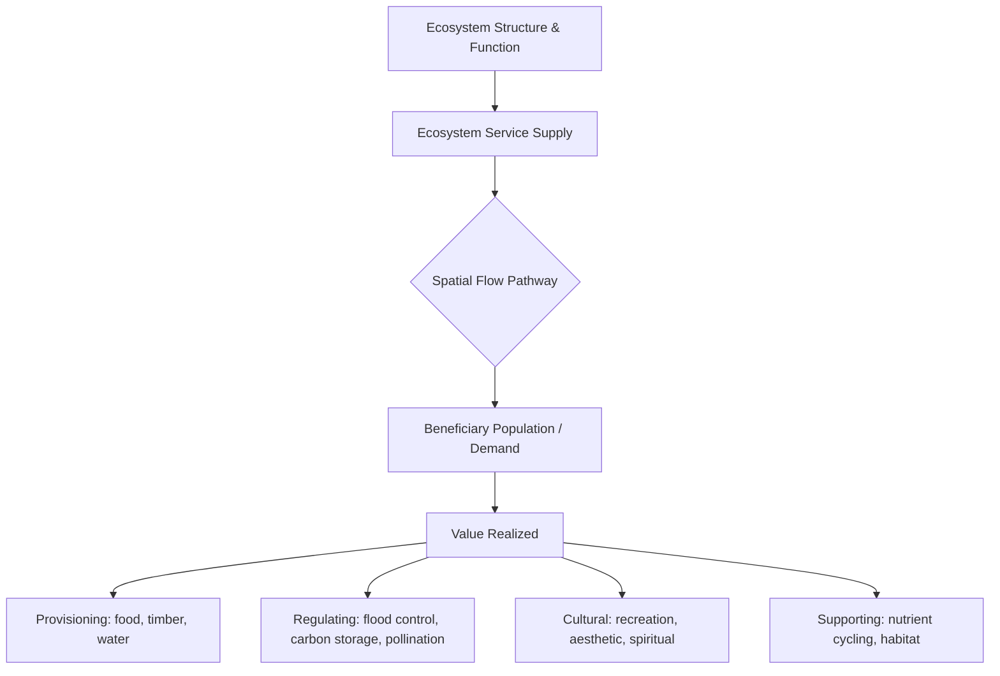
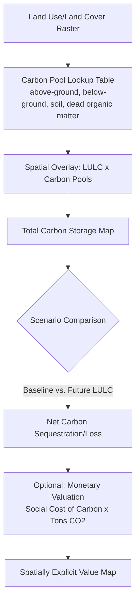

## Ecosystem Services Valuation

### Overview

Ecosystem services valuation (ESV) is the interdisciplinary practice of quantifying—typically in monetary or biophysical terms—the benefits that ecosystems provide to human well-being, such as water purification, carbon sequestration, pollination, flood regulation, and recreation. In geospatial science, ESV combines spatially explicit biophysical modeling with economic valuation methods to produce maps and metrics that inform land-use planning, conservation prioritization, environmental impact assessment, and natural capital accounting.

### Conceptual Foundation

**Key Points**

- **Ecosystem services classification**: The Millennium Ecosystem Assessment (2005) and later frameworks like the Common International Classification of Ecosystem Services (CICES) organize services into four categories: *provisioning* (food, timber, water), *regulating* (climate regulation, flood control, water purification), *cultural* (recreation, aesthetic, spiritual value), and *supporting/habitat* (nutrient cycling, habitat provision underlying the other three).
- **Ecosystem service flow**: The concept that services are not static stocks but flows from a biophysical *supply* (ecosystem capacity to generate a service) to a *demand* (beneficiary population), mediated by spatial proximity and flow pathways (e.g., a wetland's flood mitigation service only has value if it protects downstream property).
- **Natural capital**: Ecosystem services are framed as the "dividend" generated by natural capital stocks, analogous to how financial capital generates interest—depleting natural capital reduces the future flow of services.

### The Cascade Framework

A widely used conceptual model linking ecological structure to economic value, useful for structuring geospatial ESV workflows:

$$\text{Biophysical Structure/Process} \rightarrow \text{Function} \rightarrow \text{Service} \rightarrow \text{Benefit} \rightarrow \text{Value}$$

**Example**

A mangrove forest's root structure (biophysical structure) dissipates wave energy (function), which provides coastal storm buffering (service), which reduces property damage during storm surge events (benefit), which can be monetized as avoided damages in dollars per hectare of mangrove per storm event (value).

### Valuation Methodologies

#### 1. Market-Based (Direct Market Pricing)

Applicable to provisioning services traded in existing markets.

**Example**

Timber yield from a managed forest can be valued directly using market stumpage prices per cubic meter, spatially distributed using forest inventory and yield models.

#### 2. Revealed Preference Methods

Infer value from observed behavior in related markets.

| Method | Mechanism | Geospatial Application |
| --- | --- | --- |
| Hedonic pricing | Decomposes property value into implicit prices of environmental attributes | Spatial regression of housing prices against proximity to parks, water bodies, or pollution sources |
| Travel cost method | Uses visitor travel expenditure as a proxy for recreational site value | GIS-based catchment analysis and origin-destination cost surfaces |
| Averting/defensive expenditure | Uses spending to avoid environmental harm as a lower-bound value estimate | Mapping household water filtration expenditure against measured water contamination |

#### 3. Stated Preference Methods

Survey-based elicitation of willingness to pay (WTP) or willingness to accept (WTA) for non-market goods.

- **Contingent valuation**: Directly asks respondents' WTP for a specified environmental change (e.g., "How much would you pay annually to prevent the loss of this wetland?").
- **Choice experiments**: Presents respondents with attribute bundles at varying price levels, enabling estimation of marginal WTP for individual ecosystem attributes via discrete choice modeling (often multinomial or mixed logit).

#### 4. Production Function / Avoided Cost Approaches

Values a service based on its contribution to a marketed output or the cost avoided by its provision.

**Example**

A wetland's water purification service can be valued using the avoided cost of constructing and operating equivalent water treatment infrastructure—if the wetland removes nitrogen loading equivalent to what a treatment plant costing $X per kg-N-removed would otherwise require, that avoided cost approximates the wetland's value.

#### 5. Benefit Transfer

Applies value estimates or functions derived from existing primary studies to a new site with similar characteristics, adjusted for factors such as income, population density, and ecosystem condition.

**Key Points**

- **Unit value transfer**: Directly transfers a per-hectare or per-unit value from a study site to a policy site (simplest but least accurate approach).
- **Value function/meta-analytic transfer**: Transfers a statistical function relating value to site characteristics, allowing some adjustment for context (more defensible for heterogeneous landscapes).
- Widely used in large-scale spatial ESV because conducting primary valuation studies for every mapped ecosystem parcel is prohibitively costly.

### Geospatial ESV Modeling Tools

**Example**

The InVEST (Integrated Valuation of Ecosystem Services and Tradeoffs) suite, developed by the Natural Capital Project (Stanford University, University of Minnesota, The Nature Conservancy, WWF), provides a family of spatially explicit biophysical models—including modules for carbon storage/sequestration, water yield, sediment retention, pollinator abundance, and coastal vulnerability—that can optionally be paired with economic valuation functions to convert biophysical outputs into monetary terms.

| Tool | Developer(s) | Core Approach |
| --- | --- | --- |
| InVEST | Natural Capital Project | Biophysical production-function models with optional monetary valuation |
| ARIES (Artificial Intelligence for Ecosystem Services) | University of Basilicata / BC3, et al. | Bayesian network-based service flow modeling |
| ESTIMAP | European Commission Joint Research Centre | EU-focused mapping of ecosystem service supply/demand |
| Co$ting Nature | King's College London / Ambiotek | Policy-support ecosystem service mapping platform |
| SolVES (Social Values for Ecosystem Services) | USGS | Maps cultural/perceived values using public participation GIS (PPGIS) data |

[Unverified — tool developer affiliations and current version capabilities should be checked against each project's official documentation, as academic/institutional tools evolve and affiliations can shift over time]

Typical InVEST-style workflow for a carbon storage assessment:

### Value Aggregation and Total Economic Value

Ecosystem service values across a landscape are typically aggregated as:

$$V_{total} = \sum_{i=1}^{n} \sum_{j=1}^{m} A_{ij} \times v_{ij}$$

Where $A_{ij}$ is the area of land-cover type $i$ under scenario $j$, and $v_{ij}$ is the per-hectare value coefficient for that land-cover/service combination. This spatial aggregation approach underlies most landscape-scale ecosystem service maps but requires care regarding **value transfer error** and the **non-linearity of ecosystem service supply** (e.g., forest fragmentation can reduce per-hectare service value even when total forest area is held constant, an effect simple area-based aggregation can miss). [Inference — the degree of non-linearity and appropriate correction methods are actively studied in ecosystem service science and vary by service type]

### Data Inputs Commonly Required

- **Land use/land cover classification** (from satellite imagery classification, e.g., Sentinel-2, Landsat)
- **Digital elevation models (DEM)** for hydrological and erosion-related services
- **Soil data** (texture, organic carbon content) for water and carbon-related services
- **Climate data** (precipitation, evapotranspiration) for water yield modeling
- **Population/demand data** for beneficiary mapping (who receives the service)
- **Socioeconomic data** (income, property values) for valuation function calibration

### Applications in Geospatial Practice

**Key Points**

- **Conservation prioritization**: Identifying parcels with the highest marginal ecosystem service value per conservation dollar spent, often via spatial optimization algorithms (e.g., Marxan combined with ESV layers).
- **Environmental impact assessment (EIA)**: Quantifying the ecosystem service loss from proposed development (e.g., wetland fill for infrastructure) as part of regulatory review.
- **Natural capital accounting**: National-level frameworks such as the UN System of Environmental-Economic Accounting (SEEA) integrate spatially derived ecosystem service estimates into national accounts alongside traditional GDP measures.
- **Payments for Ecosystem Services (PES) design**: Spatially targeting payments to landowners whose parcels generate the highest service value, maximizing conservation return on investment.
- **Green infrastructure planning**: Comparing engineered (grey) infrastructure costs against nature-based solutions (e.g., urban tree canopy for stormwater management) using avoided-cost valuation.

### Common Pitfalls

- **Double-counting services**: Services are interdependent (e.g., biodiversity underpins pollination, which underpins provisioning), and naive summation of separately valued services can overstate total value.
- **Ignoring spatial flow/demand**: A biophysically high-supply ecosystem (e.g., a remote forest's flood regulation capacity) has limited realized value if no downstream beneficiary population exists to receive the benefit—supply-only mapping without demand mapping overstates practical value.
- **Uncritical benefit transfer**: Applying value coefficients from a study in one biome/socioeconomic context to a structurally dissimilar site without adjustment introduces substantial estimation error.
- **Treating monetary value as the only legitimate metric**: Many cultural and existence values resist reliable monetization; purely monetary ESV frameworks risk marginalizing non-market values important to some communities and can conflict with Indigenous and local knowledge systems that frame nature's value in non-economic terms.
- **Static land-cover snapshots ignoring ecological condition**: Two parcels with identical land-cover classification (e.g., "forest") can have very different service-generating capacity depending on degradation state, age, or fragmentation, which simple LULC-based models may not capture without additional condition indicators.

### Conclusion

Ecosystem services valuation bridges ecological function and economic decision-making by quantifying the benefits ecosystems provide, using methods ranging from direct market pricing to stated-preference surveys to spatially explicit biophysical models like InVEST. For geospatial practitioners, ESV requires integrating land-cover, hydrological, climate, and socioeconomic data into spatial models that map both service supply and beneficiary demand, while remaining attentive to methodological pitfalls such as double-counting, uncritical benefit transfer, and the limits of monetization for cultural and existence values.

**Related Topics**

- InVEST Model Suite: Setup and Application Workflows
- Total Economic Value Framework and Non-Use Value Estimation
- Payments for Ecosystem Services (PES) Spatial Targeting
- UN System of Environmental-Economic Accounting (SEEA)
- Public Participation GIS (PPGIS) for Cultural Ecosystem Service Mapping
- Green Infrastructure vs. Grey Infrastructure Cost-Benefit Analysis
- Land-Cover Classification Accuracy and Its Effect on ESV Model Outputs
- Spatial Optimization for Conservation Prioritization (Marxan, Zonation)