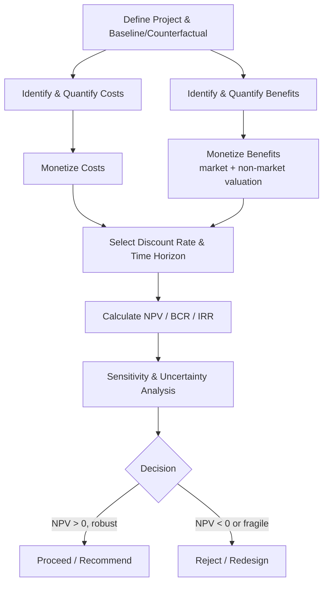
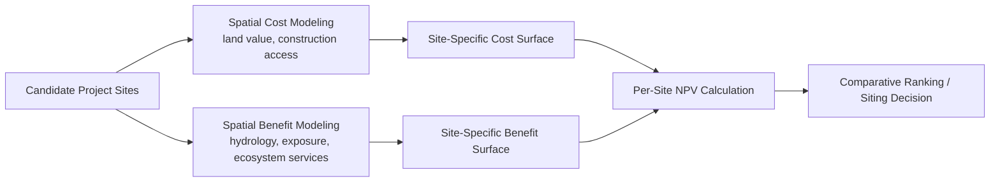

## Cost-Benefit Analysis for Environmental Projects

### Overview

Cost-benefit analysis (CBA) for environmental projects is a systematic economic evaluation method that compares the monetized costs and benefits of a proposed environmental intervention—such as wetland restoration, renewable energy infrastructure, flood defense construction, or conservation area designation—to determine whether the project generates net social value and how it compares against alternatives. In geospatial contexts, CBA integrates spatially distributed cost and benefit data (site-specific construction costs, spatially varying ecosystem service benefits, population exposure) to support siting, prioritization, and regulatory decisions.

### Core Analytical Structure

**Key Points**

- **Net Present Value (NPV)**: The central decision criterion, summing discounted net benefits over the project's time horizon.
- **Benefit-Cost Ratio (BCR)**: An alternative summary statistic expressing total discounted benefits divided by total discounted costs.
- **Internal Rate of Return (IRR)**: The discount rate at which NPV equals zero, used to compare project return against a hurdle rate.
- **Sensitivity analysis**: Essential given the uncertainty inherent in environmental valuation, physical impact modeling, and discount rate selection.

$$NPV = \sum_{t=0}^{T} \frac{B_t - C_t}{(1+r)^t}$$

Where $B_t$ is the monetized benefit in year $t$, $C_t$ is the cost in year $t$, $r$ is the discount rate, and $T$ is the project time horizon. A project is generally considered economically justified if $NPV > 0$; among mutually exclusive alternatives, the option with the highest NPV is preferred (assuming no capital constraint) over simply the highest BCR, since BCR can favor smaller-scale projects with less total value.

### Step-by-Step Methodology

#### 1. Define the Baseline (Counterfactual) and Project Scenario

The "with-project" scenario must be compared against a credible "without-project" (business-as-usual) baseline, not against a hypothetical ideal. This is especially important in environmental CBA because ecosystems are dynamic—a wetland's condition without intervention may itself degrade over time due to independent pressures (e.g., ongoing sea-level rise, adjacent development).

**Example**

Evaluating a proposed mangrove restoration project requires projecting the counterfactual trajectory of the site's coastal protection value if no restoration occurs (accounting for likely continued degradation from erosion or clearing), not simply assuming the current condition would persist unchanged.

#### 2. Identify and Categorize Costs

- **Capital costs**: Construction, land acquisition, equipment.
- **Operating and maintenance costs**: Ongoing management, monitoring, staffing.
- **Opportunity costs**: Value of the next-best alternative use of the land or resources foregone (e.g., agricultural output foregone by converting farmland to wetland).
- **Transition/transaction costs**: Costs of negotiating land rights, permitting, stakeholder consultation.

#### 3. Identify and Categorize Benefits

Environmental project benefits frequently span market and non-market categories, requiring the valuation methods discussed under ecosystem services valuation (market pricing, revealed preference, stated preference, benefit transfer).

| Benefit Category | Example | Typical Valuation Method |
| --- | --- | --- |
| Direct market benefits | Timber, fisheries yield | Market price |
| Avoided damage costs | Flood damage reduction | Avoided cost / damage function modeling |
| Health benefits | Reduced air pollution morbidity/mortality | Value of statistical life (VSL), cost-of-illness |
| Recreation/amenity value | Increased park visitation | Travel cost method, hedonic pricing |
| Non-use value | Existence value of preserved habitat | Contingent valuation, choice experiments |
| Climate regulation | Carbon sequestration | Social cost of carbon x tons $CO_2$ |

#### 4. Select the Discount Rate

**Key Points**

- Discount rate selection materially affects outcomes for long-horizon environmental projects (e.g., climate mitigation, old-growth forest conservation), since higher discount rates suppress the present value of benefits realized decades in the future.
- **Social discount rate (SDR)** approaches include the *social rate of time preference* (based on how society values present vs. future consumption) and the *social opportunity cost of capital* (based on returns foregone elsewhere in the economy); government guidance documents (e.g., US OMB Circular A-4, UK HM Treasury Green Book) specify recommended rates and have periodically revised them. [Unverified — specific current discount rate figures should be checked against the latest version of the relevant governing guidance document, as these are revised periodically]
- **Declining discount rates** (lower rates applied to more distant future periods) have been proposed and adopted in some jurisdictions specifically to address the ethical concern that constant discounting excessively discounts harms to future generations.

#### 5. Conduct Sensitivity and Uncertainty Analysis

**Example**

A coastal wetland restoration CBA might run a sensitivity analysis varying the discount rate (e.g., 2%, 3%, 7%), the assumed rate of sea-level rise, and the social cost of carbon used to value sequestration benefits—reporting a range of NPV outcomes rather than a single point estimate, since environmental projects are especially exposed to long-horizon physical and valuation uncertainty.

Common techniques:

- **One-at-a-time (OAT) sensitivity analysis**: Varying single parameters while holding others constant.
- **Monte Carlo simulation**: Sampling from probability distributions of uncertain parameters to generate a distribution of NPV outcomes rather than a single value.
- **Break-even analysis**: Identifying the parameter value at which NPV crosses zero, indicating the threshold of project viability.

### Distributional and Equity Considerations

Standard CBA aggregates net benefits regardless of who bears costs or receives benefits (the Kaldor-Hicks efficiency criterion—a project is justified if winners could theoretically compensate losers, even if compensation doesn't actually occur). This has well-documented limitations for environmental projects:

**Example**

A flood defense project that protects a wealthy coastal district may generate a large aggregate NPV due to high property values protected, while an equally flood-vulnerable low-income community elsewhere receives a lower NPV score simply because the property values at risk are lower—potentially directing public investment away from areas of greatest human vulnerability if NPV is used as the sole decision criterion.

Mitigations:

- **Distributional weighting**: Applying higher weights to benefits accruing to lower-income or vulnerable populations, partially correcting the equity blind spot of standard CBA.
- **Multi-criteria analysis (MCA)** as a complement: Explicitly incorporating equity, cultural, and other non-monetizable criteria alongside NPV rather than relying on monetary aggregation alone.
- **Reporting distributional incidence tables**: Presenting who bears costs and who receives benefits by income group, geography, or demographic category, alongside the aggregate NPV figure.

### Geospatial Integration in Environmental CBA

**Key Points**

- **Spatial cost surfaces**: Construction and land acquisition costs vary spatially (terrain, land value, accessibility), requiring GIS-based cost-distance or land-value surface modeling rather than uniform per-hectare estimates.
- **Spatially explicit benefit mapping**: Benefits such as flood risk reduction or air quality improvement are highly location-dependent, requiring hydrological or dispersion modeling combined with population exposure layers (e.g., overlaying a flood inundation model with a population density raster to estimate avoided damages).
- **Site selection and siting optimization**: CBA is often embedded within a broader spatial optimization workflow to identify the site location that maximizes net benefit per unit cost across candidate locations (e.g., using multi-criteria decision analysis, MCDA, in a GIS environment).
- **Scenario/what-if mapping**: Comparing NPV outcomes across multiple candidate project designs or locations, visualized as comparative benefit or NPV surfaces.

### Illustrative Worked Example

**Example**

A municipality evaluates a $4 million urban stormwater wetland versus a $6 million conventional grey-infrastructure (piped) stormwater system, each with a 30-year design life. The wetland option has lower capital cost but higher land opportunity cost (foregone development value) and generates co-benefits (recreation value, habitat, minor cooling effect) not present in the grey infrastructure option. Running both through a discounted cash flow at, e.g., a 3% discount rate, and comparing NPVs across the two mutually exclusive alternatives allows the municipality to select the option with higher net social value—provided the co-benefits are credibly monetized and the opportunity cost of land is not omitted, a common error that biases naive comparisons toward nature-based solutions. [Inference — illustrative numbers; actual project economics depend heavily on site-specific data]

### Common Pitfalls

- **Omitting opportunity costs**: Failing to value the foregone alternative use of land or resources (e.g., agricultural or development value) leads to overstated net benefits for conservation or restoration projects.
- **Inconsistent treatment of the counterfactual**: Comparing the project against current conditions rather than a realistic projected baseline can overstate or understate net benefits depending on whether the baseline itself would improve or degrade.
- **Cherry-picking discount rates**: Selecting an unusually low or high discount rate to produce a predetermined favorable or unfavorable result undermines analytical credibility; standard practice is to report results across a range of rates.
- **Ignoring irreversibility and option value**: Standard NPV analysis can undervalue the option value of preserving flexibility (e.g., not developing an area with unique, irreplaceable ecological features), which real options analysis or a explicit option-value term can help address.
- **Equity blindness**: Treating a positive aggregate NPV as sufficient justification without examining distributional incidence can mask regressive outcomes.
- **Double-counting benefits**: As with ecosystem service valuation generally, benefits that are ecologically interdependent (e.g., water quality and fisheries yield) can be inadvertently double-counted if not carefully disaggregated.

### Conclusion

Cost-benefit analysis for environmental projects extends standard economic CBA methodology to the specific challenges of environmental valuation—non-market benefits, long time horizons, physical and ecological uncertainty, and often severe distributional asymmetries. In geospatial practice, rigorous environmental CBA requires integrating spatial cost and benefit surfaces, exposure and hydrological modeling, and ecosystem service valuation methods within a structured NPV framework, while explicitly reporting sensitivity to discount rate assumptions and distributional incidence to support transparent, defensible decision-making.

**Related Topics**

- Social Discount Rate Selection and Government Guidance Documents (OMB Circular A-4, HM Treasury Green Book)
- Multi-Criteria Decision Analysis (MCDA) for Environmental Siting
- Value of Statistical Life (VSL) in Environmental Health Benefit Estimation
- Monte Carlo Methods for Environmental Project Uncertainty Analysis
- Distributional Weighting and Equity-Adjusted CBA
- Real Options Analysis for Irreversible Environmental Decisions
- Nature-Based Solutions vs. Grey Infrastructure Cost Comparisons
- Spatial Cost-Distance Modeling for Infrastructure Siting