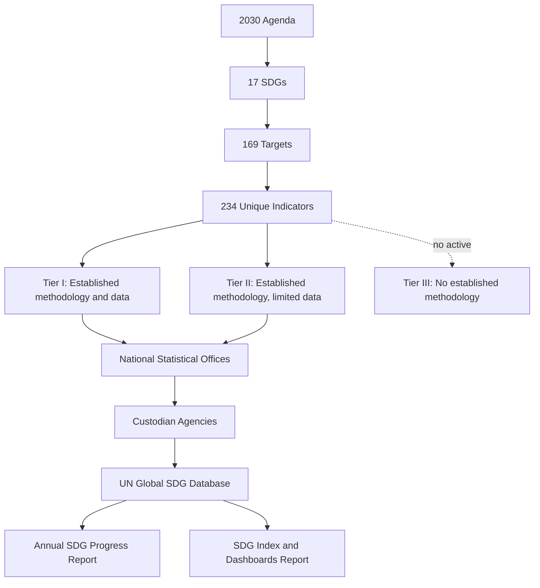

## Sustainable Development Goals and Indicators

### Overview

The Sustainable Development Goals (SDGs) are a 17-goal, 169-target framework adopted by the UN General Assembly in 2015 as the "2030 Agenda for Sustainable Development." Each target is tracked through one or more quantitative or qualitative indicators, collectively forming the **global indicator framework** — the statistical backbone that converts political commitments into measurable, comparable data. As of the most recent comprehensive review, the framework comprises 234 unique indicators measuring progress toward the 17 SDGs and 169 targets, though this number shifts slightly with each annual refinement cycle. [Nature](https://www.nature.com/articles/s43247-025-02837-6)

For geospatial and environmental science practitioners, the SDG framework is significant beyond its policy role: a substantial share of environmental indicators (land degradation, forest cover, water body extent, marine protected areas, urban expansion) are measured primarily through Earth observation and GIS-based methods rather than conventional surveys.

### Historical Development and Governance

- **2015** — 2030 Agenda and the 17 SDGs adopted by the UN General Assembly (Resolution A/RES/70/1), superseding the Millennium Development Goals (MDGs).
- **March 2017** — The global indicator framework was developed by the Inter-Agency and Expert Group on SDG Indicators (IAEG-SDGs) and agreed upon at the 48th session of the UN Statistical Commission. [UNSD](https://unstats.un.org/sdgs/indicators/indicators-list/online)
- **July 2017** — The framework was formally adopted by the General Assembly via Resolution A/RES/71/313. [UNSD](https://unstats.un.org/sdgs/indicators/indicators-list/online)
- **2020 Comprehensive Review** — The 51st session of the UN Statistical Commission approved 36 major changes (replacements, revisions, additions, deletions) and 20 minor refinements, eliminating all remaining Tier III indicators and bringing the total to 231 unique indicators. [un](https://unstats.un.org/sdgs/files/meetings/iaeg-sdgs-meeting-11/4.%20Updates%20on%20the%20revised%20global%20indicator%20framework%20and%20SDG%20indicator%20website_UNSD.pdf)
- **2025 Comprehensive Review** — A further comprehensive review was conducted at the 56th session of the Statistical Commission in March 2025, alongside the annual refinement process that continues each year, bringing the count to 234 as of June 2025. [UNSD](https://unstats.un.org/sdgs/indicators/indicators-list/online)
- **Ongoing** — Annual refinements continue through each subsequent Statistical Commission session (57th session onward), so exact indicator counts should be treated as a moving baseline rather than a fixed constant. [Unverified: the precise indicator count at any point after March 2026 depends on that session's outcomes, which are not reliably confirmable from current sources.]

Governance sits with the **IAEG-SDGs** (technical custodian of the framework), the **UN Statistical Commission** (approval authority), and **custodian agencies** — specialized UN bodies and other international organizations (e.g., FAO, WHO, UNEP, UN-Habitat) responsible for compiling and validating data for specific indicators.

### The Three-Level Structure: Goals, Targets, Indicators

The framework is strictly hierarchical:

1. **Goals (17)** — Broad thematic outcomes (e.g., SDG 1: No Poverty, SDG 13: Climate Action, SDG 15: Life on Land).
2. **Targets (169)** — Specific, time-bound sub-objectives under each goal, numbered `Goal.Target` (e.g., 15.3 — combat desertification and land degradation by 2030).
3. **Indicators (234, as of 2025)** — Measurable metrics attached to targets, numbered `Goal.Target.Indicator` (e.g., 15.3.1 — proportion of land that is degraded over total land area).

Some indicators are reused across multiple targets (e.g., an employment indicator may serve both a poverty target and a decent-work target), which is why the *listed* indicator count differs slightly from the *unique* indicator count.

### Indicator Tier Classification

Indicators are classified by data and methodological maturity:

- **Tier I** — Methodology is internationally established, and data are regularly produced by most countries.
- **Tier II** — Methodology is internationally established, but data are not regularly produced by most countries.
- **Tier III** — No internationally agreed methodology exists yet.

Following the 2020 comprehensive review, no indicators remained classified as Tier III, meaning every current indicator now has an agreed methodology — though data *availability* across countries remains highly uneven, which is a distinct problem from methodological maturity. Indicators can be reclassified between Tier I and Tier II as data coverage improves or degrades. [un](https://unstats.un.org/sdgs/files/meetings/iaeg-sdgs-meeting-11/4.%20Updates%20on%20the%20revised%20global%20indicator%20framework%20and%20SDG%20indicator%20website_UNSD.pdf)

### Custodian Agencies and Data Flow

Each indicator has one or more **custodian agencies** responsible for methodology, data compilation, and quality assurance. Examples relevant to environmental/geospatial domains:

| Domain | Example Indicator | Typical Custodian |
| --- | --- | --- |
| Forests | 15.1.1 Forest area as a proportion of total land area | FAO |
| Land degradation | 15.3.1 Proportion of degraded land | UNCCD, FAO, UNEP |
| Water ecosystems | 6.6.1 Change in extent of water-related ecosystems | UNEP |
| Marine areas | 14.5.1 Coverage of marine protected areas | UNEP-WCMC, IUCN |
| Urbanization | 11.3.1 Ratio of land consumption rate to population growth rate | UN-Habitat |
| Air quality | 11.6.2 Annual mean levels of fine particulate matter | WHO |

Data generally flows: **national statistical systems / national geospatial agencies → custodian agency validation → UN Global SDG Database → annual reporting products**. Custodian agencies must submit metadata update requests to the IAEG-SDGs at least one month before a scheduled meeting, with review and approval timelines that can span up to 12 weeks or more, reflecting a deliberately conservative, consensus-driven change process. [UNSD](https://unstats.un.org/sdgs/metadata/)

### Geospatial and Earth-Observation Contribution

A distinguishing feature of the SDG framework relative to earlier development metrics is heavy reliance on Earth observation (EO) and GIS for indicators that are impractical to measure through surveys alone:

- **Land Cover/Land Use Change** — Indicators 11.3.1, 15.1.1, 15.3.1 rely on satellite time-series (Landsat, Sentinel-2, MODIS) and land-cover classification algorithms.
- **Water Body Extent** — Indicator 6.6.1 uses tools such as the Global Surface Water dataset and the SDG 6 Data Portal built on JRC/Google Earth Engine pipelines.
- **Forest Monitoring** — FAO's Collect Earth Online and Global Forest Resources Assessment (FRA) integrate remote sensing with ground-truthing for 15.1.1 and 15.2.1.
- **Urban Expansion** — 11.3.1 uses nighttime lights, high-resolution imagery, and settlement layers (e.g., Global Human Settlement Layer) to compute built-up area growth relative to population growth.

**Key Points**

- EO-derived indicators reduce dependence on infrequent national censuses but introduce their own uncertainty from sensor resolution, classification accuracy, and temporal gaps.
- Many custodian agencies now publish standardized geospatial methodologies (e.g., UN-Habitat's Urban Monitoring Framework) precisely to keep Tier I/II classification consistent across countries with unequal remote-sensing capacity.

### Measurement and Aggregation Methodology

Raw indicator values are typically transformed before cross-country or cross-goal comparison, most commonly through **min–max normalization**, used in composite tools such as the SDSN/Bertelsmann Stiftung **SDG Index**:

$$x_{norm} = \frac{x - x_{min}}{x_{max} - x_{min}} \times 100$$

Where $x$ is a country's raw indicator value, and $x_{min}$/$x_{max}$ are defined by the "worst" and "best" (target) values observed globally, so that $x_{norm}$ ranges from 0 (furthest from the goal) to 100 (goal achieved).

Goal-level scores are then computed as an arithmetic mean (or, in some frameworks, geometric mean to penalize imbalance) of normalized indicator scores within that goal:

$$\text{Goal Score} = \frac{1}{n}\sum_{i=1}^{n} x_{norm,i}$$

The 2026 SDG Index refines a "headline" index (SDGhi) that draws on 17 SDG indicators — one per goal — specifically to evaluate country and regional progress while minimizing statistical bias caused by missing time-series data. That edition's results covered 146 countries, since countries with excessive missing data — often those facing conflict or structural vulnerabilities — were excluded from the comparative index, which is itself a methodological caution: exclusion from an index is not equivalent to good performance. [Sustainable Development Report](https://dashboards.sdgindex.org/chapters/part-2-the-sdg-index-and-dashboards/)[Sustainable Development Report](https://dashboards.sdgindex.org/chapters/part-2-the-sdg-index-and-dashboards/)

**Example**

A country reports a poverty headcount ratio (indicator 1.1.1) of 12%, where the global "best" observed value is 0% and the defined "worst" threshold is 60%:

$$x_{norm} = \frac{60 - 12}{60 - 0} \times 100 = 80$$

(Note the inversion: for indicators where *lower* raw values are better, the normalization formula is flipped so that higher $x_{norm}$ still means better performance.) This normalized score of 80 would then be averaged with other SDG 1 indicators (e.g., social protection coverage, multidimensional poverty rate) to produce the composite Goal 1 score.

### Monitoring and Review Mechanisms

- **High-Level Political Forum (HLPF)** — The UN's central platform for annual follow-up and review, convened under ECOSOC (and every four years under the General Assembly).
- **Voluntary National Reviews (VNRs)** — Country-led, country-submitted self-assessments presented at the HLPF; participation is voluntary and reporting depth varies widely.
- **Annual SDG Progress Report** — Presented each year by the UN Secretary-General, developed with the UN System based on the global indicator framework and data from national statistical systems and regional sources. [United Nations](https://sdgs.un.org/goals)
- **Global Sustainable Development Report (GSDR)** — An independent, science-based report produced once every four years to inform the quadrennial SDG review at the General Assembly. [United Nations](https://sdgs.un.org/goals)
- **SDG Index and Dashboards Report** — An SDSN-led, non-UN complementary product ranking country performance and flagging "spillover effects" (a country's impact on other countries' ability to achieve the SDGs).

The Sustainable Development Goals Report 2025/2026 found that since 2015 the SDGs have delivered results at scale — expanding access to clean water, electricity, health care, and digital connectivity for billions of people — but progress remains uneven and insufficient against headwinds including escalating conflicts, slowing global economic growth, climate change, rising debt burdens, and declining official development assistance. [UNSD](https://unstats.un.org/sdgs/)

<svg viewBox="0 0 900 360" xmlns="http://www.w3.org/2000/svg" font-family="sans-serif">
<text x="450" y="28" text-anchor="middle" font-size="18" font-weight="bold" fill="#1a1a1a">SDG Monitoring and Review Cycle (svg_diagram)</text>
<rect x="20" y="70" width="160" height="60" rx="8" fill="#e8f4ea" stroke="#2e7d32" stroke-width="2"/>
<text x="100" y="95" text-anchor="middle" font-size="12">National Statistical</text>
<text x="100" y="112" text-anchor="middle" font-size="12">& Geospatial Systems</text>
<rect x="230" y="70" width="160" height="60" rx="8" fill="#e3f2fd" stroke="#1565c0" stroke-width="2"/>
<text x="310" y="95" text-anchor="middle" font-size="12">Custodian Agency</text>
<text x="310" y="112" text-anchor="middle" font-size="12">Validation</text>
<rect x="440" y="70" width="160" height="60" rx="8" fill="#fff3e0" stroke="#ef6c00" stroke-width="2"/>
<text x="520" y="95" text-anchor="middle" font-size="12">UN Global SDG</text>
<text x="520" y="112" text-anchor="middle" font-size="12">Database</text>
<rect x="650" y="70" width="200" height="60" rx="8" fill="#f3e5f5" stroke="#6a1b9a" stroke-width="2"/>
<text x="750" y="95" text-anchor="middle" font-size="12">Annual Progress Report</text>
<text x="750" y="112" text-anchor="middle" font-size="12">& SDG Index</text>
<rect x="230" y="220" width="160" height="60" rx="8" fill="#ffebee" stroke="#c62828" stroke-width="2"/>
<text x="310" y="245" text-anchor="middle" font-size="12">Voluntary National</text>
<text x="310" y="262" text-anchor="middle" font-size="12">Reviews (VNR)</text>
<rect x="440" y="220" width="200" height="60" rx="8" fill="#e0f2f1" stroke="#00695c" stroke-width="2"/>
<text x="540" y="245" text-anchor="middle" font-size="12">High-Level Political</text>
<text x="540" y="262" text-anchor="middle" font-size="12">Forum (HLPF)</text>
<line x1="180" y1="100" x2="230" y2="100" stroke="#555" stroke-width="2" marker-end="url(#arrow)"/>
<line x1="390" y1="100" x2="440" y2="100" stroke="#555" stroke-width="2" marker-end="url(#arrow)"/>
<line x1="600" y1="100" x2="650" y2="100" stroke="#555" stroke-width="2" marker-end="url(#arrow)"/>
<line x1="750" y1="130" x2="540" y2="220" stroke="#555" stroke-width="2" marker-end="url(#arrow)"/>
<line x1="440" y1="250" x2="390" y2="250" stroke="#555" stroke-width="2" marker-end="url(#arrow)"/>
<line x1="310" y1="220" x2="310" y2="130" stroke="#555" stroke-width="2" stroke-dasharray="4,3" marker-end="url(#arrow)"/>
<defs>
<marker id="arrow" markerWidth="10" markerHeight="10" refX="8" refY="3" orient="auto" markerUnits="strokeWidth">
<path d="M0,0 L0,6 L9,3 z" fill="#555"/>
</marker>
</defs>
</svg>

### Challenges and Limitations

- **Data availability gaps** — Approximately half of the indicators lack even two data points for more than half of all countries, undermining trend analysis. [Nature](https://www.nature.com/articles/s43247-025-02837-6)
- **Indicator overlap and redundancy** — Some indicators overlap conceptually or statistically, diluting the framework's diagnostic clarity. [Nature](https://www.nature.com/articles/s43247-025-02837-6)
- **Local misalignment** — Global indicators are sometimes poorly matched to local contexts and national priorities, which has led to proposals for a tiered structure of global core, global optional, and custom local indicators for any post-2030 framework. [Nature](https://www.nature.com/articles/s43247-025-02837-6)
- **Exclusion bias in composite indices** — Countries with the weakest statistical capacity are often excluded from aggregate indices (as noted above for the 2026 SDG Index's 146-country coverage), which can mask exactly the cases of greatest concern.
- **Remote-sensing heterogeneity** — For EO-derived indicators, differences in sensor availability, cloud cover, and processing pipelines between countries can introduce comparability issues even where a Tier I methodology formally exists. [Inference: this is a widely acknowledged practical limitation in the remote-sensing/SDG literature rather than a claim made in a single authoritative source cited above.]

### Conclusion

**Conclusion**

The SDG indicator framework operationalizes a broad political agenda into a structured, tiered, and continuously refined measurement system spanning 17 goals, 169 targets, and 234 unique indicators. For environmental and geospatial science, the framework is notable for institutionalizing Earth observation and GIS methods as primary — not supplementary — data sources for a meaningful share of indicators, while still facing persistent challenges around data coverage, comparability, and local relevance. With the 2030 deadline approaching, ongoing annual refinements and the eventual design of a post-2030 framework are active areas of methodological and policy development.

**Related Topics**

- Tier Classification Methodology and IAEG-SDG Review Process
- Earth Observation for Environmental Indicator Monitoring (Sentinel, Landsat, MODIS pipelines)
- SDG Index and Dashboards Methodology (SDSN)
- Voluntary National Reviews (VNR) Reporting Process
- Land Degradation Neutrality and Indicator 15.3.1 Methodology
- Composite Index Construction: Normalization and Aggregation Techniques
- Global Human Settlement Layer and Urban SDG Indicators (11.3.1)
- Data Gaps in Environmental Statistics and Statistical Capacity Building