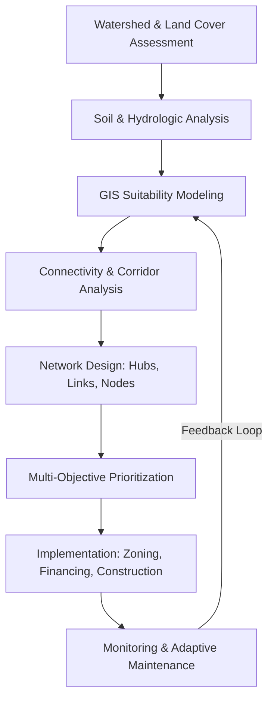

## Green Infrastructure Planning

### Definition and Scope

Green Infrastructure (GI) Planning is the strategic process of designing, siting, and managing an interconnected network of natural and engineered systems that deliver ecological, hydrological, and social services within a landscape. Unlike traditional "grey infrastructure" (pipes, culverts, concrete channels), GI leverages vegetation, soil, and natural hydrological processes to manage stormwater, improve air and water quality, reduce urban heat, and support biodiversity while simultaneously providing recreational and economic value.

GI operates at multiple scales:

- **Site scale**: rain gardens, bioswales, green roofs, permeable pavement
- **Neighborhood scale**: urban forests, greenways, constructed wetlands
- **Regional scale**: watershed-level conservation corridors, floodplain reconnection, agricultural buffer networks

### Core Theoretical Foundations

**Ecosystem Services Framework**

GI planning is grounded in the ecosystem services taxonomy (Millennium Ecosystem Assessment):

- *Provisioning* — timber, food, water supply
- *Regulating* — flood attenuation, water purification, carbon sequestration, microclimate regulation
- *Cultural* — recreation, aesthetic and psychological value
- *Supporting* — soil formation, nutrient cycling, habitat provision

**Landscape Ecology Principles**

GI networks are typically conceptualized using patch-corridor-matrix theory:

- **Patches**: discrete habitat or functional units (parks, wetlands)
- **Corridors**: linear connective elements (greenways, riparian buffers) enabling species movement and hydrological continuity
- **Matrix**: the dominant surrounding land use (urban fabric, agriculture)

Connectivity metrics used in GI network design include:

$$IIC = \frac{\sum_{i=1}^{n}\sum_{j=1}^{n} \frac{a_i a_j}{1+nl_{ij}}}{A_L^2}$$

where $IIC$ is the Integral Index of Connectivity, $a_i$ and $a_j$ are patch areas, $nl_{ij}$ is the number of links in the shortest path between patches $i$ and $j$, and $A_L$ is total landscape area.

**Hydrological Design Basis**

Stormwater-oriented GI (bioretention, swales, permeable pavement) is sized using modified rational or curve-number methods. The NRCS Curve Number method estimates runoff depth:

$$Q = \frac{(P - 0.2S)^2}{P + 0.8S}$$

where $Q$ is runoff depth, $P$ is rainfall depth, and $S = \frac{25400}{CN} - 254$ (metric units), with $CN$ the curve number reflecting land cover and soil hydrologic group.

### The GI Planning Process

#### 1. Assessment and Inventory

- Land cover classification (remote sensing, LiDAR canopy analysis)
- Soil hydrologic grouping (A–D, per NRCS/USDA classification)
- Watershed delineation and impervious surface mapping
- Existing ecological asset inventory (wetlands, riparian corridors, urban tree canopy)
- Social vulnerability and environmental justice overlay (heat island exposure, flood risk to underserved populations)

#### 2. Suitability and Connectivity Analysis

GIS-based multi-criteria evaluation (MCE) is standard practice. A weighted overlay combines normalized layers:

$$S = \sum_{i=1}^{n} w_i \cdot x_i$$

where $S$ is the suitability score, $w_i$ is the weight of criterion $i$ (e.g., slope, soil permeability, proximity to impervious surface, land value), and $x_i$ is the normalized criterion value (commonly 0–1 or 0–100 scale).

Least-cost path and circuit theory (e.g., Linkage Mapper, Circuitscape) are used to identify optimal corridor alignments connecting habitat patches or stormwater management nodes.

#### 3. Network Design

- Establish a hierarchy: hub (core habitat/regional park) → corridor/link → site-scale node
- Apply redundancy principles so network function persists if one link is degraded
- Layer GI typologies to match hydrological and ecological targets (see typology table below)

#### 4. Prioritization and Sequencing

Multi-objective optimization (e.g., Pareto frontier analysis, InVEST models) balances cost, ecological gain, and stormwater capture volume, since budgets rarely allow full build-out simultaneously.

#### 5. Implementation, Governance, and Maintenance

- Zoning overlays, green infrastructure ordinances, and stormwater utility fee credits
- Public-private partnership structures (e.g., developer GI offset requirements)
- Long-term maintenance funding mechanisms (stormwater utility fees, tax increment financing, conservation easements)

### Common GI Typologies

| Typology | Primary Function | Typical Scale | Key Design Parameter |
| --- | --- | --- | --- |
| Bioswale | Conveyance + filtration | Site/street | Longitudinal slope 1–5% |
| Rain garden | Infiltration | Site/parcel | Ponding depth 15–30 cm |
| Green roof | Retention, thermal regulation | Building | Substrate depth (extensive vs. intensive) |
| Permeable pavement | Infiltration | Site | Void ratio, subgrade infiltration rate |
| Constructed wetland | Water quality treatment | Neighborhood/regional | Hydraulic residence time |
| Urban tree canopy | Heat mitigation, interception | Neighborhood/regional | Canopy cover % target |
| Riparian buffer | Bank stabilization, filtration | Regional/watershed | Buffer width (typically 15–30 m minimum) |
| Greenway/corridor | Connectivity, recreation | Regional | Corridor width for species movement |

### Analytical and Modeling Tools

- **GIS platforms**: ArcGIS Pro, QGIS — suitability modeling, network analysis, hydrologic delineation
- **EPA SUSTAIN / SWMM (Storm Water Management Model)**: hydrologic-hydraulic simulation of GI performance at catchment scale
- **InVEST (Integrated Valuation of Ecosystem Services and Tradeoffs)**: urban cooling, sediment retention, and habitat quality models developed by the Natural Capital Project
- **i-Tree (USDA Forest Service)**: urban forest canopy benefits quantification (stormwater interception, carbon, air quality)
- **Circuitscape / Linkage Mapper**: corridor connectivity modeling using circuit theory analogs

**Example: Simplified Bioretention Sizing Calculation**

For a 1,000 m² impervious drainage area in a region with a design storm depth of 25 mm, targeting 90% capture:

$$V_{required} = C \times P \times A$$

where $C$ is the runoff coefficient (≈0.9 for impervious surface), $P$ is design storm depth (m), and $A$ is drainage area (m²).

$$V_{required} = 0.9 \times 0.025\,\text{m} \times 1000\,\text{m}^2 = 22.5\,\text{m}^3$$

This volume informs the ponding depth and footprint of the bioretention cell, typically sized at 5–10% of contributing impervious area for a ponding depth of 15–30 cm. [Inference: exact sizing ratios vary by jurisdiction-specific design manuals and local rainfall statistics.]

### Illustrative Diagram: GI Planning Workflow

### Diagram: Patch-Corridor-Matrix Network (svg_diagram)

<svg xmlns="http://www.w3.org/2000/svg" viewBox="0 0 640 360">
<rect x="0" y="0" width="640" height="360" fill="#f4f6f0" />
<text x="20" y="28" font-family="sans-serif" font-size="16" font-weight="bold" fill="#222">GI Network: Patch-Corridor-Matrix (svg_diagram)</text>
<rect x="20" y="50" width="600" height="290" fill="#dfe7d0" stroke="#8a9a6b" stroke-width="2" />
<circle cx="120" cy="120" r="45" fill="#5a8f4c" stroke="#365e2b" stroke-width="2" />
<text x="120" y="125" font-family="sans-serif" font-size="12" fill="#fff" text-anchor="middle">Core Habitat Hub</text>
<circle cx="480" cy="120" r="45" fill="#5a8f4c" stroke="#365e2b" stroke-width="2" />
<text x="480" y="125" font-family="sans-serif" font-size="12" fill="#fff" text-anchor="middle">Regional Park</text>
<circle cx="300" cy="280" r="35" fill="#4f8fa8" stroke="#2c5566" stroke-width="2" />
<text x="300" y="285" font-family="sans-serif" font-size="12" fill="#fff" text-anchor="middle">Wetland Node</text>
<line x1="160" y1="140" x2="270" y2="255" stroke="#3d6b2f" stroke-width="6" stroke-linecap="round" />
<line x1="335" y1="255" x2="445" y2="140" stroke="#3d6b2f" stroke-width="6" stroke-linecap="round" />
<line x1="165" y1="120" x2="435" y2="120" stroke="#3d6b2f" stroke-width="4" stroke-dasharray="10,6" />
<text x="330" y="105" font-family="sans-serif" font-size="10" fill="#333" text-anchor="middle">Riparian Corridor</text>
<text x="200" y="215" font-family="sans-serif" font-size="10" fill="#333" text-anchor="middle">Greenway Link</text>
<rect x="40" y="300" width="14" height="14" fill="#5a8f4c" />
<text x="60" y="312" font-family="sans-serif" font-size="11" fill="#333">Patch (Habitat/Park)</text>
<rect x="220" y="300" width="14" height="14" fill="#4f8fa8" />
<text x="240" y="312" font-family="sans-serif" font-size="11" fill="#333">Functional Node</text>
<line x1="400" y1="307" x2="430" y2="307" stroke="#3d6b2f" stroke-width="4" />
<text x="440" y="312" font-family="sans-serif" font-size="11" fill="#333">Corridor</text>
</svg>

### Policy and Economic Instruments

- **Stormwater utility fee credits**: reduced fees for parcels implementing on-site GI
- **Green infrastructure ordinances**: mandatory GI ratios for new development (e.g., minimum impervious cover offset percentages)
- **Payment for Ecosystem Services (PES)**: compensating landowners for maintaining GI functions (e.g., riparian buffers)
- **Cost-benefit comparison**: GI vs. grey infrastructure lifecycle cost analysis often shows GI has higher co-benefit value (heat reduction, amenity, biodiversity) despite comparable or higher upfront costs per unit stormwater managed. [Unverified: cost comparisons are highly context- and region-dependent, varying with land value, labor cost, and climate.]

### Common Pitfalls and Design Considerations

- **Undersized systems**: designing for average rather than design-storm intensity leads to bypass and system failure during extreme events
- **Soil compaction**: urban infill soils frequently fail to meet infiltration rate assumptions (>13 mm/hr commonly required); geotechnical infiltration testing is essential before finalizing bioretention design
- **Maintenance neglect**: sediment accumulation and vegetation die-off reduce long-term hydraulic performance if maintenance funding is not secured at planning stage
- **Equity gaps**: GI amenities can drive green gentrification; planning processes increasingly incorporate anti-displacement safeguards alongside environmental justice screening

### Related Topics

- Low Impact Development (LID) and Sustainable Urban Drainage Systems (SuDS)
- Urban Heat Island Mitigation Strategies
- Watershed-Based Stormwater Management Planning
- Ecosystem Services Valuation Methods
- Climate Adaptation and Resilience Planning
- GIS-Based Land Suitability Analysis
- Payment for Ecosystem Services (PES) Mechanisms
- Urban Forestry and Canopy Cover Modeling (i-Tree)
- Floodplain Reconnection and River Restoration