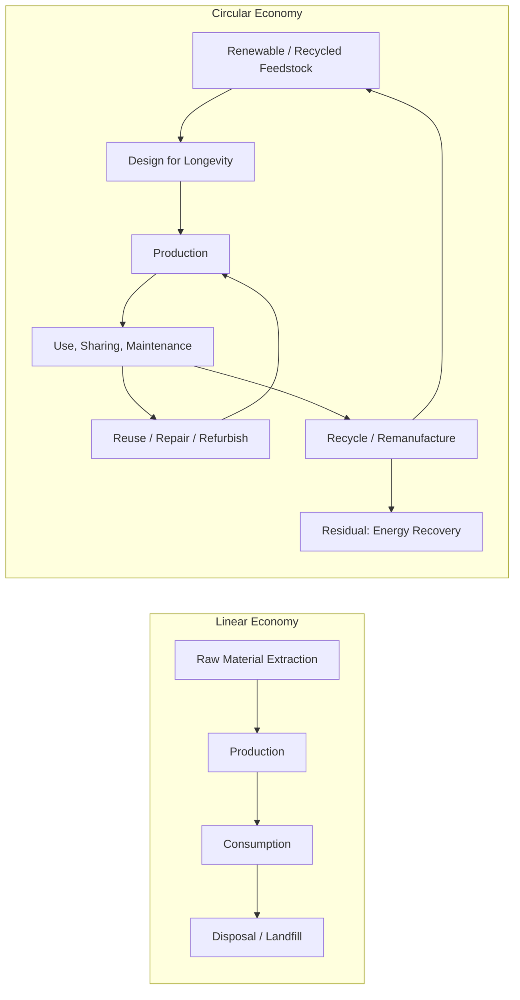

## Circular Economy Concepts

### Overview

The circular economy (CE) is an economic model that decouples growth from finite resource consumption by designing out waste, keeping materials and products in use at their highest value for as long as possible, and regenerating natural systems. It stands in direct contrast to the traditional **linear economy** ("take–make–dispose"). While popularized largely through the Ellen MacArthur Foundation's work since 2010, the concept now underpins formal international standards (the ISO 59000 series), EU regulation, and national material-flow policy.

### Foundational Principles

Most contemporary frameworks converge on a small set of core principles:

1. **Eliminate waste and pollution by design** — Waste is treated as a design flaw, not an inevitable output.
2. **Circulate products and materials at their highest value** — Prioritize maintaining a product's original form (reuse, repair) over degrading it into raw material (recycling).
3. **Regenerate natural systems** — Return biological nutrients safely to the biosphere rather than merely minimizing harm.
4. **Design for durability, modularity, and disassembly** — Products are engineered so components can be separated, repaired, or upgraded.
5. **Shift from ownership to access** — Product-as-a-service and sharing models retain material ownership within the producing organization, incentivizing durability.
6. **Systems thinking** — Circularity is assessed across value networks (suppliers, users, waste managers) rather than a single firm's operations.

### The R-Framework (Waste Hierarchy)

Circular strategies are commonly ranked by a "R-ladder," ordered from highest value retention to lowest:

| Tier | Strategy | Description |
|---|---|---|
| Highest | **Refuse** | Avoid the resource use altogether (e.g., dematerialized service instead of product) |
| | **Rethink** | Redesign the product or business model (e.g., product-as-a-service) |
| | **Reduce** | Use fewer materials/energy per unit of function |
| | **Reuse** | Use a product again in its original form |
| | **Repair** | Fix a broken product to restore function |
| | **Refurbish** | Restore an old product and bring it up to current standard |
| | **Remanufacture** | Rebuild a product from parts of old products with equal or better performance |
| | **Repurpose** | Use a discarded product/parts for a different function |
| | **Recycle** | Process materials to recover raw material for reuse |
| Lowest | **Recover** | Incinerate materials for energy recovery as a last resort before landfill |

Recent revisions to the standard R-scheme (reflected in the ISO 59000 series) expand and reorder these into additional categories that also incorporate "Circular sourcing" of renewable or recycled feedstocks alongside the traditional refuse–rethink–reduce set, reflecting a broader shift from an end-of-pipe recycling focus toward upstream design and sourcing decisions.

### Key Conceptual Models

- **Ellen MacArthur Foundation "Butterfly Diagram"** — Separates material flows into a **biological cycle** (nutrients safely returned to the biosphere via composting, anaerobic digestion) and a **technical cycle** (products/components/materials looped through maintenance, reuse, refurbishment, and recycling).
- **Cradle to Cradle (C2C)** — A design philosophy (McDonough & Braungart) that categorizes materials as either biological or technical "nutrients" from the outset, so end-of-life recovery is engineered in at the design stage rather than retrofitted.
- **Industrial Symbiosis / Industrial Ecology** — Co-located firms exchange by-products, waste heat, and water so one process's output becomes another's input (e.g., Kalundborg Symbiosis, Denmark).
- **Performance/Product-Service Systems (PSS)** — Business models selling function (e.g., "light-as-a-service," tire-as-a-service) rather than physical ownership, aligning producer incentive with product longevity.

### ISO 59000 Series Standards

The circular economy has moved from a largely conceptual/voluntary framework toward formal standardization. A set of foundational standards developed by ISO/TC 323 was published in mid-2024, providing common terminology, implementation guidance, and measurement methodology for organizations:

- **ISO 59004:2024** — Vocabulary, principles, and implementation guidance; defines core terms, a CE vision, and the foundational principles applicable to any organization type.
- **ISO 59010:2024** — Guidance on transitioning business models and value networks from linear to circular structures.
- **ISO 59020:2024** — Methodology for measuring and assessing circularity performance at organizational and inter-organizational levels, including mandatory and optional circularity indicators for consistent, verifiable results.

Additional standards in the family (including ISO 59014 on secondary raw materials and further technical reports) were under preparation as of the most recent published guidance, so the family is expected to grow to roughly seven interlocking standards. In the EU, this ISO work intersects with the **Ecodesign for Sustainable Products Regulation (ESPR)** and sustainability reporting obligations under the **Corporate Sustainability Reporting Directive (CSRD)** and its **European Sustainability Reporting Standards (ESRS)**, creating overlapping compliance and disclosure requirements for companies operating in EU markets.

**Key Points**
- ISO 59020 is the standard most directly relevant to quantitative circularity measurement and reporting.
- Standardization is significant because it gives circularity claims (and third-party audits/certifications) a common, auditable reference — reducing the "greenwashing" risk associated with informal circularity claims.

### Measuring Circularity

Several quantitative indicators are used at firm, product, and national/regional scale:

**Recycled Input Rate** (firm/product level):
$$RIR = \frac{M_{recycled}}{M_{total}} \times 100$$

**Circular Material Use Rate** (Eurostat, national/EU level) — the share of material recovered and fed back into the economy relative to overall material use:
$$CMU = \frac{U}{DMC + U} \times 100$$
where $U$ is the quantity of recycled/secondary material used in the economy and $DMC$ is Domestic Material Consumption (total material directly used, from both domestic extraction and imports).

**Material Circularity Indicator (MCI)** (Ellen MacArthur Foundation / Granta Design methodology) — a product-level score from 0 (fully linear) to 1 (fully circular) built from a **Linear Flow Index** (share of virgin input and unrecoverable waste relative to total material flow) combined with a utility factor that adjusts for product lifespan and intensity of use relative to an industry average. [Note: the full MCI derivation involves several weighted sub-terms beyond a single simple ratio; consult the Ellen MacArthur Foundation/Granta Design "Circularity Indicators" methodology for the complete formula rather than a single-line simplification.]

**Example**

A manufacturer uses 800 kg of recycled aluminum and 200 kg of virgin aluminum to produce a batch of components (total 1,000 kg):

$$RIR = \frac{800}{1000} \times 100 = 80\%$$

An 80% recycled input rate indicates strong upstream circularity for that material stream, though it says nothing about downstream reuse, repairability, or end-of-life recovery — which is why composite indicators like the MCI combine multiple flow measurements rather than relying on a single ratio.

<svg xmlns="http://www.w3.org/2000/svg" viewBox="0 0 700 420" font-family="sans-serif">
<text x="350" y="28" text-anchor="middle" font-size="18" font-weight="bold" fill="#1a1a1a">Circular Economy R-Hierarchy (svg_diagram)</text>

<polygon points="350,50 500,120 200,120" fill="#1b5e20" stroke="#0d3b12" stroke-width="1.5" />
<text x="350" y="95" text-anchor="middle" font-size="13" fill="white">Refuse / Rethink</text>

<polygon points="200,120 500,120 540,190 160,190" fill="#2e7d32" stroke="#0d3b12" stroke-width="1.5" />
<text x="350" y="160" text-anchor="middle" font-size="13" fill="white">Reduce</text>

<polygon points="160,190 540,190 580,260 120,260" fill="#558b2f" stroke="#0d3b12" stroke-width="1.5" />
<text x="350" y="230" text-anchor="middle" font-size="13" fill="white">Reuse / Repair / Refurbish</text>

<polygon points="120,260 580,260 620,330 80,330" fill="#9e9d24" stroke="#0d3b12" stroke-width="1.5" />
<text x="350" y="300" text-anchor="middle" font-size="13" fill="white">Remanufacture / Repurpose</text>

<polygon points="80,330 620,330 660,400 40,400" fill="#f9a825" stroke="#0d3b12" stroke-width="1.5" />
<text x="350" y="370" text-anchor="middle" font-size="13" fill="#1a1a1a">Recycle / Recover</text>

<text x="30" y="80" font-size="11" fill="#555">Highest</text>
<text x="30" y="90" font-size="11" fill="#555">value</text>
<text x="30" y="380" font-size="11" fill="#555">Lowest</text>
<text x="30" y="390" font-size="11" fill="#555">value</text>
</svg>

### Policy and Regulatory Landscape

- **EU Circular Economy Action Plan (CEAP)** — Part of the European Green Deal, driving legislation across product design, waste, and secondary raw materials.
- **Ecodesign for Sustainable Products Regulation (ESPR)** — Replaces the earlier energy-focused Ecodesign Directive with mandatory circularity requirements (durability, reusability, reparability, recycled content) across nearly all product categories, backed by a forthcoming "Digital Product Passport."
- **Extended Producer Responsibility (EPR)** — Regulatory mechanism making producers financially/operationally responsible for end-of-life management of their products (widely applied to packaging, electronics, batteries, textiles).
- **CSRD / ESRS E5** — EU sustainability reporting standard specifically addressing resource use and circular economy disclosures for large companies.

### Geospatial and Environmental Science Applications

- **Material Flow Analysis (MFA) mapping** — GIS is used to spatially trace material stocks and flows (e.g., urban mining potential, construction/demolition waste hotspots).
- **Industrial symbiosis network mapping** — Spatial proximity analysis identifies candidate industrial clusters for by-product/energy exchange.
- **Urban circularity indicators** — City-scale circular economy monitoring (e.g., "Circulytics," Circularity Gap city reports) increasingly integrates land-use and infrastructure geodata with material-flow accounting.
- **Life Cycle Assessment (LCA) integration** — Circularity metrics are often paired with LCA to ensure that closing a material loop actually reduces net environmental burden (recycling processes themselves can be energy- or water-intensive).

### Challenges and Limitations

- **Rebound effects** — Efficiency gains from circular practices can be offset if lower costs stimulate higher overall consumption.
- **Down-cycling** — Many "recycling" processes degrade material quality each cycle (e.g., plastics), meaning material cannot circulate indefinitely at equivalent value.
- **Measurement fragmentation** — Multiple competing indicators (MCI, CMU, Circulytics, Circularity Gap metrics) complicate cross-study and cross-country comparison; ISO 59020 is intended to partially address this.
- **Energy and water intensity of recovery** — Recycling and remanufacturing are not automatically lower-impact than virgin production; outcomes are process- and material-specific and should be verified through LCA rather than assumed. [Inference: this caveat reflects a well-established finding across LCA literature rather than a single cited source above.]

**Conclusion**
Circular economy concepts translate a systems-level critique of the linear "take-make-dispose" model into design principles, business models, and — increasingly — formal measurement standards such as the ISO 59000 series. For environmental and geospatial practitioners, the field offers concrete quantitative entry points (recycled input rate, circular material use rate, MCI) and strong linkages to spatial analysis (material flow mapping, industrial symbiosis siting), while regulatory instruments like the EU's ESPR are rapidly converting circularity from a voluntary aspiration into a compliance requirement.

**Related Topics**
- Material Flow Analysis (MFA) and Substance Flow Analysis (SFA)
- Life Cycle Assessment (LCA) Methodology
- Extended Producer Responsibility (EPR) Policy Design
- Industrial Symbiosis and Eco-Industrial Parks
- ISO 59020 Circularity Performance Measurement in Practice
- EU Ecodesign for Sustainable Products Regulation (ESPR) and Digital Product Passports
- Urban Mining and Construction & Demolition Waste Recovery
- Circularity Gap Report Methodology and National Benchmarking