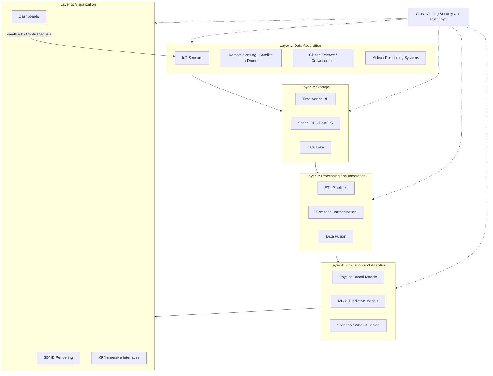

## Digital Twins for Environmental and Urban Systems

### Definition and Scope

A digital twin (DT) in the environmental and urban context is a dynamic, continuously updated virtual representation of a physical system — a watershed, city district, building stock, or infrastructure network — that is coupled to its physical counterpart via real-time or near-real-time data flows, enabling monitoring, simulation, prediction, and decision support. Digital twins are AI-powered virtual replicas of physical systems that support real-time monitoring, predictive modeling, and scenario testing, enabling system-wide insight and informed decision-making, with urban digital twins (UDTs) specifically focused on representing the built environment at urban scale. [EasyChair](https://easychair.org/cfp/DTRUE2026)

Critically, a DT differs from a static 3D/GIS model or a conventional simulation in that it maintains **bidirectional synchronization**: sensor data updates the virtual model, and the virtual model's outputs (predictions, optimizations) can, in advanced implementations, feed back into physical system control.

### Distinguishing UDTs from Traditional Simulation and BIM

Urban Digital Twins establish a dynamic connection between digital models and physical urban environments through real-time data integration, making them conceptually similar to traditional digital twins, though they distinguish themselves by adopting a human-centered perspective and capturing the dynamic and evolving nature of urban systems. This distinguishes UDTs from: [ScienceDirect](https://www.sciencedirect.com/science/article/pii/S2210670726003434)

- **Static GIS/BIM models**: fixed-in-time representations without continuous sensor coupling
- **Traditional simulations**: run in isolation from live data, typically for one-off scenario testing rather than continuous operational use
- **City Information Models (CIM)**: often a data substrate that a DT layer builds upon, rather than the live, coupled twin itself

### Reference Architecture

A widely cited five-layer reference architecture for environmental/urban DTs (applied specifically to green space and ecosystem twins) structures the system as follows: the architecture comprises five main layers: Data Acquisition, Storage, Data Processing & Integration, Simulation & Analytics, and Visualization, interconnected via standardized transmission protocols, ETL processes, and APIs, with a cross-cutting Security Layer ensuring system-wide integrity and trust. [Springer](https://link.springer.com/chapter/10.1007/978-3-032-09040-9_5)

**Layer breakdown:**

1. **Data Acquisition Layer** — IoT sensor networks, remote sensing (satellite/drone), citizen science inputs, video surveillance, positioning systems. In practice, deployment of IoT devices such as video surveillance, environmental sensors, and positioning equipment creates a comprehensive intelligent sensing network enabling real-time collection and feedback of data on human activities, environmental factors, and infrastructure operational status. [Frontiers](https://www.frontiersin.org/journals/sustainable-cities/articles/10.3389/frsc.2026.1733281/full)
2. **Storage Layer** — time-series databases, spatial databases (PostGIS), data lakes for heterogeneous multi-source data
3. **Data Processing & Integration Layer** — ETL pipelines, semantic harmonization, data fusion across formats and sources
4. **Simulation & Analytics Layer** — physics-based models (hydrology, air dispersion, thermal), machine learning/AI predictive models, scenario/what-if engines
5. **Visualization Layer** — 3D/4D rendering, dashboards, immersive/XR interfaces for stakeholder interaction

An expert-ranking study using Kendall's W concordance coefficient found strong agreement among experts that IoT, GIS, and BIM are the most suitable enabling technologies for urban digital twins due to their capacity for real-time sensing, semantic integration, and spatial representation. [ResearchGate](https://www.researchgate.net/publication/396986296_Urban_Digital_Twin_Data_Requirements_and_Reference_Architecture_for_Green_Spaces_and_Ecosystems)

### Illustrative Diagram: Five-Layer UDT Reference Architecture

### Core Technical Requirements

**Real-time data infrastructure**

Real-time integration is identified as a core element of digital twin systems, with high processing power, distributed databases, and parallel computing highlighted as essential, alongside infrastructures that support continuous data streaming and real-time simulations. Taken together, real-time data infrastructures transform digital twins from static modelling tools into dynamic monitoring environments that support predictive and adaptive management. [ScienceDirect](https://www.sciencedirect.com/science/article/pii/S2210670726003434)[ScienceDirect](https://www.sciencedirect.com/science/article/pii/S2210670726003434)

**Interoperability**

This remains one of the central technical challenges. Digital twins integrate research and operational data acquisition, models, and simulations, which creates additional heterogeneity in control mechanisms and outcomes on top of well-known data interoperability challenges — interoperability is also evolving to encompass reuse at scale with cloud, HPC/quantum computing, machine learning, AI, and heterogeneous data sources including airborne, drone, and in situ data. Operationally, interoperability can be achieved through middleware that ensures data architecture consistency across APIs, visualization, and platforms. [IEEE Xplore](https://ieeexplore.ieee.org/document/10640598/)[ScienceDirect](https://www.sciencedirect.com/science/article/pii/S2210670726003434)

**Standards landscape**

Standards Development Organizations underpin interoperability standards over longer periods, whereas community-driven efforts continually define conventions — meaning practitioners must track both formal standards (e.g., ISO 23247 for manufacturing-originated DT frameworks, OGC standards for geospatial data such as CityGML) and evolving community/open-source conventions (e.g., OpenStreetMap-based geometry pipelines). [Inference: no single unified standard governs environmental/urban DTs comprehensively as of this writing; practitioners typically compose OGC geospatial standards, sector-specific IoT protocols (MQTT, OPC-UA), and domain simulation model formats.] [IEEE Xplore](https://ieeexplore.ieee.org/document/10640598/)

### Application Domains

**Air Quality and Pollution Modeling**

A demonstrated implementation integrates real-time meteorological data, OpenStreetMap-based geometry, and high-fidelity Lattice Boltzmann Method (LBM) simulations for urban wind and pollution modeling, running with hourly updates over multi-week periods. Results showed that alternating east-west winds create a dynamic pollution distribution, identifying critical residential exposure areas, and the system allows interactive modifications to urban geometry and continuous data updates, serving as a tool for adaptive urban planning and evidence-based air quality policy. [A Digital Urban Twin Enabling Interactive Pollution Predictions and Enhanced Planning +2](https://arxiv.org/pdf/2502.13746)

**Water-Sensitive Urban Design (WSUD)**

UDTs coupled to hydrological models support real-time stormwater and flood management, extending the Green Infrastructure Planning concepts (bioswales, permeable surfaces, detention basins) into continuously monitored, predictively managed systems rather than static designs.

**Urban Green Space and Ecosystem Management**

Purpose-built architectures organize monitoring around thematic KPI groups: pollution and climate, natural environment, ecosystems, human perception, and public awareness, supporting data-driven planning, monitoring, and regeneration of green infrastructure amid growing pressure from climate change, biodiversity loss, and urbanization. [Springer](https://link.springer.com/chapter/10.1007/978-3-032-09040-9_5)[Springer](https://link.springer.com/chapter/10.1007/978-3-032-09040-9_5)

**City-Scale Lifecycle Governance**

Large-scale deployments position the DT as persistent operational infrastructure rather than a one-off model. In the Singapore–Nanjing Eco Hi-Tech Island case, the digital twin evolves from a representational mirror into an operational infrastructure — functioning as a hidden but essential "city operating system" enabling innovation across diverse domains, supporting integrated lifecycle operations across planning, construction, and long-term management phases. [Frontiers](https://www.frontiersin.org/journals/sustainable-cities/articles/10.3389/frsc.2026.1733281/full)

**Dynamic Building Codes and Climate Adaptation**

Emerging conceptual frameworks propose using AI and DTs to enable real-time monitoring and updating of building codes to address the complexities of modern urban environments and support climate change adaptation in smart, sustainable cities. [Springer](https://link.springer.com/chapter/10.1007/978-981-95-8872-5_28)

### Notable Reference Implementations

- **DUET (Digital Urban European Twins)**: an established digital twin initiative for cities promoting adoption of local and urban DTs, with a published technical architecture specifying functionalities and corresponding platform components [arxiv](https://arxiv.org/pdf/2409.19005)
- **Singapore–Nanjing Eco Hi-Tech Island**: city-scale multi-domain operational DT case study
- Sector-adjacent standard: **ISO 23247**, originally developed for manufacturing digital twins, offers a transferable reference architecture pattern (observable manufacturing elements, device communication entity, DT entity, user entity) that urban/environmental DT designers frequently adapt.

### Design Considerations and Pitfalls

- **Data heterogeneity**: environmental DTs must fuse remote sensing, ground sensors, model outputs, and citizen input — each with different spatial/temporal resolution and uncertainty characteristics
- **Computational cost of high-fidelity coupling**: physics-based simulations (LBM, CFD) at city scale require significant compute; real-time performance often necessitates surrogate/ML-accelerated models rather than full-fidelity physics at every update cycle [Inference: specific compute/latency tradeoffs are implementation-dependent and not standardized across the field]
- **Governance and trust**: quality, trust, and determinism concerns are amplified when DT outputs inform real-world operational or policy decisions [IEEE Xplore](https://ieeexplore.ieee.org/document/10640598/)
- **Fragmentation risk**: many deployments remain fragmented and fail to support integrated lifecycle operations across planning, construction, and long-term management, underscoring the need for architecture-first design rather than siloed tool adoption [Frontiers](https://www.frontiersin.org/journals/sustainable-cities/articles/10.3389/frsc.2026.1733281/full)
- **Security**: a cross-cutting security layer is considered essential architecture, not an add-on, given the sensitivity of infrastructure and citizen data flowing through the system

### Related Topics

- Green Infrastructure Planning (GI network monitoring integration)
- GIS-Based Spatial Data Infrastructure and OGC Standards (CityGML, 3D Tiles)
- Remote Sensing and Earth Observation Systems
- IoT Sensor Networks for Environmental Monitoring
- Computational Fluid Dynamics and Lattice Boltzmann Methods for Urban Airflow
- Smart City Governance and Data Interoperability Standards
- Climate Adaptation and Resilience Planning
- Machine Learning for Environmental Prediction and Scenario Modeling
- Building Information Modeling (BIM) and City Information Modeling (CIM)