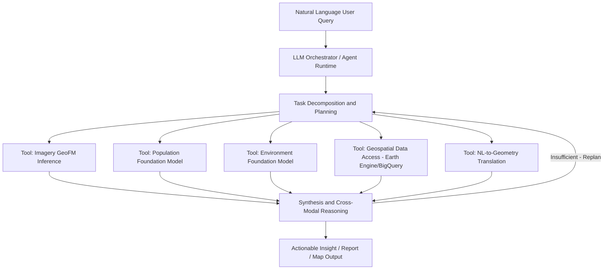

## Geospatial Foundation Models and Agentic Reasoning

### Definition and Scope

Geospatial Foundation Models (GeoFMs) are large-scale pretrained models — typically vision transformers or vision-language architectures — trained on massive volumes of Earth observation data (satellite and airborne imagery, and increasingly radar, LiDAR, and textual/environmental data) to learn general-purpose representations transferable across downstream geospatial tasks. This paper focuses on overhead imagery-based GeoFMs, those used to process satellite and airborne imagery with a downward-facing look angle, though the paradigm extends to population and environmental data domains as well.

**Agentic Geospatial Reasoning** is the emerging paradigm layered atop GeoFMs, in which multimodal Large Language Models (LLMs) act as intelligent orchestrators, leveraging GeoFMs as tools to automate complex analytical workflows directly from natural language prompts — moving the field from perception to cognition.

### Pre-Training Paradigms

Two dominant pre-training strategies define the GeoFM landscape:

**Self-Supervised Learning (Masked Autoencoding)**

Models learn representations by reconstructing masked portions of input imagery without labeled data. This produces **fine-tunable vision models** suited to dense prediction tasks (segmentation, classification, change detection) once adapted to a specific downstream task. Prithvi (NASA/IBM), trained on NASA Earth Observation remote sensing imagery, is a widely cited example of this approach, released in 2023.

**Contrastive Learning (Vision-Language Alignment)**

Models are trained to align image and text embeddings in a shared space (following architectures adapted from SigLIP, MaMMUT, OWL-ViT-style contrastive objectives). This produces **vision-language models** that enable zero-shot tasks such as open-vocabulary image analysis — querying imagery using natural language categories the model was never explicitly trained to detect.

A third emerging approach is the **implicit embedding field model**: AlphaEarth Foundations adopts this strategy, using a Space-Time Precision encoder that fuses multi-source data — including optical, radar, LiDAR, environmental, and textual information — to generate high-precision, global annual embedding fields at 10-meter resolution, enabling continuous temporal support and efficient global mapping.

### Model Adaptation Taxonomy

Operationalizing GeoFMs requires selecting an adaptation strategy appropriate to the downstream task, data availability, and compute budget:

| Strategy | Description | Typical Use Case |
| --- | --- | --- |
| Zero-shot inference | Direct application of pretrained contrastive VLM | Open-vocabulary search, rapid triage |
| Linear probing | Freeze backbone, train lightweight classifier head | Low-data regimes, quick benchmarking |
| Fine-tuning | Update model weights on labeled downstream dataset | Task-specific accuracy optimization |
| Parameter-efficient fine-tuning (PEFT) | Adapters/LoRA-style updates to subset of parameters | Resource-constrained deployment |
| Embedding-based retrieval | Use pretrained embeddings as features for downstream ML | Rapid prototyping, transfer across tasks |

A practical framework for domain experts weighs performance-cost tradeoffs across this taxonomy, since full fine-tuning of large GeoFMs is computationally expensive relative to lighter-weight adaptation approaches. [Inference: optimal strategy selection is highly task- and resource-dependent; no universal ranking applies across all mission sets.]

### Architecture of Agentic Geospatial Systems

The agentic paradigm reframes GeoFMs as **tools** invoked by an LLM orchestrator rather than standalone inference endpoints. A representative production architecture (Google's Geospatial Reasoning framework) illustrates the pattern: an agentic back-end implementing a LangGraph agent deployed on a managed agent runtime (Vertex AI Agent Engine), with LLM-accessible tools for accessing Earth Engine, BigQuery, Google Maps Platform, and cloud storage — performing routine geospatial operations such as translating between natural language and geospatial geometries, and invoking remote sensing foundation model inference endpoints.

The broader Earth AI framework generalizes this pattern: it is built upon foundation models across three key domains — Planet-scale Imagery, Population, and Environment — coordinated by an intelligent reasoning engine (Gemini-powered in this implementation) that jointly reasons over multiple foundation models along with large geospatial data sources and tools to handle complex, multi-step queries.

### Illustrative Diagram: Agentic Geospatial Reasoning Architecture

### Why Agentic Orchestration Differs From Generic Tool-Use Agents

Applying generic LLM agent frameworks directly to Earth observation (EO) workflows exposes a mismatch. Generic agentic AI models often make implicit assumptions — independent tools, reversible actions, exposed correctness signals, locally detectable errors, and sufficient internal evaluation — that do not hold for EO reasoning. EO reasoning instead operates over a structured geospatial state rather than an abstract sequence of tool calls, and many transformations are order-dependent and may be partly irreversible, meaning early mistakes can silently propagate through later stages of the workflow.

This has motivated specialized geospatial agent architectures beyond generic frameworks, including retrieval-guided orchestration, state-driven prompting, and specialized interactive analysis pipelines — exemplified by systems such as RS-Agent, Geo-OLM, Change-Agent, PEACE, and OpenEarthAgent.

### Example: Post-Disaster Damage Assessment Workflow

A demonstrated agentic application illustrates the end-to-end pattern for post-hurricane damage assessment: the system is configured with access to high-resolution aerial imagery, pre-processed using AI capabilities for geolocation and identification of critical infrastructure. The Geospatial Reasoning agent coordinates multiple specialized models into a unified system, and on a benchmark of real-world crisis scenarios, the agent demonstrates the ability to deconstruct complex problems, delegate tasks to specialized tools, and synthesize intermediate results into coherent, actionable insights — effectively bridging the gap between raw geospatial data and actionable understanding.

**Example query flow:**

1. User asks: "Which residential areas near the coast show the most severe roof damage after the storm?"
2. Orchestrator decomposes into: (a) retrieve pre/post-storm imagery, (b) run change-detection GeoFM inference, (c) cross-reference with population/building footprint data, (d) rank affected areas by severity and population exposure
3. Agent synthesizes tool outputs into a ranked report with supporting map visualization

### Benchmarking and Evaluation

Purpose-built benchmarks are emerging to evaluate tool-augmented geospatial agents under realistic, dynamic execution conditions rather than static QA — for example, GeoAgentBench evaluates tool-augmented agents specifically on spatial analysis tasks, reflecting the paradigm shift of geospatial intelligence from domain-specific small models toward general-purpose intelligent systems built on LLMs and vision-language models.

### Design and Deployment Considerations

- **Security and confidentiality**: modular integration strategies (deploying GeoFMs as callable tools behind an orchestrator) can democratize access to state-of-the-art AI/ML while maintaining the security and confidentiality of the downstream task, since sensitive imagery or analysis need not be exposed directly to a general-purpose LLM
- **Irreversibility of geospatial operations**: unlike many software agent tasks, geospatial transformations (masking, reprojection, aggregation) are frequently order-dependent and not cleanly reversible, requiring careful state tracking in agent design
- **Field maturity**: agentic geospatial reasoning is explicitly characterized by its own developers as a rapidly evolving field, with a vast landscape of additional capabilities still to explore. [Inference: given the pace of publication in this area (multiple foundational papers published within the current year), specific architectural details and benchmark leaders are likely to shift rapidly; verify against current literature for production decisions.]
- **Trusted tester / phased rollout models**: major frameworks in this space have initially been released through trusted tester programs with industry partners (e.g., WPP, Airbus, Maxar, Planet Labs) rather than general availability, reflecting the early operational maturity of the paradigm

### Related Topics

- Remote Sensing and Earth Observation Systems
- Digital Twins for Environmental and Urban Systems
- Machine Learning for Environmental Prediction and Scenario Modeling
- Vision-Language Models and Zero-Shot Open-Vocabulary Analysis
- MLOps for Geospatial Model Deployment
- Change Detection Methods in Remote Sensing
- Disaster Response and Crisis Analytics Applications
- GIS-Based Spatial Data Infrastructure and OGC Standards
- LLM Agent Architectures and Tool-Use Frameworks