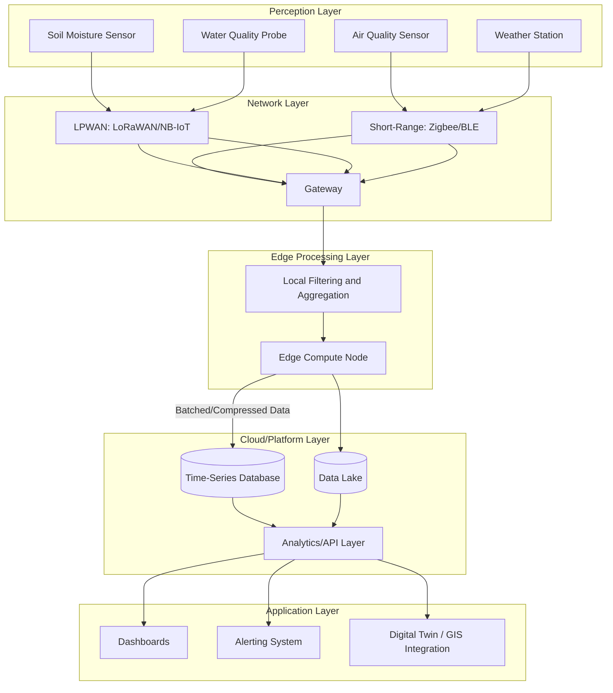
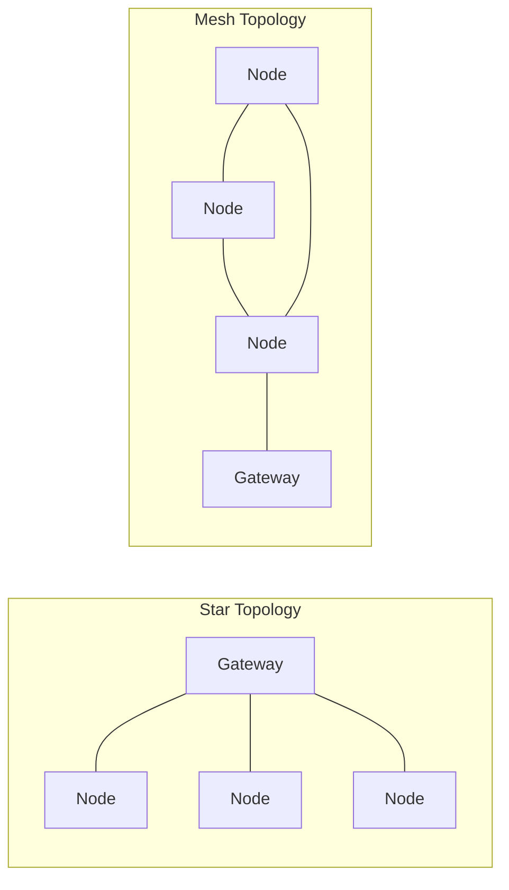

## Internet of Things Environmental Sensor Networks

### Definition and Scope

Internet of Things (IoT) Environmental Sensor Networks are distributed systems of interconnected, often low-power sensing devices deployed across a geographic area to continuously monitor environmental parameters — air quality, water quality, soil conditions, weather variables, noise, radiation, or ecological indicators — and transmit that data over wireless networks to storage, processing, and analytics platforms. These networks form the foundational **Data Acquisition Layer** underpinning applications ranging from precision agriculture to urban digital twins and climate monitoring.

### Core Architecture

IoT environmental sensor networks are conventionally structured in a layered architecture:

1. **Perception/Sensing Layer** — physical sensors and actuators (particulate matter sensors, pH probes, soil moisture sensors, weather stations, gas sensors)
2. **Network/Communication Layer** — wireless protocols transmitting data from sensor nodes to gateways and onward to cloud/edge infrastructure
3. **Edge Processing Layer** — local preprocessing, filtering, and compression at or near the sensor node to reduce bandwidth and latency
4. **Cloud/Platform Layer** — data ingestion, storage, aggregation, and analytics (time-series databases, data lakes)
5. **Application Layer** — dashboards, alerting systems, APIs for downstream consumption (e.g., feeding into digital twins or GIS platforms)

### Illustrative Diagram: IoT Environmental Sensor Network Architecture

### Sensor Types and Parameters

| Sensor Category | Measured Parameters | Common Technologies |
| --- | --- | --- |
| Air quality | PM2.5/PM10, CO2, NO2, O3, VOCs | Optical particle counters, electrochemical cells, metal-oxide sensors |
| Water quality | pH, turbidity, dissolved oxygen, conductivity, temperature | Ion-selective electrodes, optical DO sensors |
| Soil sensing | Moisture, temperature, EC, NPK | Capacitive/TDR probes, ion-selective electrodes |
| Weather | Temperature, humidity, wind speed/direction, precipitation | Thermistors, anemometers, tipping-bucket rain gauges |
| Acoustic | Noise levels, bioacoustic monitoring | MEMS microphones, acoustic arrays |
| Radiation | Gamma, UV index | Geiger-Müller tubes, UV photodiodes |

### Communication Protocols

Protocol selection is governed by a tradeoff between range, power consumption, bandwidth, and data payload size:

**Low-Power Wide-Area Networks (LPWAN)**

- **LoRaWAN**: long range (up to 10-15 km line-of-sight), very low power, low bandwidth — well suited to sparse, infrequent environmental readings across large rural or watershed areas
- **NB-IoT / LTE-M**: cellular-based LPWAN, benefits from existing carrier infrastructure, moderate power consumption

**Short-Range Protocols**

- **Zigbee**: mesh networking topology, suited to dense urban deployments with many nodes relaying through each other
- **Bluetooth Low Energy (BLE)**: very low power, short range, suited to mobile/wearable environmental sensors
- **Wi-Fi**: higher bandwidth and power draw, appropriate where mains power is available (e.g., fixed monitoring stations)

**Satellite Connectivity**

Used for remote/off-grid deployments (open ocean buoys, remote forest monitoring) lacking terrestrial network coverage, typically at higher cost per transmission and lower bandwidth.

### Power Management

Environmental sensor nodes are frequently deployed in remote, unpowered locations, making energy management a first-order design constraint:

- **Duty cycling**: sensors wake, sample, transmit, and return to sleep on a scheduled interval to conserve battery
- **Energy harvesting**: solar panels (most common), and in specialized deployments, piezoelectric or thermal harvesting supplement or replace battery power
- **Battery selection**: lithium-thionyl chloride cells are common for long-duration low-power deployments due to low self-discharge rates

Battery life estimation for a duty-cycled node follows:

$$T_{life} = \frac{C_{battery}}{I_{avg}}$$

where $I_{avg}$ is the time-weighted average current draw across sleep, sensing, and transmission states:

$$I_{avg} = \frac{I_{sleep} \cdot t_{sleep} + I_{active} \cdot t_{active}}{t_{sleep} + t_{active}}$$

**Example**: A node with $I_{sleep} = 5\,\mu A$, $I_{active} = 40\,mA$, sampling for $t_{active} = 2\,s$ every $t_{sleep} = 600\,s$ (10-minute interval), drawing from a $C_{battery} = 3000\,mAh$ cell:

$$I_{avg} = \frac{(0.005\,mA \times 600) + (40\,mA \times 2)}{602} \approx 0.138\,mA$$

$$T_{life} = \frac{3000\,mAh}{0.138\,mA} \approx 21{,}700\,\text{hours} \approx 2.5\,\text{years}$$

[Inference: this is a simplified estimate excluding self-discharge, temperature derating, and transmission retry overhead — actual deployed battery life is typically lower and should be validated empirically.]

### Data Quality and Calibration

- **Sensor drift**: low-cost environmental sensors (particularly electrochemical and metal-oxide gas sensors) are prone to drift over time and require periodic recalibration against reference-grade instruments
- **Cross-sensitivity**: gas sensors often respond to multiple analytes, requiring correction algorithms or sensor fusion to isolate the target parameter
- **Co-location calibration**: best practice involves deploying low-cost sensors alongside regulatory-grade reference monitors for a calibration period to derive correction functions (commonly linear or machine-learning-based regression models)
- **Quality flagging**: automated QA/QC pipelines flag out-of-range values, sensor faults, and communication gaps before data reaches analytics layers

### Edge Computing and Data Reduction

Given bandwidth and power constraints, raw high-frequency sensor data is rarely transmitted in full. Common edge strategies include:

- **Threshold-based transmission**: only transmit when a value crosses a defined threshold or changes significantly from the last reading
- **Statistical aggregation**: transmit periodic min/max/mean/std rather than raw samples
- **On-device anomaly detection**: lightweight ML models flag anomalies locally, triggering higher-frequency transmission only when relevant
- **Compression**: delta encoding and lossy compression reduce payload size for constrained LPWAN links

### Network Topologies

- **Star topology**: simple, low-latency, each node communicates directly with a central gateway — common in LoRaWAN deployments; single point of failure at the gateway
- **Mesh topology**: nodes relay data through neighboring nodes, extending effective range and providing redundancy — common in Zigbee deployments; higher complexity and power cost per node

### Applications in Geospatial and Environmental Science

- **Air quality monitoring networks**: dense low-cost sensor grids supplementing sparse regulatory monitoring stations, enabling fine-grained spatial interpolation of pollution surfaces
- **Precision agriculture**: soil moisture and nutrient sensor networks driving variable-rate irrigation and fertilization
- **Watershed and water quality monitoring**: distributed sensors along rivers/reservoirs feeding early-warning systems for contamination or flood events
- **Urban heat island mapping**: dense temperature sensor networks providing higher spatial resolution than satellite thermal imagery alone
- **Wildlife and biodiversity monitoring**: acoustic and camera-trap sensor networks for species presence detection
- **Feeding Digital Twins**: IoT sensor data constitutes the real-time data stream that synchronizes digital twin models with physical environmental/urban systems (see Digital Twins for Environmental and Urban Systems)

### Integration with GIS and Analytics Platforms

Sensor data is typically geotagged at ingestion and integrated into spatial databases (PostGIS) or time-series platforms with spatial extensions, enabling:

- Spatial interpolation (kriging, IDW) to generate continuous surfaces from discrete sensor points
- Integration with remote sensing data for validation/calibration of satellite-derived products
- API-based feeds into dashboards, digital twins, and early-warning systems

### Design and Deployment Considerations

- **Node density vs. cost tradeoff**: higher spatial resolution requires more nodes, increasing capital and maintenance cost; optimal density depends on the spatial autocorrelation structure of the monitored parameter
- **Maintenance accessibility**: remote deployments (forests, watersheds) incur higher maintenance cost per visit; this should factor into network design and redundancy planning
- **Data security**: environmental sensor networks are increasingly recognized as critical infrastructure, warranting attention to authentication, encrypted transmission, and tamper detection [Inference: security requirements vary substantially by application criticality — a research biodiversity sensor has different risk exposure than a municipal water safety monitoring network]
- **Interoperability**: adopting open standards (e.g., OGC SensorThings API) for data exchange improves integration with downstream GIS and digital twin platforms

### Related Topics

- Digital Twins for Environmental and Urban Systems
- Remote Sensing and Earth Observation Systems
- GIS-Based Spatial Interpolation Methods (Kriging, IDW)
- Water Quality Monitoring and Watershed Management
- Precision Agriculture and Variable-Rate Technology
- Edge Computing and Machine Learning at the Sensor Node
- Urban Heat Island Mitigation Strategies
- Green Infrastructure Planning
- Environmental Data QA/QC and Sensor Calibration Methods