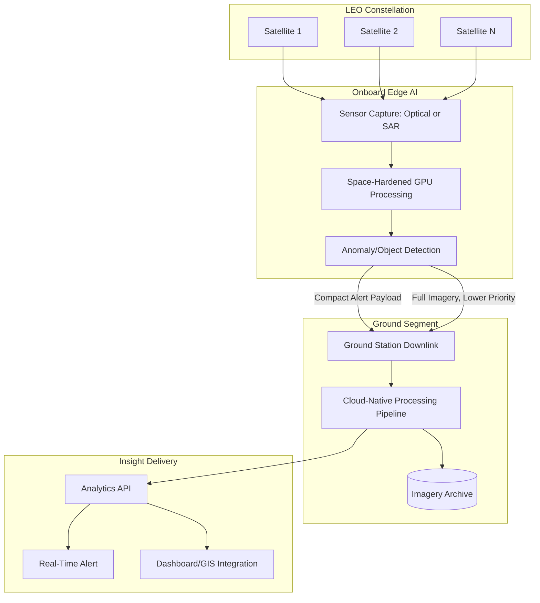

## Real-Time Earth Observation Constellations

### Definition and Scope

Real-time Earth Observation (EO) constellations are networks of multiple satellites — typically small satellites (SmallSats) or CubeSats operating in Low Earth Orbit (LEO) — coordinated to deliver high-frequency, low-latency imaging and sensing of the Earth's surface. As the Earth Observation market enters a hyper-operational phase in 2026, the reliance on massive, multibillion-dollar satellites is rapidly giving way to agile "tiny" satellite constellations, with 3U and 6U CubeSats becoming primary drivers for real-time tracking of global weather patterns, agricultural yields, and maritime shipping logistics.

The defining characteristic distinguishing these systems from legacy single-satellite EO is **revisit rate**: while legacy systems provided weekly updates, current constellations from providers like Planet and Spire Global have achieved sub-daily revisit rates, a capability now treated as a baseline requirement for modern precision agriculture, disaster response, and time-sensitive monitoring applications.

### Orbital Mechanics and Revisit Rate Fundamentals

The vast majority of commercial EO satellites operate in Low Earth Orbit, since LEO allows for higher resolutions and faster revisit rates as the satellite is both closer to the Earth and has a smaller total distance to orbit. This proximity advantage is offset by a fundamental tradeoff: when a satellite is closer to Earth, the swath width it can capture is smaller, meaning single-satellite systems must choose between resolution and coverage area.

**Constellation-based revisit** solves this by distributing coverage across multiple satellites in different orbital planes, so that revisit rates are achieved not by a single satellite returning overhead, but by a constellation of satellites passing over the same location at different times, reducing the wait between observations. As an illustrative example, a 28-satellite constellation architecture can achieve up to 25 revisits per day for many locations, enabling near-continuous global monitoring.

**Theoretical vs. Effective Revisit**

A critical distinction in operational EO planning: theoretical revisit describes how often a satellite can pass near a location, while effective revisit refers to how often high-quality, usable data is actually collected, since cloud cover, lighting conditions, or sensor limitations may prevent usable imagery from a given theoretical pass. [Inference: for optical constellations, effective revisit in persistently cloudy regions can be substantially lower than theoretical revisit; SAR constellations, being cloud-penetrating, do not share this limitation.]

### Revisit Rate Determinants

| Factor | Effect on Revisit |
| --- | --- |
| Orbital altitude | Lower altitude → faster revisit, narrower swath |
| Number of satellites | More satellites in constellation → higher aggregate revisit |
| Orbital plane distribution | Multiple planes → more varied pass geometry, higher effective revisit |
| Swath width | Wider swath → fewer satellites needed for same coverage |
| Sensor type (optical vs. SAR) | SAR unaffected by cloud cover/darkness; optical is not |
| Latitude of target | Polar-orbiting constellations revisit high latitudes more frequently than equatorial |

### From Imagery to Real-Time Insight: Orbital Edge AI

A key architectural shift in 2026-era constellations is the move from downlinking raw imagery for ground-based processing toward **onboard (edge) processing**, sometimes termed Orbital Edge AI — where satellites move from capturing static "images" to delivering real-time "answers" directly to end-users. By processing data on-board using space-hardened GPUs, these satellites can transmit a compact "detection" alert (e.g., a vessel-detected signal) in seconds, rather than downloading a multi-gigabyte image file that would require minutes of ground-based processing.

This reflects a broader value shift in the industry: the value is no longer solely in raw pixel resolution but increasingly in the pattern and timeliness of the derived insight — illustrated by the framing that a high-resolution image is of limited value if it is many hours old, whereas a lower-resolution image delivered within minutes can materially change a tactical or commercial decision.

### Illustrative Diagram: Real-Time EO Constellation Data Pipeline

### Sensor Modality Comparison

**Optical (Multispectral/Panchromatic)**

Higher spatial resolution achievable (sub-meter for leading commercial systems, e.g., 50 cm class), but limited by daylight and cloud-free conditions. Well suited to land cover classification, vegetation indices, and visual change detection.

**Synthetic Aperture Radar (SAR)**

Active sensing independent of sunlight and largely unaffected by cloud cover, enabling day/night, all-weather acquisition. Large SAR constellations have the advantage of negligible latency in data acquisition since there is generally a satellite in the vicinity of the area of interest at any given time, with rapid changes requiring tracking via short revisit times — the interval between two image acquisitions of the same area. Very high-resolution SAR combined with specific interferometric or change-detection techniques can detect even minimal changes preceding an event, supporting persistent monitoring use cases that single satellites cannot achieve.

### Resilience and Constellation Design Philosophy

A core architectural advantage of distributed small-satellite constellations over monolithic flagship satellites is fault tolerance: if one satellite in a 100-unit constellation fails, the network loses only about 1% of capacity, whereas failure of a single large flagship satellite can end the mission entirely. This resilience-through-distribution principle, combined with lower per-unit launch and manufacturing cost, underpins the industry-wide shift toward large SmallSat/CubeSat fleets over fewer exquisite satellites.

### Cloud-Native Processing and Data Democratization

EO data in the current era is processed, analyzed, and visualized directly in cloud-native environments, allowing teams to scale instantly and collaborate globally, eliminating traditional on-premises infrastructure bottlenecks. This is paired with expanding open data initiatives, as governments and international agencies increasingly release free EO data, lowering entry barriers for startups, researchers, and developing-nation users alongside commercial high-revisit offerings.

### Example: Revisit Rate Comparison Across System Classes

| System Class | Approximate Revisit | Resolution Class | Typical Use Case |
| --- | --- | --- | --- |
| Free/public (e.g., Sentinel-2 class) | ~5 days | 10 m | Broad-scale land cover, climate monitoring |
| Commercial mid-tier | Daily | 1–3 m | Agriculture, infrastructure monitoring |
| High-revisit commercial constellations | Multiple passes/day (up to ~15 at peak, mid-latitudes) | Sub-meter to few-meter | Maritime tracking, disaster response, tasking-on-demand |
| SAR constellations | Near-continuous, all-weather | Sub-meter to meter class | Persistent monitoring, night/cloud-cover change detection |

[Unverified: specific revisit figures and satellite counts for named commercial operators change frequently as constellations are actively expanded; treat cited figures as illustrative of system class capability rather than fixed specifications.]

### Applications in Environmental and Geospatial Science

- **Precision agriculture**: sub-daily revisit enables near-real-time crop health (NDVI/vegetation index) monitoring and rapid response to stress events
- **Disaster response**: high-frequency tasking supports flood extent mapping, wildfire progression tracking, and post-event damage assessment within hours rather than days
- **Maritime and environmental compliance**: vessel detection and tracking for illegal fishing monitoring, oil spill detection
- **Climate and land-cover change tracking**: persistent monitoring supports deforestation alerts and glacier/ice-sheet change detection at operationally useful timescales
- **Feeding into GeoFMs and Digital Twins**: high-revisit constellation data is an increasingly critical input stream for the geospatial foundation models and urban/environmental digital twins covered elsewhere in this chapter, providing the near-real-time imagery layer these systems reason over

### Design and Operational Considerations

- **Tasking vs. archive tradeoff**: on-demand tasking of a fresh capture typically incurs higher cost and some latency versus using recent archive imagery; workflow design should match acquisition mode to time-sensitivity of the application
- **Effective revisit planning**: mission planners should budget for the gap between theoretical and effective revisit, particularly for optical constellations in persistently cloudy regions
- **Data volume management**: onboard edge processing is increasingly necessary as constellation size and capture frequency scale, since downlinking full-resolution imagery from every pass is bandwidth-prohibitive at high revisit rates
- **Latency-critical vs. archival use cases**: not all applications require real-time delivery; matching constellation/tasking choice to actual latency requirements avoids unnecessary cost

### Related Topics

- Remote Sensing and Earth Observation Systems
- Geospatial Foundation Models and Agentic Reasoning
- Digital Twins for Environmental and Urban Systems
- Synthetic Aperture Radar (SAR) Change Detection Methods
- Disaster Response and Crisis Analytics Applications
- Cloud-Native Geospatial Data Processing
- Vegetation Index Analysis and Precision Agriculture
- Internet of Things Environmental Sensor Networks
- Open Data Policy in Earth Observation