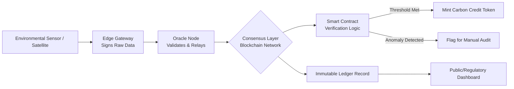
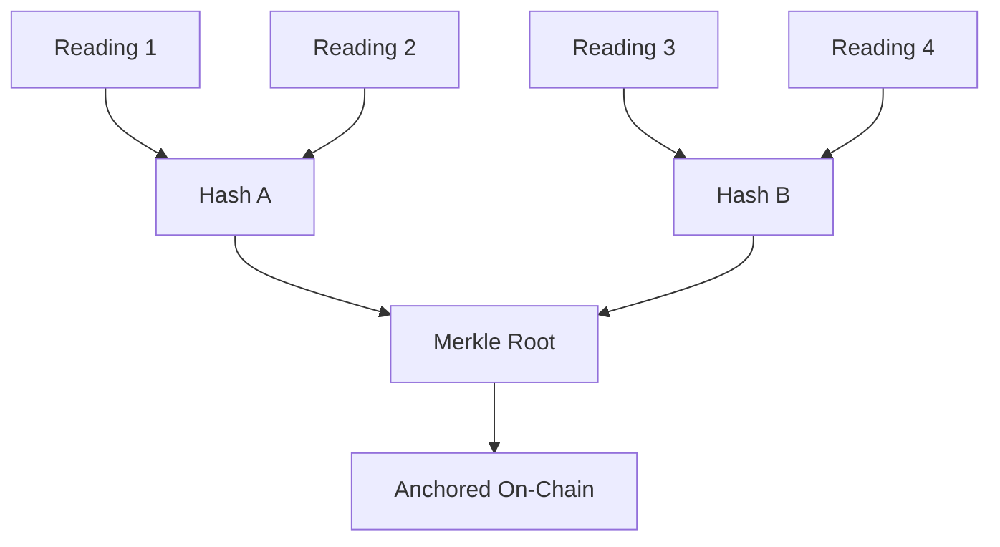

## Blockchain for Environmental Data Verification


### Overview

Blockchain for environmental data verification refers to the use of distributed ledger technology (DLT) to create tamper-evident, auditable records of environmental measurements, sensor readings, carbon credits, and compliance data. The core value proposition is establishing trust in data provenance and immutability without relying on a single centralized authority — relevant for carbon markets, ESG reporting, supply chain sustainability claims, and regulatory monitoring.

### Core Concepts

#### Why Blockchain for Environmental Data

**Key Points**

- Environmental data (emissions, water quality, deforestation rates, carbon offsets) is often self-reported, creating incentive misalignment between reporters and verifiers.
- Blockchain provides an append-only, cryptographically linked ledger where historical records cannot be altered without detection.
- Distributed consensus removes single-point-of-failure trust in one institution's database.
- Smart contracts can automate verification logic and payment triggers (e.g., releasing carbon credit payments only when IoT-sourced data meets a threshold).

[Inference] The greatest practical value emerges not from blockchain alone but from the combination of blockchain + IoT sensors + oracles, since blockchain only guarantees that recorded data hasn't been altered *after* it entered the chain — it does not guarantee the original measurement was accurate ("garbage in, garbage out" problem, commonly called the "oracle problem").

#### Core Architecture Components

1. **Data Capture Layer** — IoT sensors, satellite imagery (e.g., Sentinel-2, Planet Labs), drones, or manual field audits generate raw environmental readings.
2. **Oracle Layer** — Middleware (e.g., Chainlink, or custom oracle nodes) that signs and pushes off-chain data onto the blockchain, often with cryptographic attestation of sensor identity.
3. **Ledger Layer** — The blockchain itself (public like Ethereum/Polygon, permissioned like Hyperledger Fabric, or hybrid).
4. **Smart Contract Layer** — Encodes verification rules, tokenization logic (e.g., minting a carbon credit token), and dispute resolution.
5. **Application/Reporting Layer** — Dashboards, APIs, and regulatory reporting tools that query the ledger for auditability.

### Diagram: End-to-End Data Flow



### Blockchain Architecture Choices

#### Public vs. Permissioned Ledgers

| Dimension | Public (e.g., Ethereum, Polygon) | Permissioned (e.g., Hyperledger Fabric) |
| --- | --- | --- |
| Trust model | Trustless, open participation | Trust among known consortium members |
| Throughput | Lower (though L2s improve this) | Higher, tunable |
| Transparency | Fully public, auditable by anyone | Restricted to permissioned parties |
| Use case fit | Carbon credit marketplaces, public ESG claims | Inter-agency environmental compliance, supply chain consortiums |
| Regulatory fit | [Inference] Harder for jurisdictions requiring data residency/control | Easier to align with government data governance rules |

#### Consensus Mechanisms Relevant to Environmental Applications

- **Proof of Stake (PoS)** — Energy-efficient relative to Proof of Work; used by Ethereum post-Merge, Polygon, Algorand. Preferred for environmental applications given the irony of high energy consumption in "green" tech infrastructure.
- **Proof of Authority (PoA)** / **Practical Byzantine Fault Tolerance (PBFT)** — Common in permissioned networks like Hyperledger Fabric, where validators are known institutions (government agencies, certified auditors).
- [Unverified] Some newer chains marketed for sustainability claims use "Proof of Useful Work" variants tying computation to climate modeling, but adoption remains limited and claims should be independently verified per project.

### The Oracle Problem in Environmental Contexts

**Key Points**

- Blockchains cannot natively query real-world data; they require oracles to bridge off-chain sensor data to on-chain smart contracts.
- If a sensor is compromised, miscalibrated, or spoofed, the blockchain will faithfully and immutably record incorrect data — immutability protects data *integrity after entry*, not data *accuracy at capture*.
- Mitigation strategies:
  - **Multi-source attestation**: Requiring agreement from multiple independent sensors/satellites before data is accepted (analogous to consensus, but at the data-source level).
  - **Hardware-based trust roots**: Using tamper-evident hardware (Trusted Platform Modules, secure enclaves) on sensors so data is cryptographically signed at the point of capture.
  - **Reputation-weighted oracles**: Networks like Chainlink allow weighting oracle inputs by historical reliability.
  - **Hybrid human-in-the-loop audits**: Periodic physical/satellite cross-verification against on-chain claims (e.g., verifying a reported reforestation project via satellite imagery analysis).

### Practical Applications

#### 1. Carbon Credit Verification and Tokenization

Carbon credits are tokenized as fungible or non-fungible tokens (NFTs) representing a verified unit of emissions reduction (typically 1 metric ton CO2e).

**Example** — Simplified Solidity smart contract pattern for a carbon credit mint gated by oracle-verified data:

```solidity
// SPDX-License-Identifier: MIT
pragma solidity ^0.8.20;

import "@chainlink/contracts/src/v0.8/interfaces/AggregatorV3Interface.sol";
import "@openzeppelin/contracts/token/ERC20/ERC20.sol";

contract CarbonCreditToken is ERC20 {
    address public oracleAddress;
    uint256 public constant CO2_THRESHOLD_PPM = 400;

    struct VerificationRecord {
        uint256 timestamp;
        uint256 co2Reading;
        bytes32 sensorId;
        bool verified;
    }

    mapping(bytes32 => VerificationRecord) public records;

    event CreditMinted(address indexed recipient, uint256 amount, bytes32 sensorId);
    event AnomalyFlagged(bytes32 sensorId, uint256 reading);

    constructor(address _oracle) ERC20("VerifiedCarbonCredit", "VCC") {
        oracleAddress = _oracle;
    }

    modifier onlyOracle() {
        require(msg.sender == oracleAddress, "Unauthorized oracle");
        _;
    }

    function submitVerifiedReading(
        bytes32 sensorId,
        uint256 co2Reading,
        address projectOwner
    ) external onlyOracle {
        records[sensorId] = VerificationRecord({
            timestamp: block.timestamp,
            co2Reading: co2Reading,
            sensorId: sensorId,
            verified: co2Reading < CO2_THRESHOLD_PPM
        });

        if (co2Reading < CO2_THRESHOLD_PPM) {
            _mint(projectOwner, 1 * 10**decimals());
            emit CreditMinted(projectOwner, 1 * 10**decimals(), sensorId);
        } else {
            emit AnomalyFlagged(sensorId, co2Reading);
        }
    }
}
```

[Unverified] This contract is illustrative of common design patterns, not a production-audited implementation; real carbon credit protocols (e.g., Toucan Protocol, KlimaDAO, Regen Network) include additional safeguards such as retirement mechanisms to prevent double-counting, and legal wrapping tied to registries like Verra or Gold Standard.

#### 2. Deforestation and Land-Use Monitoring

Satellite-derived NDVI (Normalized Difference Vegetation Index) or forest-cover-change data is hashed and anchored on-chain at regular intervals, creating an immutable timeline against which land-use claims (e.g., "no deforestation since 2020") can be checked.

$$NDVI = \frac{NIR - Red}{NIR + Red}$$

Where $NIR$ is near-infrared reflectance and $Red$ is red-band reflectance. A declining NDVI trend anchored on-chain over time provides auditable evidence for deforestation claims tied to supply chain due diligence (e.g., EU Deforestation Regulation compliance).

#### 3. Water Quality and Emissions Compliance Monitoring

Permissioned blockchains allow regulatory agencies, factories, and independent auditors to share a common ledger of continuous emissions monitoring system (CEMS) data or water quality sensor readings, reducing disputes over compliance history.

#### 4. Renewable Energy Certificates (RECs) and Guarantees of Origin

Blockchain tracks the generation and retirement of renewable energy certificates, preventing the same unit of green energy from being counted twice by different buyers ("double-counting" problem in voluntary carbon and energy markets).

### Data Integrity Techniques

#### Merkle Trees for Efficient Verification

Large batches of sensor data are hashed into a Merkle tree; only the root hash is stored on-chain, dramatically reducing on-chain storage costs while still allowing any individual reading to be cryptographically proven as part of the verified batch.



#### Hash Anchoring Pattern

$$H_{root} = \text{Hash}(H(D_1) \Vert H(D_2) \Vert ... \Vert H(D_n))$$

Only $H_{root}$ (a single 32-byte value for SHA-256) is written on-chain per batch, while the full dataset $D_1...D_n$ remains in off-chain storage (e.g., IPFS or a traditional database), referenced by content-addressed hash.

### SVG: On-Chain vs. Off-Chain Data Split (svg_diagram)

<svg xmlns="http://www.w3.org/2000/svg" viewBox="0 0 700 320">
<text x="350" y="25" font-size="16" font-weight="bold" text-anchor="middle" fill="#1a1a1a">On-Chain vs Off-Chain Data Architecture (svg_diagram)</text>
<rect x="30" y="60" width="280" height="200" rx="8" fill="#eef5ff" stroke="#3a6ea5" stroke-width="2" />
<text x="170" y="85" font-size="13" font-weight="bold" text-anchor="middle" fill="#1a1a1a">Off-Chain Storage</text>
<rect x="55" y="100" width="230" height="35" rx="4" fill="#ffffff" stroke="#3a6ea5" />
<text x="170" y="122" font-size="11" text-anchor="middle">Raw Sensor Readings</text>
<rect x="55" y="145" width="230" height="35" rx="4" fill="#ffffff" stroke="#3a6ea5" />
<text x="170" y="167" font-size="11" text-anchor="middle">Satellite Imagery Files</text>
<rect x="55" y="190" width="230" height="35" rx="4" fill="#ffffff" stroke="#3a6ea5" />
<text x="170" y="212" font-size="11" text-anchor="middle">IPFS / Cloud Database</text>
<rect x="390" y="60" width="280" height="200" rx="8" fill="#fff4e6" stroke="#c97a1a" stroke-width="2" />
<text x="530" y="85" font-size="13" font-weight="bold" text-anchor="middle" fill="#1a1a1a">On-Chain Ledger</text>
<rect x="415" y="100" width="230" height="35" rx="4" fill="#ffffff" stroke="#c97a1a" />
<text x="530" y="122" font-size="11" text-anchor="middle">Merkle Root Hash</text>
<rect x="415" y="145" width="230" height="35" rx="4" fill="#ffffff" stroke="#c97a1a" />
<text x="530" y="167" font-size="11" text-anchor="middle">Timestamp + Sensor ID</text>
<rect x="415" y="190" width="230" height="35" rx="4" fill="#ffffff" stroke="#c97a1a" />
<text x="530" y="212" font-size="11" text-anchor="middle">Smart Contract State</text>
<line x1="310" y1="150" x2="390" y2="150" stroke="#555" stroke-width="2" marker-end="url(#arrow)" />
<text x="350" y="140" font-size="10" text-anchor="middle">hash()</text>
<text x="350" y="300" font-size="11" text-anchor="middle" fill="#555">Only the hash digest is stored on-chain; bulk data remains off-chain and content-addressed</text>

</svg>

### Standards, Registries, and Interoperability

- **Verra (VCS)** and **Gold Standard** — Leading voluntary carbon credit registries; several blockchain protocols (Toucan, Moss.Earth) bridge tokenized credits back to these registries, though bridging has drawn criticism over "zombie credits" (already-retired credits being tokenized).
- **ISO 14064** — International standard for greenhouse gas quantification and verification; blockchain systems are increasingly designed to produce audit trails compatible with ISO 14064 reporting requirements.
- **W3C Verifiable Credentials** — Used alongside blockchain to represent auditor certifications and attestations in an interoperable, cryptographically verifiable format.
- **InterWork Alliance (IWA) Climate Action Data Trust** — A World Bank-backed initiative to create a federated, blockchain-based meta-registry linking existing carbon registries.

### Limitations and Criticisms

**Key Points**

- **Energy consumption paradox**: Proof-of-Work chains (legacy Bitcoin-style) consume significant energy, undermining "green tech" positioning; this has driven a shift toward PoS/permissioned models for environmental use cases.
- **Oracle trust dependency**: The system is only as trustworthy as the weakest link in the data capture/oracle chain — blockchain does not solve sensor fraud or satellite data manipulation.
- **Regulatory uncertainty**: [Inference] Financial regulators in many jurisdictions have not fully clarified how tokenized carbon credits are classified (commodity, security, or neither), creating legal ambiguity for market participants.
- **Double-counting risks persist**: Bridging off-chain registries to on-chain tokens has historically caused instances of credits being both retired in the original registry and separately traded on-chain.
- **Scalability and cost**: Public blockchain transaction (gas) fees can be volatile and, during network congestion, may exceed the economic value of a single microtransaction-scale environmental data update.

### Practical Setup Pattern (Permissioned Network Example)

**Example** — Hyperledger Fabric-based deployment steps for an inter-agency environmental compliance network:

1. Define consortium members (e.g., environmental regulator, certified auditors, factory operators) as distinct Fabric organizations, each with their own Certificate Authority (CA).
2. Design the chaincode (smart contract) to encode compliance thresholds (e.g., maximum permissible emissions per reporting period).
3. Configure channels to segment data visibility — e.g., a private channel between regulator and specific facility, separate from public-facing aggregate reporting channels.
4. Integrate IoT gateway middleware (e.g., using MQTT-to-REST bridges) to push signed sensor payloads to a Fabric client application, which submits transactions via the Fabric SDK.
5. Implement an endorsement policy requiring signatures from both the facility operator and an independent auditor node before a compliance record is committed.
6. Expose a read-only REST API (via Fabric Gateway) for public dashboards or regulatory reporting tools to query committed ledger state without write access.

[Unverified] Specific Hyperledger Fabric API and SDK method signatures should be checked against the current Fabric documentation, since these interfaces have changed across major versions.

### Next Steps

**Related Topics**

- Digital MRV (Measurement, Reporting, Verification) systems for climate finance
- IoT sensor networks and edge computing for environmental monitoring
- Satellite remote sensing (NDVI, SAR) for land-use change detection
- Carbon credit market mechanisms and Article 6 of the Paris Agreement
- Smart contract security auditing practices
- Decentralized oracle networks (Chainlink, Band Protocol)
- ESG data standards and corporate sustainability reporting frameworks (GRI, SASB, TCFD)
- Zero-knowledge proofs for privacy-preserving environmental compliance disclosure