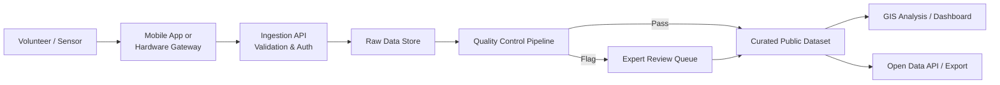

## Citizen Science and Crowdsourced Monitoring


### Overview

Citizen science and crowdsourced monitoring refers to the collection, submission, and validation of environmental data by non-professional volunteers, often coordinated through mobile applications, web platforms, and low-cost sensor networks. In geospatial and environmental science, this approach dramatically expands spatial and temporal data coverage beyond what professional monitoring networks can achieve alone, at the cost of introducing data quality, bias, and validation challenges that require specific technical mitigation strategies.

### Core Concepts

#### Defining Characteristics

**Key Points**

- **Volunteered Geographic Information (VGI)** — A term coined by Michael Goodchild (2007) describing the phenomenon of citizens acting as sensors, generating geotagged data (observations, photos, measurements) that feeds into geographic databases.
- **Spatial and temporal density** — Citizen science networks can achieve sampling densities (e.g., thousands of air quality sensors in a city) that are economically infeasible for centralized agencies to deploy and maintain.
- **Data heterogeneity** — Contributions vary widely in instrument calibration, observer skill, and reporting consistency, requiring downstream statistical correction.
- **Participation models** range from passive sensing (background app-based noise/location logging) to active reporting (manually logging a bird sighting) to contributory processing (classifying satellite imagery on a platform like Zooniverse).

#### Typology of Citizen Science Projects

| Model | Description | Example |
| --- | --- | --- |
| Contributory | Volunteers collect data per protocol designed by scientists | eBird, iNaturalist |
| Collaborative | Volunteers help design methodology and collect/analyze data | Community-led water quality monitoring |
| Co-created | Volunteers involved from question formulation onward | Indigenous-led environmental monitoring programs |
| Crowdsourced processing | Volunteers classify/label existing data rather than collect new data | Zooniverse's Planet Hunters, Galaxy Zoo (astro analogs); Global Forest Watch imagery tagging |
| Sensor-based passive | Low-cost hardware sensors deployed by volunteers stream continuous data | PurpleAir, Safecast |

### System Architecture

#### General Data Pipeline



#### Key Architectural Components

1. **Data Capture Layer** — Mobile apps (iOS/Android, often built on frameworks like React Native or Flutter), GPS-enabled cameras, low-cost sensor kits (e.g., Arduino/ESP32-based air quality monitors).
2. **Geolocation and Metadata Tagging** — Every observation typically includes latitude/longitude (via device GPS or manual pin-drop), timestamp, and observer ID, following the Darwin Core standard for biodiversity data where applicable.
3. **Validation/QA Layer** — Automated range-checking, outlier detection, and community or expert peer review workflows.
4. **Data Aggregation and Storage** — Backend databases (commonly PostgreSQL/PostGIS for spatial queries) exposing REST or GraphQL APIs.
5. **Visualization/Dashboard Layer** — Web maps (Leaflet, Mapbox GL JS) rendering point/heatmap layers, often with temporal sliders.

### Data Quality and Validation Techniques

#### The Core Challenge

**Key Points**

- Non-expert observers introduce identification errors (e.g., species misidentification), instrument miscalibration, and non-random spatial sampling bias (data clusters near populated/accessible areas, undersampling remote regions).
- [Inference] Because volunteer participation correlates with population density and internet access, raw crowdsourced datasets often systematically underrepresent rural, low-income, or protected/inaccessible areas — a bias that must be corrected for before use in scientific inference, not just noted.

#### Common Validation Strategies

1. **Expert-in-the-loop review** — A subset of submissions is manually verified by domain experts (used heavily in iNaturalist's "Research Grade" designation, which requires community consensus plus taxonomic agreement).
2. **Redundant/multi-observer consensus** — Requiring independent agreement from multiple volunteers on the same observation before acceptance.
3. **Reputation and trust scoring** — Weighting an observer's historical accuracy (tracked via past verified submissions) into confidence scores for new submissions.
4. **Automated outlier detection** — Statistical filtering (e.g., z-score thresholds, spatial autocorrelation checks via Moran's I) to flag anomalous readings for review.
5. **Sensor calibration co-location** — Deploying low-cost sensors alongside reference-grade instruments to derive calibration correction factors, a technique widely used in low-cost air quality networks like PurpleAir, which apply correction algorithms against EPA reference monitors.

#### Statistical Bias Correction Example

A common correction for low-cost PM2.5 sensor bias (following EPA-style correction approaches):

$$PM_{2.5,corrected} = a \cdot PM_{2.5,raw} + b \cdot RH + c$$

Where $RH$ is relative humidity (a major confounding factor for optical particle sensors), and $a$, $b$, $c$ are regression coefficients derived from co-location studies against reference-grade monitors. [Unverified] Exact coefficients vary significantly by sensor model, region, and humidity range, and published correction equations (e.g., the EPA's national PurpleAir correction) should be sourced directly from current EPA or manufacturer documentation rather than assumed universal.

### Prominent Platforms and Case Studies

#### eBird (Cornell Lab of Ornithology)

- Global bird observation database; over 1 billion observations submitted by volunteers as of recent years.
- Uses semi-structured checklists (complete checklist protocol) enabling occupancy modeling and detection-probability-adjusted analyses rather than treating raw counts as absolute abundance.
- Backend applies automated filters (regional/seasonal expected-species filters) that flag unusual reports for regional reviewer approval.

#### iNaturalist

- Combines citizen photo submissions with a computer-vision-assisted species identification suggestion engine (a CNN-based classifier).
- "Research Grade" status requires community identification consensus, feeding verified records into the Global Biodiversity Information Facility (GBIF).

#### Global Forest Watch / Forest Watcher

- Combines satellite-derived deforestation alerts (from sources like the University of Maryland's GLAD alert system) with on-the-ground volunteer and indigenous community verification via mobile apps, closing the loop between remote sensing signals and ground-truth confirmation.

#### Safecast

- Grassroots radiation monitoring network established after the 2011 Fukushima disaster; volunteers built and deployed Geiger counter-based sensors (the "bGeigie" device), publishing an open dataset now containing over 150 million radiation measurements. [Unverified — exact current count should be checked against Safecast's live dataset, as it continues to grow.]

#### PurpleAir

- Distributed network of low-cost laser particle counter sensors reporting real-time PM2.5/PM10 data, integrated into platforms like the U.S. EPA's AirNow Fire and Smoke Map alongside regulatory-grade monitors, using bias-correction algorithms to align low-cost sensor readings with reference standards.

### Geospatial Data Standards Relevant to Citizen Science

- **Darwin Core (DwC)** — Biodiversity data exchange standard (used by GBIF, iNaturalist) defining fields like `decimalLatitude`, `decimalLongitude`, `eventDate`, `scientificName`.
- **OGC Sensor Web Enablement (SWE)** — Standards (SensorML, Observations & Measurements/O&M) for describing and exchanging sensor-derived observations in interoperable form.
- **GeoJSON / KML** — Common lightweight formats for exporting point observation data to web maps.
- **Citizen Science Association (CSA) Data & Metadata Standards** — Best-practice guidelines for metadata completeness (observer ID, protocol version, instrument type) to support downstream scientific reuse.

### Example: Minimal Ingestion API Schema

```json
{
  "observation_id": "uuid-v4",
  "observer_id": "hashed-user-id",
  "timestamp_utc": "2026-09-15T08:32:00Z",
  "location": {
    "type": "Point",
    "coordinates": [120.9842, 14.5995]
  },
  "coordinate_uncertainty_m": 12,
  "parameter": "PM2.5",
  "value": 34.2,
  "unit": "ug/m3",
  "instrument_type": "PurpleAir PA-II",
  "qa_flag": "pending_review",
  "media_url": "https://example.org/photo.jpg"
}
```

**Key Points on Schema Design**

- `coordinate_uncertainty_m` is essential metadata often omitted by naive implementations — GPS accuracy on consumer devices varies widely (typically 3–15 m under open sky, degrading substantially in urban canyons or under canopy).
- `qa_flag` supports a review-state machine (`pending_review` → `verified` / `rejected` / `needs_expert`) rather than a binary accept/reject.
- Storing raw `instrument_type` enables retroactive bias-correction if better calibration models become available later.

### SVG: Spatial Bias in Crowdsourced Sampling (svg_diagram)

<svg xmlns="http://www.w3.org/2000/svg" viewBox="0 0 700 340">
<text x="350" y="25" font-size="16" font-weight="bold" text-anchor="middle" fill="#1a1a1a">Spatial Sampling Bias in Citizen Science Data (svg_diagram)</text>
<rect x="30" y="55" width="300" height="240" fill="#f5f5f0" stroke="#888" stroke-width="1.5" />
<text x="180" y="75" font-size="12" font-weight="bold" text-anchor="middle">Urban Area (High Density)</text>
<circle cx="70" cy="100" r="4" fill="#2a7de1" />
<circle cx="90" cy="110" r="4" fill="#2a7de1" />
<circle cx="110" cy="95" r="4" fill="#2a7de1" />
<circle cx="130" cy="120" r="4" fill="#2a7de1" />
<circle cx="150" cy="105" r="4" fill="#2a7de1" />
<circle cx="75" cy="140" r="4" fill="#2a7de1" />
<circle cx="100" cy="150" r="4" fill="#2a7de1" />
<circle cx="125" cy="145" r="4" fill="#2a7de1" />
<circle cx="160" cy="140" r="4" fill="#2a7de1" />
<circle cx="185" cy="115" r="4" fill="#2a7de1" />
<circle cx="200" cy="135" r="4" fill="#2a7de1" />
<circle cx="220" cy="100" r="4" fill="#2a7de1" />
<circle cx="240" cy="125" r="4" fill="#2a7de1" />
<circle cx="260" cy="110" r="4" fill="#2a7de1" />
<circle cx="150" cy="170" r="4" fill="#2a7de1" />
<circle cx="180" cy="180" r="4" fill="#2a7de1" />
<circle cx="210" cy="165" r="4" fill="#2a7de1" />
<text x="180" y="230" font-size="11" text-anchor="middle" fill="#555">Dense sampling</text>
<text x="180" y="245" font-size="11" text-anchor="middle" fill="#555">(near population centers)</text>
<rect x="370" y="55" width="300" height="240" fill="#f0f5f0" stroke="#888" stroke-width="1.5" />
<text x="520" y="75" font-size="12" font-weight="bold" text-anchor="middle">Rural / Remote Area (Low Density)</text>
<circle cx="420" cy="120" r="4" fill="#2a7de1" />
<circle cx="580" cy="200" r="4" fill="#2a7de1" />
<circle cx="500" cy="250" r="4" fill="#2a7de1" />
<text x="520" y="230" font-size="11" text-anchor="middle" fill="#555">Sparse sampling</text>
<text x="520" y="245" font-size="11" text-anchor="middle" fill="#555">(undersampled ground truth)</text>

<text x="350" y="320" font-size="11" text-anchor="middle" fill="#555">Correction required: spatial interpolation, stratified weighting, or targeted deployment incentives</text>

</svg>

### Applications in Environmental Monitoring

1. **Air quality mapping** — Dense low-cost sensor grids supplement sparse regulatory monitoring stations, enabling hyperlocal pollution hotspot identification (e.g., near highways, industrial zones).
2. **Biodiversity and phenology tracking** — Species range shifts and flowering/migration timing changes tracked at continental scale via platforms like iNaturalist and eBird, feeding into climate change impact studies.
3. **Water quality monitoring** — Community-based testing kits (e.g., for pH, turbidity, nitrates) coordinated through programs like EarthEcho Water Challenge or FreshWater Watch.
4. **Disaster response mapping** — Crisis mapping platforms (e.g., Humanitarian OpenStreetMap Team, Ushahidi) crowdsource real-time damage assessment and needs-mapping during floods, earthquakes, and wildfires.
5. **Marine debris and plastic pollution tracking** — Apps like Marine Debris Tracker enable geotagged litter reporting feeding into policy-relevant pollution hotspot datasets.
6. **Deforestation ground-truthing** — Combining satellite alert systems with local community verification to reduce false positives and build locally actionable enforcement datasets.

### Integration with Geospatial Analysis Workflows

**Example** — Python pattern for ingesting and spatially joining crowdsourced point data with administrative boundaries using GeoPandas:

```python
import geopandas as gpd
import pandas as pd

# Load crowdsourced observations (e.g., exported from an API as GeoJSON)
observations = gpd.read_file("citizen_observations.geojson")

# Load administrative boundary polygons for spatial aggregation
admin_boundaries = gpd.read_file("admin_boundaries.geojson")

# Ensure matching coordinate reference systems before spatial join
observations = observations.to_crs(admin_boundaries.crs)

# Spatial join: attach administrative region to each observation
joined = gpd.sjoin(observations, admin_boundaries, how="left", predicate="within")

# Aggregate: mean pollutant reading per administrative region
summary = joined.groupby("admin_name")["value"].agg(["mean", "count", "std"])

# Flag regions with low sample counts as statistically unreliable
summary["reliable"] = summary["count"] >= 30
print(summary)
```

[Inference] The `count >= 30` threshold reflects a common rule-of-thumb minimum sample size for stable mean estimation under approximate normality assumptions, not a universally validated statistical standard — actual required sample size depends on the underlying variance and desired confidence interval.

### Limitations and Criticisms

**Key Points**

- **Sampling bias** — Data density correlates with human accessibility and interest, not with scientific sampling design, requiring statistical correction (post-stratification, spatial interpolation) before use in formal inference.
- **Verification burden** — Expert-in-the-loop review, while improving accuracy, is not infinitely scalable and can become a bottleneck as submission volume grows.
- **Sensor heterogeneity** — Mixing device/instrument models without proper calibration metadata undermines cross-comparability of results.
- **Sustained engagement** — [Inference] Many citizen science projects experience participation drop-off after initial novelty, a pattern documented across multiple platform studies, which can create temporal gaps or declining spatial coverage over a project's lifetime.
- **Data ownership and privacy** — Precise geolocation of observations (e.g., rare/endangered species sightings) can inadvertently expose sensitive locations to poachers or collectors; platforms like iNaturalist implement location "obscuring" for threatened species by default.
- **Equity of participation** — Requires smartphone/internet access, potentially excluding populations most affected by the environmental issues being studied.

### Next Steps

**Related Topics**

- Volunteered Geographic Information (VGI) theory and spatial data quality frameworks
- Low-cost sensor calibration techniques and co-location study design
- Remote sensing ground-truth validation workflows
- OGC Sensor Web Enablement (SensorML, O&M) standards
- Computer vision for automated species/image classification (relevant to iNaturalist-style platforms)
- Environmental justice and equity in monitoring network deployment
- Open data licensing and GBIF data publishing workflows
- Statistical methods for occupancy modeling and detection-probability correction in ecological survey data