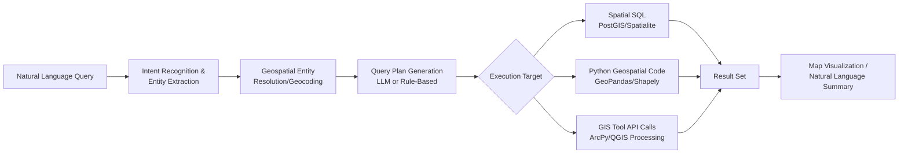

## Natural Language Interfaces for Geospatial Analysis


### Overview

Natural language interfaces (NLIs) for geospatial analysis allow users to query, manipulate, and analyze spatial data using conversational or written natural language rather than formal query languages (SQL/spatial SQL), GIS software menus, or programming APIs. This emerging area combines natural language processing (NLP), large language models (LLMs), and geospatial computing to lower the barrier to entry for spatial analysis, translating intents like "show me all flood zones within 2 km of hospitals" into executable spatial queries, code, or visualizations.

### Core Concepts

#### Why Natural Language Interfaces for GIS

**Key Points**

- Traditional GIS workflows require familiarity with spatial query languages (e.g., PostGIS SQL), desktop GIS tool chains (ArcGIS ModelBuilder, QGIS Processing), or GIS-specific APIs (ArcPy, GeoPandas), creating a steep learning curve for non-specialists.
- NLIs aim to democratize spatial analysis for domain experts (public health officials, urban planners, environmental scientists) who understand the questions they want answered but lack GIS programming expertise.
- The core technical challenge is **semantic parsing**: translating ambiguous, context-dependent natural language into unambiguous, executable geospatial operations (buffer, intersect, spatial join, routing, etc.).

#### The Translation Pipeline



### Architectural Approaches

#### 1. Rule-Based / Template-Matching Systems (Legacy Approach)

- Pre-LLM systems relied on grammars and slot-filling: matching phrases against predefined templates (e.g., "show [FEATURE] within [DISTANCE] of [LOCATION]") and extracting named entities into fixed query slots.
- **Key Points**: Highly predictable and auditable but brittle — fails on paraphrased or compound queries outside the template set. [Inference] Largely superseded by LLM-based approaches in current research and commercial tooling, though still used in constrained-vocabulary voice assistant contexts (e.g., in-car navigation "find nearest gas station").

#### 2. LLM-Based Text-to-SQL / Text-to-Code Approaches

- Modern systems use large language models to translate natural language directly into spatial SQL (e.g., PostGIS queries) or executable Python code (GeoPandas/Shapely operations).
- Typically implemented via **retrieval-augmented generation (RAG)**: the LLM is given schema context (table names, column types, available spatial functions) alongside the user's question to ground the generated query in the actual database structure.
- **Function calling / tool use** patterns (as in modern LLM APIs) allow the model to invoke discrete geospatial functions (`buffer()`, `intersects()`, `nearest_neighbor()`) rather than freely generating raw SQL, improving reliability and reducing injection risk.

#### 3. Agentic Geospatial Analysis Systems

- More advanced systems use multi-step agent loops: the LLM plans a sequence of spatial operations, executes each via tool calls, inspects intermediate results, and iterates — analogous to a human analyst's iterative workflow in a GIS desktop tool.
- [Unverified] This is an active and fast-moving research/product area; specific named systems, benchmark results, and commercial tool capabilities should be verified against current documentation and papers rather than assumed stable, as both open-source and commercial offerings are evolving rapidly.

### Key Technical Challenges

#### Geospatial Entity Resolution (Toponym Resolution)

**Key Points**

- Place names in natural language are frequently ambiguous: "Springfield" exists in dozens of U.S. states; "the river" is meaningless without context.
- Resolution typically combines:
  - **Gazetteer lookup** (e.g., GeoNames, OpenStreetMap Nominatim) to map a place name string to candidate geographic coordinates/geometries.
  - **Context-based disambiguation** using surrounding text (mentioned country/region, conversation history, user's current map viewport) to select the correct candidate among homonyms.
  - **Geocoding APIs** (Nominatim, Google Geocoding API, Mapbox Geocoding) to convert resolved place names into coordinates or bounding geometries.

#### Spatial Relationship and Operator Mapping

Natural language spatial prepositions must be mapped to formal spatial predicates:

| Natural Language | Formal Spatial Operation |
| --- | --- |
| "near", "close to" | Buffer + intersects, or k-nearest-neighbor with distance threshold |
| "within X km of" | `ST_DWithin(geom1, geom2, X)` (PostGIS) |
| "inside", "contained in" | `ST_Within` / `ST_Contains` |
| "overlapping" | `ST_Intersects` / `ST_Overlaps` |
| "along the route" | Line buffer + spatial join |
| "upstream of" | Requires hydrological network topology, not simple geometric distance |
| "between A and B" | Convex hull, corridor buffer, or routing-based interpretation depending on domain context |

[Inference] Ambiguous prepositions like "near" require a default distance threshold to be assumed by the system when none is specified by the user; well-designed NLIs surface this assumption back to the user (e.g., "showing results within 1 km — adjust?") rather than silently guessing, since an unstated default can silently bias results.

#### Ambiguity and Underspecification

- Users often omit critical parameters (units, time range, exact spatial operator) that a formal query requires.
- Robust systems implement **clarification dialogue** — the interface asks a follow-up question rather than guessing when confidence in the parsed intent is low, particularly for high-stakes environmental/planning decisions.

### Practical Implementation Pattern

**Example** — Simplified architecture combining an LLM with a PostGIS backend via function calling, illustrating the general pattern used in text-to-spatial-SQL systems:

```python
import psycopg2
from typing import Any

# Schema context provided to the LLM for grounding
SCHEMA_CONTEXT = """
Table: flood_zones (id, geom GEOMETRY(Polygon, 4326), risk_level TEXT)
Table: hospitals (id, name TEXT, geom GEOMETRY(Point, 4326))
Available spatial functions: ST_DWithin, ST_Intersects, ST_Buffer, ST_Distance
"""

def generate_spatial_sql(user_query: str, schema_context: str) -> str:
    """
    Sends the user query + schema context to an LLM, requesting
    ONLY a parameterized SQL query as output (no free-form prose).
    """
    prompt = f"""
    Given this schema:
    {schema_context}

    Translate this question into a valid PostGIS SQL query.
    Question: "{user_query}"

    Return ONLY the SQL query, no explanation.
    """
    # llm_response = call_llm_api(prompt)  # Placeholder for actual LLM call
    # return llm_response.strip()
    raise NotImplementedError("Illustrative pattern — connect to an LLM API")

def execute_safely(sql_query: str, connection) -> list[dict[str, Any]]:
    """
    Executes generated SQL with safeguards: read-only transaction,
    query timeout, and result row limit to prevent runaway queries.
    """
    with connection.cursor() as cur:
        cur.execute("SET TRANSACTION READ ONLY")
        cur.execute("SET statement_timeout = '10s'")
        cur.execute(sql_query)
        columns = [desc[0] for desc in cur.description]
        rows = cur.fetchmany(1000)  # Hard cap on returned rows
        return [dict(zip(columns, row)) for row in rows]

# Example resulting query for: "Show flood zones within 2km of hospitals"
EXAMPLE_GENERATED_SQL = """
SELECT DISTINCT fz.id, fz.risk_level, fz.geom
FROM flood_zones fz
JOIN hospitals h ON ST_DWithin(fz.geom::geography, h.geom::geography, 2000)
"""
```

**Key Points on Safety Patterns**

- LLM-generated SQL should always execute under a **read-only** database role/transaction to prevent unintended data modification.
- **Statement timeouts** and **row limits** guard against runaway or overly broad queries (e.g., an unfiltered join across large tables).
- Schema context should be dynamically injected (not hardcoded) so the system remains correct as the underlying database evolves.
- [Inference] Production systems typically validate or sandbox-execute LLM-generated SQL against a query plan cost estimate (e.g., PostgreSQL's `EXPLAIN`) before full execution, to catch pathologically expensive queries before they run against the live database.

### Integration Patterns with Existing GIS Ecosystems

#### Desktop GIS Plugins

- QGIS and ArcGIS Pro both have active plugin ecosystems exploring LLM-assisted natural language query panels that translate user questions into Processing Toolbox operations or ArcPy/PyQGIS script execution.
- [Unverified] Specific plugin names, capabilities, and maturity levels change frequently in this space; current QGIS Plugin Repository or Esri Marketplace listings should be checked directly for up-to-date offerings rather than relying on a fixed list.

#### Conversational Mapping Applications

- Web-based chat interfaces paired with interactive maps (e.g., a chat panel beside a Leaflet/Mapbox GL map) where natural language queries trigger both a spatial computation and a corresponding map layer update/zoom.
- Commonly built using a frontend framework (React) driving a backend LLM orchestration layer, with map state updates triggered by structured function-call outputs from the LLM rather than free-text parsing on the frontend.

#### Voice-Based Field Data Collection

- Hands-free natural language interfaces for field scientists and surveyors (e.g., dictating observations while conducting fieldwork), transcribed via speech-to-text and parsed into structured geospatial records (coordinates, species, condition notes) without requiring the user to type on a device in the field.

### Domain-Specific Applications in Environmental Science

1. **Environmental compliance queries** — "Which facilities exceeded emissions thresholds within 5 miles of a school in the last quarter?" translated into a join across regulatory sensor data and school location datasets.
2. **Disaster response coordination** — Emergency responders querying "which shelters have capacity and are outside the current flood extent" during active events, where response latency matters and NLIs reduce time spent constructing manual GIS queries.
3. **Climate risk assessment for planners** — Non-GIS-specialist urban planners querying wildfire, flood, or heat-island risk layers using plain language during public consultation sessions.
4. **Biodiversity/conservation data exploration** — Ecologists querying species observation databases ("show iNaturalist records of this species within protected areas since 2020") without writing SQL against underlying biodiversity databases.
5. **Accessibility for non-technical stakeholders** — Enabling community members, journalists, or policymakers to directly interrogate environmental datasets during public hearings without depending on a GIS analyst intermediary.

### SVG: NLI Query Resolution Pipeline (svg_diagram)

<svg xmlns="http://www.w3.org/2000/svg" viewBox="0 0 700 300">
<text x="350" y="25" font-size="16" font-weight="bold" text-anchor="middle" fill="#1a1a1a">Natural Language to Spatial Query Resolution (svg_diagram)</text>
<rect x="20" y="55" width="150" height="50" rx="6" fill="#eef5ff" stroke="#3a6ea5" stroke-width="2" />
<text x="95" y="75" font-size="11" text-anchor="middle">"Flood zones near</text>
<text x="95" y="90" font-size="11" text-anchor="middle">hospitals in Batac"</text>
<line x1="170" y1="80" x2="220" y2="80" stroke="#555" stroke-width="2" marker-end="url(#arr2)" />
<rect x="220" y="55" width="150" height="50" rx="6" fill="#fff4e6" stroke="#c97a1a" stroke-width="2" />
<text x="295" y="72" font-size="10" text-anchor="middle">Entity Extraction:</text>
<text x="295" y="86" font-size="10" text-anchor="middle">[flood_zones] [hospitals] [Batac]</text>
<line x1="370" y1="80" x2="420" y2="80" stroke="#555" stroke-width="2" marker-end="url(#arr2)" />
<rect x="420" y="55" width="150" height="50" rx="6" fill="#f0f5f0" stroke="#3a9142" stroke-width="2" />
<text x="495" y="72" font-size="10" text-anchor="middle">Toponym Resolution:</text>
<text x="495" y="86" font-size="10" text-anchor="middle">Batac → bounding polygon</text>
<line x1="495" y1="105" x2="495" y2="150" stroke="#555" stroke-width="2" marker-end="url(#arr2)" />
<rect x="330" y="150" width="330" height="55" rx="6" fill="#f5eefc" stroke="#7a3ac9" stroke-width="2" />
<text x="495" y="170" font-size="10" text-anchor="middle" font-family="monospace">SELECT * FROM flood_zones fz</text>
<text x="495" y="185" font-size="10" text-anchor="middle" font-family="monospace">JOIN hospitals h ON ST_DWithin(...)</text>
<text x="495" y="198" font-size="9" text-anchor="middle" fill="#555">Generated Spatial SQL</text>
<line x1="495" y1="205" x2="495" y2="240" stroke="#555" stroke-width="2" marker-end="url(#arr2)" />
<rect x="380" y="240" width="230" height="40" rx="6" fill="#ffe6e6" stroke="#c93a3a" stroke-width="2" />
<text x="495" y="265" font-size="11" text-anchor="middle">Map Render + Result Table</text>
</svg>

### Evaluation and Benchmarking Considerations

**Key Points**

- Evaluating NLI-for-GIS systems typically measures: (1) **intent classification accuracy**, (2) **entity/toponym resolution accuracy**, (3) **query execution correctness** (does the generated query return the semantically correct result set), and (4) **end-to-end task success rate** on realistic user queries.
- [Unverified] Standardized, widely-adopted public benchmarks specifically for text-to-geospatial-query tasks are still emerging as a research area; practitioners should check current literature (e.g., recent GIScience, ACL, or spatial computing conference proceedings) for the latest benchmark datasets rather than assuming a de facto standard exists.
- A critical failure mode distinct from generic text-to-SQL is **silent spatial misinterpretation** — a syntactically valid but semantically wrong query (e.g., using centroid-distance instead of true polygon boundary distance) can return a plausible-looking but incorrect result set without any error being raised, making result validation by a domain expert particularly important in high-stakes applications (e.g., regulatory or emergency response contexts).

### Limitations and Open Challenges

**Key Points**

- **Hallucinated spatial operations** — LLMs can generate syntactically valid but semantically incorrect spatial predicates (e.g., using simple Euclidean distance when geodesic/geographic distance is required, causing meaningful error at larger scales).
- **Coordinate reference system (CRS) mishandling** — Natural language rarely specifies a CRS explicitly; systems must infer an appropriate projection for distance/area calculations, and incorrect assumptions here silently produce wrong results (e.g., computing area in degrees instead of a projected equal-area CRS).
- **Explainability** — Users may trust a natural-language-derived result without understanding the underlying query logic, which is problematic for decisions with legal/regulatory consequences; showing the generated query/logic alongside the answer is a recommended mitigation.
- **Domain vocabulary gaps** — General-purpose LLMs may not know domain-specific jargon (e.g., "riparian buffer," "impervious surface coefficient") without additional grounding via retrieval-augmented context or fine-tuning.
- **Latency and cost** — Multi-step agentic query resolution (especially with iterative tool calls) introduces higher latency and API cost per query compared to a direct SQL query, a consideration for interactive/real-time use cases.

### Next Steps

**Related Topics**

- Retrieval-augmented generation (RAG) architectures for domain-grounded LLM applications
- Spatial SQL and PostGIS query optimization
- Toponym resolution and gazetteer-based geocoding systems
- LLM function calling / tool use design patterns
- Conversational UI/UX design for data analysis tools
- Coordinate reference systems and projection-aware spatial computation
- Explainable AI (XAI) for automated decision-support systems in environmental policy
- Agentic AI systems and multi-step task planning architectures