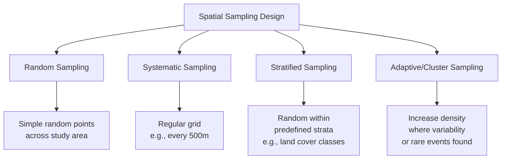
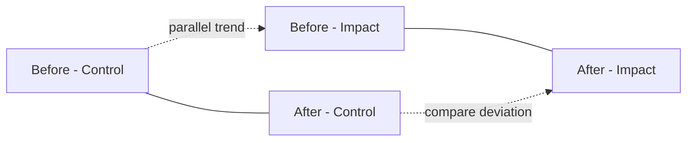

## Research Design in Geospatial and Environmental Science

### Overview

Research design in geospatial and environmental science is the systematic planning of how a research question will be answered, encompassing the choice of study approach (observational, experimental, quasi-experimental, modeling), spatial and temporal sampling strategy, data sources, and analytical framework. Because geospatial and environmental phenomena are inherently spatially and temporally autocorrelated, research design in this field requires specific methodological adaptations beyond generic scientific research design principles — particularly around sampling, scale, and the statistical assumptions that spatial data routinely violate.

### Core Concepts

#### The Research Design Process

**Key Points**

- A research design translates a research question into a reproducible methodology: what will be measured, where, when, how often, and how the resulting data will be analyzed to support or refute a hypothesis.
- In geospatial/environmental contexts, design decisions must explicitly address **scale** (spatial resolution and extent), **temporal frequency** (how often data is collected relative to the phenomenon's rate of change), and **spatial dependency** (nearby observations are rarely statistically independent).
- Design choices directly constrain which statistical methods are valid downstream — poor design cannot be fully corrected by sophisticated analysis after the fact.

#### Types of Research Design

| Design Type | Description | Environmental Science Example |
| --- | --- | --- |
| Observational/Descriptive | Systematic observation without manipulation | Long-term biodiversity survey of a national park |
| Correlational | Examines relationships between variables without establishing causation | Relating land surface temperature to impervious surface percentage |
| Quasi-experimental | Exploits naturally occurring "treatment" vs. control conditions without random assignment | Before-after-control-impact (BACI) study around a new dam |
| True experimental | Random assignment of treatment vs. control | Controlled mesocosm experiments testing pollutant effects on aquatic species |
| Longitudinal/Time-series | Repeated measurements at the same locations over time | Multi-decade glacier mass balance monitoring |
| Cross-sectional | Single-time-point measurement across multiple locations | One-time regional soil contamination survey |
| Modeling/Simulation | Computational representation of system dynamics, validated against observed data | Hydrological watershed model calibrated against streamflow gauges |

### Spatial Sampling Design

#### Why Spatial Sampling Differs from Classical Sampling

**Key Points**

- Classical statistics assumes independent, identically distributed (i.i.d.) observations; spatial data violates this by **Tobler's First Law of Geography**: "everything is related to everything else, but near things are more related than distant things."
- Ignoring spatial autocorrelation in sampling design or analysis leads to underestimated standard errors, inflated Type I error rates (false positives), and overconfident conclusions.
- Sampling design must balance spatial coverage (representativeness across the study area) against sampling cost/logistics (fieldwork, sensor deployment, satellite revisit time).

#### Common Spatial Sampling Strategies

1. **Simple random sampling** — Locations chosen with uniform random probability across the study extent; statistically unbiased but can leave large gaps or oversample by chance.
2. **Systematic sampling** — Regular grid or transect spacing; ensures even spatial coverage but risks aliasing if the sampling interval coincides with a periodic environmental pattern (e.g., regular field boundaries).
3. **Stratified random sampling** — Study area divided into strata (e.g., land cover type, elevation band, administrative zone) with random sampling within each stratum, ensuring representation of known heterogeneity.
4. **Cluster sampling** — Sampling grouped locations (e.g., all plots within a randomly selected watershed) rather than dispersing individual points, often driven by field logistics/cost constraints.
5. **Adaptive/response-driven sampling** — Sampling intensity increased dynamically in areas showing high variability or the phenomenon of interest (e.g., denser sampling near a detected contamination plume).

#### Determining Sample Size and Spatial Resolution

- Sample size in spatial studies must account for the **effective sample size** reduction caused by spatial autocorrelation — a set of $n$ spatially clustered observations carries less independent information than $n$ truly independent observations.
- **Semivariogram analysis** (from geostatistics) is often used *a priori* (from pilot data or prior studies) to determine the spatial range beyond which observations become effectively independent, informing minimum sampling spacing.

$$\gamma(h) = \frac{1}{2N(h)} \sum_{i=1}^{N(h)} [z(x_i) - z(x_i + h)]^2$$

Where $\gamma(h)$ is the semivariance at lag distance $h$, $z(x_i)$ is the observed value at location $x_i$, and $N(h)$ is the number of point pairs separated by distance $h$. The **range** parameter of a fitted semivariogram model indicates the distance beyond which spatial autocorrelation becomes negligible — a useful guide for minimum sample spacing to approach independence.

### Temporal Design Considerations

**Key Points**

- **Temporal resolution** must be matched to the rate of change of the studied phenomenon: daily air quality monitoring is appropriate for pollution episodes but wholly inadequate for detecting decadal land-cover change.
- **Nyquist-type considerations** apply loosely to environmental monitoring: sampling frequency should be at least twice the frequency of the fastest relevant cycle being studied (e.g., sub-daily sampling to characterize diurnal temperature cycles).
- **Baseline/reference period selection** is critical for change-detection studies (e.g., climate anomaly calculations require a clearly justified and consistently applied baseline period, commonly a 30-year climatological normal per WMO convention).
- **Autocorrelation in time** (temporal analog of spatial autocorrelation) similarly reduces effective sample size in time-series designs and must be addressed via appropriate time-series statistical methods (e.g., generalized least squares with autoregressive error structures).

### Common Environmental Research Designs

#### Before-After-Control-Impact (BACI) Design

Used to assess the effect of a discrete environmental intervention or disturbance (dam construction, restoration project, pollution event) by comparing:

- **Before vs. After** at the impact site (temporal comparison)
- **Impact vs. Control** site (spatial comparison, assuming control site would have followed a similar trajectory absent the intervention)

[Inference] BACI designs strengthen causal inference relative to simple before-after comparisons at a single site, because they help account for confounding temporal trends (e.g., regional climate variability) that would otherwise be indistinguishable from the intervention's effect — but they still rely on the assumption that control and impact sites would have followed similar trajectories absent the intervention, an assumption that cannot be directly verified and should be explicitly justified.

#### Space-for-Time Substitution (Chronosequence Studies)

- Used when direct long-term temporal monitoring is impractical; sites at different successional/developmental stages are sampled simultaneously and treated as proxies for temporal change (e.g., studying forest sites of different known ages to infer succession dynamics).
- **Key Points**: A pragmatic and widely used approach, but its core assumption — that the different-aged sites differ only in age and not in unmeasured confounding factors (soil type, disturbance history, microclimate) — is a substantial limitation and should always be explicitly stated rather than assumed valid by default.

#### Paired Watershed / Catchment Studies

Comparing a treated watershed (e.g., logged, restored) against a paired reference/control watershed with similar physical characteristics, commonly used in forest hydrology research.

#### Remote Sensing Time-Series Change Detection Design

- Requires careful consideration of **sensor consistency** across the study period (same satellite platform, or well-validated cross-sensor calibration when combining data from different missions).
- Must account for **phenological/seasonal timing** — comparing imagery from different seasons can produce spurious "change" signals unrelated to the actual phenomenon of interest.
- Common design pattern: select cloud-free, near-anniversary-date imagery pairs (same day-of-year across different years) to control for seasonal/illumination confounds.

### Modeling and Simulation-Based Research Design

**Key Points**

- Environmental models (hydrological, atmospheric, ecological) require a design encompassing: model structure selection, parameter calibration strategy, validation dataset partitioning, and uncertainty quantification approach.
- **Calibration/validation data splitting** — Common practice is to reserve a temporally or spatially independent subset of observed data purely for validation, never used in calibration, to obtain an honest estimate of predictive performance.
- **Cross-validation for spatial data** requires spatially-aware partitioning (e.g., spatial blocking, leaving out entire geographic clusters) rather than naive random k-fold splitting, because random splitting on spatially autocorrelated data leaks information between training and test sets, producing overly optimistic performance estimates. [Inference] This is a well-established critique in the spatial machine learning literature (commonly discussed alongside "spatial cross-validation" methods), though specific recommended blocking strategies continue to be an active area of methodological research.
- **Sensitivity analysis** — Systematically varying model input parameters to assess which most strongly influence model outputs, informing where measurement precision investment matters most.

### Data Source Integration Design

Modern geospatial/environmental research frequently integrates heterogeneous data sources, each imposing its own design constraints:

| Data Source | Design Consideration |
| --- | --- |
| Field measurements | Sampling protocol standardization; observer training/inter-rater reliability |
| Remote sensing | Spatial/spectral/temporal resolution trade-offs; atmospheric correction consistency |
| Citizen science/crowdsourced | Bias correction, validation protocol (see prior topic) |
| Model reanalysis products | Understanding underlying model assumptions and resolution limitations |
| Administrative/survey data | Ecological fallacy risk when aggregating individual-level inference from area-level data |

### Addressing Common Threats to Validity

#### Internal Validity

- **Confounding variables** — Unmeasured factors correlated with both the predictor and outcome (e.g., studying urbanization effects on stream health without controlling for concurrent regional climate trends).
- **Instrument drift** — Sensor calibration degrading over long study periods; requires periodic recalibration protocols and documentation.

#### External Validity (Generalizability)

- **Modifiable Areal Unit Problem (MAUP)** — Statistical results can change substantially depending on how spatial units are aggregated or drawn (zone boundaries) and at what scale (resolution), even when underlying data is identical. This is a foundational and well-documented issue in spatial analysis, meaning findings from one areal unit scheme should not be automatically assumed to generalize to a different aggregation scheme.
- **Ecological fallacy** — Inferring individual-level relationships from aggregate/area-level data (e.g., concluding individual behavior from county-level averages) is a known source of erroneous inference and should be explicitly avoided in study design and interpretation.

#### Statistical Conclusion Validity

- **Pseudoreplication** — Treating spatially or temporally non-independent samples as independent replicates, artificially inflating statistical power and increasing false-positive risk; a well-recognized design flaw in ecological and environmental research since Hurlbert's influential 1984 critique.

### Example: Research Design Decision Framework

**Example** — A structured checklist approach for designing an environmental monitoring study:

1. **Define the research question precisely** — e.g., "Has riparian buffer restoration reduced stream nitrate concentrations over a 10-year period?"
2. **Identify the appropriate design type** — Given a discrete restoration intervention with an available comparable unrestored reference stream, a BACI design is appropriate.
3. **Determine spatial sampling strategy** — Stratify sampling points by stream order and distance from the restoration zone; use semivariogram analysis from a pilot survey to set minimum sample spacing.
4. **Determine temporal sampling frequency** — Match sampling frequency to nitrate temporal variability (likely requiring higher-frequency sampling during storm events, when nitrate flux is known to spike, versus baseflow conditions).
5. **Specify statistical analysis plan in advance** — Pre-register the intended statistical model (e.g., mixed-effects model with site as random effect to account for repeated measures) before data collection to avoid post-hoc analytical flexibility ("p-hacking").
6. **Plan for missing data and equipment failure** — Define a priori how sensor gaps or missed sampling events will be handled (imputation method, minimum data completeness threshold for inclusion).
7. **Address uncertainty quantification** — Specify how measurement uncertainty and model/analytical uncertainty will be propagated and reported alongside point estimates.

### SVG: Spatial Sampling Design Comparison (svg_diagram)

<svg xmlns="http://www.w3.org/2000/svg" viewBox="0 0 700 320">
<text x="350" y="25" font-size="16" font-weight="bold" text-anchor="middle" fill="#1a1a1a">Spatial Sampling Design Patterns (svg_diagram)</text>
<rect x="20" y="50" width="200" height="200" fill="#f5f5f0" stroke="#888" />
<text x="120" y="70" font-size="11" font-weight="bold" text-anchor="middle">Random</text>
<circle cx="45" cy="90" r="4" fill="#2a7de1" />
<circle cx="130" cy="105" r="4" fill="#2a7de1" />
<circle cx="70" cy="150" r="4" fill="#2a7de1" />
<circle cx="180" cy="80" r="4" fill="#2a7de1" />
<circle cx="160" cy="200" r="4" fill="#2a7de1" />
<circle cx="40" cy="220" r="4" fill="#2a7de1" />
<circle cx="100" cy="230" r="4" fill="#2a7de1" />
<circle cx="190" cy="160" r="4" fill="#2a7de1" />
<rect x="250" y="50" width="200" height="200" fill="#f0f5f0" stroke="#888" />
<text x="350" y="70" font-size="11" font-weight="bold" text-anchor="middle">Systematic Grid</text>
<circle cx="280" cy="90" r="4" fill="#3a9142" />
<circle cx="330" cy="90" r="4" fill="#3a9142" />
<circle cx="380" cy="90" r="4" fill="#3a9142" />
<circle cx="420" cy="90" r="4" fill="#3a9142" />
<circle cx="280" cy="140" r="4" fill="#3a9142" />
<circle cx="330" cy="140" r="4" fill="#3a9142" />
<circle cx="380" cy="140" r="4" fill="#3a9142" />
<circle cx="420" cy="140" r="4" fill="#3a9142" />
<circle cx="280" cy="190" r="4" fill="#3a9142" />
<circle cx="330" cy="190" r="4" fill="#3a9142" />
<circle cx="380" cy="190" r="4" fill="#3a9142" />
<circle cx="420" cy="190" r="4" fill="#3a9142" />
<circle cx="280" cy="230" r="4" fill="#3a9142" />
<circle cx="330" cy="230" r="4" fill="#3a9142" />
<circle cx="380" cy="230" r="4" fill="#3a9142" />
<circle cx="420" cy="230" r="4" fill="#3a9142" />
<rect x="480" y="50" width="200" height="200" fill="#fff4e6" stroke="#888" />
<text x="580" y="70" font-size="11" font-weight="bold" text-anchor="middle">Stratified</text>
<line x1="480" y1="150" x2="680" y2="150" stroke="#c97a1a" stroke-dasharray="4" />
<line x1="580" y1="50" x2="580" y2="250" stroke="#c97a1a" stroke-dasharray="4" />
<circle cx="510" cy="90" r="4" fill="#c97a1a" />
<circle cx="540" cy="110" r="4" fill="#c97a1a" />
<circle cx="620" cy="100" r="4" fill="#c97a1a" />
<circle cx="650" cy="120" r="4" fill="#c97a1a" />
<circle cx="510" cy="190" r="4" fill="#c97a1a" />
<circle cx="550" cy="220" r="4" fill="#c97a1a" />
<circle cx="620" cy="200" r="4" fill="#c97a1a" />
<circle cx="640" cy="230" r="4" fill="#c97a1a" />

<text x="350" y="290" font-size="11" text-anchor="middle" fill="#555">Choice depends on coverage needs, known heterogeneity, and logistical cost</text>

</svg>

### Reproducibility and Open Science Practices

**Key Points**

- **Pre-registration** of hypotheses and analysis plans (e.g., via OSF) reduces the risk of undisclosed analytical flexibility in flagged environmental/spatial studies.
- **FAIR data principles** (Findable, Accessible, Interoperable, Reusable) increasingly expected for publicly funded environmental research datasets.
- **Code and workflow sharing** — Publishing analysis scripts (R/Python) and, where feasible, containerized environments (Docker) alongside publications to enable computational reproducibility.
- **Metadata standards** — Adherence to standards such as ISO 19115 (geographic metadata) or Ecological Metadata Language (EML) to ensure long-term data reusability.

### Next Steps

**Related Topics**

- Geostatistics and semivariogram/kriging methods
- Spatial autocorrelation diagnostics (Moran's I, Geary's C)
- Modifiable Areal Unit Problem (MAUP) and ecological fallacy
- Mixed-effects models for repeated-measures environmental data
- Spatial cross-validation techniques for machine learning model evaluation
- Uncertainty quantification and error propagation in environmental modeling
- Open science practices: pre-registration, FAIR data, reproducible workflows
- Scientific writing and reporting standards for geospatial research (e.g., methods section transparency)