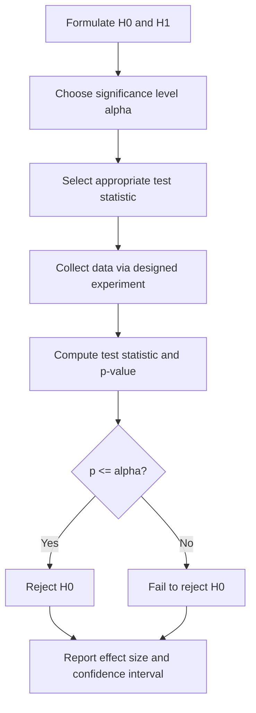

## Hypothesis Testing and Experimental Design

### Overview

Hypothesis testing is the formal statistical framework for evaluating claims about a population using sample data, while experimental design is the discipline of structuring data collection so that those tests yield valid, unconfounded, and interpretable results. Together they form the methodological backbone of quantitative research across environmental and geospatial science — from controlled greenhouse experiments to field-based ecological monitoring and remote-sensing validation studies.

### The Statistical Hypothesis Testing Framework

Every classical hypothesis test rests on the same logical structure:

- **Null hypothesis ($H_0$)** — A statement of "no effect" or "no difference," treated as the default to be disproven (e.g., a pollutant has no effect on species richness).
- **Alternative hypothesis ($H_1$ or $H_a$)** — The claim of interest, which may be directional (one-tailed) or non-directional (two-tailed).
- **Test statistic** — A value computed from sample data (e.g., $t$, $F$, $\chi^2$, $z$) that measures how far the observed data deviate from what $H_0$ predicts.
- **Significance level ($\alpha$)** — The pre-specified probability threshold (commonly 0.05) for rejecting $H_0$ when it is actually true.
- **p-value** — The probability of observing a test statistic at least as extreme as the one obtained, assuming $H_0$ is true. It is not the probability that $H_0$ is true, and is frequently misinterpreted as such.

**Decision rule:** reject $H_0$ if $p \leq \alpha$; otherwise, fail to reject $H_0$ (never "accept" $H_0$, since failing to find evidence against it is not proof of its truth).

### Type I and Type II Errors, and Statistical Power

| | $H_0$ True | $H_0$ False |
|---|---|---|
| **Reject $H_0$** | Type I Error (false positive), probability $\alpha$ | Correct decision (true positive), probability $1-\beta$ |
| **Fail to reject $H_0$** | Correct decision (true negative), probability $1-\alpha$ | Type II Error (false negative), probability $\beta$ |

**Statistical power** is the probability of correctly rejecting a false $H_0$:
$$\text{Power} = 1 - \beta$$

Power increases with larger sample size, larger true effect size, lower measurement variance, and higher $\alpha$ (at the cost of more false positives). Under-powered studies — common in field ecology and environmental monitoring where sampling is expensive — risk failing to detect real effects and can also inflate the magnitude of any effects that are detected significant (the "winner's curse").

### Common Statistical Tests

| Test | Use Case | Test Statistic (general form) |
|---|---|---|
| One-sample/two-sample $t$-test | Compare mean(s) to a value or between two groups | $t = \dfrac{\bar{x}_1 - \bar{x}_2}{\sqrt{s_p^2\left(\frac{1}{n_1}+\frac{1}{n_2}\right)}}$ |
| Paired $t$-test | Compare matched/repeated measurements | $t = \dfrac{\bar{d}}{s_d/\sqrt{n}}$ |
| One-way ANOVA | Compare means across 3+ groups | $F = \dfrac{MS_{between}}{MS_{within}}$ |
| Chi-square test | Association between categorical variables | $\chi^2 = \sum \dfrac{(O_i - E_i)^2}{E_i}$ |
| Linear regression / correlation | Relationship between continuous variables | $t = \dfrac{r\sqrt{n-2}}{\sqrt{1-r^2}}$ |
| Mann-Whitney U / Kruskal-Wallis | Non-parametric alternatives when normality assumptions fail | Rank-based statistics |

Test selection depends on data type (continuous, ordinal, categorical), number of groups, independence of observations, and whether parametric assumptions (normality, homogeneity of variance) are reasonably satisfied — often checked via Shapiro-Wilk and Levene's tests respectively.

### Experimental Design Principles

Robust experimental design rests on four pillars:

1. **Randomization** — Random assignment of treatments to experimental units removes systematic bias and underpins the validity of significance tests.
2. **Replication** — Multiple independent experimental units per treatment allow estimation of within-treatment variability and are required to distinguish true treatment effects from noise.
3. **Blocking** — Grouping experimental units into homogeneous blocks (e.g., by soil type, elevation, site) before randomizing treatments within each block, which removes a known source of variability from the error term and increases power.
4. **Control** — Including a baseline/control group (and controlling extraneous variables) isolates the effect attributable to the treatment itself.

### Common Experimental Design Types

- **Completely Randomized Design (CRD)** — Treatments assigned entirely at random across all units; simplest design, appropriate when the experimental environment is homogeneous.
- **Randomized Block Design (RBD)** — Units are grouped into blocks (controlling for a nuisance variable), and treatments randomized within each block.
- **Factorial Design** — Simultaneously tests two or more factors (and their interactions) by combining all factor levels (e.g., a 2×3 factorial testing two irrigation levels × three fertilizer types).
- **Latin Square Design** — Controls for two blocking factors simultaneously (e.g., row and column position in a field trial) using a balanced grid.
- **Split-Plot Design** — Used when one factor is harder/costlier to randomize finely (e.g., irrigation applied at the plot level, fertilizer varied within sub-plots).

<svg xmlns="http://www.w3.org/2000/svg" viewBox="0 0 620 340" font-family="sans-serif">
<text x="310" y="26" text-anchor="middle" font-size="17" font-weight="bold" fill="#1a1a1a">Randomized Block Design Layout (svg_diagram)</text>

<text x="30" y="60" font-size="12" fill="#333">Block 1</text>
<rect x="30" y="70" width="70" height="50" fill="#c8e6c9" stroke="#2e7d32" /><text x="65" y="100" text-anchor="middle" font-size="12">A</text>
<rect x="105" y="70" width="70" height="50" fill="#bbdefb" stroke="#1565c0" /><text x="140" y="100" text-anchor="middle" font-size="12">C</text>
<rect x="180" y="70" width="70" height="50" fill="#ffe0b2" stroke="#ef6c00" /><text x="215" y="100" text-anchor="middle" font-size="12">B</text>
<rect x="255" y="70" width="70" height="50" fill="#e1bee7" stroke="#6a1b9a" /><text x="290" y="100" text-anchor="middle" font-size="12">D</text>

<text x="30" y="150" font-size="12" fill="#333">Block 2</text>
<rect x="30" y="160" width="70" height="50" fill="#ffe0b2" stroke="#ef6c00" /><text x="65" y="190" text-anchor="middle" font-size="12">B</text>
<rect x="105" y="160" width="70" height="50" fill="#e1bee7" stroke="#6a1b9a" /><text x="140" y="190" text-anchor="middle" font-size="12">D</text>
<rect x="180" y="160" width="70" height="50" fill="#c8e6c9" stroke="#2e7d32" /><text x="215" y="190" text-anchor="middle" font-size="12">A</text>
<rect x="255" y="160" width="70" height="50" fill="#bbdefb" stroke="#1565c0" /><text x="290" y="190" text-anchor="middle" font-size="12">C</text>

<text x="30" y="240" font-size="12" fill="#333">Block 3</text>
<rect x="30" y="250" width="70" height="50" fill="#e1bee7" stroke="#6a1b9a" /><text x="65" y="280" text-anchor="middle" font-size="12">D</text>
<rect x="105" y="250" width="70" height="50" fill="#bbdefb" stroke="#1565c0" /><text x="140" y="280" text-anchor="middle" font-size="12">C</text>
<rect x="180" y="250" width="70" height="50" fill="#c8e6c9" stroke="#2e7d32" /><text x="215" y="280" text-anchor="middle" font-size="12">A</text>
<rect x="255" y="250" width="70" height="50" fill="#ffe0b2" stroke="#ef6c00" /><text x="290" y="280" text-anchor="middle" font-size="12">B</text>

<text x="400" y="90" font-size="11" fill="#555">A, B, C, D = treatments,</text>
<text x="400" y="108" font-size="11" fill="#555">randomized independently</text>
<text x="400" y="126" font-size="11" fill="#555">within each block.</text>
<text x="400" y="150" font-size="11" fill="#555">Blocking removes a known</text>
<text x="400" y="168" font-size="11" fill="#555">source of variability (e.g.,</text>
<text x="400" y="186" font-size="11" fill="#555">soil gradient) from the</text>
<text x="400" y="204" font-size="11" fill="#555">error term.</text>
</svg>

### Sample Size and Power Analysis

A priori sample size calculation prevents both under-powered studies and wasteful over-sampling. For a two-sample $t$-test comparing means, an approximate required sample size per group is:

$$n = \frac{2(z_{1-\alpha/2} + z_{1-\beta})^2 \sigma^2}{\delta^2}$$

where $\sigma^2$ is the assumed population variance, $\delta$ is the minimum detectable effect size (difference in means), and $z_{1-\alpha/2}$, $z_{1-\beta}$ are standard normal quantiles corresponding to the chosen significance level and desired power. In practice, power analysis is usually performed with software (e.g., G*Power, R's `pwr` package) rather than hand calculation, especially for more complex designs (ANOVA, mixed models).

### Confidence Intervals vs. p-values

A **confidence interval (CI)** communicates both the estimated effect size and its precision, and is increasingly preferred alongside (or instead of) a bare p-value, since a statistically significant result with a wide CI may have little practical importance, while a non-significant result with a narrow CI close to zero provides stronger evidence of "no meaningful effect" than a non-significant p-value alone conveys.

### Common Pitfalls

- **p-hacking / data dredging** — Repeatedly testing subsets or variables until a significant result emerges, inflating the true false-positive rate.
- **Multiple comparisons problem** — Running many tests increases the chance of at least one false positive; corrections (Bonferroni, Benjamini-Hochberg false discovery rate) adjust the significance threshold accordingly.
- **Pseudoreplication** — Treating spatially or temporally non-independent samples (e.g., multiple readings from the same plot) as independent replicates, artificially inflating sample size and power; a classic and well-documented problem in field ecology and environmental monitoring study design.
- **Spatial autocorrelation** — In geospatial datasets, nearby observations tend to be more similar than distant ones (Tobler's First Law of Geography), violating the independence assumption of standard tests; spatial statistics (e.g., Moran's I, geographically weighted regression, spatial mixed models) are used to detect and account for this.
- **Confusing statistical and practical significance** — A very small effect can be statistically significant with a sufficiently large sample size, without being practically meaningful.

### Worked Example

A field trial compares mean soil nitrate concentration (mg/kg) between a fertilized plot ($\bar{x}_1 = 24.5$, $s_1 = 3.1$, $n_1=12$) and an unfertilized control plot ($\bar{x}_2 = 19.8$, $s_2 = 2.9$, $n_2=12$).

Pooled variance:
$$s_p^2 = \frac{(n_1-1)s_1^2 + (n_2-1)s_2^2}{n_1+n_2-2} = \frac{11(3.1^2) + 11(2.9^2)}{22} \approx 9.01$$

Test statistic:
$$t = \frac{24.5 - 19.8}{\sqrt{9.01\left(\frac{1}{12}+\frac{1}{12}\right)}} = \frac{4.7}{\sqrt{1.502}} \approx 3.84$$

With $df = 22$, a $t$-value of 3.84 corresponds to $p < 0.001$, well below a conventional $\alpha = 0.05$ threshold — providing strong evidence to reject $H_0$ (no difference in mean nitrate concentration between fertilized and control plots). [Note: this exact worked figure should be verified against a $t$-distribution table or software for the reported p-value, as manual approximation of exact tail probabilities beyond the test statistic itself is not shown step-by-step here.]

**Key Points**
- Statistical significance depends jointly on effect size, sample size, and variability — never interpret a p-value in isolation from these.
- Good experimental design (randomization, replication, blocking, control) is what makes a subsequent hypothesis test valid in the first place; no statistical correction can fully repair a poorly designed study.
- In geospatial/environmental contexts, always check for spatial and temporal non-independence before assuming standard test assumptions hold.

**Conclusion**
Hypothesis testing provides the formal inferential machinery for deciding whether observed data are consistent with a null claim, but that machinery is only as trustworthy as the experimental design that produced the data. For environmental and geospatial research in particular, standard textbook assumptions of independence are frequently violated by spatial and temporal autocorrelation, making careful design (blocking, adequate replication, explicit spatial modeling) and honest power analysis essential complements to correct statistical testing.

**Related Topics**
- Spatial Autocorrelation and Moran's I
- Mixed-Effects Models for Nested/Hierarchical Field Data
- Multiple Comparisons Corrections (Bonferroni, FDR)
- Power Analysis and Sample Size Determination in Ecological Studies
- Bayesian Hypothesis Testing as an Alternative Framework
- Geographically Weighted Regression (GWR)
- Reproducibility and Pre-Registration in Environmental Science Research