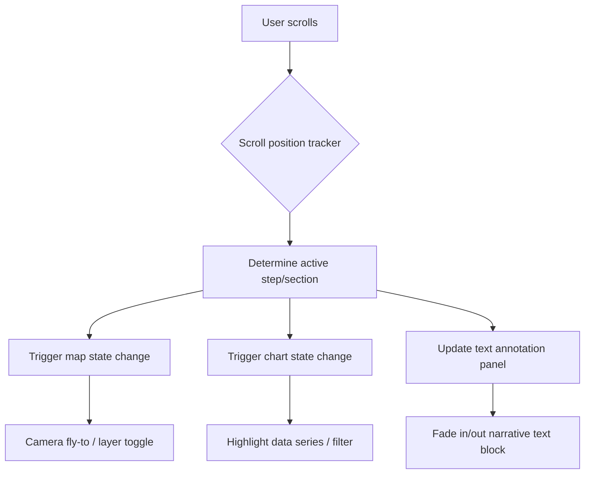

## Data Visualization and Map-Based Storytelling


### Overview

Data visualization and map-based storytelling is the practice of transforming geospatial and environmental datasets into visual narratives that communicate patterns, trends, and relationships to specific audiences — scientific, policy-making, or public. In geospatial science, this discipline sits at the intersection of cartography, information design, statistics, and narrative structure. It differs from purely analytical mapping in that the end goal is communication and persuasion grounded in data integrity, not just exploratory analysis.

The field encompasses static maps and charts, interactive web maps, animated time-series visualizations, dashboards, and StoryMaps (a specific product category, discussed below), all unified by the principle that a visualization is only successful if it accurately represents underlying data while remaining interpretable by its intended audience.

### Core Principles

#### The Visualization Pipeline

$$\text{Raw Data} \rightarrow \text{Data Processing} \rightarrow \text{Visual Encoding} \rightarrow \text{Narrative Structuring} \rightarrow \text{Delivery Medium}$$

Each stage introduces choices that affect fidelity and interpretability. A common failure mode is optimizing visual polish at the delivery stage while neglecting encoding integrity at the earlier stages (e.g., choosing a color ramp before checking whether the underlying data is normally distributed or skewed).

#### Visual Variables (Bertin's Framework)

Jacques Bertin's semiology of graphics identifies the visual variables available for encoding data:

- **Position** — strongest for quantitative comparison
- **Size** — effective for quantitative data (e.g., proportional symbols)
- **Value (lightness/darkness)** — effective for ordered/sequential data
- **Color hue** — best for qualitative/categorical data, not ordered data
- **Orientation** — limited encoding capacity, mostly categorical
- **Shape** — categorical only, not ordered
- **Texture/pattern** — categorical, used sparingly due to visual noise

[Inference] Matching the visual variable to the data's measurement level (nominal, ordinal, interval, ratio) is the single most common error-avoidance heuristic taught in cartographic design, though the "correct" mapping is a design convention rather than a universal law.

#### Data Classification Methods for Choropleth Maps

Choosing how continuous data is binned into classes materially changes the message of a map. Standard classification methods include:

| Method | Description | Best Used When |
| --- | --- | --- |
| Equal Interval | Divides data range into equal-sized bins | Data is uniformly distributed |
| Quantile | Equal number of observations per class | Emphasizing rank/relative position |
| Natural Breaks (Jenks) | Minimizes within-class variance, maximizes between-class variance | Data has natural clusters |
| Standard Deviation | Bins centered on the mean, in units of $\sigma$ | Highlighting deviation from the mean |
| Manual/Custom | Analyst-defined thresholds | Domain-specific meaningful breakpoints exist (e.g., regulatory limits) |

[Unverified] The Jenks natural breaks algorithm is computationally the most expensive of these for large datasets due to its iterative variance-minimization approach, though modern implementations (e.g., in GeoPandas or D3) optimize this with sampling for large $n$.

### Map-Based Storytelling Structures

#### Narrative Archetypes

Common structures used in geospatial storytelling, adapted from journalism and data-driven storytelling literature:

- **Martini Glass** — a linear, guided narrative (author-driven) that opens up into free exploration at the end
- **Interactive Slideshow** — sequential "scenes," each with its own map state, camera position, and annotation (used heavily in scrollytelling)
- **Drill-Down** — starts at an aggregate view (e.g., national) and lets users progressively zoom into finer resolution (regional, local)
- **Magazine/Annotated Chart** — a single static or lightly interactive visualization with explicit callouts and annotations layered on top

#### Scrollytelling Architecture

Scrollytelling ties scroll position to map/chart state changes. The general technical pattern:



This pattern is implemented via libraries such as `scrollama.js` (step-detection via Intersection Observer) paired with a mapping library (Mapbox GL JS, MapLibre GL JS, Leaflet) for the visual layer.

### Tools and Platforms

#### Static/Print Cartography

- **QGIS** — Print Layout module for publication-quality static maps; supports atlas generation for multi-page repeated layouts
- **ArcGIS Pro** — Layout view with data-driven pages
- **Matplotlib + GeoPandas / Cartopy (Python)** — programmatic, reproducible static map generation, well-suited for scientific publication figures

#### Interactive Web Mapping

- **Leaflet.js** — lightweight, widely used, large plugin ecosystem
- **Mapbox GL JS / MapLibre GL JS** (open-source fork after Mapbox's license change) — vector-tile rendering, WebGL-based, supports 3D terrain and smooth camera transitions
- **Kepler.gl** — Uber-developed, browser-based, geared toward large-scale geospatial data exploration with minimal code
- **deck.gl** — WebGL-powered large-scale data visualization layers, often paired with Mapbox/MapLibre as a base map

#### Purpose-Built Storytelling Products

- **ArcGIS StoryMaps** — Esri's narrative-building tool combining maps, text, images, and multimedia into a linear scrolling story; widely used in environmental science communication and government reporting
- **Felt** — collaborative, browser-native map-making platform emphasizing simplicity
- **Flourish** — template-driven data visualization/storytelling tool with strong map templates (e.g., hex-bin, choropleth race charts)

#### Charting Libraries for Companion Visualizations

- **D3.js** — low-level, maximal control, steep learning curve
- **Observable Plot** — higher-level abstraction over D3 grammar-of-graphics style
- **Vega-Lite** — declarative JSON-based grammar of graphics, good for reproducible scientific charts
- **Chart.js** — simpler API, less flexible, adequate for standard chart types

### Practical Example: Building a Scrollytelling Sea-Level Rise Story

#### Step 1 — Data Preparation

```python
import geopandas as gpd
import pandas as pd

# Load coastal elevation and projected inundation data
coastline = gpd.read_file("coastline_2024.geojson")
inundation = gpd.read_file("slr_projection_2100.geojson")

# Reproject to a common CRS for accurate area/distance calculations
coastline = coastline.to_crs(epsg=3857)
inundation = inundation.to_crs(epsg=3857)

# Simplify geometry for web performance (tolerance in projected units)
inundation["geometry"] = inundation.geometry.simplify(tolerance=50)
```

[Inference] A Web Mercator projection (EPSG:3857) is the conventional choice here because it matches most web basemap tile services, though it is not appropriate for accurate area measurement — an equal-area projection should be used if the underlying area statistics (e.g., km² flooded) are computed rather than just visualized.

#### Step 2 — Scene/Step Definition (Narrative Layer)

```json
[
  {
    "step": 1,
    "camera": {"center": [-80.19, 25.76], "zoom": 9, "pitch": 0},
    "layerVisibility": {"coastline": true, "slr_2050": false, "slr_2100": false},
    "text": "Miami's coastline today, before projected sea-level rise."
  },
  {
    "step": 2,
    "camera": {"center": [-80.19, 25.76], "zoom": 10, "pitch": 30},
    "layerVisibility": {"coastline": true, "slr_2050": true, "slr_2100": false},
    "text": "By 2050, moderate-emission scenarios project this extent of tidal inundation."
  }
]
```

#### Step 3 — Scroll-Trigger Binding

```javascript
const scroller = scrollama();

scroller
  .setup({
    step: ".scroll-step",
    offset: 0.5
  })
  .onStepEnter(({ index }) => {
    const scene = scenes[index];
    map.flyTo(scene.camera);
    Object.entries(scene.layerVisibility).forEach(([layerId, visible]) => {
      map.setLayoutProperty(layerId, "visibility", visible ? "visible" : "none");
    });
    document.querySelector(".narrative-text").textContent = scene.text;
  });
```

**Output**: A scroll-linked map narrative where each scroll "step" triggers a camera fly-to animation and toggles data layer visibility, synchronized with narrative text — the standard architecture behind most environmental-science scrollytelling pieces (e.g., NASA's climate visualizations, NOAA sea-level viewers).

### Design Considerations for Scientific Integrity

#### Avoiding Visual Distortion

- **Truncated color scales** on choropleth maps can exaggerate perceived differences between classes; using a full, perceptually uniform scale (e.g., `viridis`, `cividis`) mitigates this
- **Proportional symbol maps** must scale symbol *area* (not radius/diameter) to the data value, since human perception of area is what a symbol size is intended to convey; scaling radius linearly to value causes area to grow quadratically, visually exaggerating magnitude
- **Small multiples** (a grid of many small, identically-scaled maps/charts) are often preferable to a single animated map for showing change over time in print or static contexts, since they permit direct visual comparison without relying on memory across frames

#### Colorblind-Safe and Perceptually Uniform Palettes

Sequential and diverging palettes should be chosen from perceptually validated sets (e.g., ColorBrewer, `viridis` family) rather than default software palettes (e.g., a naive red-yellow-green ramp), because:

- Perceptually uniform ramps ensure equal data steps correspond to equal *perceived* visual steps
- ColorBrewer palettes are explicitly tested for colorblind safety and print/screen reproduction

#### Accessibility

- Interactive maps should provide non-color-dependent cues (patterns, labels, tooltips) for users with color vision deficiencies
- Text alternatives (alt text, data tables) should accompany visualizations for screen-reader accessibility, particularly important for publicly funded environmental/government reporting

### Diagram: Storytelling Pipeline Architecture (svg_diagram)

<svg xmlns="http://www.w3.org/2000/svg" viewBox="0 0 900 340" font-family="sans-serif">
<text x="450" y="25" font-size="16" font-weight="bold" text-anchor="middle">Map-Based Storytelling Pipeline (svg_diagram)</text>
<rect x="20" y="60" width="140" height="60" rx="6" fill="#e8f0fe" stroke="#4285f4" />
<text x="90" y="85" font-size="12" text-anchor="middle">Raw Geospatial</text>
<text x="90" y="100" font-size="12" text-anchor="middle">Data (vector/raster)</text>
<rect x="200" y="60" width="140" height="60" rx="6" fill="#e6f4ea" stroke="#34a853" />
<text x="270" y="85" font-size="12" text-anchor="middle">Processing</text>
<text x="270" y="100" font-size="12" text-anchor="middle">(clean, reproject, simplify)</text>
<rect x="380" y="60" width="140" height="60" rx="6" fill="#fef7e0" stroke="#fbbc04" />
<text x="450" y="85" font-size="12" text-anchor="middle">Visual Encoding</text>
<text x="450" y="100" font-size="12" text-anchor="middle">(classification, symbology)</text>
<rect x="560" y="60" width="140" height="60" rx="6" fill="#fce8e6" stroke="#ea4335" />
<text x="630" y="85" font-size="12" text-anchor="middle">Narrative</text>
<text x="630" y="100" font-size="12" text-anchor="middle">Structuring</text>
<rect x="740" y="60" width="140" height="60" rx="6" fill="#f3e8fd" stroke="#a142f4" />
<text x="810" y="85" font-size="12" text-anchor="middle">Delivery Medium</text>
<text x="810" y="100" font-size="12" text-anchor="middle">(web / print / dashboard)</text>
<line x1="160" y1="90" x2="200" y2="90" stroke="#555" stroke-width="2" marker-end="url(#arrow)" />
<line x1="340" y1="90" x2="380" y2="90" stroke="#555" stroke-width="2" marker-end="url(#arrow)" />
<line x1="520" y1="90" x2="560" y2="90" stroke="#555" stroke-width="2" marker-end="url(#arrow)" />
<line x1="700" y1="90" x2="740" y2="90" stroke="#555" stroke-width="2" marker-end="url(#arrow)" />
<rect x="60" y="180" width="780" height="130" rx="8" fill="#fafafa" stroke="#ccc" />
<text x="450" y="205" font-size="13" font-weight="bold" text-anchor="middle">Feedback Loop: Audience Testing</text>
<text x="90" y="230" font-size="11">1. Draft visualization reviewed against target audience literacy level</text>
<text x="90" y="250" font-size="11">2. Check for perceptual distortion (color scale truncation, symbol area scaling)</text>
<text x="90" y="270" font-size="11">3. Validate accessibility (colorblind-safe palette, alt text, screen reader support)</text>
<text x="90" y="290" font-size="11">4. Iterate encoding/narrative structure based on comprehension testing</text>
</svg>

### Common Pitfalls

- **Overplotting** — dense point data rendered without aggregation (heatmaps, hexbinning, clustering) obscures rather than reveals pattern
- **Projection mismatch** — mixing basemap projection with analytical layer projection causes silent spatial misalignment
- **Chartjunk** — excessive decorative elements (3D effects, unnecessary gridlines, drop shadows) that reduce the data-ink ratio without adding informational value, a concept formalized by Edward Tufte
- **Narrative bias through selective framing** — choosing a time window, classification scheme, or map extent that exaggerates a trend beyond what a neutral encoding would show; this is an ethical concern distinct from technical error, as the visualization can be technically correct yet rhetorically misleading

### Evaluation Criteria for Effective Geospatial Stories

- **Data-ink ratio** — proportion of ink/pixels devoted to actual data versus decoration (Tufte's principle)
- **Legibility at target scale** — text, symbols, and line weights remain readable at the intended display size/zoom level
- **Narrative coherence** — the sequence of scenes/views builds a logical argument rather than a disconnected series of maps
- **Reproducibility** — for scientific communication specifically, the underlying data processing and classification choices should be documented or scriptable (e.g., in a Jupyter notebook or version-controlled repository) so the visualization can be audited or updated

**Related Topics**

- Cartographic Generalization and Multi-Scale Mapping
- Remote Sensing Time-Series Animation Techniques
- Grammar of Graphics and Declarative Visualization (Vega-Lite, ggplot2)
- GeoJSON, TopoJSON, and Vector Tile Formats for Web Delivery
- Statistical Data Classification and Modifiable Areal Unit Problem (MAUP)
- Accessibility Standards for Web-Based Geospatial Applications (WCAG)
- Uncertainty Visualization in Environmental Modeling (e.g., climate projection confidence intervals)