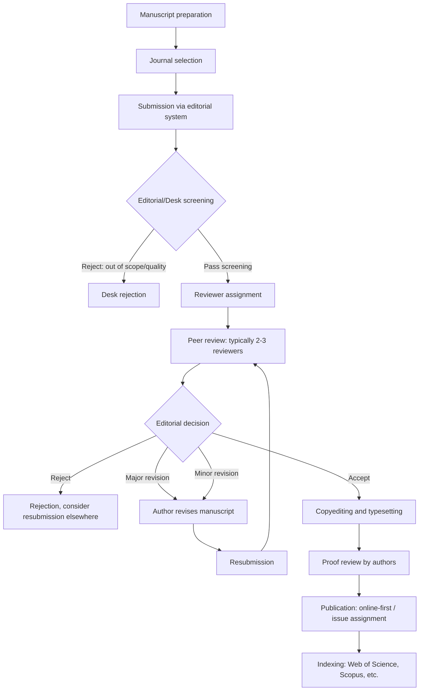

## Peer Review and Publication Process

### Overview

The peer review and publication process is the quality-control and dissemination mechanism through which geospatial and environmental science research is validated by domain experts and made available to the scientific community. For research involving spatial data, remote sensing, GIS methods, or environmental modeling, peer review carries domain-specific scrutiny beyond general scientific rigor: reviewers assess spatial data provenance, coordinate reference system correctness, validation methodology (e.g., accuracy assessment, cross-validation design), and reproducibility of geospatial workflows. Understanding this process is essential not only for publishing but for critically evaluating published literature as a research consumer.

### Core Principles

#### Purpose of Peer Review

Peer review serves several overlapping functions:

- **Quality control** — catching methodological flaws, statistical errors, or unsupported conclusions before publication
- **Gatekeeping** — determining whether work meets a journal's scope, novelty, and rigor threshold
- **Improvement** — reviewers often suggest revisions that substantively strengthen a manuscript beyond simple error correction
- **Community validation** — publication in a peer-reviewed venue signals that independent experts have assessed the work's credibility

[Inference] The relative weight given to these functions varies by venue tier; high-impact journals tend to emphasize novelty and broad significance alongside rigor, while specialized or regional journals may weight methodological soundness and regional relevance more heavily.

#### Peer Review Models

| Model | Description | Common Use |
| --- | --- | --- |
| Single-blind | Reviewers know authors' identities; authors do not know reviewers' | Traditional model, still dominant in many earth/environmental science journals |
| Double-blind | Neither party knows the other's identity | Increasingly adopted to reduce bias (e.g., institutional prestige bias) |
| Open review | Reviewer identities (and sometimes reviews) are published alongside the article | Growing adoption (e.g., some MDPI, Copernicus journals) |
| Post-publication review | Review occurs after publication via open commentary | Less common in geospatial/environmental science; more prevalent in preprint-heavy fields |

[Unverified] The specific prevalence rates of each model across geospatial and environmental science journals are not something that can be stated as a fixed figure, since journal policies change over time and vary considerably by publisher; authors should verify current policy directly on a target journal's website before submission.

### The Publication Workflow

#### Stage Detail: Journal Selection

Key factors in selecting a target journal for geospatial/environmental research:

- **Scope alignment** — journal explicitly covers the sub-discipline (e.g., *International Journal of Applied Earth Observation and Geoinformation* for remote sensing methods vs. *Journal of Environmental Management* for policy-oriented environmental work)
- **Impact factor / citation metrics** — a proxy for journal visibility and prestige, though [Inference] increasingly criticized as a sole quality metric due to its sensitivity to citation practices that vary by subfield
- **Open access status and article processing charges (APCs)** — many geospatial journals (e.g., MDPI's *Remote Sensing*, *ISPRS Journal*) operate on open-access models with author-paid APCs, while others use traditional subscription models
- **Turnaround time** — varies substantially; some journals publish typical review timelines publicly

#### Stage Detail: Desk Screening

Editors perform an initial screening before sending a manuscript to reviewers, checking for:

- Fit with journal scope
- Adherence to formatting/length requirements
- Plagiarism screening (via software such as iThenticate or Turnitin)
- Baseline quality/novelty threshold

A manuscript that fails desk screening receives a **desk rejection**, typically within days to a few weeks, without external peer review.

#### Stage Detail: Reviewer Assignment and Review

Editors typically seek 2–3 reviewers with relevant domain expertise. For geospatial/environmental manuscripts, editors may specifically seek reviewers with expertise in:

- The specific sensor/data platform used (e.g., SAR, LiDAR, multispectral)
- The statistical/modeling method (e.g., machine learning classification, hydrological modeling)
- The regional/ecological context (e.g., tropical forest monitoring, urban heat island studies)

Reviewers typically evaluate against criteria including originality, methodological soundness, validity of conclusions given the evidence, clarity of writing, and adequacy of data/reproducibility reporting.

### Anatomy of a Peer Review Report

A structured peer review typically contains:

1. **Summary** — reviewer's restatement of the manuscript's contribution, confirming correct understanding
2. **Major comments** — substantive concerns about methodology, validity, or interpretation that may require significant revision
3. **Minor comments** — smaller issues: clarity, missing citations, figure quality, typographical errors
4. **Recommendation** — accept, minor revision, major revision, or reject (exact categories vary by journal)

#### Example Major Comment (Geospatial-Specific)

> The authors report an overall classification accuracy of 94% but do not specify whether the accuracy assessment used a spatially independent validation set or one drawn from the same training image via random split. Given known spatial autocorrelation in remote sensing data, random splits can substantially inflate reported accuracy. Please clarify the validation design and, if necessary, reassess accuracy using a spatially stratified holdout.

This exemplifies domain-specific rigor: a generic reviewer might accept a high accuracy figure at face value, while a geospatial-methods-literate reviewer probes the validation design itself.

### Responding to Reviewers

#### Structure of a Response Letter

A standard response-to-reviewers document:

- Reproduces each reviewer comment verbatim (often numbered)
- Provides a direct, itemized author response beneath each comment
- States explicitly what was changed in the manuscript and where (e.g., "Revised in Section 3.2, page 8, lines 145–152")
- Maintains a professional, non-defensive tone even when disagreeing with a reviewer

#### Example Response Pattern

> **Reviewer Comment:** "The methods section does not specify the coordinate reference system used for spatial overlay analysis."
>
> **Author Response:** "We thank the reviewer for catching this omission. We have added the CRS (EPSG:32651, WGS 84 / UTM Zone 51N) to Section 2.3, and confirmed that all input layers were reprojected to this CRS prior to overlay analysis (see revised Section 2.3, lines 88–91)."

**Key Points** for effective responses: acknowledge the comment, state the specific change made, and reference its exact location — vague responses ("we have addressed this") without specifics are a common cause of repeated revision rounds.

#### Handling Disagreement with a Reviewer

When an author believes a reviewer's request is incorrect or inappropriate, the standard convention is to respond respectfully with evidence-based justification rather than simply refusing:

> "We appreciate the reviewer's concern; however, we respectfully note that [specific technical justification with citation]. We have nonetheless clarified this point in the text to preempt similar concerns from readers (see Section 4.1)."

Editors generally expect authors to either comply or provide a substantive, evidence-based rebuttal — an unsupported refusal to engage with a comment is a common cause of subsequent rejection.

### Editorial Decision Categories

| Decision | Meaning | Typical Author Action |
| --- | --- | --- |
| Accept | No further changes needed (rare on first submission) | Proceed to production |
| Minor Revision | Small clarifications/corrections needed | Address within days to weeks |
| Major Revision | Substantive methodological or interpretive concerns | May require new analysis; resubmission reviewed again |
| Reject and Resubmit | Manuscript has merit but requires restructuring beyond typical revision scope | Treated as new submission, may go to different reviewers |
| Reject | Manuscript not suitable for the journal at all | Consider alternative journal or fundamental rework |

### Preprints and Open Science Practices

- **Preprint servers** — platforms such as *EarthArXiv*, *ESSOAr* (Earth and Space Science Open Archive), and general repositories (e.g., *arXiv* for quantitative methods) allow authors to share manuscripts prior to or during peer review, establishing priority and enabling early feedback
- **Registered Reports** — a growing publication format where the introduction and methods are peer-reviewed and provisionally accepted *before* data collection/analysis, intended to reduce publication bias toward positive/novel results — [Unverified] adoption in geospatial/environmental science specifically remains comparatively limited relative to fields like psychology, where the format originated
- **Open data mandates** — many journals and funders (e.g., NSF, EU Horizon programs) now require deposition of underlying geospatial datasets in public repositories (e.g., Zenodo, PANGAEA) as a condition of publication

### Ethical Considerations in Peer Review

- **Conflicts of interest** — reviewers must disclose competing interests (e.g., prior collaboration with authors, competing research) and recuse themselves where appropriate
- **Confidentiality** — manuscripts under review are confidential; reviewers must not share content or use unpublished methods/data in their own work
- **Reviewer anonymity limits** — even in blind review, domain-specific methods or datasets can sometimes reveal author identity; reviewers are expected to maintain professionalism regardless
- **Predatory journals** — publications that charge fees while providing minimal or no genuine peer review; warning signs include unsolicited aggressive solicitation emails, extremely rapid acceptance timelines, and lack of clear editorial board affiliation. Checking a journal against directories such as DOAJ (Directory of Open Access Journals) or Cabell's Predatory Reports is a standard due-diligence step

### Common Pitfalls

- **Submitting to a mismatched journal** — leads to desk rejection and wasted review cycles; checking recent journal issues for topical/methodological fit before submission mitigates this
- **Ignoring formatting/reporting guidelines** — many journals require specific reporting checklists (e.g., data availability statements, CRediT author contribution statements) that, if omitted, delay processing
- **Treating reviewer comments as a checklist to superficially satisfy** — reviewers and editors typically notice responses that address the letter but not the substance of a concern, prompting further revision rounds
- **Underestimating revision timelines** — major revisions involving new spatial analysis (e.g., re-running an accuracy assessment with a different validation design) can take substantially longer than textual edits; realistic timeline planning avoids missing revision deadlines

### Diagram: Reviewer Evaluation Criteria Weighting (Conceptual) (svg_diagram)

<svg xmlns="http://www.w3.org/2000/svg" viewBox="0 0 800 320" font-family="sans-serif">
<text x="400" y="25" font-size="16" font-weight="bold" text-anchor="middle">Typical Reviewer Evaluation Focus Areas (svg_diagram)</text>
<rect x="40" y="60" width="150" height="200" fill="#e8f0fe" stroke="#4285f4" />
<text x="115" y="80" font-size="11" text-anchor="middle" font-weight="bold">Methodological</text>
<text x="115" y="94" font-size="11" text-anchor="middle" font-weight="bold">Soundness</text>
<text x="115" y="115" font-size="10" text-anchor="middle">CRS/projection</text>
<text x="115" y="130" font-size="10" text-anchor="middle">correctness</text>
<text x="115" y="150" font-size="10" text-anchor="middle">Validation design</text>
<text x="115" y="170" font-size="10" text-anchor="middle">(spatial CV)</text>
<text x="115" y="190" font-size="10" text-anchor="middle">Sample adequacy</text>
<rect x="220" y="60" width="150" height="200" fill="#e6f4ea" stroke="#34a853" />
<text x="295" y="80" font-size="11" text-anchor="middle" font-weight="bold">Data</text>
<text x="295" y="94" font-size="11" text-anchor="middle" font-weight="bold">Provenance</text>
<text x="295" y="115" font-size="10" text-anchor="middle">Source/version</text>
<text x="295" y="130" font-size="10" text-anchor="middle">documentation</text>
<text x="295" y="150" font-size="10" text-anchor="middle">Acquisition dates</text>
<text x="295" y="170" font-size="10" text-anchor="middle">Resolution</text>
<text x="295" y="190" font-size="10" text-anchor="middle">reporting</text>
<rect x="400" y="60" width="150" height="200" fill="#fef7e0" stroke="#fbbc04" />
<text x="475" y="80" font-size="11" text-anchor="middle" font-weight="bold">Interpretive</text>
<text x="475" y="94" font-size="11" text-anchor="middle" font-weight="bold">Validity</text>
<text x="475" y="115" font-size="10" text-anchor="middle">Claims match</text>
<text x="475" y="130" font-size="10" text-anchor="middle">evidence strength</text>
<text x="475" y="150" font-size="10" text-anchor="middle">Appropriate</text>
<text x="475" y="170" font-size="10" text-anchor="middle">hedging language</text>
<text x="475" y="190" font-size="10" text-anchor="middle">Limitations noted</text>
<rect x="580" y="60" width="150" height="200" fill="#fce8e6" stroke="#ea4335" />
<text x="655" y="80" font-size="11" text-anchor="middle" font-weight="bold">Presentation</text>
<text x="655" y="94" font-size="11" text-anchor="middle" font-weight="bold">Quality</text>
<text x="655" y="115" font-size="10" text-anchor="middle">Figure/map</text>
<text x="655" y="130" font-size="10" text-anchor="middle">self-containment</text>
<text x="655" y="150" font-size="10" text-anchor="middle">Writing clarity</text>
<text x="655" y="170" font-size="10" text-anchor="middle">Structural</text>
<text x="655" y="190" font-size="10" text-anchor="middle">completeness</text>

<text x="400" y="290" font-size="11" text-anchor="middle" font-style="italic">All four areas are typically evaluated jointly; weighting varies by journal and reviewer</text>

</svg>

**Related Topics**

- Scientific Writing and Technical Reporting (methods/results reporting standards feeding into reviewable manuscripts)
- Research Data Management and FAIR Data Principles
- Grant Proposal Writing and Funding Review Processes
- Open Access Publishing Models and Article Processing Charges
- Bibliometrics and Citation Analysis (impact factor, h-index, altmetrics)
- Research Ethics and Institutional Review in Environmental Science
- Reproducibility Crisis and Computational Reproducibility in Geospatial Research