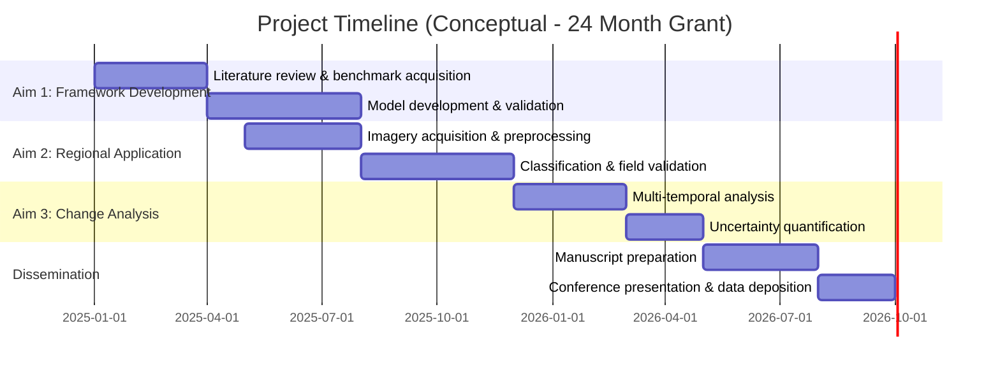
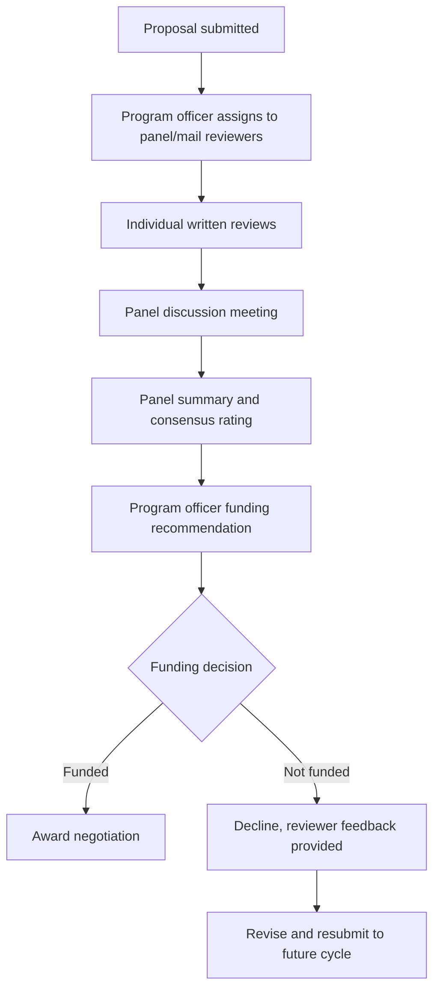

## Grant Writing and Proposal Development

### Overview

Grant writing and proposal development is the process of designing and articulating a research plan to secure funding from government agencies, private foundations, or institutional sources. In geospatial and environmental science, proposals must justify not only scientific merit but also methodological feasibility involving data acquisition (satellite imagery, field sensors, LiDAR surveys), computational resources, and often multi-stakeholder coordination (e.g., government agencies providing access to environmental monitoring sites). Success depends on aligning a compelling scientific narrative with the specific evaluation criteria of the target funder.

### Core Principles

#### The Proposal as an Argument

A funding proposal is fundamentally a persuasive argument structured around a logical chain:

$$\text{Problem} \rightarrow \text{Significance} \rightarrow \text{Gap in Knowledge} \rightarrow \text{Objectives} \rightarrow \text{Methods} \rightarrow \text{Expected Outcomes/Impact}$$

Each link must follow logically from the previous one. A common weakness in early-career proposals is a disconnect between the stated significance (e.g., "climate change threatens coastal communities") and the actual scope of proposed work (e.g., a narrow methodological improvement to a single algorithm), without an explicit bridging argument connecting the two.

#### Funder Alignment

Before drafting, proposals should be explicitly reverse-engineered from the funder's stated priorities:

- **Funding agency mission and current priority areas** (e.g., NSF's specific program solicitations, NASA's Research Opportunities in Space and Earth Science (ROSES) themes, EU Horizon Europe cluster priorities)
- **Review criteria weighting** — most funders publish explicit criteria (e.g., NSF's Intellectual Merit and Broader Impacts) and often a scoring rubric or weighting
- **Program officer guidance** — many agencies encourage informal pre-submission contact with program officers to assess fit before a full proposal is written

[Inference] Proposals that are drafted first and then retrofitted to match funder language are generally weaker than those designed from the outset around the specific solicitation's stated priorities, since retrofitting often leaves structural mismatches between the proposal's actual logic and the funder's evaluation framework.

### Standard Proposal Structure

While formats vary by funder, most substantial research proposals include:

1. **Title** — concise, specific, ideally indicating both the problem and method
2. **Abstract/Project Summary** — often the only section all reviewers read in full; must be self-contained
3. **Introduction/Background** — establishes problem context and literature gap
4. **Significance/Broader Impacts** — why the work matters beyond the immediate scientific community
5. **Specific Aims/Objectives** — typically 2–4 discrete, measurable objectives
6. **Research Design and Methods** — data sources, study area, analytical approach, validation plan
7. **Timeline** — often a Gantt chart or milestone table
8. **Budget and Budget Justification** — itemized costs with explicit justification tied to methods
9. **Broader Impacts/Dissemination Plan** — data sharing, stakeholder engagement, education/outreach components
10. **References**

#### Specific Aims Design

Aims should be independently evaluable yet build toward a coherent whole. A common failure pattern is aims that are sequentially dependent such that failure of Aim 1 invalidates Aims 2–3 entirely — reviewers often flag this as a feasibility risk. Structuring aims to be **modular** (each contributes distinct value even if others partially fail) is a frequently advised mitigation.

**Example — Weak Aims Structure (fully dependent):**

> Aim 1: Acquire and preprocess satellite imagery.
>
> Aim 2: Classify land cover from imagery obtained in Aim 1.
>
> Aim 3: Model land cover change using classifications from Aim 2.

**Example — Strengthened Aims Structure (modular, with built-in risk mitigation):**

> Aim 1: Develop and validate a land cover classification framework using existing benchmark datasets, with new imagery acquisition as an enhancement.
>
> Aim 2: Apply the validated framework to the target study region using multi-temporal Sentinel-2 imagery, with a contingency use of publicly available ESA WorldCover products if acquisition delays occur.
>
> Aim 3: Quantify land cover change trajectories and associated uncertainty, deliverable independently of Aim 2's specific imagery source.

**Key Points**: modular aims explicitly name contingencies for data acquisition risk, a specific and common feasibility concern in geospatial proposals dependent on satellite tasking, field campaigns, or third-party data access.

### Budget Development for Geospatial Research

#### Common Budget Categories

| Category | Geospatial-Specific Considerations |
| --- | --- |
| Personnel | GIS analysts, remote sensing specialists, field technicians; effort often stated in person-months |
| Equipment | GNSS/GPS receivers, UAV/drone platforms, field sensors, workstations with GPU for deep learning |
| Data acquisition | Commercial satellite imagery licensing (e.g., Maxar, Planet), LiDAR survey contracts |
| Cloud computing | Cloud compute credits for large-scale processing (e.g., Google Earth Engine, AWS, Microsoft Planetary Computer) |
| Travel | Field campaigns, conference dissemination |
| Publication costs | Open-access article processing charges, increasingly allowable and sometimes required by funder open-access mandates |

[Unverified] Specific allowable cost categories and indirect cost (overhead) rate calculations vary substantially by funding agency and host institution; the applicant's institutional sponsored-programs office is the authoritative source for current allowable rates rather than general guidance.

#### Budget Justification Example

> **UAV LiDAR Survey Equipment ($45,000):** A fixed-wing UAV-mounted LiDAR system is required to acquire sub-meter resolution canopy height data over the 200 km² study area at a temporal frequency (quarterly) not achievable via existing commercial satellite LiDAR products (e.g., GEDI's footprint-based sampling is insufficient for the wall-to-wall coverage required by Aim 2). Cost estimate based on vendor quote (Attachment C).

**Key Points**: effective budget justifications explicitly connect cost to a specific aim and explain why the specific resource (versus a cheaper alternative) is methodologically necessary — reviewers scrutinize budgets for unjustified or generic line items.

### Timeline and Milestone Planning

#### Gantt Chart Representation

Milestones should include explicit, checkable deliverables (e.g., "validated classification framework with documented accuracy assessment," not "progress on classification") to support both self-monitoring and funder progress reporting requirements.

### Broader Impacts and Data Management Plans

#### Broader Impacts

Many funders (notably NSF) require explicit articulation of impacts beyond scientific knowledge production:

- Education and training (e.g., graduate student involvement, K-12 outreach using geospatial tools)
- Diversity and inclusion in STEM participation
- Stakeholder engagement (e.g., partnering with local government or Indigenous communities for environmental monitoring)
- Societal/policy relevance (e.g., informing coastal zone management decisions)

#### Data Management Plans (DMPs)

Most federal funders require a DMP addressing:

- **Data types generated** (raw imagery, derived classification products, field survey data)
- **Metadata standards** to be followed (e.g., FGDC, ISO 19115)
- **Storage and preservation** plan and repository (e.g., institutional repository, Zenodo, agency-specific archive)
- **Access and sharing policy**, including any embargo period and licensing terms
- **Long-term preservation** commitments beyond the grant period

[Inference] DMP requirements have become more stringent across major funders in recent years, reflecting a broader open science policy trend, though specific requirements (e.g., mandatory public data release timelines) differ by agency and should be verified against the current solicitation rather than assumed from past practice.

### Review Process and Scoring

#### Panel Review Model (Common at NSF, NIH-adjacent agencies)

Common scoring dimensions include intellectual merit, broader impacts, feasibility, and budget appropriateness — but exact rubrics and relative weighting are funder-specific and stated in the solicitation.

### Common Pitfalls

- **Vague or overly broad significance statements** disconnected from the specific, narrower scope of the actual proposed work
- **Underestimating data acquisition timelines** — commercial imagery tasking, field permits, or UAV flight authorizations can introduce delays not accounted for in an optimistic timeline
- **Budget-methods mismatch** — requesting resources (e.g., high-performance computing) not clearly tied to a stated method, or conversely, proposing computationally intensive methods (e.g., deep learning on large raster stacks) without budgeting adequate compute
- **Ignoring page limits and formatting requirements** — many agencies administratively reject proposals for exceeding stated page limits or omitting required sections, regardless of scientific quality
- **Insufficient engagement with prior/related work** — failing to explicitly differentiate the proposed work from existing published methods invites a "lack of novelty" critique
- **Overpromising deliverables** relative to the requested budget and timeline, which reviewers experienced in the specific subfield will recognize as unrealistic

### Common Funding Sources in Geospatial/Environmental Science

- **U.S. federal agencies**: NSF (Directorate for Geosciences), NASA (ROSES solicitations), USGS, EPA, USDA (for agricultural/land-use research)
- **International/multilateral**: EU Horizon Europe, European Space Agency (ESA) research calls, World Bank environmental grants
- **Private foundations**: Gordon and Betty Moore Foundation (environmental conservation), National Geographic Society grants
- **Industry/commercial data grants**: Planet Labs' Education and Research Program, Maxar's data grant programs, Google Earth Engine research credits

**Next Steps**

- Scientific Writing and Technical Reporting (methods articulation shared with proposal writing)
- Research Data Management and FAIR Data Principles
- Peer Review and Publication Process (parallel review-culture skills)
- Stakeholder Engagement and Participatory GIS in Environmental Projects
- Budgeting and Cost Estimation for Remote Sensing and Field Campaigns
- Project Management Methods for Multi-Year Research Programs