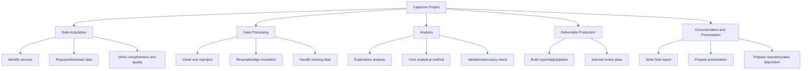
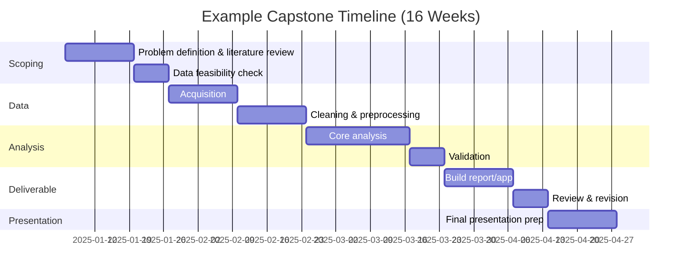

## Capstone Project Planning and Scoping

### Overview

Capstone project planning and scoping is the process of transforming a broad interest area in geospatial and environmental science into a well-defined, feasible, time-bound project with clear deliverables. Unlike open-ended research, a capstone project operates under fixed constraints — a defined timeline (typically one academic term to one year), limited data access, individual or small-team capacity, and an evaluative deliverable (report, application, or presentation) — making disciplined scoping the primary determinant of project success, often more so than the ambition of the original idea.

### Core Principles

#### The Scoping Funnel

Effective capstone scoping proceeds through progressive narrowing:

$$\text{Broad Interest} \rightarrow \text{Problem Domain} \rightarrow \text{Specific Question} \rightarrow \text{Feasible Deliverable}$$

A common failure mode is skipping intermediate steps — moving directly from a broad interest ("I want to study deforestation") to a deliverable ("build a deforestation dashboard") without articulating a specific, answerable question in between, resulting in a project with unclear success criteria.

#### Feasibility Dimensions

A well-scoped capstone must be evaluated against several independent feasibility axes simultaneously:

| Dimension | Key Questions |
| --- | --- |
| Data feasibility | Is the required data publicly available, or does it require costly acquisition/permissions? What is the actual spatial/temporal coverage? |
| Technical feasibility | Do required tools/skills fall within the student's current or acquirable competency within the timeline? |
| Time feasibility | Can each project phase realistically fit within the available weeks, including buffer for troubleshooting? |
| Scope feasibility | Is the question narrow enough to answer conclusively, or does it require indefinite additional analysis? |
| Access feasibility | Does the project require stakeholder cooperation (e.g., a local government dataset, an NGO partnership) that is not yet secured? |

[Inference] Data feasibility is frequently the most underestimated dimension in geospatial capstones specifically, since publicly advertised datasets often have gaps in temporal coverage, spatial extent, or resolution that only become apparent after acquisition attempts begin — this is a domain-specific risk distinct from generic project scoping.

### Structured Scoping Process

#### Step 1 — Problem Statement Development

A strong problem statement is specific, bounded, and stakeholder-relevant. The transformation from vague to scoped:

**Vague**: "I want to look at urban flooding using GIS."

**Scoped**: "How has impervious surface expansion between 2015–2024 in [specific municipality] altered modeled stormwater runoff volumes in three flood-prone subcatchments, based on publicly available land cover time series and a simplified SCS curve number model?"

**Key Points** distinguishing the scoped version: a defined study area, a defined time window, a named analytical method, and an explicit data source — each element independently checkable for feasibility before committing further effort.

#### Step 2 — Literature and Precedent Review

Before finalizing scope, a capstone should identify:

- **Existing methods** applied to similar problems (avoiding reinventing an established workflow unnecessarily)
- **Existing datasets or tools** that could be reused or adapted rather than built from scratch
- **Gaps or local specificity** that justify the project's value (e.g., an established national method not yet applied to a specific local jurisdiction)

#### Step 3 — Deliverable Definition

Capstone deliverables in geospatial/environmental contexts commonly take one of several forms:

- **Analytical report** — a written document presenting a spatial analysis and findings (closest to a traditional research paper)
- **Interactive web application/dashboard** — a deployed tool (e.g., built with Leaflet, Streamlit, or ArcGIS Dashboards) allowing stakeholder exploration of results
- **Reproducible analysis pipeline** — a documented, version-controlled codebase (e.g., Python/R scripts or notebooks) intended for reuse by others
- **Policy brief or decision-support product** — a shorter, stakeholder-facing document translating technical findings into actionable recommendations

The choice of deliverable format should be made explicitly during scoping, not left implicit, since it significantly affects the technical skill investment required (e.g., a dashboard requires front-end/deployment skills beyond the core spatial analysis).

#### Step 4 — Work Breakdown Structure (WBS)

Decomposing the project into discrete, estimable tasks:

Each leaf-level task should be estimated in concrete time units (days/weeks), enabling a realistic timeline to be assembled bottom-up rather than top-down (assigning arbitrary duration to broad phases).

### Risk Identification and Contingency Planning

A scoping document should explicitly enumerate risks and pre-planned responses, particularly for geospatial-specific risk categories:

| Risk Category | Example | Contingency |
| --- | --- | --- |
| Data access failure | Requested government dataset denied or delayed | Identify substitute open dataset (e.g., regional agency alternative, global product like ESA WorldCover) during scoping, not after failure |
| Data quality issues | Cloud cover obscures required satellite imagery for the study period | Widen acceptable date range or use SAR data (cloud-penetrating) as fallback |
| Technical skill gaps | Chosen method (e.g., a specific deep learning architecture) exceeds current skill level | Scope a simpler baseline method as the guaranteed deliverable, with the advanced method as a stretch goal |
| Scope creep | Additional interesting sub-questions emerge during analysis | Maintain a documented "future work" list; explicitly defer, do not incorporate mid-project |

[Unverified] The specific probability or frequency of each risk materializing cannot be generalized across capstone projects, since it depends heavily on the specific data sources, institutional context, and student experience level — the value of this table lies in prompting explicit risk enumeration during scoping rather than providing calibrated probability estimates.

### Milestone and Timeline Structuring

#### Example Timeline for a One-Semester (16-Week) Capstone

Building in an explicit buffer (commonly 10–20% of total timeline) for unforeseen delays — particularly around data acquisition, historically the most common source of capstone schedule slippage in geospatial projects — is a widely advised practice, though [Inference] the specific buffer percentage is a heuristic rather than an empirically derived figure.

### Advisor and Stakeholder Alignment

- **Advisor check-in cadence** — establishing a regular (e.g., biweekly) meeting schedule during scoping itself, not after the project begins, ensures early course-correction opportunities
- **Scope agreement documentation** — a written scoping document or proposal, reviewed and approved by an advisor before full-scale work begins, reduces later disputes about what constitutes project completion
- **External stakeholder expectations** — if the project involves a partner organization (e.g., a local government or NGO), explicitly clarifying what deliverable they expect and by when prevents misalignment discovered late in the project

### Common Pitfalls

- **Scope defined by tool ambition rather than question** — designing a project around "using machine learning" or "building a dashboard" as the primary goal, rather than around a specific analytical question, often results in a technically impressive but analytically shallow deliverable
- **Underestimating data preprocessing time** — in geospatial projects, cleaning, reprojecting, and aligning heterogeneous datasets frequently consumes more time than the core analysis itself, a ratio often inverted in initial time estimates
- **No defined "minimum viable deliverable"** — without an explicit fallback scope, schedule slippage in early phases cascades into an incomplete final deliverable rather than a smaller, but complete, one
- **Conflating exploratory work with the final analysis timeline** — early exploratory data analysis is valuable but open-ended; failing to timebox it can consume schedule intended for the core, deliverable-producing analysis
- **Ignoring reproducibility until the end** — treating documentation, code organization, and version control as a final step rather than an ongoing practice throughout the project, resulting in a rushed and incomplete methods write-up

### Scoping Document Template (Structure)

A capstone scoping document (deliverable of the scoping phase itself) typically includes:

1. Problem statement and research question(s)
2. Background/justification (brief literature grounding)
3. Data sources (named, with access status confirmed)
4. Methodology overview (methods named, not yet fully detailed)
5. Deliverable specification (format, audience, success criteria)
6. Work breakdown structure and timeline
7. Risk register with contingencies
8. Advisor/stakeholder sign-off

**Related Topics**

- Scientific Writing and Technical Reporting (final capstone report structure)
- Data Visualization and Map-Based Storytelling (deliverable design for dashboards/reports)
- Project Management Methods for Multi-Year Research Programs
- Version Control and Reproducible Workflows (Git, notebooks, environment management)
- Portfolio Development and Presenting Technical Work to Employers
- Stakeholder Engagement and Participatory GIS in Environmental Projects