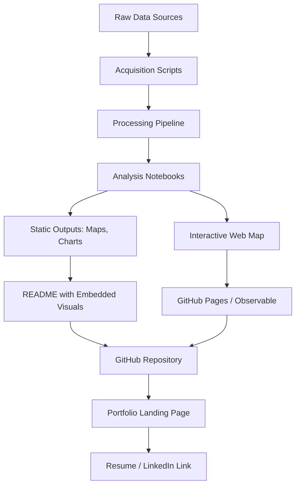

## Portfolio Development for Geospatial Professionals


### Purpose and Scope

A geospatial portfolio is a curated, public-facing demonstration of applied competence in spatial data acquisition, processing, analysis, and communication. Unlike a resume, which asserts skills, a portfolio provides verifiable evidence: working code, reproducible analyses, cartographic output, and documented reasoning. For hiring managers in GIS, remote sensing, spatial data science, and geospatial software engineering, the portfolio typically substitutes for a technical interview's first filtering stage.

The scope of a geospatial portfolio differs from a general software portfolio because it must demonstrate three simultaneous competencies:

- **Domain knowledge** — understanding of coordinate reference systems (CRS), spatial statistics, remote sensing physics, or cartographic principles
- **Technical execution** — proficiency with GIS software, spatial databases, programming languages (Python, R, JavaScript), and cloud geospatial platforms
- **Communication** — the ability to translate spatial analysis into a decision-relevant narrative for non-technical stakeholders

### Core Portfolio Components

#### 1. Project Selection Strategy

Projects should span the breadth of the target role. A candidate applying for a spatial data science role should not submit five cartography-only projects. Recommended distribution for a general geospatial portfolio (4–6 projects):

- One **data engineering/pipeline** project (ETL of raw spatial data into an analysis-ready format)
- One **spatial analysis** project (proximity analysis, network analysis, spatial interpolation, or hotspot detection)
- One **remote sensing/Earth observation** project (land cover classification, change detection, or vegetation indices)
- One **web mapping/visualization** project (interactive dashboard or story map)
- Optionally, one **machine learning + geospatial** project (spatial ML, geostatistics, or deep learning on imagery)

Each project should have a clear **problem statement**, not just a demonstration of a tool. "I built a heat island map of my city" is weaker than "I identified block groups with land surface temperatures 5°C above the city median and cross-referenced them with tree canopy coverage to prioritize planting interventions."

#### 2. Technical Stack Documentation

Every project should explicitly document the stack used, since reviewers scan for specific tool fluency:

| Layer | Common Tools |
| --- | --- |
| Data acquisition | USGS EarthExplorer, Copernicus Open Access Hub, OpenStreetMap Overpass API, government open-data portals |
| Storage | PostGIS, GeoParquet, Cloud-Optimized GeoTIFF (COG), SpatiaLite |
| Processing (Python) | GeoPandas, Rasterio, Shapely, PyProj, Xarray, Rasterstats |
| Processing (R) | sf, terra, raster, stars |
| Remote sensing | Google Earth Engine, SNAP (Sentinel toolbox), scikit-image |
| Desktop GIS | QGIS, ArcGIS Pro |
| Web mapping | Leaflet, Mapbox GL JS, MapLibre GL JS, Kepler.gl, deck.gl |
| Cloud/infra | AWS S3 + Lambda, Google Cloud Storage, STAC catalogs |

#### 3. Repository Structure

A geospatial repository should follow a convention that signals reproducibility. A widely adopted pattern:

```plaintext
project-name/
├── data/
│   ├── raw/              # Original, unmodified source data (often gitignored)
│   ├── interim/          # Intermediate transformations
│   └── processed/        # Analysis-ready datasets
├── notebooks/            # Exploratory analysis, numbered by sequence
├── src/                  # Reusable functions/modules
│   ├── acquisition.py
│   ├── processing.py
│   └── visualization.py
├── outputs/
│   ├── maps/
│   └── figures/
├── environment.yml       # or requirements.txt / pyproject.toml
├── README.md
└── LICENSE
```

Raw geospatial data (especially large raster files) should **not** be committed directly to Git. Use `.gitignore` for `data/raw/` and document acquisition steps (API calls, download URLs) so the pipeline is reproducible without bloating the repository. Git LFS or DVC (Data Version Control) is appropriate when versioned datasets must be tracked.

#### 4. README as the Primary Communication Artifact

The README is the single most scrutinized file in a portfolio repository. A strong geospatial project README includes:

- **Problem statement** — one paragraph, framed as a real-world question
- **Data sources** — named, linked, and dated (spatial data has strong temporal validity constraints)
- **Methodology summary** — CRS used, resolution, key algorithms, and any assumptions
- **Key visualization** — a static map or chart embedded directly in the README (GitHub renders images inline)
- **Reproducibility instructions** — environment setup and execution steps
- **Limitations** — explicit statement of known data quality issues, edge cases, or scale constraints

**Example** README excerpt:

```plaintext
## Urban Heat Island Analysis — Metro Manila

### Problem
Identify barangays with disproportionate land surface temperature (LST)
relative to green cover, to prioritize urban tree-planting budget allocation.

### Data
- Landsat 8 Collection 2 Level-2 (USGS, Aug 2024, Path 116/Row 51)
- PSA barangay boundaries (2023 vintage)
- CRS: EPSG:32651 (UTM Zone 51N) for area-preserving calculations

### Method
LST derived via Band 10 brightness temperature with NDVI-based emissivity
correction (Sobrino et al. method). Zonal statistics aggregated per barangay
using rasterstats.

### Limitations
Single-date snapshot; seasonal LST variation not captured. Cloud masking
removed ~8% of urban core pixels.
```

### Choosing a Hosting and Presentation Platform

| Platform | Best For | Constraints |
| --- | --- | --- |
| GitHub/GitLab | Code, notebooks, README-driven projects | No native interactive map hosting beyond static renders |
| GitHub Pages | Static web maps (Leaflet, MapLibre) | Free, but no backend/server-side processing |
| Personal domain + static site generator (Hugo, Quarto) | Portfolio narrative, blog-style write-ups | Requires more setup; higher polish ceiling |
| ArcGIS Online / StoryMaps | Cartography-forward, non-coding stakeholders | Best for roles emphasizing Esri ecosystem fluency |
| Observable | Interactive data + map notebooks | Good for JS-based spatial visualization |
| Kaggle/HuggingFace Spaces | ML-heavy geospatial projects | Signals data science orientation |

[Inference] For roles explicitly requiring Esri certification or municipal/government GIS experience, an ArcGIS Online portfolio alongside code repositories is often expected, since many public-sector employers standardize on Esri tooling rather than the open-source stack.

### Portfolio Architecture Diagram



### Cartographic Quality Standards

Every static map included in a portfolio should satisfy baseline cartographic conventions, since poor map design signals weak domain fluency regardless of analytical rigor:

- **Title** stating what is mapped, not just the dataset name
- **Scale bar and north arrow** (unless explicitly a web Mercator interactive map where these are contextually implied)
- **Legend** with units, not just color ramps
- **Data source and date** citation in a footer
- **Appropriate classification scheme** — quantile, natural breaks (Jenks), or equal interval, chosen deliberately and stated
- **Colorblind-safe palettes** — ColorBrewer or viridis-family ramps rather than default red-green ramps

#### Illustrative SVG: Map Element Checklist (svg_diagram)

<svg xmlns="http://www.w3.org/2000/svg" viewBox="0 0 640 340">
<text x="320" y="28" font-size="16" font-weight="bold" text-anchor="middle" fill="#1a1a1a">Essential Map Elements (svg_diagram)</text>
<rect x="30" y="50" width="580" height="260" fill="none" stroke="#333" stroke-width="2" />
<text x="45" y="75" font-size="13" fill="#333">Title: "Land Surface Temperature by Barangay, Aug 2024"</text>
<rect x="45" y="90" width="380" height="180" fill="#eef3f7" stroke="#888" />
<text x="235" y="185" font-size="12" text-anchor="middle" fill="#666">[ Choropleth Map Body ]</text>
<rect x="440" y="90" width="150" height="60" fill="#fff" stroke="#888" />
<text x="450" y="105" font-size="11" fill="#333">Legend</text>
<rect x="450" y="112" width="12" height="12" fill="#fee5d9" />
<text x="468" y="122" font-size="10" fill="#333">28–31°C</text>
<rect x="450" y="128" width="12" height="12" fill="#a50f15" />
<text x="468" y="138" font-size="10" fill="#333">38–41°C</text>
<line x1="440" y1="165" x2="480" y2="165" stroke="#333" stroke-width="2" />
<text x="440" y="180" font-size="10" fill="#333">0 5 km (Scale Bar)</text>
<polygon points="560,160 570,180 550,180" fill="#333" />
<text x="545" y="195" font-size="9" fill="#333">N</text>
<text x="45" y="285" font-size="10" fill="#555">Source: Landsat 8 C2L2, USGS. Boundaries: PSA 2023. CRS: EPSG:32651</text>
</svg>

### Demonstrating Reproducibility and Environment Management

Portfolio reviewers with technical backgrounds frequently attempt to clone and run a repository. Failure to run is a stronger negative signal than mediocre analysis. Best practices:

- Pin dependency versions in `environment.yml` (Conda) or `pyproject.toml` (Poetry/PDM), since GDAL-dependent geospatial stacks (Rasterio, Fiona, GeoPandas) are sensitive to binary compatibility
- Include a `Makefile` or numbered notebook execution order when pipeline steps are sequential
- Where possible, provide a small sample dataset so the pipeline runs end-to-end without requiring multi-gigabyte downloads
- Consider a `Dockerfile` for projects with complex native dependencies (GDAL, PROJ, GEOS), since these are historically difficult to install consistently across operating systems

**Example** minimal `environment.yml`:

```yaml
name: uhi-analysis
channels:
  - conda-forge
dependencies:
  - python=3.11
  - geopandas=0.14
  - rasterio=1.3
  - rasterstats=0.19
  - matplotlib=3.8
  - jupyterlab
```

### Narrative Framing: Case Study Structure

Each portfolio project benefits from being written up as a case study rather than a code dump. A structure that performs well with both technical and hiring-manager audiences:

1. **Context** — who would need this analysis and why (simulate a real stakeholder if the project is self-initiated)
2. **Question** — the specific, falsifiable question being answered
3. **Data and method** — brief, linking to full technical detail rather than inlining all of it
4. **Result** — the map, chart, or number that answers the question
5. **Interpretation** — what the result means for the stakeholder's decision
6. **Caveats** — explicit acknowledgment of data or method limitations

[Inference] This structure tends to outperform purely technical documentation in portfolio contexts because it demonstrates the applied, decision-oriented reasoning that most geospatial roles require beyond raw analytical execution — though its relative weight versus technical depth varies by employer and role seniority.

### Differentiation by Career Track

| Track | Portfolio Emphasis |
| --- | --- |
| GIS Analyst (public sector/utilities) | Cartographic polish, ArcGIS Pro/Online proficiency, workflow documentation |
| Spatial Data Scientist | Python/R fluency, statistical rigor, reproducible notebooks, spatial ML |
| Remote Sensing Specialist | Google Earth Engine or SNAP workflows, classification accuracy metrics, time-series analysis |
| Geospatial Software Engineer | API design, spatial database schema, performance benchmarks, deployment architecture |
| UX/Cartographic Designer | Interactive web maps, design system consistency, accessibility |

### Common Weaknesses in Geospatial Portfolios

- **Toy datasets without stated provenance** — using an unlabeled Kaggle CSV without documenting original source or collection date undermines credibility
- **Missing CRS documentation** — omitting the coordinate reference system used for area/distance calculations is a frequent and visible error to domain reviewers
- **Overly generic tutorials repackaged as projects** — a near-identical reproduction of a well-known tutorial (e.g., "COVID choropleth map") without an original question or dataset extension signals low initiative
- **No discussion of accuracy or validation** — remote sensing classification projects that omit a confusion matrix or accuracy assessment appear incomplete to domain specialists
- **Dead links to interactive demos** — web maps hosted on free tiers that expire or break after initial submission

### Maintenance and Versioning

A portfolio is not static. Recommended maintenance cadence:

- Review and update the top 3–4 featured projects every 6 months
- Archive but retain older projects to show skill progression over time
- Tag repository releases (`v1.0`, `v1.1`) when significant methodology revisions occur, allowing reviewers to see iterative improvement
- Keep a lightweight `CHANGELOG.md` for portfolio-quality projects that receive updates after initial publication

**Next Steps**

- Draft problem statements for 4–6 candidate projects spanning the distribution table above
- Select and document CRS and data provenance for each project before writing analysis code
- Build one project end-to-end (data → processing → README → hosted output) as a template before parallelizing the rest
- Set up a personal landing page or GitHub profile README linking all projects with one-line problem statements

**Related Topics**

- Writing Effective Geospatial Case Studies for Non-Technical Audiences
- Reproducible Geospatial Workflows with Docker and Conda
- Accuracy Assessment Methods for Remote Sensing Classification
- Designing Interactive Web Maps with MapLibre GL JS
- STAC (SpatioTemporal Asset Catalog) for Data Discovery and Documentation
- Technical Interview Preparation for Geospatial Roles