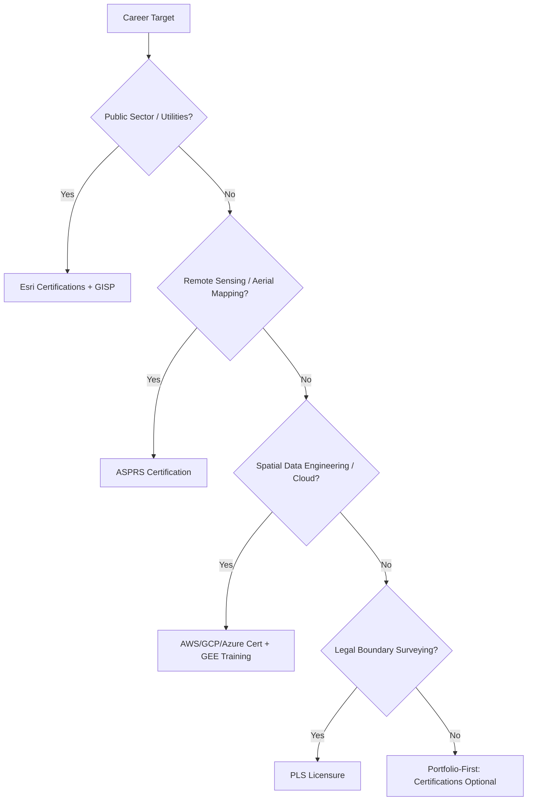

## Professional Certifications and Credentials

### Purpose and Role in a Geospatial Career

Certifications serve as third-party verification of competence, distinct from a portfolio (self-demonstrated) or a degree (institutionally general). In geospatial fields, certifications carry variable weight depending on sector: public-sector and utility employers often list them as preferred or required qualifications, while software-engineering-oriented geospatial roles tend to weight portfolios and technical interviews more heavily. Understanding which certifications map to which career track is a prerequisite to prioritizing study time and cost.

### Major Certification Categories

Geospatial credentials fall into four broad categories:

1. **Vendor/platform certifications** — tied to a specific software ecosystem (Esri, Google)
2. **Professional/industry certifications** — vendor-neutral, competency-based (GISP, ASPRS)
3. **Cloud and data engineering certifications** — general cloud credentials applied to geospatial workloads (AWS, GCP, Azure)
4. **Domain-specific technical certifications** — remote sensing, surveying, or specialized software (SNAP, LiDAR processing)

### Esri Certifications

Esri's certification program is the most widely recognized vendor credential in traditional GIS employment, particularly in North American public sector, utilities, and natural resources.

| Certification | Level | Focus |
| --- | --- | --- |
| ArcGIS Desktop Associate | Entry | Basic mapping, data management, ArcGIS Pro navigation |
| ArcGIS Desktop Professional | Intermediate | Advanced spatial analysis, geoprocessing |
| ArcGIS Enterprise Administration Associate | Entry–Intermediate | Server deployment, portal administration |
| ArcGIS Developer Associate | Intermediate | ArcGIS API for JavaScript/Python, app development |
| ArcGIS Spatial Analyst / 3D Analyst Associate | Specialist | Extension-specific competency |

Exams are proctored, multiple-choice/scenario-based, and require renewal (typically every 2–3 years) as Esri updates software versions. [Unverified] Exact renewal intervals and exam fees change periodically with Esri's certification program updates, so current pricing and validity periods should be confirmed against Esri's certification portal at the time of registration rather than assumed from prior cycles.

### GIS Professional (GISP) Certification

The GISP, administered by the **GIS Certification Institute (GISCI)** in the United States, is the primary vendor-neutral professional credential in the GIS field.

**Eligibility structure** is portfolio-based rather than exam-based, scored across three components:

- **Education** — points awarded per degree/coursework in GIS-relevant fields
- **Experience** — points per year of documented professional GIS work
- **Contributions to the profession** — points for publications, conference presentations, teaching, professional service

A minimum point threshold (historically 150 points, with a floor requirement in each category) is required to sit for the **GIS Certification Exam**, a proctored knowledge exam covering:

- Conceptual foundations (spatial data models, geodesy, map projections)
- Analytical methods (spatial statistics, geoprocessing, network analysis)
- Planning and management (project management, GIS implementation)
- Data (data models, quality, metadata standards)

[Inference] The GISP is generally weighted more heavily by employers seeking demonstrated professional judgment and ethics compliance (GISCI requires adherence to a Code of Ethics) than by employers hiring for narrowly technical or software-engineering roles, since its scoring rubric rewards career breadth over specific tool fluency.

### ASPRS Certifications

The **American Society for Photogrammetry and Remote Sensing (ASPRS)** offers credentials specifically for remote sensing, photogrammetry, and LiDAR/UAS specialists:

- **Certified Photogrammetrist**
- **Certified Mapping Scientist — Remote Sensing**
- **Certified Mapping Scientist — GIS/LIS**
- **UAS Mapping Certification**

These are relevant primarily for candidates targeting aerial mapping, surveying-adjacent, or federal geospatial contracting roles (e.g., USGS, NOAA contractors), where ASPRS credentials are sometimes explicitly listed in contract qualification requirements.

### Cloud Platform Certifications Applied to Geospatial Work

As geospatial workloads increasingly run on cloud infrastructure (Earth Engine, cloud-native raster formats, distributed processing), general cloud certifications have become relevant credentials for geospatial data engineering roles, even though they are not geospatial-specific:

| Certification | Provider | Relevance to Geospatial Work |
| --- | --- | --- |
| AWS Certified Solutions Architect | Amazon | S3-based data lakes, Lambda-driven processing pipelines, EC2 for compute-heavy raster work |
| Google Cloud Professional Data Engineer | Google | BigQuery GIS, Earth Engine integration, Dataflow pipelines |
| Microsoft Azure Data Engineer Associate | Microsoft | Azure Maps, Azure Synapse spatial analytics |
| Google Earth Engine (developer certificate/training) | Google | JavaScript/Python API proficiency for large-scale Earth observation analysis |

[Inference] Cloud certifications carry more signal for geospatial software engineering and data science roles than for traditional cartography/GIS-analyst roles, since they validate infrastructure competence rather than domain-specific spatial analysis skill.

### Surveying and Licensure-Adjacent Credentials

Distinct from GIS/remote sensing certifications, **Professional Land Surveyor (PLS)** or equivalent licensure is a legally regulated credential (state/national licensing board, not a voluntary certification) required for boundary surveys, legal land descriptions, and certain cadastral work. This is a separate regulatory track from GISP/Esri certifications and typically requires a surveying-specific degree, apprenticeship hours, and a licensing exam (e.g., the **Fundamentals of Surveying (FS)** and **Principles and Practice of Surveying (PS)** exams in the U.S.). [Unverified] Licensure requirements are jurisdiction-specific and should be verified against the relevant state or national licensing board rather than assumed to generalize internationally.

### Decision Framework by Career Track

### Cost, Time, and Renewal Considerations

| Certification | Approx. Preparation Time | Renewal Model |
| --- | --- | --- |
| Esri Associate-level | 4–8 weeks self-study | Version-tied, periodic re-exam |
| GISP | Months (portfolio assembly) + exam prep | Annual renewal via continuing education points |
| ASPRS Certified Photogrammetrist | Requires years of documented experience | Periodic renewal with continuing education |
| AWS/GCP/Azure Associate-level | 4–12 weeks | 2–3 year re-certification |

[Inference] Because GISP eligibility depends on accumulated experience and contribution points rather than study time alone, it is generally unsuitable as an early-career credential and is more commonly pursued mid-career, whereas Esri Associate certifications and cloud certifications are more accessible immediately after formal education.

### Certification vs. Portfolio: Complementary, Not Substitutive

**Key Points**

- Certifications validate standardized knowledge; portfolios validate applied execution. Employers evaluating technical/analyst roles typically want both.
- A certification without any demonstrated project work signals theoretical knowledge without proven execution.
- A portfolio without any credentials may be sufficient in software-engineering-adjacent geospatial roles but is often insufficient in public-sector hiring, where credentials may be a formal screening criterion (sometimes a pass/fail filter before resumes are even reviewed).
- Certifications with renewal requirements (Esri, cloud providers) also implicitly signal that a candidate's skills reflect current software versions rather than knowledge that may be several major versions stale.

### Preparing for Certification Exams

**Example** structured preparation approach for an Esri Desktop Associate exam:

1. Review the official exam study guide and topic weighting published by Esri
2. Complete hands-on exercises in ArcGIS Pro covering each weighted topic area (data management, analysis, cartographic output)
3. Use Esri's free training resources (Esri Academy modules) matched to exam objectives
4. Take a practice assessment if available to identify weak areas
5. Schedule the proctored exam only after consistently scoring above the target threshold on practice material

### Common Pitfalls

- **Certification stacking without direction** — accumulating unrelated certifications (e.g., an Esri Developer cert alongside a PLS-track exam) without a coherent career narrative dilutes rather than strengthens a candidate profile
- **Letting certifications lapse silently** — an expired Esri or cloud certification listed on a resume without renewal date context can appear as an oversight during technical screening
- **Treating GISP as an entry-level goal** — attempting GISP eligibility too early in a career often fails the points threshold and wastes application effort better spent gaining documented experience first
- **Ignoring jurisdiction-specific licensure rules** for surveying-adjacent work, which vary significantly by state/country and are not satisfied by GIS certifications alone

**Next Steps**

- Identify target career track (public sector, remote sensing, cloud/data engineering, surveying) before selecting certifications
- Cross-reference 3–5 job postings in the target track to identify explicitly required or preferred credentials
- Build a certification timeline aligned with portfolio project completion, since combined credential + project evidence is strongest for applications
- Verify current exam fees, renewal cycles, and eligibility requirements directly against the issuing organization's official site before committing study time

**Related Topics**

- GIS Certification Institute (GISCI) Code of Ethics and Professional Conduct
- Esri ArcGIS Pro Certification Exam Objectives (current version)
- ASPRS Remote Sensing and Photogrammetry Credentialing Pathways
- Cloud Infrastructure for Large-Scale Earth Observation Processing
- Continuing Education and Professional Development Planning for GIS Careers
- Job Market Analysis: Credential Requirements Across Geospatial Sectors