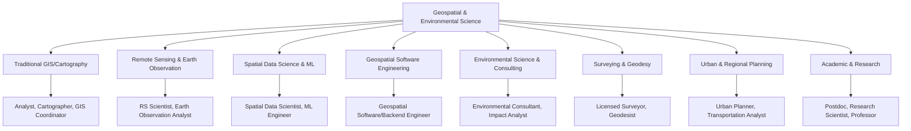

## Career Pathways in Geospatial and Environmental Science

### Overview of the Field's Career Landscape

Geospatial and environmental science careers span a spectrum from field-based data collection to software engineering, spanning public, private, academic, and non-profit sectors. Unlike more narrowly defined technical fields, the geospatial domain is inherently cross-disciplinary: a single job title (e.g., "GIS Analyst") can require radically different skill sets depending on the employing sector. Understanding the major pathway clusters is a prerequisite for targeted skill development and portfolio/certification planning.

### Primary Pathway Clusters

### 1. Traditional GIS and Cartography

**Typical roles**: GIS Analyst, GIS Technician, Cartographer, GIS Coordinator, GIS Manager

**Core responsibilities**: Data management and QA/QC, map production, geoprocessing workflows, database administration (often using Esri's ecosystem), and supporting decision-makers in local/state government, utilities, or natural resource agencies.

**Typical employers**: Municipal and county governments, utility companies (water, electric, telecom), state departments of transportation, environmental agencies, land trusts.

**Progression**: GIS Technician → GIS Analyst → Senior Analyst/GIS Coordinator → GIS Manager/Director. Progression to management often shifts responsibilities toward enterprise system administration and staff supervision rather than deepening technical analysis.

**Key credentials**: Esri Associate/Professional certifications, GISP (mid-career).

### 2. Remote Sensing and Earth Observation

**Typical roles**: Remote Sensing Scientist, Earth Observation Analyst, Imagery Analyst, Photogrammetrist

**Core responsibilities**: Satellite and aerial imagery analysis, land cover/land use classification, change detection, vegetation index time-series analysis, atmospheric correction, sensor calibration.

**Typical employers**: NASA/ESA-affiliated research programs, NOAA, USGS, defense/intelligence contractors, agricultural technology companies (precision agriculture), forestry and conservation organizations, disaster response agencies.

**Distinguishing technical depth**: Requires understanding of electromagnetic spectrum behavior, sensor types (optical, SAR, LiDAR, hyperspectral), and platform-specific processing (Sentinel, Landsat, commercial constellations like Planet or Maxar).

**Key credentials**: ASPRS certifications, domain-specific graduate coursework, Google Earth Engine proficiency.

### 3. Spatial Data Science and Machine Learning

**Typical roles**: Spatial Data Scientist, Geospatial ML Engineer, Quantitative Analyst (location intelligence)

**Core responsibilities**: Applying statistical and machine learning methods to spatial data — spatial regression, geostatistics (kriging), spatial clustering, deep learning on imagery (CNNs for classification/segmentation), building predictive models incorporating location as a feature.

**Typical employers**: Location intelligence companies (e.g., ride-share, delivery logistics, real estate analytics), insurance (catastrophe/risk modeling), retail site-selection analytics, climate risk modeling firms, agtech.

**Distinguishing technical depth**: Strong Python/R statistical programming, understanding of spatial autocorrelation and the modifiable areal unit problem (MAUP), familiarity with ML frameworks applied to raster/vector data.

[Inference] This pathway has grown substantially relative to traditional GIS roles as data science hiring has expanded across industries, though the degree of overlap with "pure" data science roles (without a geospatial specialization) varies by employer and is not uniformly documented across the industry.

### 4. Geospatial Software Engineering

**Typical roles**: Geospatial Backend Engineer, Full-Stack Geospatial Developer, GIS Software Developer

**Core responsibilities**: Building and maintaining spatial databases (PostGIS), APIs serving spatial data, web mapping applications, spatial ETL pipelines, cloud infrastructure for geospatial workloads.

**Typical employers**: Mapping/location technology companies (Mapbox, Esri as an employer, HERE, TomTom), companies building internal geospatial tooling (logistics, telecom, agriculture technology), open-source geospatial foundations.

**Distinguishing technical depth**: General software engineering competence (APIs, databases, cloud infrastructure, CI/CD) combined with spatial-specific knowledge (spatial indexing, CRS transformations, vector tile generation, raster tiling schemes like COG/XYZ).

**Key credentials**: Less certification-dependent; portfolio and system design competence weigh more heavily than vendor certifications.

### 5. Environmental Science and Consulting

**Typical roles**: Environmental Consultant, Environmental Scientist, Natural Resource Analyst, Compliance Specialist

**Core responsibilities**: Environmental impact assessments, regulatory compliance reporting, field data collection (water quality, soil, ecological surveys), integrating GIS with environmental modeling (hydrology, habitat suitability).

**Typical employers**: Environmental consulting firms, engineering firms with environmental divisions, government regulatory agencies (EPA-equivalent bodies), NGOs focused on conservation.

**Distinguishing technical depth**: Often requires a stronger natural sciences foundation (ecology, hydrology, soil science) alongside GIS as a supporting tool rather than the primary skill.

### 6. Surveying and Geodesy

**Typical roles**: Licensed Land Surveyor, Geodesist, Survey Technician

**Core responsibilities**: Legally binding boundary determination, control network establishment, high-precision GNSS/GPS surveying, integration with CAD and BIM workflows.

**Regulatory distinction**: This pathway is licensure-gated in most jurisdictions (see Professional Certifications topic), requiring formal examination and apprenticeship hours; it is not accessible purely through self-study or portfolio work.

### 7. Urban and Regional Planning

**Typical roles**: Urban Planner, Transportation Analyst, GIS-focused Planner

**Core responsibilities**: Land use analysis, zoning, transportation network modeling, demographic and census data analysis, public engagement mapping (StoryMaps, dashboards).

**Typical employers**: Municipal planning departments, metropolitan planning organizations (MPOs), transportation consulting firms.

**Overlap note**: This pathway often blends GIS analyst work with policy analysis; many practitioners hold a Master's in Urban/Regional Planning (MUP/MURP) rather than a pure GIS credential.

### 8. Academic and Research Careers

**Typical roles**: Graduate Researcher, Postdoctoral Fellow, Research Scientist, Professor

**Core responsibilities**: Original research contributing to the geospatial/environmental science literature, grant writing, teaching, and (increasingly) developing open-source tools or datasets used by the broader field.

**Pathway structure**: Typically requires a PhD; progression follows the standard academic track (PhD → postdoc → tenure-track/research scientist), though research-scientist roles in national labs (e.g., NASA JPL, national geological surveys) offer non-teaching alternatives.

### Cross-Pathway Skill Comparison

| Pathway | Core Programming Need | Domain Science Depth | Certification Weight | Fieldwork Component |
| --- | --- | --- | --- | --- |
| Traditional GIS | Low–Moderate | Moderate | High (Esri/GISP) | Low–Moderate |
| Remote Sensing | Moderate | High (physics/sensors) | Moderate (ASPRS) | Low |
| Spatial Data Science | High | Moderate (statistics) | Low | None |
| Geospatial Software Eng. | Very High | Low–Moderate | Low | None |
| Environmental Consulting | Low | High (natural sciences) | Moderate (env. certs) | High |
| Surveying/Geodesy | Low | High (geodesy) | Mandatory (licensure) | High |
| Urban Planning | Low–Moderate | Moderate (policy) | Low–Moderate | Moderate |
| Academic/Research | Varies (often High) | Very High | Low (degree-driven) | Varies |

### Sector Distribution

**Key Points**

- **Public sector** (municipal, state, federal) tends to offer strong job stability and defined GIS/planning career ladders but generally slower compensation growth and more standardized (often Esri-centric) tooling.
- **Private sector technology companies** (mapping platforms, location intelligence, agtech) offer more overlap with general software/data science compensation trends and faster tooling evolution (open-source, cloud-native stacks).
- **Environmental consulting** compensation and workload are often tied to regulatory cycles and project-based contracts, producing more variable workload patterns than public-sector roles.
- **Academic/research** paths offer the deepest specialization but the longest credentialing timeline (PhD) and historically constrained tenure-track hiring relative to PhD output. [Inference] This supply/demand imbalance is a commonly cited pattern across STEM academic labor markets generally, not unique to geospatial science, though its precise severity in geospatial subfields specifically is not something that can be quantified without current labor market data.

### Transitioning Between Pathways

Lateral movement between pathways is common and often follows recognizable bridges:

- **Traditional GIS → Spatial Data Science**: typically requires building Python/R statistical proficiency and a portfolio demonstrating analytical (not just cartographic) work
- **Remote Sensing → Spatial Data Science/ML**: often a natural transition given shared foundations in raster processing and increasingly, deep learning for image classification
- **Environmental Science → GIS-heavy roles**: common when a practitioner's fieldwork-oriented role increasingly involves GIS as core tooling
- **Academic Research → Industry**: frequently bridges through open-source contributions, published methodology later adopted commercially, or postdoc-to-industry-research-scientist transitions

### Building a Pathway-Aligned Development Plan

**Example** development plan for a candidate targeting Spatial Data Science from a Traditional GIS background:

1. Formalize Python proficiency (GeoPandas, scikit-learn) beyond ArcGIS's built-in Python window usage
2. Complete 2–3 portfolio projects demonstrating statistical/ML methods applied to spatial data (see Portfolio Development topic)
3. Study foundational spatial statistics (Moran's I, kriging, spatial regression) to speak credibly to the "spatial" half of the role, not just general data science
4. Target job postings explicitly blending "GIS" and "data science" language to identify realistic transitional roles rather than applying directly to senior spatial-data-science positions

### Common Pitfalls in Career Pathway Planning

- **Treating "GIS" as a single monolithic career** rather than recognizing the substantial skill and compensation divergence across the clusters above
- **Over-specializing early** in a narrow tool (e.g., only ArcGIS) without building underlying spatial reasoning and programming fundamentals transferable across pathways
- **Underestimating the licensure barrier** in surveying, assuming GIS credentials substitute for legally required surveying licensure
- **Ignoring sector-specific hiring norms** — for example, applying to public-sector roles with a private-sector-style portfolio-only application, without addressing formal certification requirements often used as initial screening filters

**Next Steps**

- Map personal interests and existing coursework/skills against the eight pathway clusters to identify the closest-fit starting point
- Identify 3–5 target job postings per candidate pathway to reverse-engineer required skills, tools, and credentials
- Align portfolio project selection (see Portfolio Development for Geospatial Professionals) and certification planning (see Professional Certifications and Credentials) with the chosen pathway rather than pursuing generic, unfocused preparation

**Related Topics**

- Compensation Benchmarking Across Geospatial Career Tracks
- Graduate Program Selection for Remote Sensing vs. GIScience vs. Spatial Data Science
- Building a Transition Plan Between Geospatial Career Pathways
- Public Sector vs. Private Sector Geospatial Employment: Trade-offs
- Open-Source Contribution as a Career Development Strategy in Geospatial Software