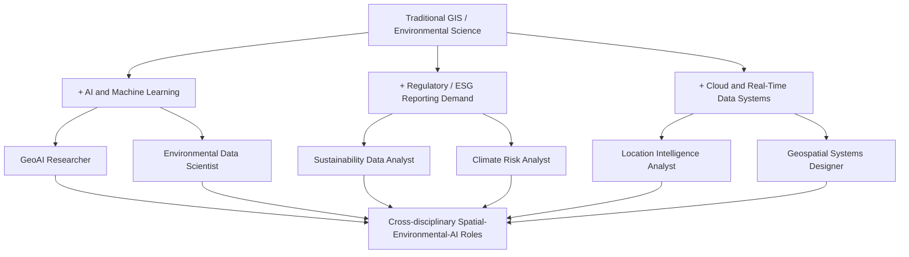

## Industry Trends and Emerging Job Roles

### Overview

The geospatial and environmental science job market in 2026 is being reshaped by three converging forces: the integration of AI/machine learning into spatial and environmental workflows, a sharp expansion of regulatory-driven sustainability reporting requirements, and a broader shift from "tool operators" toward professionals who can translate data into real-time operational decisions. For capstone and career planning purposes, understanding these shifts helps target skill development toward roles that are actively expanding rather than those being automated away.

### Macro Drivers Reshaping the Field

- **AI/GeoAI convergence** — Machine learning is increasingly embedded directly into spatial analysis pipelines (automated satellite image classification, change detection, object extraction), reducing manual processing time.
- **Outcome-focused, real-time spatial intelligence** — Organizations are moving spatial data out of standalone GIS platforms and into operational systems, so decision-makers get real-time answers (e.g., "where is the congestion right now") rather than waiting on analyst-produced reports.
- **Regulatory expansion in sustainability reporting** — Frameworks such as the EU's Corporate Sustainability Reporting Directive (CSRD) and European Sustainability Reporting Standards (ESRS) are compelling thousands of organizations globally (with similar expansions in the UK, US, Australia, and Canada) to build out environmental compliance functions.
- **Climate risk quantification for finance** — Physical climate risk assessment and biodiversity-dependency modeling for financial institutions have become some of the most sought-after skill profiles in sustainable finance.
- **Persistent workforce skills gap** — Industry workforce studies describe the AI/geospatial skills gap as a structural, not temporary, challenge threatening the sector's ability to meet demand across commercial, defense, and intelligence applications.

### Geospatial Industry Trends and Emerging Roles

The GIS/geospatial field is shifting from "professionals who make maps" toward professionals who can build and deploy analytical and automated systems. Core in-demand technical skills include Python-based geospatial automation (GeoPandas, Rasterio, scikit-learn), machine learning for spatial prediction and classification, cloud platforms (AWS, Azure), SQL/data pipelines, and — newly prominent — working with large language models (LLMs) and AI agents to automate geospatial workflows.

| Emerging Role | Core Focus |
| --- | --- |
| GeoAI / Spatial AI Researcher | Merges machine learning research with spatial data, both academic and applied |
| AI-Powered GIS Analyst | Applies automated classification/change-detection models within traditional GIS analysis |
| Geospatial Data Scientist | Blends spatial statistics, ML modeling, and data engineering |
| Automated Mapping Specialist | Builds AI-driven cartographic pipelines replacing manual map production/maintenance |
| Geospatial Systems Designer | Designs entire spatial data systems/infrastructure rather than individual maps |
| Location Intelligence Analyst | Supports real-time, operational decision-making (logistics, risk, asset tracking) |

**Key Points**

- Employer demand is shifting from "map production" skills toward system design, automation, and ML deployment skills.
- Entry-level, manual cartographic and processing roles face the greatest automation exposure; specialization in AI-integrated analysis increases resilience and advancement potential.

### Environmental Science Industry Trends and Emerging Roles

Environmental science careers have broadened well beyond academia, government, and NGOs into corporate boardrooms, financial institutions, infrastructure firms, and technology companies. The four fastest-growing specializations identified in recent industry analysis are sustainability assessment, ESG data and reporting, environmental data science, and climate risk management, with regulatory expansion (CSRD/ESRS and equivalents) a major structural driver of this growth.

| Emerging Role | Core Focus |
| --- | --- |
| Sustainability Data Analyst | Compiles and analyzes ESG/sustainability metrics for corporate reporting |
| Climate Resilience Planner | Designs adaptation strategies for infrastructure/communities against climate risk |
| Environmental Data Scientist | Applies ML/AI to ecological and environmental datasets for prediction and modeling |
| Physical Climate Risk Analyst | Assesses asset- and portfolio-level exposure to climate hazards, largely for financial institutions |
| Circular Economy Consultant | Advises organizations on material-flow and circularity strategy (see related Circular Economy Concepts topic) |
| Environmental Justice Coordinator | Integrates equity and community-impact considerations into environmental planning/compliance |
| Biodiversity/Nature-Risk Modeler | Models biodiversity dependencies and impacts for corporate and financial risk disclosure |

Supplementary credentials increasingly signal specialized competency in this space, including ISO 14001 lead auditor certification, Life Cycle Assessment (LCA) practitioner certification, and the CFA Institute's Certificate in ESG Investing.

### Cross-Cutting Skill Stack

<svg xmlns="http://www.w3.org/2000/svg" viewBox="0 0 640 360" font-family="sans-serif">
<text x="320" y="26" text-anchor="middle" font-size="17" font-weight="bold" fill="#1a1a1a">In-Demand Skill Stack, 2026 (svg_diagram)</text>
<rect x="70" y="50" width="500" height="50" fill="#1565c0" stroke="#0d47a1" />
<text x="320" y="80" text-anchor="middle" font-size="13" fill="white">Domain Foundations: GIS, Remote Sensing, Environmental Science, Statistics</text>
<rect x="70" y="110" width="500" height="50" fill="#2e7d32" stroke="#1b5e20" />
<text x="320" y="140" text-anchor="middle" font-size="13" fill="white">Programming and Data: Python (GeoPandas, Rasterio), SQL, R</text>
<rect x="70" y="170" width="500" height="50" fill="#ef6c00" stroke="#e65100" />
<text x="320" y="200" text-anchor="middle" font-size="13" fill="white">Machine Learning / AI: Classification, Change Detection, LLM Agent Workflows</text>
<rect x="70" y="230" width="500" height="50" fill="#6a1b9a" stroke="#4a148c" />
<text x="320" y="260" text-anchor="middle" font-size="13" fill="white">Cloud and Infrastructure: AWS, Azure, Cloud-Native GIS, Data Pipelines</text>
<rect x="70" y="290" width="500" height="50" fill="#c62828" stroke="#8e0000" />
<text x="320" y="320" text-anchor="middle" font-size="13" fill="white">Domain Compliance/Communication: ESG/CSRD Literacy, Stakeholder Reporting</text>
</svg>

### Salary and Growth Outlook

Official labor projections and industry surveys point consistently toward above-average growth, though specific figures vary by source, occupational definition, and time horizon:

- U.S. Bureau of Labor Statistics projections cited across recent industry analyses show GIS technician/analyst growth around 10% through 2032, and environmental scientist/specialist growth estimates ranging roughly 4–9% depending on the reporting period and occupational grouping used.
- Geospatial technology salaries are commonly reported starting around $50,000–$60,000, with mid-career pay in the $70,000–$85,000 range and senior roles reaching $95,000–$120,000+; environmental geography-focused roles show a broadly similar trajectory.
- At a macro level, the World Economic Forum's broader AI labor-market projection — often cited in geospatial workforce reporting — anticipates roughly 92 million jobs displaced globally by 2030 alongside roughly 170 million new jobs created, with GIS/GeoAI frequently cited as a sector positioned to benefit from this shift.

[Note: salary and growth-rate figures above are drawn from secondary industry/careers-advice sources rather than a single authoritative dataset, and different sources report noticeably different percentages for overlapping occupational categories — treat these as directional ranges for planning purposes rather than precise forecasts.]

### Practical Guidance for Capstone and Career Preparation

- **Build a portfolio project that pairs a geospatial/environmental dataset with an ML or automation component** — this directly targets the most consistently cited hiring signal across sources reviewed here.
- **Gain at least working familiarity with one cloud platform (AWS or Azure) and one scripting-based geospatial stack (Python/GeoPandas/Rasterio)** rather than relying solely on desktop GIS software proficiency.
- **If pursuing the environmental/ESG track, consider a recognized credential** (ISO 14001 lead auditor, LCA practitioner, or ESG-focused certification) to signal compliance-relevant expertise to employers navigating CSRD/ESRS-style regulation.
- **Target interdisciplinary framing in the capstone** — reviewers and employers increasingly value work that explicitly bridges spatial analysis, environmental domain knowledge, and data science/AI tooling rather than treating them as separate tracks.

**Conclusion**

Both the geospatial and environmental science professions are being pulled in the same direction: toward roles that combine core domain expertise with AI/automation fluency and, in the environmental science case, growing regulatory and financial-sector demand for climate and ESG risk quantification. Career preparation that demonstrates applied AI/data-science capability layered on solid domain fundamentals — rather than either in isolation — aligns most closely with where hiring demand is currently concentrated.

**Related Topics**

- GeoAI and Machine Learning for Remote Sensing
- ESG Reporting Frameworks and CSRD/ESRS Compliance
- Climate Risk Assessment Methodologies for Finance
- Cloud-Native Geospatial Data Platforms
- Building a Data Science Portfolio for Environmental/Geospatial Careers
- Circular Economy Concepts (cross-reference: Circular Economy Consultant role)
- Professional Certifications: GISP, ISO 14001 Lead Auditor, LCA Practitioner